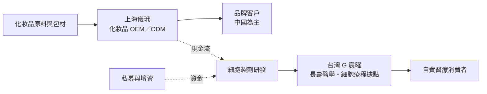
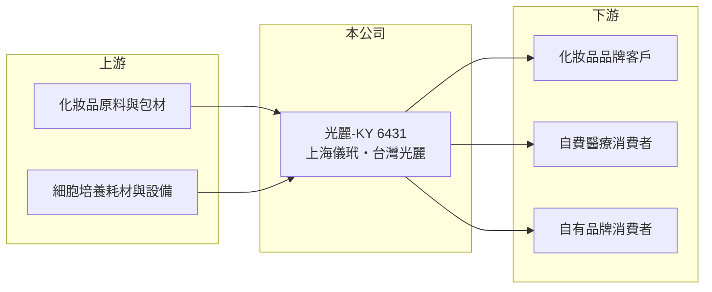

# 6431 光麗-KY

> 上市｜[[產業索引-生技醫療業|生技醫療業]]｜上市（櫃）日期 2014/12/04

# 第一章：企業模式與商業藍圖

> [!info] 撰寫說明
> 本文由 Claude 依公開資料整理，架構比照 [[2330台積電]] 的四章研究，資料截至 2026-10-08。財務數字來源：Goodinfo 年度經營績效表、證交所開放資料（基本資料、2026 年第二季財報、營益分析、股利、每月營收）；業務架構取自富果研究整理的 2025 年 12 月法說會摘要（AI 摘要，非公司原始文件）。2022 年以前的照明業務描述屬推估，各事業營收比重未查得。#待校對

光麗-KY 是一家從傳統製造轉型到生技的開曼控股公司，目前以中國的化妝品代工廠為營收基礎，在台灣發展細胞與長壽醫學服務。本章說明光麗生技控股（股票代號：6431，以下簡稱光麗）的商業模式。

## 一、核心定位：化妝品代工加上醫療生技的雙引擎

光麗於 2012 年在開曼群島設立，2014 年在證交所上市，台灣辦公室位於台北市中山區，董事長為 TEC INNOVATION 法人代表王嘉瑋，實收資本額約 9.74 億元。公司在 2022 年將產業類別調整為醫療生技業；2019 年營收約 4.25 億元、毛利率不到 3%，推估當時以照明等傳統製造為主（待校對）。目前業務分兩塊：

* **消費性生技（上海儀玳）：** 符合 GMP 標準的化妝品工廠，以 [[OEM]]／[[ODM]] 方式替品牌代工面膜、精華液、乳液、防曬與洗護產品。依法說會資料，新廠面積 3.1 萬平方米、20 條生產線，是目前營收的主要來源（推估）。
* **醫療生技（台灣光麗／G 宸曜）：** 分為長壽醫學與癌症整合照護、遠距醫療、[[細胞治療]]製劑研發與智慧細胞療程四個方向，據點在台北、桃園、新竹、台中、高雄，並延伸到日本與紐西蘭。另有自有保養品牌「蔻芮安」與 AI 醫療應用子公司。

## 二、資本轉化邏輯：代工養新事業，但尚未損益兩平

* **代工毛利偏低：** 化妝品代工以接單生產為主，議價能力有限，2021 至 2025 年[[毛利率]]約 18% 至 27%。
* **新事業燒錢：** 醫療生技據點擴張、研發與管理費用高，營業利益率在 2023 至 2025 年約負 38% 至負 42%。公司靠增資與 2025 年 3 月私募 2,500 萬股補充營運資金，股本從 2021 年約 5.1 億元增加到 2025 年約 9.7 億元。

## 三、長期方向

依法說會資料，光麗的長期策略是維持消費與醫療生技雙引擎：中國端引進無菌次拋充填設備、開發無防腐劑產品；台灣端以標準化流程擴大 G CARE 加盟據點、推進海外布局並投入細胞製劑研發。能否在資金耗盡前讓醫療生技事業達到規模經濟，是公司轉型成敗的關鍵。

# 第二章：護城河深度與競爭優勢

護城河是企業抵禦競爭、長期維持超額利潤的機制。以光麗目前的財務表現，護城河仍在建立階段。

## 一、光麗的競爭條件

* **1. 化妝品 GMP 產能：** 上海儀玳具備 GMP 工廠與多條產線，能提供多品類代工，但中國化妝品代工廠數量多，產能本身不構成強護城河。
* **2. 細胞治療據點網絡：** 在台灣五個城市設有據點，細胞治療在台灣依特管辦法開放，需要與醫療院所合作並取得核准，先行者有一定門檻。
* **3. 品牌與通路：** 自有品牌蔻芮安仍在初期，尚未形成可觀的營收。

## 二、主要競爭對手格局

| 對手 | 定位 | 對光麗的影響 |
|---|---|---|
| 中國化妝品代工廠（如科絲美詩、諾斯貝爾，待校對） | 大型化妝品 OEM／ODM | 規模大、價格競爭力強 |
| [[6712長聖]] | 細胞治療與再生醫學 | 在細胞治療市場與醫院合作資源競爭 |
| 台灣細胞治療業者 | 醫院與生技公司合作的細胞療程 | 在自費細胞療程市場直接競爭 |

## 三、優勢轉化：守得住與守不住的地方

* **守得住：** 營收在 2021 至 2025 年維持在約 2.9 億至 3.8 億元，代工業務提供基本營收。
* **守不住：** 2022 至 2025 年連續虧損，2025 年營業利益率約負 41.8%、ROE 約負 37.1%，新事業的投入遠超過代工的獲利能力。
* **觀察重點：** 醫療生技據點的營收成長與損益兩平時點、化妝品代工的毛利率，以及未來是否需要再次增資或私募。

# 第三章：財務體質與盈利規模

資料日期：2026-10-08，表格是撰寫當時的快照；最新月營收、毛利率、累計 EPS 由自動排程寫在本筆記的屬性欄位（月營收、毛利率、累計EPS 等）。#待校對

財務報表是檢驗護城河是否真實存在的最終標準。本章用五年的三率、ROE 與資本報酬，檢視光麗轉型期的財務狀況。

## 一、多年度財務表現

| 年度 | 營收（新台幣） | [[毛利率]] | [[營業利益率]] | EPS（元） | [[ROE]] |
|---|---|---|---|---|---|
| 2021 | 3.33 億 | 27.3% | -2.22% | 0.51 | 6.82% |
| 2022 | 3.42 億 | 20.1% | -26.0% | -1.22 | -10.1% |
| 2023 | 2.93 億 | 22.6% | -38.7% | -1.82 | -16.9% |
| 2024 | 3.81 億 | 17.9% | -38.0% | -2.52 | -34.0% |
| 2025 | 3.77 億 | 18.7% | -41.8% | -2.07 | -37.1% |

資料來源：Goodinfo 年度經營績效（合併報表）。2026 年上半年（證交所資料）營收約 1.82 億元、毛利率 31.5%、營業利益率約負 42.1%、EPS 負 0.92 元；2026 年 1 至 8 月累計營收年增約 13%。

* **持續虧損：** 2021 年靠業外收益約 0.67 億元才轉為獲利，本業同樣是虧損；2022 年以後虧損逐年擴大，2025 年稅後淨損約 1.93 億元。2026 年上半年毛利率回升到 31.5%，但營業虧損幅度沒有縮小。
* **長期指標：** 2021 至 2025 年平均 ROE 約負 18.3%（推算）；每股淨值從 2022 年約 9.8 元降到 2025 年約 5.9 元。依證交所資料，2025 年度未配發股利。2026 年第二季底總資產約 11.3 億元，負債約 6.2 億元，權益約 5.1 億元，負債已超過權益。

## 二、[[ROIC]] 與 [[WACC]]：價值創造利差

**ROIC 推算：** 2025 年營業虧損約 1.57 億元，虧損年度不計稅盾。官方資料揭露負債總計約 6.2 億元，假設一半為有息負債約 3.1 億元（推估），加上權益約 5.1 億元，投入資本約 8.2 億元，ROIC 約負 19.1%（推算）。

**WACC 推算：** 台灣 10 年期公債殖利率取 1.75%、市場風險溢酬 6%、β 取轉型中小型生技股常見值 1.2（未查得公司實際 β），股東權益成本約 8.95%。負債成本假設 3.0%，稅後約 2.4%，權益約占投入資本 62%，WACC 約 6.5%（推算）。

**結論：** ROIC 為負，低於 WACC 約 26 個百分點，代表轉型投入目前仍在大量消耗資本。若醫療生技事業無法在數年內轉虧為盈，持續增資將進一步稀釋股東。

# 第四章：總體風險與地緣政治

任何企業都無法脫離宏觀環境獨立存在。本章分析光麗長期必須面對的法規、地緣與財務風險。

## 一、法規風險

* **細胞治療法規：** 台灣細胞治療依特管辦法與再生醫療相關法規管理，核准項目、收費與廣告都受限制，法規變動會直接影響療程營收。
* **中國化妝品法規：** 中國對化妝品原料備案、功效宣稱與標示的規範趨嚴，代工廠需要持續投入合規成本。

## 二、地緣與市場風險

* **中國營運集中：** 代工產能在上海，受中國消費景氣、兩岸關係與資金匯出規定影響。KY 公司的營運主體在海外，資訊透明度與監管強度也常被投資人關注。
* **化妝品代工競爭：** 中國化妝品代工產能充足，價格競爭激烈，毛利率難以大幅提升。

## 三、財務風險

* **資金需求：** 連續虧損且負債已高於權益，未來可能需要[[現金增資]]或私募，稀釋既有股東。
* **轉型執行：** 同時經營代工、醫療據點、自有品牌與 AI 醫療，資源分散，任何一項進度落後都會拖累整體。

# 專有名詞解析

## 應用

- **[[細胞治療]]**：以人體細胞經處理後回輸病人的治療方式，台灣依特管辦法開放部分項目。

## 金融

- **[[現金增資]]**：公司發行新股向股東或投資人募集現金，可充實資本，但會稀釋既有股東持股。
- **[[ROIC]]**：投入資本報酬率，稅後營業利益除以股東權益加有息負債，衡量本業運用資本的效率。
- **[[WACC]]**：加權平均資金成本，股東與債權人要求報酬率的加權平均，是 ROIC 要超越的門檻。

## 產業

- **[[OEM]]**：代工廠依客戶提供的規格生產，產品掛客戶品牌，代工廠不負責設計。
- **[[ODM]]**：代工廠自行設計並生產，產品掛客戶品牌銷售，附加價值高於單純 OEM。

# 核心供應鏈

## 1. 上游：原料與耗材
- 化妝品原料、包材、細胞培養耗材供應商（名稱未查得）

## 2. 中游：光麗與同業
- 中國化妝品代工同業（科絲美詩、諾斯貝爾等，未在台上市）
- 細胞治療相關：[[6712長聖]]

## 3. 下游：客戶
- 中國化妝品品牌、台灣自費醫療消費者、自有品牌蔻芮安的消費者

## 最新新聞
<!-- news:start -->
<!-- news:end -->

## 相關連結
- [公開資訊觀測站](https://mopsov.twse.com.tw/mops/web/t05st03?step=1&firstin=1&co_id=6431)
- [Goodinfo](https://goodinfo.tw/tw/StockDetail.asp?STOCK_ID=6431)
- [Yahoo 股市](https://tw.stock.yahoo.com/quote/6431)
- [鉅亨網新聞](https://www.cnyes.com/twstock/6431/news)
