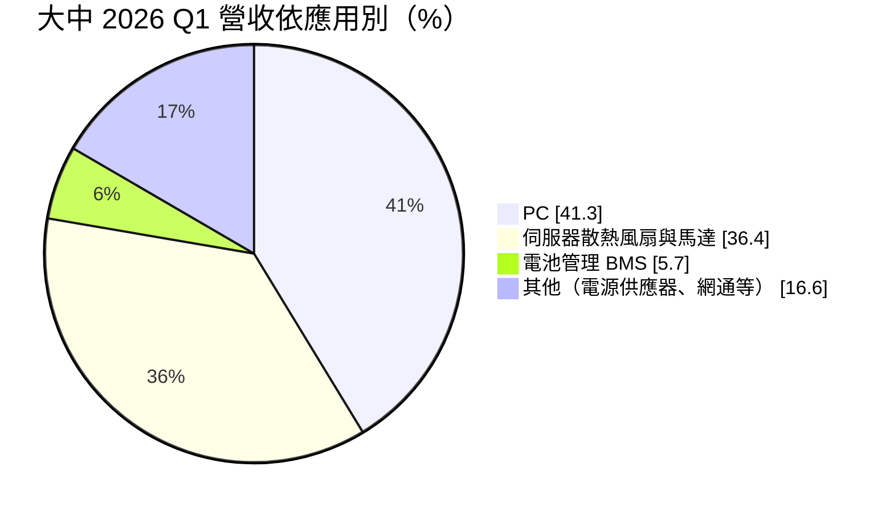
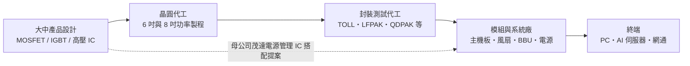
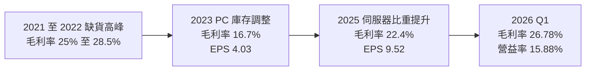
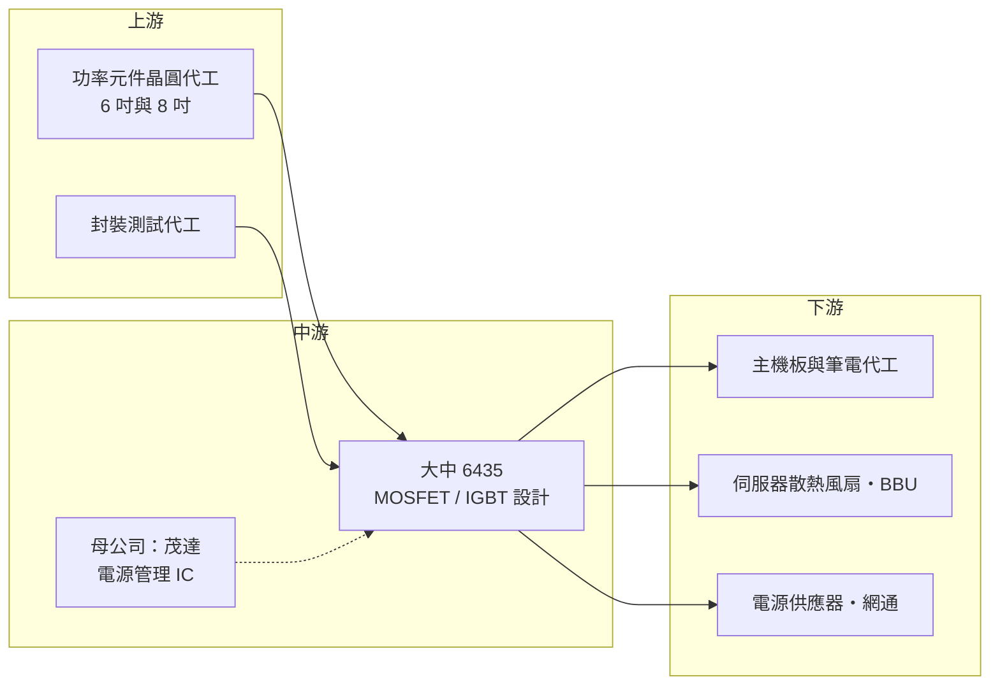

# 6435 大中

> 上櫃｜[[產業索引-半導體業|半導體業]]｜上市（櫃）日期 2016/01/07

# 第一章：企業模式與商業藍圖

> [!info] 撰寫說明
> 本文由 Claude 依公開資料整理，架構比照 [[2330台積電]] 的四章研究，資料截至 2026-10-08。財務數字來源：Goodinfo 年度經營績效與股利政策頁、MoneyDJ 資產負債表與現金流量表、富果研究 2025 年第三季與 2026 年第一季法說會整理、nStock 公司資料、工商時報、理財周刊；產業描述為整理性內容，尚未逐條比對原始文件。#待校對

在評估一家公司的長期價值時，第一步是拆解它的獲利邏輯。本章針對大中積體電路（股票代號：6435，以下簡稱大中）的商業模式進行定性分析，說明一家以筆電電源開關起家的功率元件設計公司，如何把產品重心轉向伺服器散熱與電池備援，提升自己在供應鏈中的位置。

## 一、核心定位：茂達集團旗下的 MOSFET 設計公司

大中成立於 2008 年，總部位於新竹科學園區，2016 年上櫃。依 nStock 整理的公司資料，電源管理 IC 廠 [[6138茂達]] 是大中的最終母公司，持股約 42.62%。大中的業務是研究、設計與銷售[[功率半導體]]元件，主力產品是 [[MOSFET]]（金氧半場效電晶體），另有 [[IGBT]] 與高壓 IC。

MOSFET 可以想成電子產品裡的「電源開關」。電腦、伺服器、充電器把電壓從插座的高壓一路轉換成晶片需要的低壓，過程中需要大量 MOSFET 以極高頻率開關電流。每一台筆電、每一個伺服器風扇、每一組電池模組裡都有好幾顆。大中的角色是設計這些元件，把晶圓製造與封裝交給外部代工廠，自己負責產品規格、電路設計、品質驗證與銷售，屬於 [[Fabless]] 模式。

和母公司茂達搭配來看，茂達做「控制電源的大腦」（電源管理 IC），大中做「執行開關的手腳」（MOSFET），兩者常同時出現在一塊主機板上，集團可以一起向客戶提案。

## 二、終端應用板塊：從 PC 走向伺服器

大中的應用結構在 2023 年以後明顯改變。依富果研究整理的 2026 年第一季法說會資料：

* **PC：** 用於 CPU 核心供電、快充與變壓器。2023 年占營收 63.6%，2026 年第一季降到 41.3%。PC 仍是最大市場，但已不再是大中的成長來源。
* **伺服器散熱風扇與馬達：** 2023 年僅占 8.1%，2026 年第一季升到 36.4%。[[AI伺服器]]功耗大，散熱風扇與液冷水泵的數量與功率都提高，每台伺服器需要的馬達驅動 MOSFET 隨之增加。
* **電池管理（BMS）：** 由 2023 年的 1.4% 升到 5.7%，主要來自伺服器機櫃的備援電池模組（[[BBU]]）。BBU 在斷電時要瞬間接手供電，對 MOSFET 的耐流與可靠度要求高，單價也較高。
* **電源供應器與網通：** 占比個位數，是公司規劃擴大的工業與高價值市場之一。

依電壓區分，2026 年第一季低壓產品約占 75%、中壓約 24%、高壓約 1%。

## 三、資本轉化邏輯：輕資產設計、靠產品組合賺錢

* **不擁有晶圓廠：** 大中把晶圓製造交給外部代工廠，自己的固定資產很少。依 MoneyDJ 資料，2025 年購置設備的支出僅約 0.62 億元。好處是資本支出低、自由現金流穩定；代價是在產能吃緊時要和其他客戶搶代工產能，2021 至 2022 年 6 吋與 8 吋產能短缺時，大中與茂達都曾面臨供不應求的狀況（工商時報報導）。代工夥伴名稱本次未查得。
* **獲利取決於產品組合：** 同樣是 MOSFET，用在筆電的一般型號價格競爭激烈，用在伺服器熱插拔或 BBU 的高耐流型號則利潤較好。大中近年把伺服器、BMS 比重拉高，毛利率從 2023 年的 16.7% 回到 2025 年的 22.4%，2026 年第一季達 26.78%，反映產品組合改善的效果。
* **存貨管理：** 功率元件是標準品，景氣反轉時容易積壓庫存。依法說會資料，大中的存貨周轉率由 2023 年約 2 次提升到 2025 年第三季的 4.66 次，庫存調整已大致完成。

## 四、企業長期藍圖：高價值封裝與伺服器應用

* **新封裝與新元件：** 公司正開發 Dr.MOS（把驅動 IC 與 MOSFET 整合在同一封裝）、雙面散熱 MOSFET、熱插拔用的 Robust MOS、中壓 Robust MOSFET 與第三代高壓 MOSFET，封裝形式包括 TOLL、TOLT、LFPAK 88、QDPAK 等。這些封裝的共同點是散熱更好、能承受更大電流，主要對準伺服器與電源供應器。
* **降低 PC 依賴：** 管理層的方向是把資源移往伺服器、BMS、電源供應器與工業、車用相關市場，讓營收結構不再隨 PC 換機週期大起大落。
* **集團綜效：** 與茂達的電源管理 IC 搭配，可以提供較完整的電源方案。Dr.MOS 這類整合元件需要控制 IC 與功率元件一起設計，集團內合作是大中的潛在優勢（推估）。

# 第二章：護城河深度與競爭優勢

護城河是企業抵禦競爭、長期維持超額利潤的機制。本章分析大中在高度標準化的 MOSFET 市場中有哪些防守能力，主要競爭對手是誰，以及這些優勢能守住多少。

## 一、大中護城河的核心組成要素

MOSFET 是規格公開、多家廠商都能供應的標準元件，產業整體護城河偏窄。大中的防守能力主要來自三方面：

* **1. 客戶驗證與設計導入：** 伺服器與電池模組的 MOSFET 要經過系統廠的長時間驗證，確認在高溫、高電流下長期可靠。一旦某個型號被寫進伺服器平台的料號清單，在該平台生命週期內通常不會輕易更換。大中近年伺服器比重快速提升，代表它已通過部分平台的驗證門檻。
* **2. 集團搭配銷售：** 母公司茂達在 PC 與 DRAM 模組的電源管理 IC 有既有客戶，大中的 MOSFET 可以搭配同一套電源方案進入客戶的設計，降低客戶找料與驗證的成本。
* **3. 台系供應鏈的反應速度：** 相較於國際大廠，台灣 MOSFET 設計公司的交期、客製化與技術支援更貼近台灣的主機板、伺服器與電源廠，在新平台開發初期能較快配合。

## 二、全球主要競爭對手格局

| 對手 | 定位 | 對大中的威脅 |
|---|---|---|
| 英飛凌（Infineon）、安森美（onsemi） | 全球功率半導體龍頭，自有晶圓廠，產品線涵蓋 SiC 與 GaN | 在伺服器與車用高階型號具品牌與規模優勢 |
| 萬國半導體（AOS） | 美系 MOSFET 大廠，PC 與伺服器電源主力供應商 | 在 PC 與 Dr.MOS 市場直接競爭 |
| [[8261富鼎]] | 台灣 MOSFET 設計公司，國巨集團入主 | 同樣主打 PC 與伺服器，客群高度重疊 |
| [[5299杰力]]、[[3317尼克森]] | 台灣 MOSFET 設計公司 | 在 PC 與消費性電源型號直接競價 |
| 中國功率元件廠 | 受政策扶植，產能擴張快 | 壓低一般型號的價格 |

## 三、優勢轉化：哪些市場守得住、哪些守不住

* **守得住：** 已通過驗證的伺服器散熱、熱插拔與 BBU 型號。這些應用要求高可靠度、驗證時間長，客戶更換供應商的意願低，價格也相對穩定。
* **守不住：** PC 與消費性電源的一般型號。這類產品規格標準化，對手眾多，2023 年 PC 需求下滑時，大中毛利率由 2022 年的 28.5% 降到 16.7%，EPS 由 13.64 元降到 4.03 元，顯示一般型號在景氣反轉時幾乎沒有定價能力。
* **觀察重點：** 伺服器相關比重能否持續維持在三成以上；Dr.MOS 與雙面散熱等高階產品能否量產並被主要伺服器平台採用；以及上游晶圓與封裝成本上漲時，大中能否把成本轉嫁給客戶。公司在 2026 年第一季法說會提到原物料成本自 2025 年底上升，正與客戶及供應商協商分攤。

# 第三章：財務體質與盈利規模

資料日期：2026-10-08。數字取自 Goodinfo 年度經營績效、MoneyDJ 財務報表與富果研究法說會整理，表格是撰寫當時的快照；最新月營收、毛利率、累計 EPS 由自動排程寫在本筆記的屬性欄位（月營收、毛利率、累計EPS 等）。#待校對

財務報表是檢驗護城河是否真實存在的最終標準。本章用多年度數據檢視大中在 PC 週期與伺服器轉型中的獲利品質。

## 一、獲利能力的基石：三率

| 年度 | 營收（億元） | [[毛利率]] | [[營業利益率]] | EPS（元） | [[ROE]] |
|---|---|---|---|---|---|
| 2019 | 21.5 | 18.4% | 9.27% | 6.16 | 23.2% |
| 2020 | 26.0 | 18.3% | 9.52% | 7.02 | 25.0% |
| 2021 | 31.2 | 25.3% | 15.9% | 13.09 | 35.9% |
| 2022 | 30.0 | 28.5% | 16.9% | 13.64 | 30.8% |
| 2023 | 26.6 | 16.7% | 5.63% | 4.03 | 9.3% |
| 2024 | 27.2 | 20.9% | 8.49% | 6.09 | 13.0% |
| 2025 | 34.0 | 22.4% | 11.0% | 9.52 | 18.4% |

資料來源：Goodinfo 合併報表年度經營績效。2023 年股本由 3.34 億元增至 3.73 億元（2022 年度配發股票股利 1 元），EPS 前後比較時需留意股數變動。

* **[[毛利率]]的兩個驅動力：** 第一是供需，2021 至 2022 年晶圓代工產能短缺，MOSFET 漲價，毛利率衝上 28.5%；第二是產品組合，2025 年以後毛利率回升主要來自伺服器與 BMS 比重提高，而不是全面漲價。後者的持續性比前者高。
* **[[營業利益率]]的營運槓桿：** 大中的研發與管理費用相對固定，2023 年營收只減少約 11%，營業利益率卻從 16.9% 掉到 5.63%；2025 年營收回升 25%，營業利益率也回到 11%。這種放大效果是小型 IC 設計公司的典型特徵。
* **長期成長：** 2019 年至 2025 年營收年複合成長率約 7.9%（推算），2021 年至 2025 年約 2.2%（推算）。中間經歷 PC 景氣循環，真正的成長來自 2025 年以後的伺服器應用。

## 二、[[ROE]]：資本效率

大中近 5 年（2021 至 2025 年）平均 ROE 約 21.5%（推算），即使在 2023 年谷底也維持 9.3%。高 ROE 的原因有兩個：一是 Fabless 模式不需要大量固定資產，二是公司幾乎沒有銀行借款，ROE 完全來自本業獲利，沒有靠財務槓桿放大。依 MoneyDJ 資料，2025 年底股東權益約 20.5 億元，負債約 7.0 億元，主要是應付帳款等營運負債，有息負債僅有少量租賃負債。

## 三、資本支出與自由現金流

* **[[CapEx]]：** 依 MoneyDJ 季度現金流量表加總，2025 年購置設備約 0.62 億元，相對 34 億元的營收非常低。
* **[[自由現金流]]：** 2025 年營業現金流約 5.77 億元，扣除資本支出後自由現金流約 5.15 億元（推算），足以支應股利。不過 2026 年第二季營業現金流為負 3.48 億元，推估與營收成長帶動的存貨與應收帳款增加有關，功率元件公司的現金流會隨營運資金需求波動。
* **股利政策：** 依 Goodinfo，2019 年至 2025 年度的現金股利分別為 4.3、5、7.2、3（另配股票股利 1 元）、2.8、4.302、7.5 元。以 EPS 計算，2023 至 2025 年度的現金配發率約為 69%、71%、79%（推算），顯示公司習慣把大部分盈餘以現金發還股東，股利金額隨獲利起伏。

## 四、[[ROIC]] 與 [[WACC]]：價值創造利差

* **ROIC（推算）：** 2025 年營業利益約 3.74 億元（營收 34.0 億元 × 營業利益率 11.0%），稅後約 2.99 億元（稅率 20%）。投入資本約 20.6 億元（2025 年底股東權益 20.54 億元加上租賃負債約 0.03 億元，無銀行借款），ROIC 約 14.5%（推算）；若扣除帳上現金約 2.07 億元，約 16.3%。2021 至 2022 年高峰期，以稅後營業利益約 4 億元與股東權益約 15 億元估算，ROIC 推估超過 25%。
* **WACC（推算）：** 無風險利率取 1.75%，市場風險溢酬 6%，β 取 MOSFET 與 IC 設計同業常見值 1.1（未查得公司實際 β），股東權益成本約 8.35%。公司幾乎沒有有息負債，WACC 約等於股東權益成本，約 8.3%（推算）。
* **解讀：** 2025 年 ROIC 約 14.5%，高於約 8.3% 的資金成本，利差約 6 個百分點，代表公司正在替股東創造價值。即使在 2023 年谷底，以營業利益率 5.63% 推算的 ROIC 約 7%（稅後營業利益約 1.2 億元，除以股東權益約 16 億元），只略低於 WACC。整體而言，大中屬於「景氣好時大幅創造價值、景氣差時接近損益兩平」的類型，伺服器比重提高若能降低獲利波動，長期平均利差可望擴大（推估）。

# 第四章：總體風險與地緣政治

任何企業都無法脫離宏觀環境獨立存在。本章分析大中長期必須面對的地緣政治、產業週期、營運與技術風險。

## 一、地緣政治風險

* **美中關稅的間接影響：** 公司在 2025 年第三季法說會表示，美中關稅目前沒有直接影響，但會持續觀察間接效應。大中的客戶多為台灣主機板、伺服器與電源廠，這些客戶的組裝產能分布在中國、東南亞與墨西哥，若關稅導致產線搬遷，MOSFET 的出貨地點與驗證流程也要跟著調整。
* **中國功率元件自主化：** 中國大力扶植本土功率半導體廠，一般型號 MOSFET 的價格長期承受壓力，中國市場的新設計案也可能優先採用本土供應商。
* **台灣代工集中：** 大中依賴外部晶圓與封裝代工，若供應鏈集中於特定地區，面臨與其他台灣半導體公司相同的區域風險。

## 二、產業週期與市場結構風險

* **PC 週期：** PC 仍占營收四成上下，PC 換機潮與庫存調整會直接反映在營收與毛利率。2023 年的獲利大幅下滑就是 PC 庫存調整的結果。
* **[[長鞭效應]]：** 功率元件位在供應鏈上游，終端需求的小幅變化傳到 MOSFET 時會被放大。2021 至 2022 年客戶重複下單、2023 年同步去庫存，就是典型的長鞭效應。
* **AI 伺服器需求的集中性：** 伺服器比重提高雖然改善了產品組合，但也讓大中的成長更依賴少數雲端業者的資本支出。若 AI 投資放緩，伺服器散熱與 BBU 需求可能同步降溫。
* **匯率：** 公司表示以美元計價的營收可以抵銷大部分匯率風險，但匯率大幅波動時仍會影響獲利。

## 三、營運環境的隱性風險

* **上游成本上漲：** 2025 年底以後原物料與代工成本上升，大中需要與客戶協商轉嫁。若轉嫁不及，毛利率會被壓縮。
* **代工產能取得：** 不擁有晶圓廠的設計公司在產能短缺時沒有優先權，2021 年的缺貨期間曾出現產能無法滿足訂單的情況。
* **母公司策略：** 茂達是最大股東，集團的資源分配、產品分工或整併決策，可能影響大中的發展方向與股利政策。
* **營運資金波動：** 營收快速成長時，存貨與應收帳款同步增加，2026 年第二季營業現金流轉負即是一例。

## 四、科技演進風險

伺服器電源正從傳統 12 伏特架構走向 48 伏特，乃至高壓直流（[[HVDC]]）架構，功率元件的材料也逐漸從矽走向碳化矽（[[SiC]]）與氮化鎵（[[GaN]]）。目前大中的產品以矽基 MOSFET 為主，法說會資料未提到 SiC 產品。若高階電源快速轉向寬能隙材料，大中需要投入新材料的開發或與代工夥伴合作，否則在高階市場可能被國際大廠拉開距離。另一方面，低壓矽 MOSFET 在主機板供電與風扇馬達仍是主流，短期內不會被取代。

# 專有名詞解析

## 半導體

- **[[功率半導體]]**：負責轉換與控制電力的半導體元件，例如 MOSFET、IGBT，用於電源供應器、馬達與電動車。
- **[[MOSFET]]**：金氧半場效電晶體，最常見的電源開關元件，用電壓控制電流通斷，幾乎所有電子產品的供電電路都會用到。
- **[[IGBT]]**：絕緣閘雙極電晶體，適合高電壓、大電流的開關元件，常用於變頻家電、工業馬達與電動車。
- **[[Fabless]]**：無晶圓廠的 IC 設計公司，只負責設計與銷售，製造交給晶圓代工與封測廠。
- **[[Dr.MOS]]**：把驅動 IC 與上下兩顆 MOSFET 整合在同一封裝的供電元件，常用於 CPU 與 GPU 的核心供電。
- **[[SiC]]**：碳化矽，耐高壓、耐高溫的寬能隙半導體材料，用於電動車與高階電源。
- **[[GaN]]**：氮化鎵，開關速度快、體積小的寬能隙半導體材料，用於快充與資料中心電源。

## 應用

- **[[AI伺服器]]**：搭載 GPU 或 AI 加速器、用於訓練與推論的伺服器，功耗與散熱需求遠高於一般伺服器。
- **[[BBU]]**：備援電池模組，裝在伺服器機櫃內，斷電時瞬間接手供電，避免資料中心運算中斷。
- **[[BMS]]**：電池管理系統，監控電池的電壓、溫度與充放電狀態，確保電池安全並延長壽命。
- **[[熱插拔]]**：在系統不關機的情況下插拔模組或電源，需要特殊 MOSFET 控制瞬間湧入的電流。

## 金融

- **[[長鞭效應]]**：終端需求的小幅變動，沿供應鏈往上游傳遞時被逐級放大，造成上游庫存與訂單劇烈波動。
- **[[自由現金流]]**：營業活動現金流減去資本支出，代表企業可自由用於配息、還債或併購的現金。

## 產業

- **[[HVDC]]**：高壓直流供電架構，資料中心用較高的直流電壓配電以降低傳輸損耗，對功率元件的耐壓要求更高。

# 核心供應鏈

## 1. 上游：晶圓與封裝代工
- 功率元件晶圓代工與封裝測試代工夥伴，公司未公開名稱（未查得）。台灣的功率元件代工與封測業者包括 [[5347世界先進]]、[[3707漢磊]]、[[6525捷敏-KY]] 等，與大中的實際合作關係未查得。

## 2. 中游：大中與集團
- 母公司：[[6138茂達]]（電源管理 IC，持股約 42.62%）
- 台灣同業：[[8261富鼎]]、[[5299杰力]]、[[3317尼克森]]
- 國際同業：英飛凌、安森美、萬國半導體

## 3. 下游：應用與客戶
- PC 與主機板供電、快充與變壓器
- AI 伺服器散熱風扇、液冷水泵、備援電池模組與熱插拔電路
- 電源供應器與網通設備；公司未公開客戶名稱（未查得）

## 最新新聞
<!-- news:start -->
<!-- news:end -->

## 相關連結
- [公開資訊觀測站](https://mopsov.twse.com.tw/mops/web/t05st03?step=1&firstin=1&co_id=6435)
- [Goodinfo](https://goodinfo.tw/tw/StockDetail.asp?STOCK_ID=6435)
- [Yahoo 股市](https://tw.stock.yahoo.com/quote/6435)
- [鉅亨網新聞](https://www.cnyes.com/twstock/6435/news)
