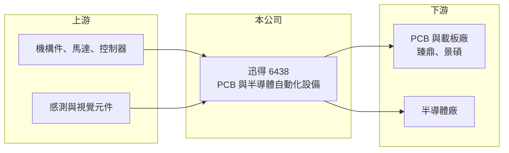

# 6438 迅得

> 上市｜[[產業索引-其他電子業|其他電子業]]｜上市（櫃）日期 2021/01/19

# 第一章：企業模式與商業藍圖

> [!info] 撰寫說明
> 精簡版，由 Claude 依公開資料整理，架構比照 [[2330台積電]]，資料截至 2026-10-07。來源：優分析（迅得 2026 年 9 月營收、上半年財報與可轉債新聞）、nStock 迅得公司簡介。#待校對

迅得機械位於桃園，是 [[PCB]] 產業的[[自動化設備]]廠，近年把業務延伸到半導體廠的物料自動化。

- **核心業務：** 設計製造 PCB 與 IC 載板生產線的上下料、搬運、倉儲等自動化設備，並發展半導體廠的物料搬運與倉儲自動化設備。
- **營收結構：** 公開資料未列出產品別比重；營收動能來自半導體設備與 PCB 設備（含高階載板）兩條線，具體比重待查。
- **營運據點：** 總部設於桃園，2021 年 1 月由櫃買轉至證交所上市；計畫在 2026 年底至 2027 年初於台灣南部興建新廠。
- **長期方向：** 以 [[ABF載板]] 與 AI 相關高階 PCB 擴產潮為短期動能，並提高半導體設備比重，降低對 PCB 景氣的依賴。

# 第二章：護城河深度與競爭優勢

迅得的競爭力在於長年服務 PCB 大廠累積的產線整合經驗，客戶擴產時常是一次性整線採購。

- **競爭優勢：** 在 PCB 與載板自動化領域經營多年，能提供整條產線的搬運與倉儲方案；2026 年獲 [[4958臻鼎-KY]] 下單 10.2 億元、[[3189景碩]] 下單逾 7 億元。
- **主要對手：** PCB 設備同業 [[6664群翊]]、[[2467志聖]]、[[3455由田]]，半導體自動化則面對 [[2464盟立]] 與日系大廠。
- **觀察重點：** 南部新廠進度、5 億元可轉債資金運用，以及半導體設備營收占比能否持續拉高。

# 第三章：財務體質與盈利規模

資料日期：2026-10-07，以下數字是撰寫當時的快照；最新月營收、毛利率、累計 EPS 由自動排程寫在本筆記的屬性欄位（月營收、毛利率、累計EPS 等）。#待校對

迅得 2026 年營收逐季創高，獲利成長速度高於營收。

- **營收規模：** 2025 年營收 64.67 億元；2026 年第三季營收 19.45 億元創新高，9 月營收 6.95 億元，1 至 9 月累計 55.13 億元、年增 13.62%。
- **獲利：** 2026 年上半年 [[毛利率]] 26.13%、稅後純益 3.11 億元、EPS 3.79 元，其中第二季 EPS 2.03 元；2025 年全年 EPS 5.24 元。
- **財務特色：** 2025 年度配發現金股利 5 元，近五年平均殖利率約 4.3%；2026 年另發行 5 億元無擔保可轉債籌措擴廠資金。

# 第四章：總體風險與地緣政治

迅得的風險主要來自客戶資本支出的週期性。

- **產業週期：** 設備需求取決於 PCB 與載板廠擴產，AI 需求若降溫或載板供過於求，訂單可能快速縮減。
- **營運風險：** 大客戶單筆訂單金額大，交機與驗收時點會造成季度營收波動；新廠投產初期折舊增加。
- **其他風險：** 客戶多在中國與東南亞設廠，地緣政治與關稅變化會影響海外出貨；可轉債轉換可能稀釋股本。

# 專有名詞解析

## 半導體

- **[[ABF載板]]**：使用味之素增層膜的高階 IC 載板，用於 CPU、GPU 與 AI 晶片的封裝。

## 金融

- **[[毛利率]]**：毛利除以營收，反映產品售價扣除直接成本後的獲利空間。

## 產業

- **[[PCB]]**：印刷電路板，承載並連接電子零件的基板，是所有電子產品的基礎零組件。
- **[[自動化設備]]**：以機械、感測與控制系統取代人工完成搬運、組裝或檢測的生產設備。

# 核心供應鏈

- 上游：機構件、馬達、控制器與感測元件供應商（推估）
- 下游／客戶：[[4958臻鼎-KY]]、[[3189景碩]] 等 PCB 與載板廠，以及半導體廠
- 同業：[[6664群翊]]、[[2467志聖]]、[[3455由田]]、[[2464盟立]]

## 最新新聞
<!-- news:start -->
<!-- news:end -->

## 相關連結
- [公開資訊觀測站](https://mopsov.twse.com.tw/mops/web/t05st03?step=1&firstin=1&co_id=6438)
- [Goodinfo](https://goodinfo.tw/tw/StockDetail.asp?STOCK_ID=6438)
- [Yahoo 股市](https://tw.stock.yahoo.com/quote/6438)
- [鉅亨網新聞](https://www.cnyes.com/twstock/6438/news)
