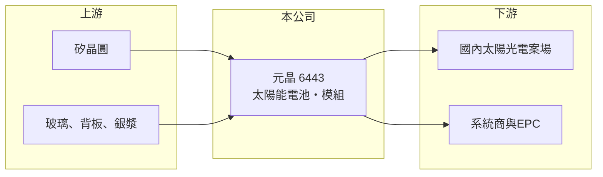

# 6443 元晶

> 上市｜[[產業索引-光電業|光電業]]｜上市（櫃）日期 2015/10/01

# 第一章：企業模式與商業藍圖

> [!info] 撰寫說明
> 精簡版，由 Claude 依公開資料整理，架構比照 [[2330台積電]]，資料截至 2026-10-07。來源：Poorstock 元晶基本資料、winvest 營收快訊。公開資料有限。#待校對

元晶是台灣本土的太陽能電池與模組廠，近年受全球太陽能產品價格下跌影響，營運持續縮小。

- **核心業務：** 公司主要從事[[太陽能電池]]及[[太陽能模組]]的製造與銷售，產品供應國內[[太陽光電]]案場。
- **營收結構：** 本次未查到產品別營收比重；依業務性質推估以模組銷售為主。
- **營運據點：** 公司登記地址位於新北市新店區，生產據點明細本次未查到。
- **長期方向：** 台灣政府的太陽光電設置目標與本土產品需求是主要支撐，公司方向取決於國內案場需求能否回溫。

# 第二章：護城河深度與競爭優勢

元晶的競爭條件主要來自本土製造身分，但面對中國低價產品，價格競爭力有限。

- **競爭優勢：** 國內部分政府標案與企業綠電案場偏好本土製造產品，提供一定的需求保障（推估）。
- **主要對手：** 國內模組同業如 [[3576聯合再生]]、[[6477安集]]，以及中國大型太陽能廠如隆基、晶科、天合光能。
- **觀察重點：** 月營收能否止跌、虧損是否收斂，以及國內太陽光電新增設置量的變化。

# 第三章：財務體質與盈利規模

資料日期：2026-10-07，以下數字是撰寫當時的快照；最新月營收、毛利率、累計 EPS 由自動排程寫在本筆記的屬性欄位（月營收、毛利率、累計EPS 等）。#待校對

元晶近兩年營收大幅萎縮並持續虧損。

- **營收規模：** 2026 年 8 月營收 6,654.6 萬元，年減 22.98%；2026 年 4 月、6 月營收分別為 7,167.1 萬元與 7,998.6 萬元，皆較去年同期衰退。
- **獲利：** 2025 年第一季 EPS -6.24 元、第三季 -1.9 元；2026 年第一季 EPS -0.2 元、第二季 -0.6 元，虧損幅度較 2025 年收斂。
- **財務特色：** 股本約 53.9 億元，相對目前每月不到 1 億元的營收規模偏大，獲利要回到正數需要營收明顯放大。

# 第四章：總體風險與地緣政治

元晶的風險集中在產品價格與國內需求。

- **產業週期：** 太陽能產業受中國產能過剩影響，電池與模組價格長期走低，屬於典型的供給過剩週期。
- **營運風險：** 營收規模縮小使固定成本難以攤提，持續虧損會侵蝕淨值，也可能有資產減損。
- **其他風險：** 國內再生能源政策、土地取得與併網進度，以及矽晶圓等原物料價格波動。

# 專有名詞解析

## 金融

- **[[長鞭效應]]**：終端需求的小幅變動沿供應鏈往上游傳遞時被逐級放大，造成上游庫存與訂單劇烈波動。

## 產業

- **[[太陽能電池]]**：把光能轉成電能的半導體元件，由矽晶圓加工而成，是模組的核心零件。
- **[[太陽能模組]]**：將多片太陽能電池串接並以玻璃、背板封裝成板，是案場實際安裝的產品。
- **[[太陽光電]]**：利用太陽能電池發電的技術與產業統稱，包含電池、模組、案場開發與維運。

# 核心供應鏈

- 上游：矽晶圓、玻璃、背板、銀漿等材料供應商（推估）
- 下游／客戶：國內太陽光電案場開發商與系統整合商（推估）
- 同業：[[3576聯合再生]]、[[6477安集]]；國外為隆基、晶科、天合光能

## 最新新聞
<!-- news:start -->
<!-- news:end -->

## 相關連結
- [公開資訊觀測站](https://mopsov.twse.com.tw/mops/web/t05st03?step=1&firstin=1&co_id=6443)
- [Goodinfo](https://goodinfo.tw/tw/StockDetail.asp?STOCK_ID=6443)
- [Yahoo 股市](https://tw.stock.yahoo.com/quote/6443)
- [鉅亨網新聞](https://www.cnyes.com/twstock/6443/news)
