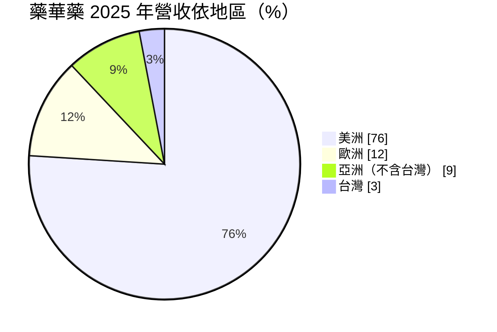
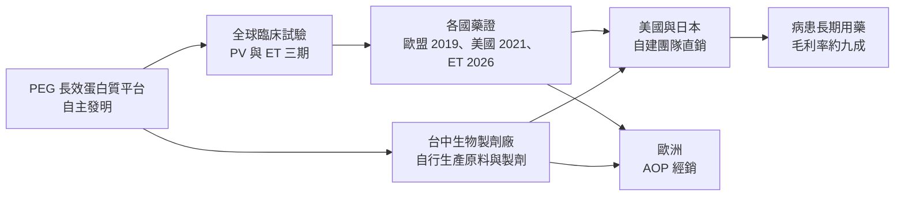
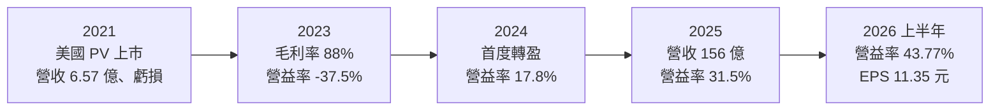
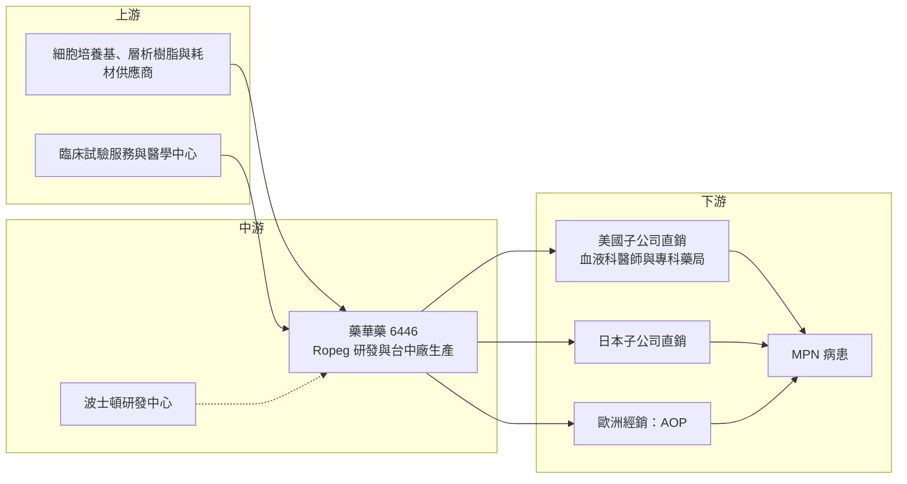

# 6446 藥華藥

> 上市｜[[產業索引-生技醫療業|生技醫療業]]｜上市（櫃）日期 2024/01/25

# 第一章：企業模式與商業藍圖

> [!info] 撰寫說明
> 本文由 Claude 依公開資料整理，架構比照 [[2330台積電]] 的四章研究，資料截至 2026-10-08。財務數字來源：Goodinfo 年度經營績效頁、證交所開放資料（基本資料、綜合損益、資產負債、營益分析、股利）、經濟日報（2026 年 5 月營收與地區比重報導）、BioPharm International（2026 年 8 月美國 ET 核准報導）、工商時報（2023 年 3 月價格與核准歷程報導）、旺得富、自由時報（AOP 仲裁報導）、證交所新上市公司介紹（2024 年 1 月）；產業描述為整理性內容，尚未逐條比對原始文件。#待校對

台灣生技產業過去最常見的模式，是研發到臨床中後期就把藥物授權給國際藥廠，自己只收授權金。藥華醫藥（股票代號：6446，以下簡稱藥華藥）走的是另一條更艱難的路：從發明、臨床、生產到在美國自建團隊銷售，全部自己來。本章針對藥華藥的商業模式進行定性分析，說明這條路為何讓它從長年虧損的研發公司，轉變為[[毛利率]]超過九成的國際藥廠。

## 一、核心定位：自主研發、自製、自銷的罕見血液疾病新藥公司

藥華藥於 2000 年由一群曾在美國生技公司任職的科學家共同創立（證交所新上市公司介紹），2024 年 1 月轉上市，2026 年第二季底實收資本額約 42.2 億元（證交所基本資料）。公司的核心技術是 PEG 長效型蛋白質藥物平台，旗艦產品為 Ropeginterferon alfa-2b（簡稱 Ropeg，美國商品名 BESREMi），是一種長效型[[干擾素]]。

Ropeg 主要治療[[骨髓增生性腫瘤]]（MPN）中的兩種疾病：

* **[[真性紅血球增多症]]（PV）：** 骨髓製造過多紅血球，使血液變濃、提高血栓與中風風險。Ropeg 於 2019 年在歐盟、2021 年在美國取得 PV 核准（工商時報，2023 年 3 月），目前已在約 50 個國家獲准用於成人 PV，包括美國、日本、中國與歐盟（旺得富，2026 年 7 月）。
* **[[原發性血小板增多症]]（ET）：** 骨髓製造過多血小板，同樣提高血栓風險。ET 適應症已在台灣與日本取得核准，美國 [[FDA]] 則於 2026 年 8 月宣布核准用於成人 ET 患者，且不限基因型與是否曾接受治療（BioPharm International，2026 年 8 月）。

這些疾病屬於[[孤兒藥]]市場，病人數不多但需要長期甚至終身用藥。Ropeg 的特點是給藥間隔長、可依病人狀況調整劑量，並且作用在疾病的源頭，而不只是控制血球數量。

## 二、終端應用／產品板塊：美洲市場占四分之三

依經濟日報 2026 年 5 月報導，2025 年藥華藥營收 156.3 億元、年增 60.6%，地區結構如下：

* **美洲：** 以美國為主，由藥華藥在美國的子公司自建業務團隊直接銷售，2025 年美國業務團隊擴編約 65%。美國是全球藥價最高的市場，2023 年報導中 500 微克劑量每針約 7,507 美元（工商時報，2023 年 3 月），這是藥華藥毛利率能超過九成的主因。
* **歐洲：** 由合作夥伴奧地利 AOP 負責銷售，藥華藥主要以供貨收入與[[權利金]]的形式獲利，因此歐洲的營收占比遠低於其市場規模。雙方另有仲裁爭議，見第四章。
* **亞洲：** 日本是近年成長最快的市場之一，2025 年日本團隊擴編約 45%，日本核准高劑量給藥方案後帶動需求（經濟日報）。中國、韓國等市場也已取得或申請藥證。
* **台灣：** 本土市場規模小，但是藥證與臨床資料的起點，ET 適應症也是先在台灣獲准。

## 三、資本轉化邏輯（營運模式）：一條龍掌握最大利潤

* **自製：** 藥華藥在台中設有生物製劑生產基地（證交所新上市公司介紹），自行生產蛋白質原料與製劑。生物藥的製程就是產品的一部分，自己掌握工廠可以確保品質、降低成本，並避免受制於委託生產廠的產能排程。
* **自銷：** 在美國與日本自建業務團隊，直接面對血液科醫師。這需要龐大的前期費用，因此藥華藥在 2021 至 2023 年仍處於虧損；但當病人數累積到一定規模後，營收增加的大部分都轉為利潤，2025 年[[營業利益率]]已達 31.5%，2026 年上半年進一步升到約 43.8%。
* **長期用藥的累積效應：** MPN 病人通常需要長期用藥，每年新增的病人會疊加在既有病人之上，營收呈現「滾雪球」式成長，而不是一次性的銷售。

## 四、企業長期藍圖：從單一適應症走向 MPN 平台

* **ET 適應症擴大市場：** 美國 ET 核准是藥華藥自 2021 年 PV 上市後最重要的里程碑。ET 病人數多於 PV（推估），核准範圍又涵蓋未曾接受治療的新診斷病人，可大幅擴大可治療的病人池。
* **更多 MPN 適應症與新地區：** 公司表示 PV 新病患持續增加，後續仍有其他 MPN 新適應症待取證（經濟日報）；ET 在中國、韓國等地的審查也在進行中。
* **研發據點延伸：** 2022 年在美國波士頓設立創新研發中心（證交所新上市公司介紹），目的是利用 PEG 平台開發下一代產品，降低對單一藥物的依賴。
* **股東回饋開始起步：** 2025 年度首次同時配發現金股利 1.5 元與股票股利 1.1 元（證交所股利資料），代表公司已從燒錢階段進入可以回饋股東的階段，但仍保留大部分盈餘作為擴張資金。

# 第二章：護城河深度與競爭優勢

在長期價值投資中，「護城河」指企業抵禦競爭、維持超額利潤的保護機制。新藥公司的護城河通常來自專利、臨床數據與市場地位。本章分析藥華藥在 MPN 市場的競爭優勢、主要競爭對手，以及這些優勢能維持多久。

## 一、藥華藥護城河的核心組成要素

藥華藥目前擁有相對寬的護城河，但高度集中在單一產品上：

* **1. 專利與生物藥製程門檻：** Ropeg 是藥華藥自行發明的分子，德國法院在仲裁相關判決中也確認執行長林國鐘為發明人（自由時報，2026 年 4 月）。生物藥的製程複雜，即使專利到期，競爭者也必須開發[[生物相似藥]]並完成臨床比對，門檻遠高於化學藥的學名藥。
* **2. 臨床證據與醫師習慣：** 三期試驗 SURPASS-ET 顯示，Ropeg 組 43% 病人在第 9 與第 12 個月達到持久反應，對照藥安閣靈（Anagrelide）組僅 6%，且血栓事件較少（BioPharm International，2026 年 8 月）。醫師一旦對某種藥物建立治療經驗，病人又需要長期用藥，轉換的意願就低。
* **3. 給藥便利性：** Ropeg 採每兩週或更長間隔給藥，美國也已核准一次性預充填注射筆（旺得富、鏡週刊轉載三立報導），比需要頻繁注射的傳統干擾素方便，有助於提高病人長期用藥的意願。
* **4. 直銷通路：** 在美國與日本自建的業務團隊，本身就是競爭者短期內難以複製的資產，未來若引進新產品，也可以沿用同一套通路。

## 二、全球主要競爭對手格局

| 對手或療法 | 定位 | 對藥華藥的威脅 |
|---|---|---|
| 羥基脲（Hydroxyurea） | 傳統口服化療藥，價格低廉，PV 與 ET 第一線常用藥 | 價格優勢大，醫師習慣根深柢固，是 Ropeg 擴大第一線使用的主要阻力 |
| 安閣靈（Anagrelide） | ET 第二線常用藥，1997 年獲美國 FDA 核准 | SURPASS-ET 中療效不如 Ropeg，但同樣便宜 |
| Jakafi（Ruxolitinib，Incyte） | JAK 抑制劑，用於羥基脲無效的 PV 與骨髓纖維化 | 在 PV 第二線與 Ropeg 競爭，Incyte 的行銷資源龐大 |
| 傳統干擾素與其他長效干擾素 | 早期干擾素需頻繁注射、副作用多 | 便利性不如 Ropeg，但部分市場以較低價格使用 |
| 開發中的新療法 | 國際藥廠開發的新機轉藥物（未逐一查證） | 若出現療效更好的口服新藥，可能改變治療指引 |

## 三、優勢轉化：哪些市場守得住、哪些守不住

* **守得住：** 美國與日本的 PV 與 ET 市場，特別是年輕、需要長期治療、希望避免化療藥長期副作用的病人。這些病人對療效與安全性的重視高於價格，也是 Ropeg 的核心客群。
* **守不住：** 價格敏感、醫療給付有限的市場，以及習慣使用羥基脲的第一線病人。在這些情境下，便宜的口服藥仍有很大優勢，Ropeg 需要時間用臨床證據改變治療指引。
* **觀察重點：** 第一，美國 ET 核准後的新病人數成長速度，法人預估 2026 年新增約 300 名、2027 年約 800 名 ET 病人（鏡週刊轉載三立報導，屬法人預估）；第二，日本、中國的滲透率；第三，PEG 平台能否推出第二個產品，讓公司不再只依賴 Ropeg。

# 第三章：財務體質與盈利規模

資料日期：2026-10-08。數字取自 Goodinfo 年度經營績效頁、證交所開放資料（綜合損益、資產負債、營益分析、股利）與經濟日報財經報導，表格是撰寫當時的快照；最新月營收、毛利率、累計 EPS 由自動排程寫在本筆記的屬性欄位（月營收、毛利率、累計EPS 等）。#待校對

財務報表是檢驗護城河是否真實存在的最終標準。藥華藥正處於從虧損轉為高獲利的轉折期，本章用多年度的三率、ROE 與資本報酬，觀察這個轉折的速度與品質。

## 一、獲利能力的基石：三率

| 年度 | 營收（新台幣） | [[毛利率]] | [[營業利益率]] | EPS（元） | [[ROE]] |
|---|---|---|---|---|---|
| 2020 | 5.57 億 | 33.0% | -308% | -8.04 | -63.1% |
| 2021 | 6.57 億 | 42.3% | -430% | -10.8 | -68.8% |
| 2022 | 28.8 億 | 71.8% | -70.4% | -4.84 | -16.8% |
| 2023 | 51.1 億 | 88.0% | -37.5% | -1.93 | -3.46% |
| 2024 | 97.3 億 | 87.9% | 17.8% | 8.96 | 11.5% |
| 2025 | 156 億 | 89.2% | 31.5% | 13.64 | 17.0% |
| 2026 上半年 | 119.8 億 | 91.51% | 43.77% | 11.35 | 約 27%（年化） |

註：2020 至 2025 年取自 Goodinfo 年度經營績效；2026 上半年取自證交所營益分析與綜合損益開放資料，ROE 為 Goodinfo 年化數字。

* **[[毛利率]]：** 毛利率從 2020 年的 33% 一路升到 2026 年上半年的 91.5%。早期毛利率低，是因為台中廠產能利用率不足、固定成本無法攤提；當美國銷售放量後，工廠滿載、單位成本大幅下降，毛利率就穩定在九成左右。這是生物藥公司典型的規模效應。
* **[[營業利益率]]：** 營業費用主要是美國與日本的業務團隊、臨床試驗與研發。這些費用在營收小時占比極高，2021 年營業利益率為 -430%；營收放大後，同樣的費用占比快速下降，2024 年首度轉正，2026 年上半年已達 43.8%。這種從大幅虧損到高利潤的轉變，正是新藥公司「營運槓桿」最極端的例子。
* **營收趨勢：** 2021 至 2025 年營收從 6.57 億元成長到 156 億元，年複合成長率約 120%（推算）；2023 至 2025 年也有約 75%（推算）。高成長來自 PV 病人數的累積與日本等新市場的貢獻。

## 二、[[ROE]]：資本效率

藥華藥的 ROE 從 2021 年的 -68.8% 轉為 2025 年的 17%，2026 年上半年年化約 27%（Goodinfo）。由於公司過去多次以現金增資籌資，2026 年第二季底資本公積約 254 億元（證交所資產負債資料），股東權益基礎相當厚，目前的 ROE 是在幾乎沒有財務槓桿的情況下達成的。轉盈時間尚短，長期平均 ROE 還不具參考性，未來幾年能否穩定在 20% 以上，是判斷其護城河深度的關鍵。

## 三、資本支出、自由現金流與股利

藥華藥主要的資本支出是台中廠的產能擴充，具體金額未查得；經濟日報提到「新廠產能陸續開出」。2026 年第二季底流動資產約 336 億元、總負債僅約 73 億元（證交所資產負債資料），顯示公司在轉盈後已累積大量營運資金。2024 年轉盈以來營業現金流應已轉正，推估[[自由現金流]]自 2024 年起為正（推估，具體金額未查得）。股利方面，2025 年度配發現金股利 1.5 元與股票股利 1.1 元，以 EPS 13.64 元計算，現金配發率僅約 11%（推算），顯示公司仍以保留盈餘支應擴張為主。

## 四、[[ROIC]] 與 [[WACC]]：價值創造利差

**ROIC 推算：** 2025 年營業利益約 49.2 億元（營收 156.3 億元 × 營業利益率 31.5%），扣除 20% 稅率後約 39.4 億元。2026 年第二季底權益總計約 368.2 億元，負債以營運負債為主，有息負債未查得、假設接近零（推估）。投入資本約 368 億元，ROIC 約 10.7%（推算）。以 2026 年上半年營業利益 52.4 億元年化計算，稅後約 83.9 億元，ROIC 約 23%（推算）。由於帳上有大量現金與金融資產，若扣除超額現金，營運資產的實際報酬率會更高。

**WACC 推算：** 假設台灣 10 年期公債殖利率 1.75%、市場風險溢酬 6%、β 取生技新藥股常見值 1.2（假設值），股東權益成本約 8.95%。由於幾乎沒有有息負債，WACC 約等於股東權益成本，約 8.9%（推算）。

**結論：** 藥華藥在 2023 年以前 ROIC 為負，持續消耗股東資本；2025 年 ROIC 首度高於 WACC，2026 年上半年的利差更擴大到約 14 個百分點。這代表公司已從「投入期」進入「回收期」，正在為過去二十年的研發投入創造回報。未來的關鍵是 ET 適應症能否讓這段高報酬期延長，並在專利保護期內找到下一個成長產品。

# 第四章：總體風險與地緣政治

任何企業都無法脫離宏觀環境獨立存在。本章分析藥華藥未來必須面對的地緣政治、產業週期、營運環境以及技術與法規演進。

## 一、地緣政治

* **美國藥價與關稅政策：** 美洲占營收約 76%，美國的藥價政策是藥華藥最大的外部變數。美國政府若推動藥價談判、最惠國定價或對進口藥品課徵關稅，都可能壓縮 Ropeg 的價格與利潤。藥華藥的生產基地在台灣，若美國要求藥品在本土生產，可能需要額外的投資或委託生產安排（推估）。
* **台灣生產集中：** 主要產能集中在台中，若台灣發生天災或區域衝突，全球供貨都會受影響。

## 二、產業週期與市場結構

* **單一產品集中：** 營收幾乎全部來自 Ropeg，任何影響這個產品的事件，例如新的安全性疑慮、強力競爭藥物上市或保險給付條件改變，都會直接衝擊公司整體營運。
* **治療指引的變化：** 罕見血液疾病的用藥選擇高度依賴國際治療指引。Ropeg 能否在指引中從第二線提升為第一線，將決定長期市場天花板；反之，若新機轉的口服藥被列為優先選項，Ropeg 的成長空間會受限。
* **專利期限：** 生物藥專利到期後會面臨生物相似藥競爭，具體到期年份未查得。專利期內能累積多少病人與現金，決定公司長期價值。

## 三、營運環境的隱性風險

* **AOP 仲裁：** 藥華藥與歐洲經銷夥伴 AOP 在國際商會（ICC）進行仲裁，爭議涉及藥證申請與供貨延遲。2025 年 2 月的部分判斷認定藥華藥需為歐盟核准延遲 5 個月與 2018 年供貨延遲 4.5 個月負責，賠償金額待定；2026 年 4 月德國法蘭克福高等法院駁回藥華藥撤銷部分判斷的申請，公司表示將上訴至德國聯邦最高法院（自由時報，2026 年 4 月）。早前一輪程序中，聯邦最高法院曾撤銷對藥華藥不利的判決，公司表示因此免除約 1.42 億歐元的責任。仲裁最終結果與賠償金額仍有不確定性。
* **匯率：** 營收以美元為主，新台幣升值會壓低以台幣計算的營收與利潤。
* **營運擴張的管理挑戰：** 美國與日本業務團隊快速擴編，人員管理、合規與行銷效率都面臨考驗。

## 四、科技或法規演進

* **新療法的技術替代：** MPN 領域有多家國際藥廠投入新機轉藥物，若出現能更有效清除致病基因突變的口服藥，可能改變治療標準。藥華藥需要持續累積長期追蹤數據，證明 Ropeg 在降低疾病進展上的優勢。
* **審查與給付制度：** 各國藥證審查與保險給付規則不斷調整，例如美國對孤兒藥與生物藥的給付改革，都可能影響新適應症上市後的實際銷售。

# 專有名詞解析

## 應用

- **[[FDA]]**：美國食品藥物管理局，負責審查美國上市的藥品與醫療器材，其核准常被視為全球藥證的重要指標。

## 金融

- **[[權利金]]**：授權方依被授權方的銷售金額，按約定比例持續收取的費用。
- **[[ROE]]**：股東權益報酬率，稅後淨利除以股東權益，衡量公司運用股東資金賺錢的效率。
- **[[ROIC]]**：投入資本報酬率，稅後營業利益除以股東權益加有息負債，衡量本業運用全部資本的效率。
- **[[WACC]]**：加權平均資金成本，股東權益成本與負債成本依資本結構加權的平均值，是投資報酬的最低門檻。
- **[[自由現金流]]**：營業活動現金流減去資本支出，代表企業可自由用於配息、還債或併購的現金。

## 產業

- **[[干擾素]]**：人體免疫系統產生的蛋白質，可調節細胞生長與免疫反應，長效型干擾素經化學修飾後可延長藥效、減少注射次數。
- **[[骨髓增生性腫瘤]]**：骨髓造血幹細胞異常增生的一群慢性血液疾病，包括真性紅血球增多症、原發性血小板增多症與骨髓纖維化。
- **[[真性紅血球增多症]]**：骨髓製造過多紅血球，使血液黏稠、提高血栓與中風風險的慢性血液疾病，英文縮寫 PV。
- **[[原發性血小板增多症]]**：骨髓製造過多血小板，提高血栓或出血風險的慢性血液疾病，英文縮寫 ET。
- **[[孤兒藥]]**：治療罕見疾病的藥物，各國常給予市場獨占期、審查優惠等獎勵，以鼓勵藥廠投入開發。
- **[[生物相似藥]]**：與已上市生物藥在品質、安全與療效上高度相似的藥品，類似化學藥的學名藥，但開發門檻較高。

# 核心供應鏈

## 1. 上游：生產耗材與臨床服務
- 生物製劑耗材：細胞培養基、層析樹脂、一次性耗材等國際供應商（未逐一查證）
- 臨床試驗：國際醫學中心與委託研究機構（未逐一查證）

## 2. 中游：藥華藥本身
- 研發與生產：台中生物製劑廠、波士頓創新研發中心
- 台灣生技同業（不同領域）：[[6589台康生技]]、[[1795美時]]、[[6472保瑞]]

## 3. 下游：銷售通路與市場
- 美國與日本：自建子公司與業務團隊直銷
- 歐洲：AOP Orphan Pharmaceuticals 經銷（雙方有仲裁爭議）
- 亞洲其他市場：中國、韓國等地藥證與經銷

## 最新新聞
<!-- news:start（自動產生，請勿手動編輯此範圍） -->
- 2026-10-06 📰 媒體 16:00｜藥華藥(6446)前三季營收197億！美、日核准ET超預期，正式啟動PV+ET雙適應症時代｜[鉅亨網](https://news.cnyes.com/news/id/6622714)
- 2026-10-06 📰 媒體 10:37｜藥華藥PV及ET雙引擎持續發威 9月營收年增1倍續創單月高｜[鉅亨網](https://news.cnyes.com/news/id/6619391)
- 2026-10-06 📰 媒體 08:20｜營收速報 - 藥華藥(6446)9月營收26.35億元年增率高達99.98％｜[鉅亨網](https://news.cnyes.com/news/id/6622265)

完整紀錄：[[6446藥華藥 新聞]]
<!-- news:end -->

## 相關連結
- [公開資訊觀測站](https://mopsov.twse.com.tw/mops/web/t05st03?step=1&firstin=1&co_id=6446)
- [Goodinfo](https://goodinfo.tw/tw/StockDetail.asp?STOCK_ID=6446)
- [Yahoo 股市](https://tw.stock.yahoo.com/quote/6446)
- [鉅亨網新聞](https://www.cnyes.com/twstock/6446/news)
