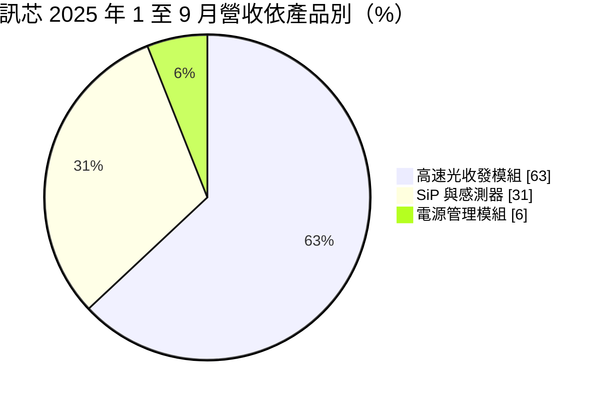
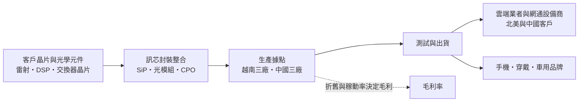
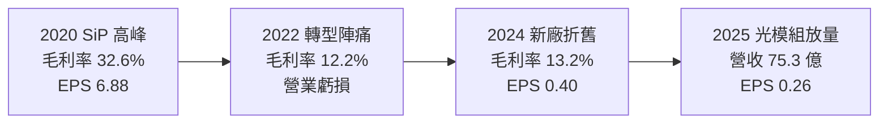
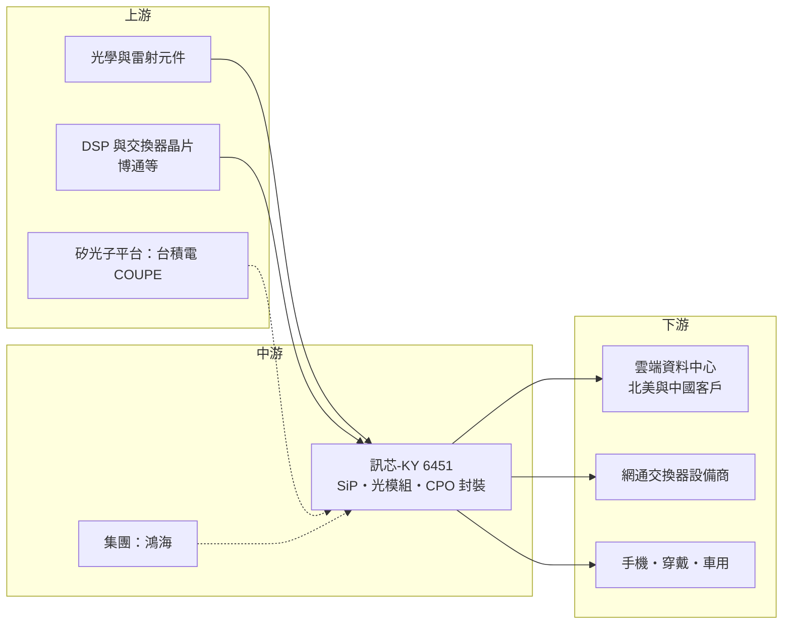

# 6451 訊芯-KY

> 上市｜[[產業索引-半導體業|半導體業]]｜上市（櫃）日期 2015/01/26

# 第一章：企業模式與商業藍圖

> [!info] 撰寫說明
> 本文由 Claude 依公開資料整理，架構比照 [[2330台積電]] 的四章研究，資料截至 2026-10-08。財務數字來源：Goodinfo 年度經營績效與股利政策頁、MoneyDJ 資產負債表與現金流量表、Yahoo 股市公司基本資料、散戶鬥嘴鼓 2025 年 11 月法說會摘要、優分析、理財周刊、科技新報、自由時報、數位時代報導；產業描述為整理性內容，尚未逐條比對原始文件。#待校對

在評估一家公司的長期價值時，第一步是看懂它在產業鏈的位置與賺錢方式。本章針對訊芯-KY（股票代號：6451，以下簡稱訊芯）的商業模式進行定性分析，說明這家鴻海集團旗下的封裝廠，如何從手機與穿戴裝置的系統級封裝，轉向 AI 資料中心的光通訊模組與共同封裝光學。

## 一、核心定位：鴻海集團的系統模組封裝廠

訊芯成立於 2008 年，註冊地在開曼群島，2015 年在台灣掛牌，是鴻海集團的轉投資公司。業務是系統模組封裝產品及各型積體電路模組的封裝、測試與銷售。2023 年 6 月，前台積電共同營運長、時任鴻海半導體策略長的蔣尚義接任董事長，總經理為徐文一。這項人事安排讓訊芯成為鴻海「3+3」策略中半導體布局的一環，負責集團的後段[[先進封裝]]。

訊芯的核心能力是把多顆晶片、被動元件、光學元件高密度整合在一個小模組裡。這種技術有兩個應用方向：一是系統級封裝（[[SiP]]），把無線通訊、感測器等功能做成小模組，放進手機、穿戴裝置與車用電子；二是高速[[光收發模組]]，把雷射、光偵測器與控制晶片封裝在一起，負責資料中心伺服器與交換器之間的光訊號傳輸。近年後者已經成為營收主體。

## 二、終端應用與產品板塊：光通訊成為主力

依 2025 年 11 月法說會資料，訊芯的產品別營收結構如下：

* **高速光收發模組：** 2024 年占 55%，2025 年前三季升到 63%。目前出貨以 400G 為大宗，正轉向 800G 與 1.6T。AI 資料中心的 GPU 與[[AI伺服器]]之間需要大量高速連線，光模組的速度每兩三年翻倍一次，是訊芯最主要的成長引擎。
* **SiP 與感測器：** 2024 年占 43%，2025 年前三季降到 31%。產品包括無線通訊與射頻模組、MEMS 與光學感測器，應用於手機、穿戴裝置與車用。這塊業務的毛利率較高，比重下降是近年毛利率走低的原因之一（優分析引述法人觀點）。
* **電源管理模組與導線架封裝：** 占比 6%，公司正擴充 TOLL、TO-247 等功率封裝，並建置[[SiC]]、[[GaN]]寬能隙半導體的封裝能力。

## 三、資本轉化邏輯：重資產封裝、靠稼動率與良率賺錢

* **生產據點：** 依 2025 年 11 月法說會資料，訊芯在越南有北寧光州、北寧雲中與河內三個據點，在中國有安徽合肥、江蘇蘇州、廣東中山三個據點，全球員工約 3,500 人。2022 年在河內設立第一座越南廠，2024 年 7 月完成收購盛帆蘇州。越南廠的設立是應客戶要求建立「中國以外」的產線，公司表示從承租到完成無塵室只花三個月，之後約一年半把大客戶產品從中國移到越南，並把良率拉到與中國廠相當。
* **重資產特性：** 封裝與光模組組裝需要大量自動化設備與無塵室，新廠開出初期稼動率（[[產能利用率]]）低、折舊高，會壓低毛利率。訊芯 2024 年毛利率只有 13.2%，主因之一就是新廠房折舊與產能尚未達經濟規模。
* **垂直整合：** 公司布局光學元件、光纖陣列（FAU）、光收發模組到 CPO 整合封裝，希望在每一代傳輸技術轉換時都能參與。

## 四、企業長期藍圖：CPO 與矽光子

* **[[CPO]]（共同封裝光學）：** 傳統光模組是插在交換器面板上的獨立零件，CPO 則把光學引擎直接封裝在交換器晶片旁邊，縮短電訊號走的距離，降低耗電。訊芯自 2021 年起與一家美國客戶合作開發 CPO，51.2T 交換器用的 CPO 已小量出貨給中國與北美客戶，102.4T 產品已完成新產品導入、交由終端客戶測試。2026 年 6 月股東會上，公司表示已具備 51.2T 與 102.4T CPO 的量產能力。
* **與台積電[[矽光子]]平台合作：** 訊芯與 [[2330台積電]] 合作 [[COUPE]]（緊湊型通用光子引擎）平台，定位在後段光學引擎的封裝。這代表訊芯在台積電主導的矽光子供應鏈中扮演後段整合的角色。
* **擴產：** 公司規劃 2026 至 2027 年資本支出約 40 億至 50 億元，主要用於矽光子 CPO 自動化產線、先進封裝與光路交換器，並不排除在馬來西亞或新加坡設立新據點。管理層預期越南新廠效益自 2026 年底開始浮現，2027 年進入量產收成期。
* **面板級封裝：** 蔣尚義在 2026 年股東會表示，鴻海集團有扇出型面板級封裝（[[FOPLP]]）經驗，若玻璃基板技術確立，訊芯與集團有能力掌握機會，但製程路線與供應鏈仍待確認。

# 第二章：護城河深度與競爭優勢

護城河是企業抵禦競爭、長期維持超額利潤的機制。本章分析訊芯的護城河由什麼構成、在光模組與 SiP 兩個市場分別面對哪些對手，以及它的優勢能否轉化成穩定獲利。

## 一、訊芯護城河的核心組成要素

訊芯的護城河目前仍在建立中，可以分成三個要素：

* **1. 高密度整合的封裝技術：** SiP 與光模組都需要把不同材料、不同功能的元件精準組裝在很小的空間裡，光學元件的對位精度要求以微米計。這種技術需要長期累積製程經驗與良率數據，新進者不容易短時間追上。
* **2. 鴻海集團與蔣尚義的產業網絡：** 鴻海集團是全球最大的電子代工集團，與雲端業者、網通設備商都有深厚關係；蔣尚義出身台積電，熟悉先進封裝與矽光子路線。訊芯能參與台積電 COUPE 平台、與美國客戶合作開發 CPO，與這層產業關係有關（推估）。
* **3. 中國以外的產能：** 越南三個據點讓訊芯能滿足美系客戶「非中國製造」的要求。地緣政治升溫後，這種產能配置本身就是接單條件之一。

## 二、全球主要競爭對手格局

| 對手 | 定位 | 對訊芯的威脅 |
|---|---|---|
| 中際旭創、新易盛 | 中國光模組龍頭，規模大、成本低 | 在 400G 與 800G 光模組市場占有率高，壓低價格 |
| Coherent、Fabrinet | 美系光通訊元件廠與光學代工廠 | 在北美雲端客戶具長期合作關係 |
| [[4979華星光]]、[[3363上詮]]、[[6442光聖]] | 台灣光通訊元件與模組廠 | 在矽光子與 CPO 供應鏈爭取同一批客戶 |
| [[3711日月光投控]] | 全球最大封測集團，SiP 規模領先 | 在 SiP 與 CPO 先進封裝都具規模優勢 |

光模組市場的特性是技術世代更替快、價格每年下滑。中國廠商憑藉規模與成本優勢，在可插拔光模組占有很高的份額；訊芯的差異化策略是押注 CPO 與矽光子這種需要先進封裝能力的新架構，避開與中國廠在傳統光模組上正面拚成本。

## 三、優勢轉化：哪些市場守得住、哪些守不住

* **守得住：** 需要「非中國產能」的美系客戶訂單，以及與台積電、美國客戶共同開發的 CPO 專案。這類合作的驗證週期長，一旦量產，客戶不容易更換封裝夥伴。
* **守不住：** 傳統可插拔光模組的價格與 SiP 的毛利。2022 年與 2024 年訊芯都出現營業虧損，2025 年營收成長 45% 但營業利益率只有 2.19%，顯示在新產能爬坡、產品組合轉向光模組的過程中，規模並沒有轉成利潤。
* **觀察重點：** 第一，越南新廠稼動率與良率何時達到經濟規模，讓毛利率回到 20% 以上；第二，CPO 何時從小量出貨進入大規模量產，法人普遍認為要等單通道 200G 以上規格成熟，約在 2026 至 2027 年；第三，40 億至 50 億元的資本支出能否在 2027 年以後帶來相對應的營收與獲利。

# 第三章：財務體質與盈利規模

資料日期：2026-10-08。數字取自 Goodinfo 年度經營績效、MoneyDJ 財務報表與法說會摘要，表格是撰寫當時的快照；最新月營收、毛利率、累計 EPS 由自動排程寫在本筆記的屬性欄位（月營收、毛利率、累計EPS 等）。#待校對

財務報表是檢驗護城河是否真實存在的最終標準。本章用多年度數據檢視訊芯從 SiP 轉向光通訊的過程中，獲利能力與資本效率的變化。

## 一、獲利能力的基石：三率

| 年度 | 營收（億元） | [[毛利率]] | [[營業利益率]] | EPS（元） | [[ROE]] |
|---|---|---|---|---|---|
| 2019 | 57.4 | 24.1% | 10.8% | 6.16 | 11.1% |
| 2020 | 48.5 | 32.6% | 19.8% | 6.88 | 12.1% |
| 2021 | 42.7 | 21.6% | 1.38% | 3.77 | 5.93% |
| 2022 | 53.2 | 12.2% | -1.52% | 1.92 | 2.77% |
| 2023 | 52.1 | 23.4% | 5.45% | 4.10 | 6.72% |
| 2024 | 51.9 | 13.2% | -4.37% | 0.40 | 0.52% |
| 2025 | 75.3 | 16.2% | 2.19% | 0.26 | 0.81% |

資料來源：Goodinfo 合併報表年度經營績效。2021 年至 2024 年營業利益偏低但 EPS 仍為正，推估主要靠利息收入等業外收益支撐。

* **[[毛利率]]的下滑：** 訊芯毛利率由 2020 年的 32.6% 降到 2024 年的 13.2%。原因有三：高毛利的 SiP 與感測器比重下降；光模組市場價格競爭激烈；越南新廠與蘇州收購廠在爬坡期折舊偏高。
* **[[營業利益率]]長期偏低：** 2021 年以後營業利益率在負 4.37% 至 5.45% 之間擺盪，代表本業規模雖然擴大，但新產能尚未帶來足夠的毛利來覆蓋費用。
* **長期成長：** 2019 年至 2025 年營收年複合成長率約 4.6%（推算），2021 年至 2025 年約 15.2%（推算）。營收在 2025 年明顯跳升，但 2026 年第一季營收年減約 21%，顯示光模組出貨的時點波動很大。

## 二、[[ROE]]：資本效率

訊芯近 5 年（2021 至 2025 年）平均 ROE 約 3.4%（推算），2024 與 2025 年都不到 1%。和 2019 至 2020 年超過 11% 相比，資本效率明顯下降。原因是公司在轉型期間大量投入新廠與收購，資產規模擴大，獲利卻沒有同步成長。依法說會資料，2025 年第三季負債占總資產比例由前一年的 52% 升到 64%，公司新增應付公司債約 23.5 億元與長期借款約 24.5 億元，財務槓桿提高，但 ROE 仍然偏低，代表問題出在本業獲利，而不是資本結構。

## 三、資本支出與自由現金流

* **[[CapEx]]：** 依 MoneyDJ 季度現金流量表加總，2025 年購置設備約 18.1 億元，2026 年上半年再支出約 7.8 億元。公司規劃 2026 至 2027 年資本支出合計約 40 億至 50 億元。
* **[[自由現金流]]：** 2025 年營業現金流約負 7.9 億元，加上資本支出後，自由現金流約負 26 億元（推算），資金缺口主要靠公司債與銀行借款支應。2025 年底帳上現金約 48.3 億元，有息負債（短期借款、長期借款、公司債與租賃負債）合計約 96.7 億元。
* **股利政策：** 依 Goodinfo，2019 年至 2025 年度的現金股利分別約為 3.67、4.10、2.56、1.17、2.46、0.36、0.22 元，隨獲利下滑而大幅減少。在大規模投資期，股利不是這家公司的主要報酬來源。

## 四、[[ROIC]] 與 [[WACC]]：價值創造利差

* **ROIC（推算）：** 2025 年營業利益約 1.65 億元（營收 75.3 億元 × 營業利益率 2.19%），稅後約 1.32 億元（稅率 20%）。投入資本約 173.4 億元（2025 年底股東權益 76.73 億元，加上有息負債約 96.67 億元），ROIC 約 0.8%（推算）；扣除帳上現金 48.3 億元後，ROIC 也只有約 1.1%。
* **WACC（推算）：** 無風險利率取 1.75%，市場風險溢酬 6%，β 取封測與光通訊同業常見值 1.2（未查得公司實際 β），股東權益成本約 8.95%。稅前負債成本假設 2.5%、稅率 20%，稅後約 2.0%。以帳面價值計算，權益約占 44%、負債約占 56%，WACC 約 5.1%（推算）。若以市值計算權益比重，WACC 會更高。
* **解讀：** 目前 ROIC 遠低於 WACC，代表訊芯過去幾年投入的資本尚未創造價值，股東承擔的是「先投資、後回收」的轉型風險。這個利差能否翻正，幾乎完全取決於越南新廠與 CPO 產線能否在 2027 年以後達到高稼動率。若 CPO 如管理層預期在 AI 資料中心放量，高附加價值的封裝業務有機會讓營業利益率回到 2020 年前後的水準；若放量延後，龐大的折舊與利息支出會持續壓低報酬率。

# 第四章：總體風險與地緣政治

任何企業都無法脫離宏觀環境獨立存在。本章分析訊芯長期必須面對的地緣政治、產業週期、營運與技術風險。

## 一、地緣政治風險

* **中美雙邊布局的兩難：** 訊芯同時在中國與越南設廠，光模組同時出貨給中國與北美客戶。這種配置在美中對立升溫時有彈性，但也代表公司必須同時遵守兩邊的出口管制與在地化要求。若美國進一步限制高速光通訊產品出口中國，或中國要求本土化採購，訊芯的中國業務會受到影響。
* **客戶要求的產能搬遷：** 美系客戶要求把產品移出中國，訊芯已在越南建立產線，但每一次搬遷都要重新認證，公司表示產品認證約需一年，新廠投資也需要時間才能回收。
* **新據點的不確定性：** 公司評估馬來西亞與新加坡設廠，海外擴張可分散風險，但也會增加管理難度與初期成本。

## 二、產業週期與市場結構風險

* **AI 資本支出的集中性：** 光模組需求高度依賴少數大型雲端業者的資本支出。AI 投資節奏一旦放緩，光模組訂單可能快速調整，2026 年第一季營收年減約 21% 已顯示出貨時點的波動。
* **價格快速下滑：** 光模組每一代產品上市後，價格通常逐年下降，廠商必須不斷推出下一代產品才能維持毛利。中國廠商的規模優勢讓價格壓力更大。
* **消費電子週期：** SiP 與感測器業務仍與手機、穿戴裝置的出貨連動，消費電子景氣低迷時這塊業務也會受影響。

## 三、營運環境的隱性風險

* **財務槓桿上升：** 2025 年起公司以公司債與長期借款支應資本支出，負債比率上升。若擴產效益延後，利息負擔會持續侵蝕獲利。
* **新廠爬坡風險：** 越南三個據點、蘇州收購廠同時整合，人員、良率與供應鏈管理的難度高。公司在股東會上也提到越南與台灣在語言與文化上需要時間磨合。
* **客戶集中：** 光模組與 CPO 業務集中於少數大型客戶，公司未公開客戶名稱與比重（未查得），單一客戶的訂單變化可能造成營收大幅波動。
* **集團關係：** 訊芯是鴻海集團的轉投資公司，集團的策略方向會影響訊芯的業務分工與資源，這對小股東而言既是支撐也是不確定性。

## 四、科技演進風險

光通訊的技術路線仍在快速演變：可插拔光模組、線性驅動光模組（LPO）、CPO、光路交換器（OCS）等架構可能並存，最終由哪一種成為主流仍有不確定性。訊芯的策略是各條路線都布局，好處是不押單一路線，代價是研發與資本支出分散。另外，CPO 讓光學引擎與交換器晶片封裝在一起，主導權可能轉移到晶圓代工與大型封測廠手上；訊芯能否在台積電 COUPE 等平台中保有後段封裝的角色，是長期最關鍵的技術觀察點。

# 專有名詞解析

## 半導體

- **[[SiP]]**：系統級封裝，把多顆晶片與被動元件封裝成一個小模組，讓手機與穿戴裝置縮小體積。
- **[[CPO]]**：共同封裝光學，把光學引擎直接封裝在交換器晶片旁，縮短電訊號距離以降低耗電。
- **[[矽光子]]**：在矽晶片上製作光學元件，以光取代電傳輸資料，可降低 AI 資料中心的傳輸耗電。
- **[[COUPE]]**：台積電的緊湊型通用光子引擎平台，用先進封裝把電子晶片與光子晶片堆疊整合。
- **[[先進封裝]]**：把多顆晶片以中介層、混合鍵合等方式高密度整合的封裝技術，例如 CoWoS、SoIC。
- **[[FOPLP]]**：扇出型面板級封裝，用大尺寸方形面板取代圓形晶圓進行封裝，以提高面積利用率、降低成本。
- **[[SiC]]**：碳化矽，耐高壓、耐高溫的寬能隙半導體材料，用於電動車與高階電源。
- **[[GaN]]**：氮化鎵，開關速度快、體積小的寬能隙半導體材料，用於快充與資料中心電源。

## 應用

- **[[AI伺服器]]**：搭載 GPU 或 AI 加速器、用於訓練與推論的伺服器，需要大量高速光連線。

## 金融

- **[[產能利用率]]**：實際生產量占總產能的比例，封裝廠新廠爬坡期利用率低，折舊會壓低毛利率。
- **[[自由現金流]]**：營業活動現金流減去資本支出，代表企業可自由用於配息、還債或併購的現金。

## 產業

- **[[光收發模組]]**：把電訊號轉成光訊號再轉回來的模組，用於資料中心伺服器與交換器之間的高速傳輸。

# 核心供應鏈

## 1. 上游：晶片與光學元件
- 網通與交換器晶片：理財周刊報導訊芯的矽光子先進封裝已取得 [[AVGO博通]] 等網通晶片大廠訂單
- 矽光子平台：[[2330台積電]]（COUPE 平台合作）
- 雷射與光學元件：台灣供應商包括 [[3081聯亞]]、[[4979華星光]] 等，與訊芯的實際採購關係未查得

## 2. 中游：訊芯與集團
- 集團母公司：[[2317鴻海]]
- 光模組與光通訊同業：[[4979華星光]]、[[3363上詮]]、[[6442光聖]]；國際有中際旭創、新易盛、Coherent、Fabrinet
- SiP 同業：[[3711日月光投控]]

## 3. 下游：客戶與終端
- 北美與中國的雲端業者與網通設備商，公司未公開名稱（未查得）
- 手機、穿戴裝置與車用電子品牌

延伸閱讀：[[台積電供應鏈]]

## 最新新聞
<!-- news:start -->
<!-- news:end -->

## 相關連結
- [公開資訊觀測站](https://mopsov.twse.com.tw/mops/web/t05st03?step=1&firstin=1&co_id=6451)
- [Goodinfo](https://goodinfo.tw/tw/StockDetail.asp?STOCK_ID=6451)
- [Yahoo 股市](https://tw.stock.yahoo.com/quote/6451)
- [鉅亨網新聞](https://www.cnyes.com/twstock/6451/news)
