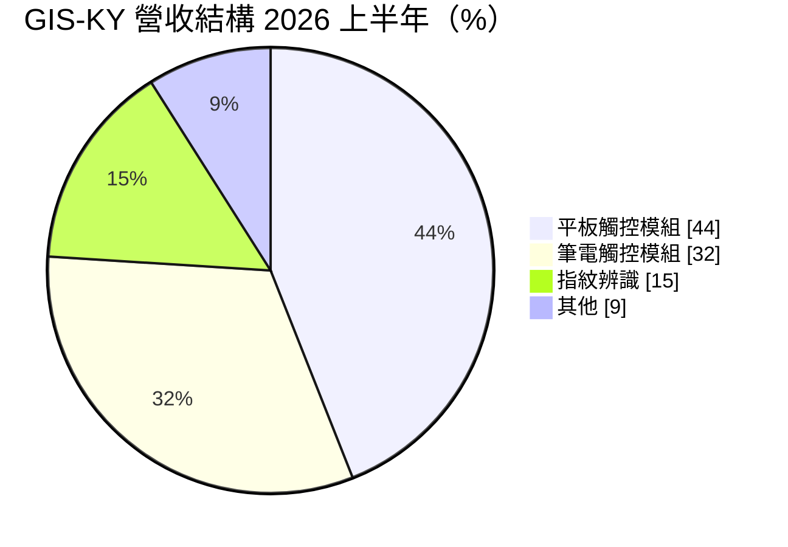
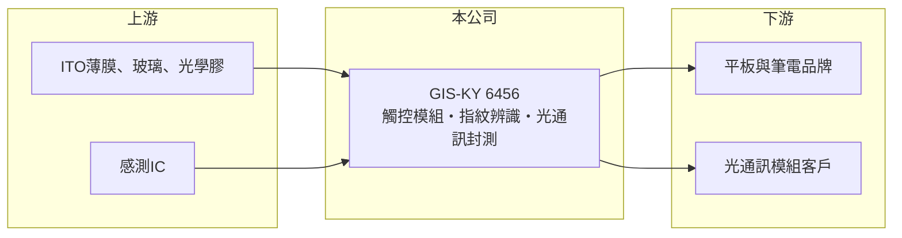

# 6456 GIS-KY

> 上市｜[[產業索引-光電業|光電業]]｜上市（櫃）日期 2015/06/12

# 第一章：企業模式與商業藍圖

> [!info] 撰寫說明
> 精簡版，由 Claude 依公開資料整理，架構比照 [[2330台積電]]，資料截至 2026-10-07。來源：富果研究 GIS-KY 2026 年 9 月法說會摘要、科技新報營收報導。#待校對

GIS-KY（業成）是平板與筆電觸控模組的大廠，正投入資本轉向半導體光學與光通訊。

- **核心業務：** 主要產品為平板與筆電用的[[電容式觸控]]模組，以及[[指紋辨識]]模組，製程包含[[光學貼合]]。
- **營收結構：** 2026 年上半年平板觸控模組占 44%、筆電觸控模組 32%、指紋辨識 15%、其他 9%。
- **營運據點：** 生產據點本次來源未列明細；依公司過往資料推估主要在中國大陸。
- **長期方向：** 2026 年資本支出上調至約 80 億元，投入 800G 光通訊雷射光源的封裝測試，預計 2027 年開始貢獻營收，屬於[[矽光子]]與光通訊供應鏈的布局。

# 第二章：護城河深度與競爭優勢

GIS-KY 的優勢在大量生產規模與大客戶認證，但觸控本業毛利率很薄。

- **競爭優勢：** 觸控與貼合需要大面積良率控制與大量產能，進入國際品牌供應鏈後轉換成本較高。
- **主要對手：** 觸控面板同業 [[3673TPK-KY]]，以及中國觸控與模組廠；光通訊封測領域則需面對既有的光模組廠。
- **觀察重點：** 記憶體缺貨對平板、筆電出貨的影響何時消退，以及 800G 光通訊封測能否如期在 2027 年量產。

# 第三章：財務體質與盈利規模

資料日期：2026-10-07，以下數字是撰寫當時的快照；最新月營收、毛利率、累計 EPS 由自動排程寫在本筆記的屬性欄位（月營收、毛利率、累計EPS 等）。#待校對

GIS-KY 2026 年營收明顯下滑，第二季轉為虧損。

- **營收規模：** 2026 年第二季合併營收約 105 億元，季減 34.7%、年減 44.8%；7 月營收 40.81 億元，前 7 月累計 306.61 億元，年減 22.7%。
- **獲利：** 第二季[[毛利率]] 3.3%（前一季 5.0%），營業損失 8.03 億元，稅後淨損 10.53 億元，EPS -3.15 元。
- **財務特色：** 觸控組裝毛利率長期偏低，營收下滑時固定成本使虧損放大；同時又要支出約 80 億元 [[CapEx]] 轉型，資金壓力需觀察。

# 第四章：總體風險與地緣政治

GIS-KY 的風險來自客戶集中、終端需求與轉型執行。

- **產業週期：** 平板與筆電出貨受消費電子景氣與記憶體供給影響，公司預期第三季優於第二季、第四季再好轉。
- **營運風險：** 營收高度依賴少數品牌客戶（推估），訂單轉移會造成大幅波動；光通訊新事業需通過客戶驗證。
- **其他風險：** 中國生產據點的地緣政治與關稅風險，以及新台幣與人民幣匯率波動。

# 專有名詞解析

## 半導體

- **[[電容式觸控]]**：利用手指改變電極間電容來偵測位置的觸控技術，是平板與筆電觸控的主流。
- **[[矽光子]]**：在矽晶片上整合光訊號傳輸元件，用於高速光通訊與資料中心互連。

## 應用

- **[[指紋辨識]]**：以光學、電容或超音波感測指紋紋路來驗證身分的模組。
- **[[光學貼合]]**：把觸控感測層與顯示面板以光學膠貼合，減少反光並提升可視性。

## 金融

- **[[毛利率]]**：營業毛利占營收的比例，反映產品的定價能力與成本控制。
- **[[CapEx]]**：資本支出，企業購置廠房、設備等長期資產的支出。

# 核心供應鏈

- 上游：ITO 薄膜、玻璃、光學膠與感測 IC 供應商（推估）
- 下游／客戶：平板與筆電品牌，市場普遍認為主要客戶為 [[AAPL蘋果]]（推估）；未來加入光通訊模組客戶
- 同業：[[3673TPK-KY]]、中國觸控模組廠

## 最新新聞
<!-- news:start -->
<!-- news:end -->

## 相關連結
- [公開資訊觀測站](https://mopsov.twse.com.tw/mops/web/t05st03?step=1&firstin=1&co_id=6456)
- [Goodinfo](https://goodinfo.tw/tw/StockDetail.asp?STOCK_ID=6456)
- [Yahoo 股市](https://tw.stock.yahoo.com/quote/6456)
- [鉅亨網新聞](https://www.cnyes.com/twstock/6456/news)
