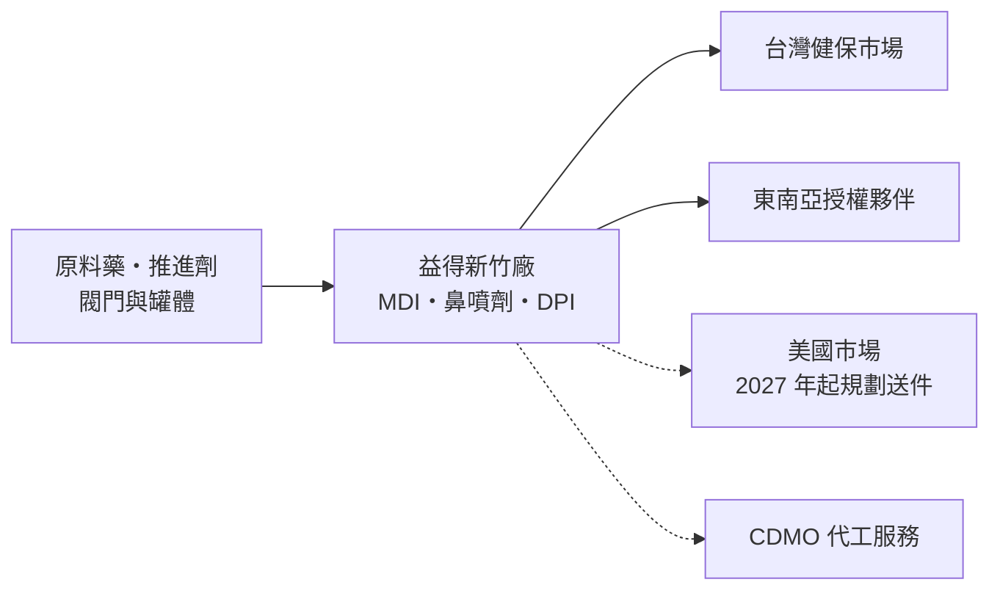
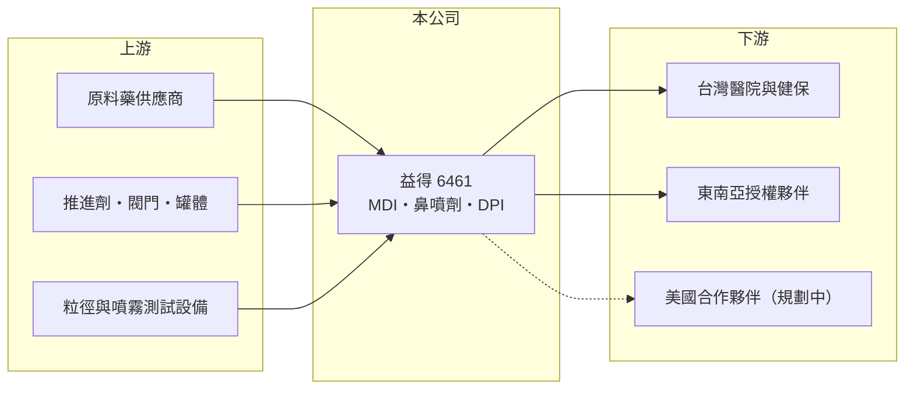

# 6461 益得

> 上櫃｜[[產業索引-生技醫療業|生技醫療業]]｜上市（櫃）日期 2018/03/28

# 第一章：企業模式與商業藍圖

> [!info] 撰寫說明
> 本文由 Claude 依公開資料整理，架構比照 [[2330台積電]] 的四章研究，資料截至 2026-10-08。財務數字來源：Goodinfo 年度經營績效表、櫃買中心開放資料（基本資料、2026 年第二季財報、每月營收、本益比殖利率）；產品、藥證與產能資料取自富果研究整理的 2026 年 7 月法說會摘要（AI 摘要，非公司原始文件）。股本變動原因與合作夥伴名稱待校對。#待校對

益得是台灣少數專攻吸入式藥物的公司，產品是氣喘與慢性阻塞性肺病患者使用的定量噴霧吸入器，以及鼻噴劑。這類藥物同時是藥品也是精密器械，開發門檻高，但公司目前仍處於投入期。本章說明益得生物科技（股票代號：6461，以下簡稱益得）的商業模式。

## 一、核心定位：複雜吸入劑的學名藥開發與製造

益得成立於 2010 年，2018 年在櫃買中心掛牌，總部與工廠位於新竹湖口，董事長為林智暉，總經理為 Manish Chawla，實收資本額約 11.0 億元。公司自稱是台灣唯一整合研發、測試、製造到商業化的複雜吸入式藥械組合產品公司。

* **[[定量噴霧吸入器]]（MDI）：** 已在台灣與東南亞多國上市的產品包括 Duasma（Budesonide）、Synvent（Albuterol）與 Synbufo（Budesonide 加 Formoterol 複方），用於氣喘與慢性阻塞性肺病（上市年份未查得）。
* **鼻噴劑：** 首款自主研發的鼻噴劑 Synfanas（Azelastine／Fluticasone 複方）於 2026 年 1 月取得台灣藥證並獲健保核價，公司預計 2026 年第三至第四季在台灣上市（實際上市時間待校對）。
* **產能：** 新竹廠符合 PIC/S GMP，年產能為 MDI 1,500 萬支、鼻噴劑 1,000 萬支、乾粉吸入器 150 萬支。

## 二、資本轉化邏輯：先建產能與藥證，再等美國市場

* **高固定成本：** 吸入劑需要專用的充填設備、粒徑測試與無塵產線，工廠建好後不論產量多少都要負擔折舊與人力。益得目前營收不到 1.1 億元，產能利用率低，因此連毛利都是負的。
* **美國市場是關鍵：** 美國吸入劑學名藥市場規模大、競爭者少，但需要完成與原廠藥的等效性研究，審查時間長。依法說會資料，公司目標在 2027 年備妥 3 至 4 項美國藥證申請（實際送件時間將與合作夥伴討論），2028 至 2030 年取得並上市 1 至 2 項美國產品。

## 三、長期方向：環保推進劑轉換的機會

全球主要藥廠承諾在 2030 至 2035 年前，把 MDI 的推進劑轉換為[[低全球暖化潛勢推進劑]]（LGWP）。依法說會資料，益得已啟動 4 項 LGWP 關鍵產品開發，並在台灣取得 2 項相關專利，長期目標是 2030 年後全面轉向 LGWP 產品、成為全球吸入劑研發與製造的 [[CDMO]] 夥伴，並開發 [[505(b)(2)]] 差異化新藥。推進劑轉換會讓原廠與學名藥廠都必須重新開發產品，這是新進者切入的窗口。

# 第二章：護城河深度與競爭優勢

護城河是企業抵禦競爭、長期維持超額利潤的機制。本章說明益得在吸入劑領域的技術門檻，以及這些門檻何時才能轉化為獲利。

## 一、益得護城河的核心組成要素

* **1. 藥械組合的技術門檻：** 吸入劑的療效取決於藥物粒徑、噴霧劑量與閥門設計，學名藥必須證明在肺部沉積的效果與原廠相同，開發難度遠高於一般口服錠劑。全球能做吸入劑學名藥的廠商數量有限。
* **2. 專用產能：** 新竹廠同時具備 MDI、鼻噴劑與乾粉吸入器產線，並通過 PIC/S GMP，這類產能從建廠到取得核准需要多年時間。
* **3. LGWP 專利與先行開發：** 在推進劑轉換的早期就投入開發並取得專利，有機會成為國際藥廠的代工或授權夥伴。

## 二、主要競爭對手格局

| 對手 | 定位 | 對益得的影響 |
|---|---|---|
| 原廠藥廠（如 GSK、AstraZeneca） | 吸入劑原廠，品牌與通路強 | 掌握醫師處方習慣與既有市場 |
| Teva、Viatris 等國際學名藥廠 | 已有美國吸入劑學名藥 | 搶先取得美國市場份額 |
| 印度藥廠（如 Cipla、Lupin） | 吸入劑學名藥成本低 | 在東南亞與美國以價格競爭 |

## 三、優勢轉化：守得住與守不住的地方

* **守得住：** 已建立完整產線與台灣、東南亞的上市產品，技術能力有實際產品驗證。
* **守不住：** 2019 至 2025 年每年營業虧損約 2.4 億至 3.7 億元，毛利長期為負，台灣與東南亞市場規模不足以支撐產能。
* **觀察重點：** 美國藥證申請的實際送件時間與合作夥伴、鼻噴劑在台灣上市後的銷售，以及 CDMO 代工訂單能否提高產能利用率。

# 第三章：財務體質與盈利規模

資料日期：2026-10-08，表格是撰寫當時的快照；最新月營收、毛利率、累計 EPS 由自動排程寫在本筆記的屬性欄位（月營收、毛利率、累計EPS 等）。#待校對

財務報表是檢驗護城河是否真實存在的最終標準。本章用五年的三率、ROE 與資本報酬，檢視益得投入期的財務狀況。

## 一、多年度財務表現

| 年度 | 營收（新台幣） | [[毛利率]] | [[營業利益率]] | EPS（元） | [[ROE]] |
|---|---|---|---|---|---|
| 2021 | 0.39 億 | -307% | -756% | -2.97 | -22.6% |
| 2022 | 0.24 億 | -623% | -1,345% | -2.82 | -27.7% |
| 2023 | 0.26 億 | -634% | -1,240% | -2.81 | -30.7% |
| 2024 | 0.40 億 | -396% | -895% | -2.68 | -37.2% |
| 2025 | 1.08 億 | -103% | -339% | -2.57 | -40.6% |

資料來源：Goodinfo 年度經營績效（合併報表）。2026 年上半年（櫃買中心資料）營收約 0.36 億元、營業毛損約 0.90 億元、營業損失約 2.05 億元、EPS 負 1.22 元；2026 年 1 至 8 月累計營收較前一年同期減少約 56%。

* **營收太小，比率失真：** 營收只有數千萬到一億元，固定的折舊與人力成本讓毛利率與營業利益率出現負數百個百分點的極端數字。對益得而言，比率不如「每年營業虧損約 3 億至 3.7 億元」這個絕對金額有意義。
* **股本變動：** Goodinfo 顯示股本從 2021 年約 11.6 億元增加到 2025 年約 17.8 億元，代表多次[[現金增資]]；2026 年第二季財報股本約 11.03 億元，推估 2026 年曾辦理[[減資彌補虧損]]（待校對）。
* **長期指標：** 2021 至 2025 年平均 ROE 約負 31.8%（推算），未配發股利。2026 年第二季底總資產約 23.0 億元，負債約 14.0 億元（其中非流動負債約 11.7 億元），權益約 8.9 億元，負債已高於權益。

## 二、[[ROIC]] 與 [[WACC]]：價值創造利差

**ROIC 推算：** 2025 年營業虧損約 3.65 億元，虧損年度不計稅盾。官方資料揭露負債總計約 14.0 億元，以非流動負債為主，假設七成為有息負債約 9.8 億元（推估），加上權益約 8.9 億元，投入資本約 18.8 億元，ROIC 約負 19.5%（推算）。

**WACC 推算：** 台灣 10 年期公債殖利率取 1.75%、市場風險溢酬 6%、β 取研發型生技股常見值 1.2（未查得公司實際 β），股東權益成本約 8.95%。負債成本假設 3.0%，稅後約 2.4%，權益約占投入資本 48%，WACC 約 5.5%（推算）。

**結論：** ROIC 為負，低於 WACC 約 25 個百分點，這是研發與建廠投入期公司的典型狀態。益得的價值取決於美國藥證能否在 2028 至 2030 年間取得並放量；在那之前，股東承擔的是持續的資金需求與稀釋風險。

# 第四章：總體風險與地緣政治

任何企業都無法脫離宏觀環境獨立存在。本章分析益得長期必須面對的研發、法規與財務風險。

## 一、研發與法規風險

* **美國審查不確定：** 吸入劑學名藥須證明與原廠的體外與臨床等效性，FDA 審查嚴格、補件頻繁，取證時間可能比公司規劃更長。
* **推進劑轉換的雙面性：** LGWP 轉換是機會，也代表既有 MDI 產品未來可能需要重新開發與送審，增加研發支出。

## 二、市場與競爭風險

* **合作夥伴依賴：** 美國市場需要透過合作夥伴銷售，合作條件與夥伴的執行力會影響最終獲利；目前合作夥伴名稱未公開。
* **價格競爭：** 學名藥上市後若有多家競爭者，價格會快速下滑，壓縮投入回收的空間。

## 三、財務風險

* **持續燒錢：** 每年營業虧損約 3 億元以上，負債已高於權益，未來可能需要再增資或舉債，對既有股東形成稀釋。
* **產能閒置：** 在美國產品上市前，產能利用率低，折舊持續拖累毛利。

# 專有名詞解析

## 金融

- **[[現金增資]]**：公司發行新股向股東或投資人募集現金，可充實資本，但會稀釋既有股東持股。
- **[[減資彌補虧損]]**：公司以減少股本的方式沖銷累積虧損，股數減少但股東權益總額不變，常見於長期虧損的公司。
- **[[ROIC]]**：投入資本報酬率，稅後營業利益除以股東權益加有息負債，衡量本業運用資本的效率。
- **[[WACC]]**：加權平均資金成本，股東與債權人要求報酬率的加權平均，是 ROIC 要超越的門檻。

## 產業

- **[[定量噴霧吸入器]]**：英文簡稱 MDI，以推進劑把定量藥物噴入肺部的吸入裝置，是氣喘與慢性阻塞性肺病的主要用藥方式。
- **[[低全球暖化潛勢推進劑]]**：英文簡稱 LGWP，用來取代現行高溫室效應推進劑的新一代吸入劑推進劑，各大藥廠承諾在 2030 年代前轉換。
- **[[PIC S GMP]]**：國際醫藥品稽查協約組織的優良製造規範，台灣藥廠須符合此標準，產品才能在國內外取得藥證。
- **[[CDMO]]**：委託開發暨製造服務，替藥廠從製程開發到量產一條龍代工，類似製藥業的晶圓代工。
- **[[505(b)(2)]]**：美國 FDA 的新藥申請途徑，可引用既有藥品的資料，用於新劑型、新配方等改良型新藥。

# 核心供應鏈

## 1. 上游：原料與元件
- 原料藥、推進劑、計量閥與罐體供應商（名稱未查得）

## 2. 中游：益得與同業
- 國際吸入劑學名藥廠：Teva、Viatris、Cipla、Lupin（未在台上市）

## 3. 下游：客戶
- 台灣醫院與健保市場、東南亞與加拿大、歐盟等地授權夥伴，以及洽談中的美國合作夥伴

## 最新新聞
<!-- news:start（自動產生，請勿手動編輯此範圍） -->
- 2026-10-09 📰 媒體 09:20｜〈熱門股〉益得首項自產複方鼻噴劑在台上市 周漲1成｜[鉅亨網](https://news.cnyes.com/news/id/6626106)

完整紀錄：[[6461益得 新聞]]
<!-- news:end -->

## 相關連結
- [公開資訊觀測站](https://mopsov.twse.com.tw/mops/web/t05st03?step=1&firstin=1&co_id=6461)
- [Goodinfo](https://goodinfo.tw/tw/StockDetail.asp?STOCK_ID=6461)
- [Yahoo 股市](https://tw.stock.yahoo.com/quote/6461)
- [鉅亨網新聞](https://www.cnyes.com/twstock/6461/news)
