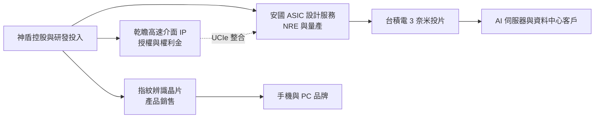
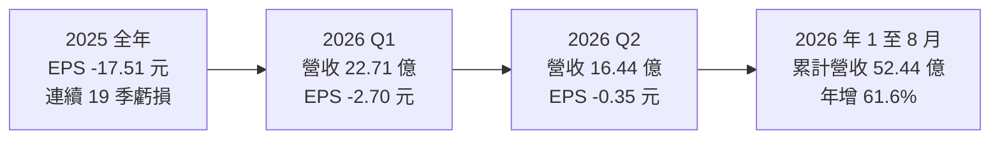
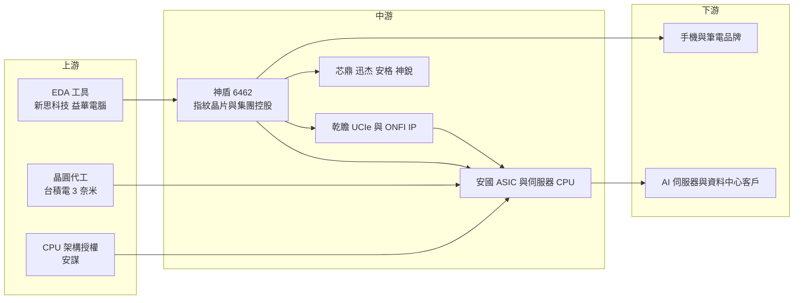

# 6462 神盾

> 上櫃｜[[產業索引-半導體業|半導體業]]｜上市（櫃）日期 2015/12/23

# 第一章：企業模式與商業藍圖

> [!info] 撰寫說明
> 本文由 Claude 依公開資料整理，架構比照 [[2330台積電]] 的四章研究，資料截至 2026-10-07。財務數字來源：經濟日報 2025 年全年財報報導與 2026 年 3 月 MWC 報導、HiStock 損益表與每股盈餘整理、科技新報月營收與乾瞻營運報導、CMoney 投資快訊；產業描述為整理性內容，尚未逐條比對原始文件。#待校對

在評估單一個股的長期投資價值時，首要步驟是拆解企業的底層獲利邏輯。本章針對神盾股份有限公司（股票代號：6462，以下簡稱神盾）的商業模式進行定性分析，說明它為何從指紋辨識晶片轉型為 AI 晶片設計集團，以及這個轉型目前走到哪一步。

## 一、核心定位：從指紋辨識轉型為 AI 晶片設計集團

神盾是台灣的 [[Fabless]] IC 設計公司，由董事長羅森洲帶領，早期以手機與筆電用的指紋辨識感測晶片聞名，曾是 Android 手機光學與電容式指紋辨識的重要供應商。隨著手機指紋市場成熟、價格競爭激烈，神盾近年透過併購與轉投資，轉型為以 AI 伺服器晶片、[[Chiplet]] 互連 [[IP]] 與 [[ASIC]] 設計服務為核心的「神盾集團」。

這個轉型需要大量研發與併購投入，神盾因此長期處於虧損狀態。經濟日報報導，2025 年全年每股淨損 17.51 元，已連續 19 季虧損。2026 年第二季每股淨損收斂至約 0.35 元，是否能進一步轉盈，是觀察轉型成效的關鍵。這個定位有兩個商業意義：

* **以集團取代單一產品：** 指紋晶片本業成長有限，神盾改以控股與多家子公司組成從 IP、ASIC 到感測的完整版圖。
* **押注 AI 伺服器架構轉變：** AI 晶片從單一大晶片走向多晶片封裝，介面 IP 與小晶片 CPU 是神盾切入的入口。

## 二、終端應用板塊：集團架構與業務組合

本次未查得集團合併營收的業務別比重，因此不畫比重圖。依 2026 年 3 月經濟日報 MWC 展覽報導，神盾集團參展的子公司共 9 家：安格、安國、迅杰、芯鼎、鈺寶、神盾衛星、神雋、乾瞻、神銳。主要成員與角色如下：

* **神盾本體：** 指紋辨識感測晶片與相關安全辨識方案，是集團的起家業務。
* **[[8054安國]]：** 集團的 ASIC 與 AI 伺服器晶片主力，推出 Mobius100 晶片，採用 Arm CSS V3 CPU IP 架構、[[2330台積電]] 3 奈米製程，並整合乾瞻的 [[UCIe]] 技術，報導稱為業界首款符合 Arm 小晶片系統架構的 CPU 晶片，可對接 AI 運算晶片。
* **乾瞻科技：** 高速介面 IP 公司，UCIe 與 [[ONFI]] IP 合計占其營收近九成。科技新報報導，乾瞻 2026 年上半年營收 2.89 億元、年增 50.4%，稅後淨利約 8,896 萬元，EPS 2.96 元，新授權案件有 88% 與資料中心相關。
* **[[6695芯鼎]]：** 影像處理晶片，提供 HSB 影像橋接模組，用於集團的多模態視覺系統。
* **[[6243迅杰]]：** 嵌入式控制器等 PC 相關晶片。
* **安格、神銳等：** 安格推出整合 RGB、[[DVS]]、[[ToF]] 感測的「AI 之眼」多模態視覺平台，神銳提供 4D 感測元件。

## 三、資本轉化邏輯：產品、設計服務與授權三種收入

* **三種收入來源：** 一是指紋辨識等既有產品銷售；二是安國的 ASIC 設計服務與量產；三是乾瞻等子公司的 IP 授權。三者的毛利率與穩定度差異很大：IP 授權毛利高、營收穩定，ASIC 量產營收大但毛利較低。
* **專案型營收跳動：** ASIC 量產營收會隨客戶專案出貨時點大幅跳動，例如 2026 年 1 月合併營收 10.31 億元、年增 200.1%，6 月卻降至 3.71 億元，7 月又回升到 7.96 億元。

## 四、企業長期藍圖：Arm 小晶片 CPU 與 UCIe 卡位

* **Arm 生態系的小晶片 CPU：** 與 [[ARM安謀]] 合作開發新一代伺服器 CPU，用小晶片架構對接各家 AI 加速器，切入 AI 伺服器市場。
* **UCIe IP 卡位：** 小晶片互連是 AI 晶片走向多晶片封裝的關鍵，乾瞻的 UCIe IP 讓集團在[[先進封裝]]世代取得技術入場券。
* **感測與視覺整合：** 結合指紋、影像、ToF 與 DVS 等感測技術，發展邊緣 AI 視覺方案。

# 第二章：護城河深度與競爭優勢

在長期價值投資中，「護城河」指企業抵禦競爭、維持超額利潤的保護機制。本章分析神盾仍在建立中的護城河、國內外主要競爭對手，以及轉型期的優勢能守住多少。

## 一、神盾護城河的核心組成要素

神盾目前的護城河「仍在建立中」，現階段較難稱為穩固，主要由四個要素組成：

* **1. IP 與介面技術：** 乾瞻的 UCIe 與 ONFI IP 已在先進製程取得授權實績，IP 一旦被客戶設計採用，會在同一產品線多代延用，具轉換成本。
* **2. 與 Arm、台積電生態系的連結：** 採用 Arm CSS 與台積電 3 奈米開發 CPU 小晶片，讓神盾集團能進入 AI 伺服器供應鏈的早期設計階段。
* **3. 集團綜效：** 從 IP、ASIC 設計到感測晶片與系統整合，集團內部可提供一條龍方案。
* **4. 指紋業務的既有客戶：** 雖然市場成熟，但累積的手機與 PC 品牌關係，仍可做為新產品的推廣管道。

## 二、全球主要競爭對手格局

| 領域 | 主要對手 | 對神盾的威脅 |
|---|---|---|
| ASIC 設計服務 | [[3443創意]]、[[3661世芯-KY]]、[[3035智原]]、[[AVGO博通]]、[[MRVL邁威爾]] | 規模與客戶基礎遠大於神盾集團 |
| 高速介面 IP | [[SNPS新思科技]]、[[CDNS益華電腦]]、[[3529力旺]]、[[6643M31]] | 國際 IP 大廠產品組合完整 |
| 指紋辨識 | Goodix（匯頂科技）、Synaptics、[[2458義隆]] | 中國業者價格競爭，本業難有穩定獲利 |
| 伺服器 CPU | 雲端業者自研（亞馬遜 Graviton、谷歌 Axion）、[[NVDA輝達]] Grace | 第三方 CPU 晶片的市場空間受壓縮 |

## 三、優勢轉化：哪些市場守得住、哪些守不住

* **守得住：** 乾瞻在 UCIe 等利基 IP 已有獲利能力，在小晶片互連這個新興領域具先行者優勢。
* **守不住：** ASIC 與伺服器 CPU 領域，神盾集團面對的是資源遠大於自己的國際大廠與台灣 ASIC 龍頭，接單規模與客戶信任仍需時間累積。指紋辨識本業則面臨中國業者的價格競爭。
* **觀察重點：** 一是 Mobius100 能否取得量產客戶；二是 2026 年第二季虧損大幅收斂後，能否在下半年轉盈；三是 ASIC 營收是否從專案性跳動轉為穩定成長。

# 第三章：財務體質與盈利規模

資料日期：2026-10-07。數字取自 HiStock 損益表整理（千元單位換算）、經濟日報與科技新報，表格是撰寫當時的快照；最新月營收、毛利率、累計 EPS 由自動排程寫在本筆記的屬性欄位（月營收、毛利率、累計EPS 等）。#待校對

財務報表是檢驗護城河是否真實存在的最終標準。本章用三率、ROE、現金流與資本報酬，檢視神盾轉型期的虧損收斂程度。由於公司仍處虧損，本章各節改以「虧損收斂」與「資金需求」為觀察主軸。

## 一、獲利能力的基石：三率

| 項目 | 2025 全年 | 2025 Q4 | 2026 Q1 | 2026 Q2 |
|---|---|---|---|---|
| 營收（新台幣） | 約 53.3 億 | 15.90 億 | 22.71 億 | 16.44 億 |
| [[毛利率]] | 約 34.5% | 約 31.1% | 約 23.2% | 約 26.5% |
| [[營業利益率]] | 約 -32.0% | 約 -36.3% | 約 -15.4% | 約 -30.4% |
| EPS（元） | -17.51 | 未查得（重編後） | -2.70 | -0.35 |

* **計算方式：** 表中毛利率與營業利益率以 HiStock 損益表的營收、毛利與營業利益換算，2025 全年營收為四季加總。
* **毛利率：** ASIC 量產比重提高時毛利率下降，2026 年第一季營收衝高但毛利率僅約 23.2%，反映產品組合變化。
* **2025 年大額虧損：** 2025 年全年歸屬母公司淨損約 15.97 億元。經濟日報報導，主因是經諮詢會計研究發展基金會後，員工認股權改為在給與日立即認列薪資費用，第二、三季財報因此重編（第二季每股淨損由 3.9 元重編為 5.39 元）。
* **2026 年第二季：** 營業虧損仍約 5 億元，但稅後淨損大幅收斂至約 1.6 億元（含非控制權益），每股淨損約 0.35 元，推估有業外收益或子公司評價利益挹注，本業尚未轉盈。
* **月營收：** 2026 年 7 月 7.96 億元、年增 63.9%，8 月 5.32 億元、年增 11.1%，1 至 8 月累計已接近 2025 年全年水準。

## 二、[[ROE]]：資本效率

連續多年虧損，ROE 為負值。轉型期大量投入研發、併購與員工認股，資本效率尚無法以傳統指標衡量，關鍵在新業務何時達到損益兩平。公司處於虧損，無盈餘可配發；2025 年度股利未查得，推估不配息。

## 三、資本支出與自由現金流

* **[[CapEx]]：** IC 設計公司的資本支出主要是研發設備、光罩與 IP 授權費用，先進製程（3 奈米）ASIC 開發的光罩成本相當高。
* **[[自由現金流]]：** 經濟日報報導，神盾規劃辦理私募（上限 1 萬張）以充實營運資金、改善財務結構，顯示營運現金流尚不足以支應轉型投資，自由現金流推估為負。

## 四、[[ROIC]] 與 [[WACC]]：價值創造利差

在營業利益為負的情況下，ROIC 低於資金成本，目前屬於「消耗價值」的投資期。對股東而言，評估重點不是當下的利差，而是：子公司中已獲利的乾瞻能否持續擴大、ASIC 量產能否把營業利益率拉回正值，以及私募稀釋股權後，未來獲利能否補回每股價值。

# 第四章：總體風險與地緣政治

任何企業都無法脫離宏觀環境獨立存在。本章分析神盾未來必須面對的地緣政治、產業與營運風險，以及小晶片技術路線的不確定性。

## 一、地緣政治風險

* **美中科技對抗：** 神盾集團的 AI 伺服器晶片與 IP 業務鎖定美系雲端與 Arm 生態系，若出口管制擴大到小晶片 IP 或先進製程設計服務，可能影響中國客戶。乾瞻營收已從 2024 年上半年全數來自大中華區，調整為大中華 44%、北美 20%、亞洲其他 36%。
* **指紋業務的中國依賴：** 指紋晶片的主要市場在中國手機品牌，中國本土化政策與價格競爭對神盾本業不利。
* **台灣與先進製程集中：** 3 奈米晶片依賴台積電在台灣生產，面臨兩岸地緣風險。

## 二、產業週期與市場結構風險

* **AI 伺服器需求與客戶集中：** ASIC 專案營收高度依賴少數客戶，專案延後或取消會造成營收大幅波動，2026 年月營收起伏即為例證。
* **手機與 PC 市場成熟：** 指紋辨識需求成長有限，價格持續下滑。
* **匯率：** 以美元計價的營收與成本為主，匯率變動影響獲利。

## 三、營運環境的隱性風險

* **持續虧損與資金需求：** 連續多季虧損，需靠私募或增資支應，股權可能被稀釋。
* **會計處理與費用：** 員工認股權費用認列方式曾導致財報重編，未來股權激勵仍可能造成大額費用。
* **集團管理複雜度：** 子公司眾多，資源分配、交叉持股與整合綜效都考驗經營團隊。

## 四、科技演進風險

UCIe 標準與小晶片生態仍在演進，若業界主流改採各家私有介面，乾瞻 IP 的價值可能受影響。3 奈米以下先進製程 ASIC 開發失敗或[[良率]]不佳，會造成高額光罩與研發成本損失。Arm 伺服器 CPU 市場由雲端大廠自研主導，第三方 CPU 晶片的市場空間仍不確定。

# 專有名詞解析

## 半導體

- **[[Fabless]]**：只做晶片設計、把製造委外給晶圓代工廠的 IC 設計公司模式。
- **[[IP]]**：矽智財，可重複授權的晶片電路設計模組，例如 CPU 核心、高速介面，客戶付授權金與權利金使用。
- **[[ASIC]]**：特殊應用積體電路，為單一客戶或用途量身設計的晶片，例如雲端業者自研的 AI 加速器。
- **[[Chiplet]]**：小晶片，把大型晶片拆成多顆功能較小的晶片分別製造，再以先進封裝組合，可提高良率並混用不同製程。
- **[[UCIe]]**：通用小晶片互連標準，規範不同廠商小晶片之間如何高速連接，目標讓小晶片像積木一樣混搭。
- **[[ONFI]]**：開放式 NAND 快閃記憶體介面標準，規範控制晶片與 NAND 之間的高速資料傳輸。
- **[[先進封裝]]**：把多顆晶片以中介層、混合鍵合等方式高密度整合的封裝技術，例如 CoWoS、SoIC。
- **[[良率]]**：合格產品占總產出的比例，先進製程晶片良率不佳會使光罩與開發成本難以回收。

## 應用

- **[[ToF]]**：飛時測距，發出光線並計算反射回來的時間來測量距離，用於 3D 感測與臉部辨識。
- **[[DVS]]**：動態視覺感測器，只在畫面亮度改變時輸出訊號，反應快、資料量小，適合機器人與邊緣 AI。

## 金融

- **[[自由現金流]]**：營業活動現金流減去資本支出，代表企業可自由用於配息、還債或併購的現金。

# 核心供應鏈

## 1. 上游：IP、EDA 與晶圓代工
- CPU 架構授權：[[ARM安謀]]
- EDA 工具：[[SNPS新思科技]]、[[CDNS益華電腦]]（推估）
- 晶圓代工：[[2330台積電]]

## 2. 中游：神盾集團成員
- ASIC 與伺服器 CPU：[[8054安國]]
- 影像晶片：[[6695芯鼎]]
- PC 嵌入式控制器：[[6243迅杰]]
- 高速介面 IP：乾瞻科技

## 3. 下游：客戶
- 手機與筆電品牌（指紋辨識）：中國 Android 手機品牌、PC 品牌（推估）
- AI 伺服器與資料中心：雲端業者與 AI 晶片公司（推估）

## 4. 同業與競爭者
- ASIC：[[3443創意]]、[[3661世芯-KY]]、[[3035智原]]
- IP：[[3529力旺]]、[[6643M31]]
- 指紋：Goodix、Synaptics、[[2458義隆]]

延伸閱讀：[[台積電供應鏈]]

## 最新新聞
<!-- news:start -->
<!-- news:end -->

## 相關連結
- [公開資訊觀測站](https://mopsov.twse.com.tw/mops/web/t05st03?step=1&firstin=1&co_id=6462)
- [Goodinfo](https://goodinfo.tw/tw/StockDetail.asp?STOCK_ID=6462)
- [Yahoo 股市](https://tw.stock.yahoo.com/quote/6462)
- [鉅亨網新聞](https://www.cnyes.com/twstock/6462/news)
