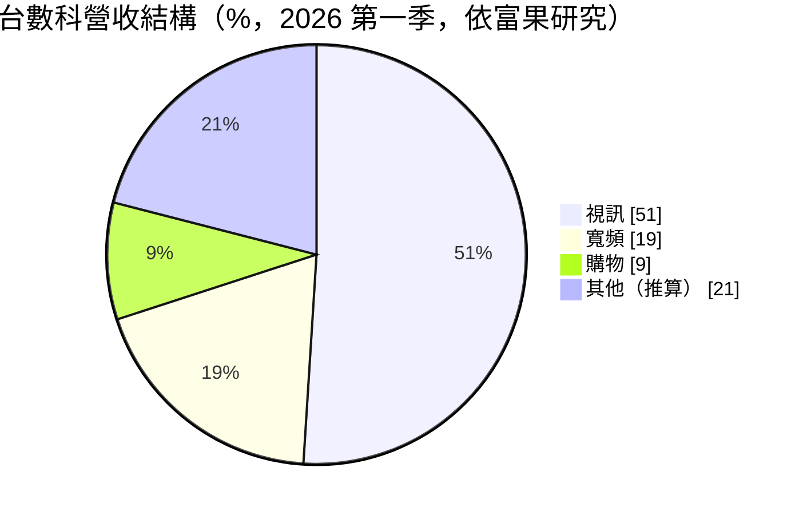
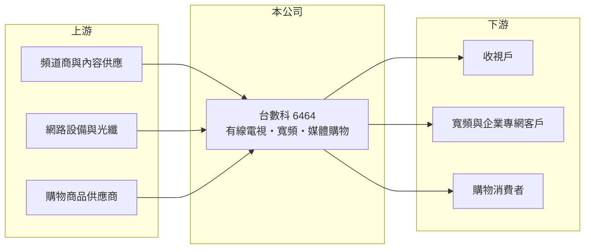

# 6464 台數科

> 上市｜[[產業索引-其他業|其他業]]｜上市（櫃）日期 2015/12/16

# 第一章：企業模式與商業藍圖

> [!info] 撰寫說明
> 精簡版，由 Claude 依公開資料整理，架構比照 [[2330台積電]]，資料截至 2026-10-07。來源：富果研究 2026-05-15 法說會整理。2026 年第二季以後的財務數字未查到。#待校對

台數科是台灣有線電視系統業者，以有線電視、電信寬頻與媒體購物三大事業組成。

- **核心業務：** [[有線電視]]約 42.2 萬收視戶，市占 9.92%（含持股 39.5% 的北港有線達 10.61%）；電信事業提供[[寬頻]]上網、光纖電路出租與[[5G專網]]；媒體購物由子公司 [[6856鑫傳]] 經營，2026 年併購寵物用品公司新品（Jolly Pet）。
- **營收結構：** 2026 年第一季視訊收入占 51%、寬頻 19%、購物 9%，其餘為其他收入；視訊比重較 2023 年的 59% 下降，寬頻與購物上升。

- **營運據點：** 以台灣各有線電視經營區為主，具有全台綿密的光纖網路。
- **長期方向：** 公司以電信事業與媒體電商整合為主要成長動能，降低對有線電視收視費的依賴。

# 第二章：護城河深度與競爭優勢

台數科的優勢在於經營區的光纖網路與多元業務組合。

- **競爭優勢：** 有線電視分區經營、網路建置成本高，形成進入障礙；光纖網路可延伸到企業專線與 5G 專網。
- **主要對手：** [[6184大豐電]]、凱擘、中嘉，以及中華電信 MOD 與行動網路業者。
- **觀察重點：** 寬頻用戶與企業專網成長、購物事業併購後的綜效，以及收視戶流失速度。

# 第三章：財務體質與盈利規模

資料日期：2026-10-07，以下數字是撰寫當時的快照；最新月營收、毛利率、累計 EPS 由自動排程寫在本筆記的屬性欄位（月營收、毛利率、累計EPS 等）。#待校對

台數科毛利率約五成、營益率接近三成，現金部位充足。

- **營收規模：** 2026 年第一季營業收入 10.39 億元。
- **獲利：** 2026 年第一季[[毛利率]] 51.6%、營業利益率 27.7%、淨利率 17.3%，EPS 1.39 元。
- **財務特色：** 第一季營運現金流 2.86 億元，現金及約當現金 11.78 億元；收視費與寬頻月租屬經常性收入。

# 第四章：總體風險與地緣政治

台數科的風險在於收視戶流失與購物業務的低毛利稀釋。

- **產業週期：** 有線電視受串流影音（[[OTT]]）衝擊，視訊收入比重逐年下降。
- **營運風險：** 購物業務毛利率低於有線電視，比重提高會拉低整體毛利率（推估）；併購整合也有執行風險。
- **其他風險：** NCC 費率與經營區法規、頻道授權費上漲，以及電信業者在寬頻市場的價格競爭。

# 專有名詞解析

## 應用

- **[[有線電視]]**：透過纜線傳送電視頻道的付費收視服務，在台灣採分區經營。
- **[[寬頻]]**：高速網路上網服務，有線電視業者多以同軸電纜或光纖提供。
- **[[5G專網]]**：為特定企業或場域建置的專用 5G 行動網路，用於工廠、園區等場景。

## 金融

- **[[毛利率]]**：營業毛利占營收的比率，反映產品售價扣除直接成本後的獲利空間。

## 產業

- **[[OTT]]**：透過網際網路直接提供影音或通訊服務的業者，例如串流平台與通訊軟體，會替代傳統電視與語音。

# 核心供應鏈

- 上游：頻道商、網路設備與光纖供應商、購物商品供應商（推估）
- 下游／客戶：家庭收視戶、寬頻用戶、企業專網客戶與購物消費者
- 同業：[[6184大豐電]]、凱擘、中嘉、中華電信 MOD

## 最新新聞
<!-- news:start（自動產生，請勿手動編輯此範圍） -->
- 2026-10-05 📰 媒體 19:07｜台數科導入倍力資訊「碳管家」 逾2300組水電數據全自動化｜[鉅亨網](https://news.cnyes.com/news/id/6621871)

完整紀錄：[[6464台數科 新聞]]
<!-- news:end -->

## 相關連結
- [公開資訊觀測站](https://mopsov.twse.com.tw/mops/web/t05st03?step=1&firstin=1&co_id=6464)
- [Goodinfo](https://goodinfo.tw/tw/StockDetail.asp?STOCK_ID=6464)
- [Yahoo 股市](https://tw.stock.yahoo.com/quote/6464)
- [鉅亨網新聞](https://www.cnyes.com/twstock/6464/news)
