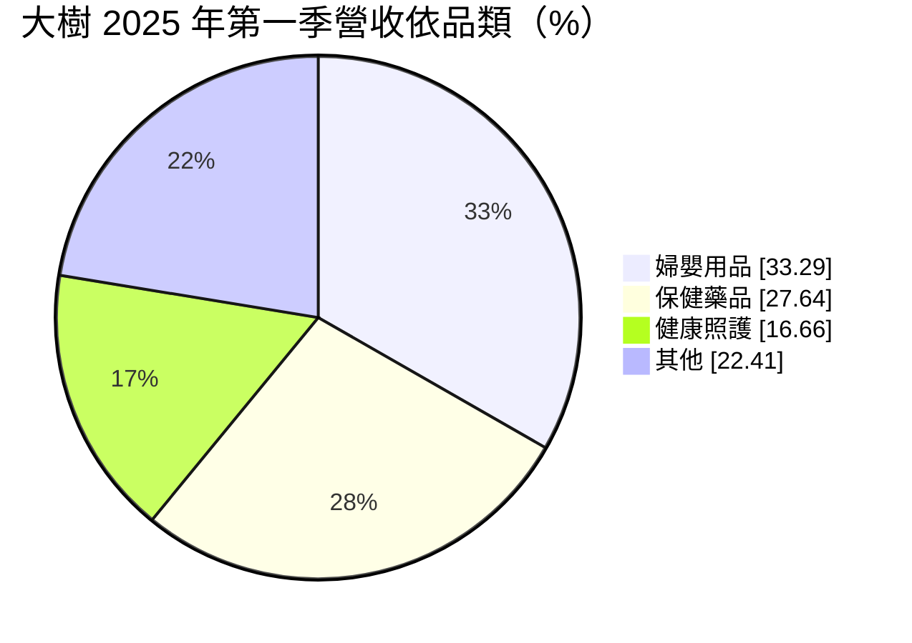
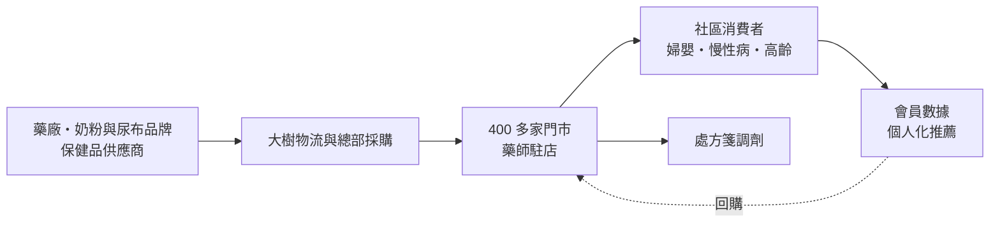
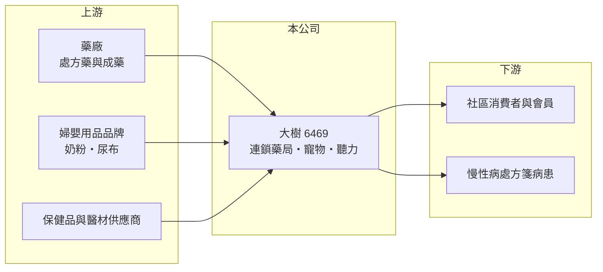

# 6469 大樹

> 上櫃｜[[產業索引-生技醫療業|生技醫療業]]｜上市（櫃）日期 2016/03/30

# 第一章：企業模式與商業藍圖

> [!info] 撰寫說明
> 本文由 Claude 依公開資料整理，架構比照 [[2330台積電]] 的四章研究，資料截至 2026-10-08。財務數字來源：Goodinfo 年度經營績效表、櫃買中心開放資料（基本資料、2026 年第二季財報、每月營收、本益比殖利率）；門市數、品類結構與策略取自富果研究整理的 2025 年 7 月法說會摘要（AI 摘要，非公司原始文件）。最新門市數、處方箋與自有品牌比重未查得。#待校對

大樹是台灣規模最大的連鎖藥局之一，靠著快速展店與標準化管理，把原本以個人藥師經營為主的社區藥局產業逐步[[連鎖零售]]化。本章說明大樹醫藥（股票代號：6469，以下簡稱大樹）的商業模式。

## 一、核心定位：以婦嬰與保健為主力的連鎖藥局

大樹成立於 2001 年，2016 年在櫃買中心掛牌，總部位於桃園市桃園區，董事長兼總經理為鄭明龍，實收資本額約 15.9 億元。截至 2025 年 6 月底全台有 407 家門市，其中 96% 為自營新展店，2025 年目標總店數 450 至 465 家（年底實際店數待校對）。依 2025 年第一季營收結構：

* **婦嬰用品：** 約占 33%，包括奶粉、尿布等民生必需品，是吸引來客的主力，但毛利率較低。比重已從 2017 年的約 46% 持續下降。
* **保健藥品：** 約占 28%，包括[[成藥]]、處方藥與保健品，比重從 2017 年的約 20% 上升。
* **健康照護：** 約占 17%，包括醫療器材與照護用品，比重從 2017 年的約 11% 上升。

「其他」為推算差額。品類結構從婦嬰轉向保健與照護，代表公司刻意提高毛利較高、與藥師專業連結更深的品類。

## 二、資本轉化邏輯：展店規模換取採購議價

* **規模經濟：** 門市越多，對奶粉、尿布與藥品供應商的採購議價能力越高，物流與後勤成本也能被攤薄。大樹營收從 2019 年的 66 億元成長到 2025 年的 189 億元。
* **毛利率穩定、費用決定獲利：** 連鎖藥局的[[毛利率]]約 24% 至 29%，展店期的新店租金、人力與開辦費用會壓低營業利益率。
* **新店養成期：** 新門市通常需要一段時間才能累積社區客群，展店速度越快，短期營業利益率越容易被稀釋。

## 三、長期方向：從展店轉向單店營收

依法說會資料，大樹把台灣展店上限從 700 家提高到 1,000 家，並以提升單店營收約 30% 為目標。成長策略包括擴大高毛利品類（保健、健康照護、寵物健康、聽力服務）、在藥局內導入聽力中心店中店（目標 2025 至 2026 年 20 家）、經營寵物門市（約 10 家），並以線上線下整合（[[OMO]]）與會員用藥紀錄提供個人化推薦。海外有馬來西亞貿易代理與中國示範店 2 家，仍屬試驗階段。

# 第二章：護城河深度與競爭優勢

護城河是企業抵禦競爭、長期維持超額利潤的機制。本章說明大樹作為連鎖藥局龍頭的優勢，以及在超商、藥妝店與電商競爭下能守住多少。

## 一、大樹護城河的核心組成要素

* **1. 門市密度與藥師人力：** 藥局必須由藥師駐店，藥師是稀缺人力。大樹擁有數百家門市與大量藥師，新進者要在短時間複製同樣的網絡並不容易。
* **2. 採購規模：** 營收規模接近 190 億元，是供應商重要的通路客戶，在進貨價格、促銷資源與獨家商品上具優勢。
* **3. 會員與用藥數據：** 會員消費與用藥紀錄讓大樹能針對慢性病與高齡族群做精準推薦，這是單店藥局難以做到的。
* **4. 產業連鎖化趨勢：** 依法說會資料，公司預期台灣藥局市場汰弱留強、連鎖化提升，體質強的業者有利擴大市占。

## 二、主要競爭對手格局

| 對手 | 定位 | 對大樹的影響 |
|---|---|---|
| [[4175杏一]] | 醫院內與社區藥局、醫材通路 | 在保健與醫材品類競爭 |
| [[6929佑全]] | 連鎖藥局 | 在社區藥局展店直接競爭 |
| 丁丁藥局、躍獅等連鎖（待校對） | 地區型連鎖藥局 | 搶同一商圈的客源與藥師 |
| [[2912統一超]]（康是美）、[[5904寶雅]] | 藥妝與生活用品通路 | 在保健品與日用品分流消費 |

## 三、優勢轉化：守得住與守不住的地方

* **守得住：** 營收連年成長，毛利率從 2019 年的 24.2% 緩步升到 2025 年的 28.7%，代表品類調整與採購規模確實改善了商品毛利。
* **守不住：** 營業利益率從 2022 年的 5.92% 下滑到 2025 年的 3.65%，EPS 從 7.85 元降到 4.01 元。展店費用、人力成本與股本擴大，讓獲利沒有跟上營收成長。
* **觀察重點：** 單店營收能否提升、營業利益率能否回到 5% 以上，以及聽力、寵物等新品類的貢獻。

# 第三章：財務體質與盈利規模

資料日期：2026-10-08，表格是撰寫當時的快照；最新月營收、毛利率、累計 EPS 由自動排程寫在本筆記的屬性欄位（月營收、毛利率、累計EPS 等）。#待校對

財務報表是檢驗護城河是否真實存在的最終標準。本章用五年的三率、ROE 與資本報酬，檢視大樹高速展店的獲利品質。

## 一、多年度財務表現

| 年度 | 營收（新台幣） | [[毛利率]] | [[營業利益率]] | EPS（元） | [[ROE]] |
|---|---|---|---|---|---|
| 2021 | 113 億 | 26.1% | 4.36% | 5.83 | 23.5% |
| 2022 | 146 億 | 27.5% | 5.92% | 7.85 | 30.6% |
| 2023 | 161 億 | 27.8% | 4.99% | 6.00 | 22.3% |
| 2024 | 173 億 | 28.0% | 4.64% | 5.16 | 19.4% |
| 2025 | 189 億 | 28.7% | 3.65% | 4.01 | 15.2% |

資料來源：Goodinfo 年度經營績效（合併報表）。2026 年上半年（櫃買中心資料）營收約 95.8 億元、毛利率約 28.2%、營業利益率約 2.3%、EPS 1.57 元；2026 年 1 至 8 月累計營收年增約 2.5%，成長明顯放緩。

* **高成長、利潤率下滑：** 2020 至 2025 年營收年複合成長率約 16.9%（推算），但 2022 年後營業利益率逐年下降。2021 至 2022 年的防疫商品需求推升獲利，之後回歸常態。
* **股本快速擴大：** 股本從 2019 年約 4.3 億元增加到 2025 年約 15.0 億元，推估主要來自盈餘轉增資配股（待校對），因此即使淨利維持在 6 億至 7 億元，EPS 仍逐年下降。
* **長期指標：** 2021 至 2025 年平均 ROE 約 22.2%（推算），在通路業中屬高水準，但呈下降趨勢。依櫃買中心資料，近一年每股股利約 3.76 元（現金與股票股利組成待校對）。2026 年第二季底總資產約 140.2 億元，負債約 102.8 億元，權益約 37.4 億元；負債比率約 73%，推估包含大量門市租約的[[租賃負債]]與應付帳款（待校對）。

## 二、[[ROIC]] 與 [[WACC]]：價值創造利差

**ROIC 推算：** 2025 年營業利益約 6.89 億元，稅率 20% 後約 5.51 億元。官方資料揭露負債總計約 102.8 億元，假設六成為有息負債與租賃負債約 61.7 億元（推估，其餘視為應付帳款等營運負債），加上權益約 37.4 億元，投入資本約 99.1 億元，ROIC 約 5.6%（推算）。

**WACC 推算：** 台灣 10 年期公債殖利率取 1.75%、市場風險溢酬 6%、β 取零售通路常見值 0.7（未查得公司實際 β），股東權益成本約 5.95%。負債成本假設 2.5%，稅後約 2.0%，權益約占投入資本 38%，WACC 約 3.5%（推算）。

**結論：** ROIC 高於 WACC 約 2 個百分點，代表大樹的展店仍在創造價值，但利差已比 2022 年明顯縮小。由於負債中租賃負債的比重假設對結果影響很大，這組數字只能當作方向參考。2026 年上半年營業利益率降到約 2.3%，若全年維持此水準，ROIC 可能接近 WACC（推算）。

# 第四章：總體風險與地緣政治

任何企業都無法脫離宏觀環境獨立存在。本章分析大樹長期必須面對的人力、政策與競爭風險。

## 一、人力與成本風險

* **藥師短缺：** 每家門市都需要藥師駐店，展店速度受藥師招募限制，人力成本也持續上升。
* **租金與基本工資：** 社區門市的租金與基本工資調漲，會直接壓縮本已偏薄的營業利益率。

## 二、政策與產業風險

* **少子化：** 婦嬰用品仍占約三分之一營收，出生數下滑會長期壓縮這個品類的市場規模，公司必須持續把重心轉往保健與高齡照護。
* **健保與處方箋政策：** 慢性病處方箋釋出、藥事服務費與藥價政策會影響藥局的調劑收入。
* **競爭加劇：** 超商、藥妝店、量販與電商都在販售保健品與日用品，價格透明度高，促銷戰會壓低毛利。

## 三、營運與財務風險

* **展店過快的稀釋：** 新店養成期長，若展店速度超過管理能力，單店效率會下降。
* **高負債結構：** 負債比率約七成，雖然多為營運與租賃性質，但景氣反轉時固定的租金支出缺乏彈性。
* **海外拓展：** 馬來西亞與中國業務規模小，若擴大投入，需面對不同的法規與競爭環境。

# 專有名詞解析

## 金融

- **[[租賃負債]]**：企業租用店面或設備時，依會計準則把未來應付租金折現後認列的負債，連鎖通路通常金額很大。
- **[[ROIC]]**：投入資本報酬率，稅後營業利益除以股東權益加有息負債，衡量本業運用資本的效率。
- **[[WACC]]**：加權平均資金成本，股東與債權人要求報酬率的加權平均，是 ROIC 要超越的門檻。

## 產業

- **[[連鎖零售]]**：以統一品牌、集中採購與標準化管理經營多家門市的零售模式，規模越大議價能力越強。
- **[[成藥]]**：依藥事法核准、不需醫師處方即可購買的藥品，作用較緩和，常用於止痛、腸胃或外用。
- **[[OMO]]**：線上線下融合，把會員、庫存與行銷在實體門市與網路渠道之間打通的零售經營方式。

# 核心供應鏈

## 1. 上游：藥品與商品供應商
- 國內藥廠：[[1720生達]]、[[3705永信]]、[[4114健喬]]（產業供應來源，實際往來未查得）
- 保健品：[[1707葡萄王]]（產業供應來源，實際往來未查得）
- 國際奶粉、尿布與醫材品牌

## 2. 中游：大樹與同業
- 連鎖藥局同業：[[4175杏一]]、[[6929佑全]]
- 藥妝與生活通路：[[2912統一超]]、[[5904寶雅]]

## 3. 下游：客戶
- 社區家庭、慢性病與高齡族群、會員與線上購物消費者

## 最新新聞
<!-- news:start -->
<!-- news:end -->

## 相關連結
- [公開資訊觀測站](https://mopsov.twse.com.tw/mops/web/t05st03?step=1&firstin=1&co_id=6469)
- [Goodinfo](https://goodinfo.tw/tw/StockDetail.asp?STOCK_ID=6469)
- [Yahoo 股市](https://tw.stock.yahoo.com/quote/6469)
- [鉅亨網新聞](https://www.cnyes.com/twstock/6469/news)
