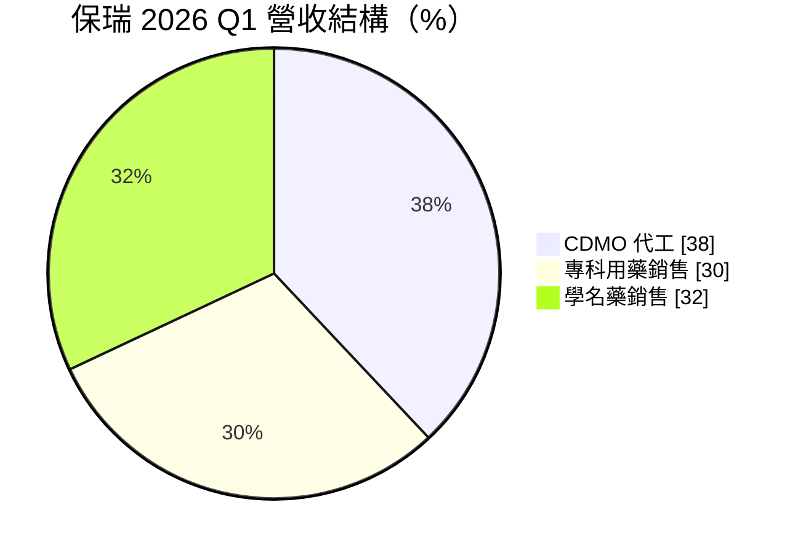
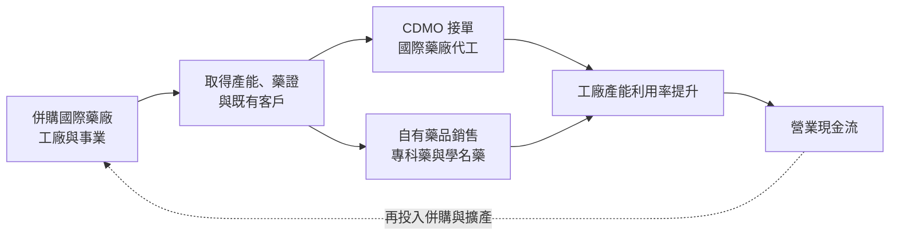
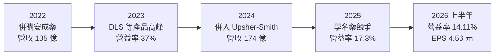
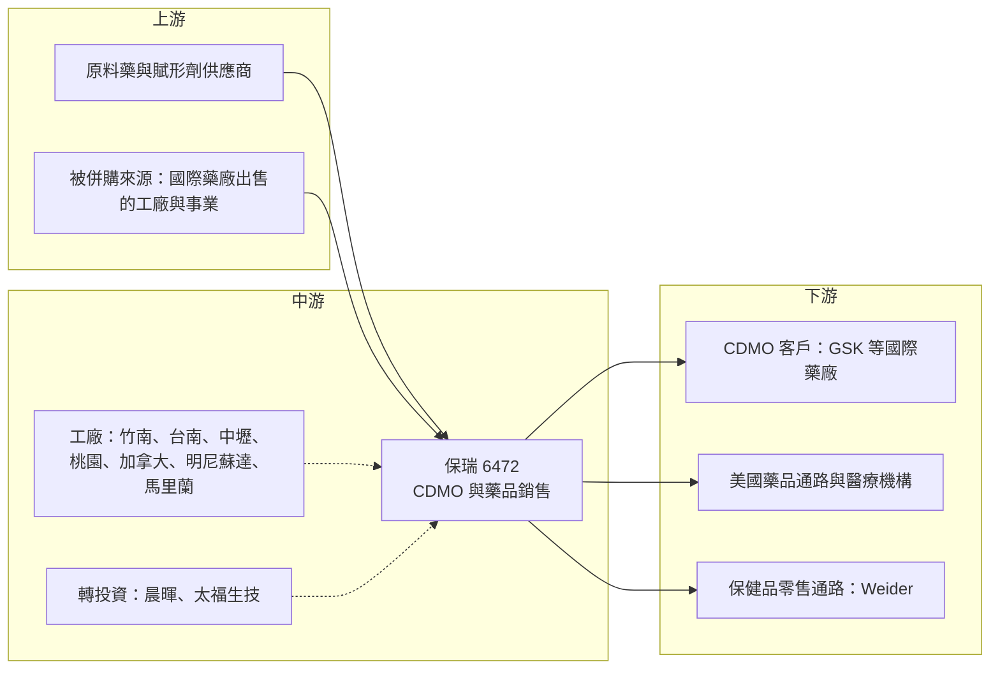

# 6472 保瑞

> 上市｜[[產業索引-生技醫療業|生技醫療業]]｜上市（櫃）日期 2023/12/19

# 第一章：企業模式與商業藍圖

> [!info] 撰寫說明
> 本文由 Claude 依公開資料整理，架構比照 [[2330台積電]] 的四章研究，資料截至 2026-10-08。財務數字來源：Goodinfo 年度經營績效頁、證交所開放資料（基本資料、綜合損益、資產負債、營益分析、股利）、富果研究 2026 年 5 月法說會整理、GeneOnline（2026 年 3 月法說報導）、工商時報（2024 年 1 月 Upsher-Smith 併購、2026 年 7 月營運報導）、經理人月刊與科技新報財經（併購歷程）、科技新報（2022 年安成藥併購）；產業描述為整理性內容，尚未逐條比對原始文件。#待校對

保瑞藥業（股票代號：6472，以下簡稱保瑞）是台灣少見以「併購」作為核心成長引擎的製藥公司。本章針對保瑞的商業模式進行定性分析，說明它如何透過一連串收購國際藥廠的工廠與事業，從小型藥品代理商成長為橫跨北美與亞洲的藥品委託開發製造（[[CDMO]]）與藥品銷售集團。

## 一、核心定位：以併購建立全球產能的 CDMO 與藥品銷售集團

保瑞成立於 2007 年，2023 年 12 月轉上市，2026 年第二季底實收資本額約 12.8 億元，董事長為盛保熙（證交所基本資料）。公司早期以代理銷售日本衛采等藥廠的產品起家，2013 年收購衛采台灣廠後跨入製造，之後十多年完成十多起國內外併購（科技新報財經，2024 年 12 月）。

保瑞今天有兩大業務：

* **CDMO：** 替國際藥廠開發配方與代工生產藥品，2026 年第一季約占營收 38%，全球共 11 個廠區（富果研究，2026 年 5 月法說）。客戶包括 GSK 等國際藥廠，2026 年 2 月與 GSK 續簽為期五年、金額 2.5 億美元的全球生產合約（GeneOnline，2026 年 3 月）。
* **全球藥品銷售：** 2026 年第一季約占 62%，其中專科用藥約占一半，以治療嬰兒痙攣症等的 vigabatrin 系列為核心；另一半是美國[[學名藥]]，主要來自 2024 年收購的 Upsher-Smith（富果研究）。

2025 年保瑞營收約 6.34 億美元，約 95% 來自海外（GeneOnline），已是一家實質上的國際藥廠。

## 二、終端應用／產品板塊：CDMO 與藥品銷售兩條腿

依富果研究整理的 2026 年第一季法說，保瑞的營收結構如下（全球藥品銷售 62% 中，專科用藥與學名藥約各半）：

註：專科用藥與學名藥的比重以全球藥品銷售 62% 分別乘上 49% 與 51% 推算。

* **CDMO 代工：** 涵蓋口服固體製劑、軟膏、液體膠囊、無菌針劑、眼藥與大分子生物製劑。2025 年 CDMO 營收含集團內部訂單約 106.4 億元，排除內部訂單約 75 億元、年增約 19.5%；2025 年新接訂單 4.82 億美元，其中 89% 為已上市的商業化產品（GeneOnline）。商業化產品的訂單一旦技術移轉完成，通常可帶來十年以上的穩定生產。
* **專科用藥：** 以 VIGAFYDE（vigabatrin 口服溶液）等需要專業醫師處方、競爭較少的藥品為主，毛利較高。這類藥品常透過[[505(b)(2)]] 途徑改良既有藥物的劑型取得藥證。
* **學名藥：** Upsher-Smith 在美國擁有數十項上市產品，但學名藥價格競爭激烈。2025 年第四季主力學名藥 Topiramate ER 與胃食道逆流用藥 DLS 都面臨新競爭者（GeneOnline），是毛利率下滑的主因。
* **保健品：** 2026 年透過子公司晨暉取得美國保健品牌 Weider Global Nutrition 100% 股權，該品牌前一年營收約 30 億元（富果研究），使保瑞再延伸到消費性保健市場。

## 三、資本轉化邏輯（營運模式）：買工廠、填訂單、再擴產

保瑞的成長公式可以概括為三步：

* **低價買入被剝離的工廠：** 國際藥廠為了聚焦核心藥物，經常出售非核心工廠，並附帶一段時間的代工合約。保瑞買下工廠時，同時取得廠房、人才、認證與保證訂單。例如 2018 年以約 7 億元收購 Impax 在台子公司的竹南廠（科技新報財經），2020 年收購 GSK 的加拿大廠（經理人月刊）。
* **用銷售業務填滿產能：** 2022 年以約 60 億元併購安成藥（科技新報，2022 年 6 月），2024 年以不超過 2.1 億美元收購美國百年藥廠 Upsher-Smith（工商時報，2024 年 1 月），取得自有藥品與美國銷售通路，讓集團內部訂單也能填滿工廠。Upsher-Smith 的 Maple Grove 廠占地逾 60 萬平方英尺，被報導為美國最大的單一口服固體製劑廠。
* **整合但保留在地團隊：** 保瑞的整合原則是盡量保留被收購公司原有的人員與制度，降低員工流失（經理人月刊）。藥廠的知識主要存在人身上，留住團隊比壓低成本更重要。

## 四、企業長期藍圖：從小分子走向大分子與美國在地產能

* **大分子生物藥 CDMO：** 2025 年 1 月保瑞生技與太福生技以股份轉換合併，建立大分子服務能力；2026 年以 1.225 億美元收購 MacroGenics 位於馬里蘭州 Rockville 的生物藥 CDMO 廠，總產能約 11,000 公升，於 2026 年 7 月完成交割（富果研究、工商時報）。這讓保瑞成為少數在美國本土擁有一次性生物反應器產能的亞洲 CDMO。
* **CDMO 營收倍增目標：** 公司目標在 3 至 5 年內讓 CDMO 營收成長為目前的二至三倍，過去 30 個月已投入 5.2 億美元於產能與技術（富果研究）。
* **國際資本市場：** 2026 年 1 月以 BORAY 代號在美國 OTCQX 掛牌一級 [[ADR]]（GeneOnline），為台灣上市公司首例，目的是提高國際能見度，為未來更大規模的併購與籌資鋪路。

# 第二章：護城河深度與競爭優勢

在長期價值投資中，「護城河」指企業抵禦競爭、維持超額利潤的保護機制。保瑞的特殊之處在於它的護城河不是單一技術，而是「併購與整合」這項能力本身。本章分析這項能力的價值、主要競爭對手，以及它的極限。

## 一、保瑞護城河的核心組成要素

* **1. 藥廠認證與法規門檻：** 藥品工廠必須通過美國 FDA、英國 MHRA 等國際主管機關的查核，客戶每更換一家代工廠，就要重新做技術移轉與法規申報，通常需要一年左右（GeneOnline）。這讓 CDMO 一旦接到商業化產品訂單，客戶黏著度就很高。
* **2. 美國本土產能：** 美國推動生物安全法案與藥品在地生產，國際藥廠需要降低對中國 CDMO 的依賴。保瑞在明尼蘇達、馬里蘭擁有產能，正好符合客戶「去風險」的需求，而美國的一次性生物反應器產能相對稀缺（GeneOnline）。
* **3. 併購與整合的組織能力：** 十多年內完成十多起國際併購，每年評估 20 至 30 個潛在標的（經理人月刊）。這種能力需要長時間累積談判、法務、財務與整合經驗，是競爭者難以快速複製的無形資產。
* **4. 產品組合帶動產能利用：** 自有藥品與 CDMO 共用工廠，自有產品可以墊高產能利用率，CDMO 訂單則分攤固定成本，兩者相互支撐。

## 二、全球主要競爭對手格局

| 對手 | 定位 | 對保瑞的威脅 |
|---|---|---|
| Catalent、Thermo Fisher（Patheon）、Lonza | 全球大型 CDMO，產能與客戶規模遠大於保瑞 | 在大藥廠的大型專案上具規模與品牌優勢 |
| 藥明康德、藥明生物等中國 CDMO | 價格具競爭力，產能龐大 | 受美國生物安全政策影響，部分客戶轉向非中國供應商，對保瑞反而是機會 |
| [[1795美時]] | 台灣學名藥與專科藥廠，同樣深耕國際市場 | 在學名藥與專科藥銷售上競爭 |
| [[6589台康生技]] | 台灣生物藥 CDMO 與生物相似藥 | 在大分子 CDMO 上與保瑞競爭 |
| 美國學名藥廠 | Teva、Viatris 等 | 在 Upsher-Smith 的學名藥市場直接競爭，壓低價格 |

## 三、優勢轉化：哪些市場守得住、哪些守不住

* **守得住：** 已商業化產品的長期 CDMO 合約，以及需要美國本土生產的客戶訂單。這類訂單一旦移轉完成，可帶來十年以上的穩定生產，是保瑞最有價值的資產。
* **守不住：** 美國學名藥價格。學名藥的競爭者眾多，任何一個產品只要新對手進場，價格就可能大幅下滑。2025 年第四季 DLS 與 Topiramate ER 的價格競爭，以及 2025 年 Upsher-Smith 停業部門虧損約 14 億元（富果研究相關報導），都說明學名藥是保瑞較脆弱的一塊。
* **觀察重點：** 第一，CDMO 在手訂單（2026 年第一季為未來 12 個月 3.14 億美元）能否持續成長；第二，Rockville 生物藥廠的產能利用率能否從約 30% 明顯提升；第三，新併購的 Weider 與 MacroGenics 廠能否在一至兩年內貢獻正的利潤，而不是稀釋 [[ROE]]。

# 第三章：財務體質與盈利規模

資料日期：2026-10-08。數字取自 Goodinfo 年度經營績效頁、證交所開放資料（綜合損益、資產負債、營益分析、股利）與富果研究、GeneOnline 法說會整理，表格是撰寫當時的快照；最新月營收、毛利率、累計 EPS 由自動排程寫在本筆記的屬性欄位（月營收、毛利率、累計EPS 等）。#待校對

財務報表是檢驗護城河是否真實存在的最終標準。對併購型公司而言，更要檢查每一筆併購是否真的帶來報酬，而不只是放大營收。本章用多年度的三率、ROE 與資本報酬檢視保瑞的併購成果。

## 一、獲利能力的基石：三率

| 年度 | 營收（新台幣） | [[毛利率]] | [[營業利益率]] | EPS（元） | [[ROE]] |
|---|---|---|---|---|---|
| 2019 | 15.3 億 | 42.0% | 22.6% | 7.9 | 20.5% |
| 2020 | 18 億 | 39.1% | 12.6% | 10.76 | 28.1% |
| 2021 | 49 億 | 34.1% | 21.3% | 11.04 | 26.7% |
| 2022 | 105 億 | 27.8% | 18.3% | 18.52 | 33.8% |
| 2023 | 142 億 | 49.2% | 37.0% | 30.2 | 36.3% |
| 2024 | 174 億 | 44.7% | 21.3% | 37.84 | 29.6% |
| 2025 | 190 億 | 41.3% | 17.3% | 23.9 | 18.8% |
| 2026 上半年 | 98.9 億 | 39.16% | 14.11% | 4.56 | 約 7%（年化） |

註：2019 至 2025 年取自 Goodinfo 年度經營績效；2026 上半年取自證交所營益分析與綜合損益開放資料，ROE 為 Goodinfo 年化數字。2024 年 EPS 另有報導因停業單位重編為 31.54 元，以年報為準。

* **[[毛利率]]：** 毛利率隨產品組合大幅變化。2023 年毛利率高達 49.2%，主要因為安成藥帶來的高毛利產品處於銷售高峰；2024 年併入毛利較低的 Upsher-Smith 學名藥後，毛利率逐年下滑到 2026 年上半年的約 39%。
* **[[營業利益率]]：** 從 2023 年的 37% 降到 2026 年上半年的約 14%，降幅大於毛利率，反映併購帶來的管理費用、整合成本與學名藥價格下滑。
* **業外與停業單位：** 2026 年上半年營業利益約 14 億元，但業外淨損約 3.6 億元、所得稅約 3.8 億元，另有停業單位損失（證交所綜合損益），使稅後純益率只有約 6.4%。併購帶來的利息、權益法投資損失與一次性費用，是評估保瑞時不能忽略的部分。
* **營收趨勢：** 2021 至 2025 年營收從 49 億元成長到 190 億元，年複合成長率約 40%（推算），幾乎全部來自併購。

## 二、[[ROE]]：資本效率

2021 至 2025 年的平均 ROE 約 29.0%（推算），在台灣製藥業中名列前茅；但趨勢從 2023 年的 36.3% 一路下滑到 2025 年的 18.8%，2026 年上半年年化僅約 7%（Goodinfo）。這顯示新一輪併購的資本先投入、利潤尚未跟上，是併購型公司常見的「消化期」。未來兩至三年 ROE 能否回到 20% 以上，是檢驗這輪併購是否成功的關鍵指標。

## 三、資本支出、自由現金流與股利

保瑞的資本配置以併購為主、資本支出為輔。過去 30 個月投入約 5.2 億美元於產能與技術（富果研究），加上 2026 年收購 MacroGenics 廠與 Weider，資金需求龐大。2026 年第一季淨負債對股東權益比升至 71.8%，帳上現金約 48 億元，4 月另發行兩檔合計 30 億元的[[可轉換公司債]]（富果研究）。在大規模併購的年度，[[自由現金流]]扣除併購支出後應為負，需要靠借款與可轉債支應（推估）。股利方面，公司章程規定每年股利不低於當年度盈餘的 20%，2025 年下半年配發每股現金股利 10 元（證交所股利資料），2026 年上半年則未配發，顯示公司在併購期優先保留現金。

## 四、[[ROIC]] 與 [[WACC]]：價值創造利差

**ROIC 推算：** 2025 年營業利益約 32.9 億元（營收 190 億元 × 營業利益率 17.3%），扣除 20% 稅率後約 26.3 億元。2026 年第二季底權益總計約 175.4 億元；依第一季淨負債比 71.8% 與現金約 48 億元回推，有息負債約 170 億元（推估）。投入資本約 345 億元，ROIC 約 7.6%（推算）。以 2026 年上半年營業利益約 14 億元年化計算，ROIC 約 6.5%（推算）。由於投入資本中包含大量併購產生的[[商譽]]與無形資產，ROIC 明顯低於併購前的水準。

**WACC 推算：** 假設台灣 10 年期公債殖利率 1.75%、市場風險溢酬 6%、β 取製藥股常見值 1.0（假設值），股東權益成本約 7.75%。負債成本假設 3%、稅後約 2.4%；以帳面價值計，權益約占 51%、負債約占 49%，WACC 約 5.1%（推算）。

**結論：** 保瑞目前的 ROIC 僅略高於 WACC，利差約 1.5 至 2.5 個百分點，遠低於 2022 至 2023 年的水準。這代表最近幾筆大型併購尚未充分轉化為報酬。保瑞的長期價值取決於整合能力：若新工廠能填滿產能、學名藥業務止穩，ROIC 有機會回到 10% 以上；若持續以舉債併購但利潤跟不上，則可能出現「規模變大、價值沒有增加」的情況。

# 第四章：總體風險與地緣政治

任何企業都無法脫離宏觀環境獨立存在。本章分析保瑞未來必須面對的地緣政治、產業週期、營運環境以及技術與法規演進。

## 一、地緣政治

* **美國生物安全政策：** 美國推動限制與特定中國生技企業合作的政策，促使國際藥廠把 CDMO 訂單從中國移出。保瑞在美國、加拿大與台灣都有產能，是潛在受益者；但政策細節與實施時程若改變，轉單的速度與規模也會不同。
* **美國藥價與關稅：** 保瑞約 95% 營收來自海外，美國是最大市場。美國若對進口藥品課徵關稅或推動藥價改革，台灣廠出口到美國的產品成本與售價都會受影響；美國本土工廠則相對受惠。

## 二、產業週期與市場結構

* **學名藥價格侵蝕：** 美國學名藥市場在新競爭者進入後，價格可能在短期內大幅下滑。保瑞的學名藥業務主要來自 Upsher-Smith，需要持續推出新產品來抵銷舊產品的價格下滑；2026 年初公司表示有 7 項產品準備上市、8 項待核准（GeneOnline）。
* **CDMO 產業週期：** 生技募資景氣會影響新藥公司的委託開發需求，大藥廠的產能規劃也會影響代工訂單。商業化產品的長約可以降低這種波動，但新廠產能利用率在爬坡期仍受景氣影響。

## 三、營運環境的隱性風險

* **併購整合風險：** 短期內同時整合多家國際公司，管理團隊的負荷很重。若整合不順，可能出現人才流失、品質問題或成本超支。
* **財務槓桿與利率：** 淨負債比在 2026 年升到七成以上，若利率上升或獲利不如預期，利息負擔會壓縮淨利，也可能限制下一輪併購的空間。
* **商譽減損：** 併購累積的商譽若因被收購事業表現不佳而需要減損，會造成一次性大額虧損。
* **權益法投資損失：** 2026 年第一季認列太福生技相關的權益法損失約 2.29 億元（富果研究），轉投資的虧損會持續影響稅後獲利。

## 四、科技或法規演進

* **大分子藥物趨勢：** 新藥研發愈來愈集中在抗體、細胞與基因治療等大分子領域，小分子口服藥的委託生產需求成長較慢。保瑞透過 Rockville 廠切入大分子，但這個領域的技術門檻與資本需求都高於小分子，需要時間建立實績。
* **藥廠法規查核：** 美國 FDA 等機關對藥廠的查核日趨嚴格，任何一個工廠收到警告信，都可能影響該廠所有客戶的出貨。工廠數量愈多，合規管理的複雜度愈高。

# 專有名詞解析

## 應用

- **[[FDA]]**：美國食品藥物管理局，負責審查美國上市的藥品與醫療器材，其核准常被視為全球藥證的重要指標。

## 金融

- **[[ADR]]**：美國存託憑證，讓外國公司股票以存託憑證形式在美國市場交易，一級 ADR 僅在櫃檯市場交易、不能籌資。
- **[[可轉換公司債]]**：可在約定條件下轉換為公司股票的債券，利率通常較低，但轉換後會稀釋既有股東權益。
- **[[商譽]]**：併購價格超過被併購公司可辨認淨資產公允價值的部分，若被併購事業表現不佳，需提列減損。
- **[[停業單位]]**：公司已處分或決定處分的業務部門，其損益與持續營業部分分開列示。
- **[[ROE]]**：股東權益報酬率，稅後淨利除以股東權益，衡量公司運用股東資金賺錢的效率。
- **[[ROIC]]**：投入資本報酬率，稅後營業利益除以股東權益加有息負債，衡量本業運用全部資本的效率。
- **[[WACC]]**：加權平均資金成本，股東權益成本與負債成本依資本結構加權的平均值，是投資報酬的最低門檻。
- **[[自由現金流]]**：營業活動現金流減去資本支出，代表企業可自由用於配息、還債或併購的現金。

## 產業

- **[[CDMO]]**：委託開發暨製造服務，替藥廠從配方開發、臨床用藥到商業化量產提供代工服務的商業模式。
- **[[學名藥]]**：原廠藥專利到期後，由其他藥廠生產的相同成分藥品，價格較低、競爭激烈。
- **[[505(b)(2)]]**：美國藥證申請途徑之一，可引用既有藥物的公開資料，針對新劑型、新劑量或新給藥方式申請藥證。
- **[[生物相似藥]]**：與已上市生物藥在品質、安全與療效上高度相似的藥品，類似化學藥的學名藥，但開發門檻較高。

# 核心供應鏈

## 1. 上游：原料與併購來源
- 原料藥與賦形劑：國內外原料藥廠（未逐一查證），台灣原料藥同業如 [[4746台耀]]、[[1789神隆]]
- 併購來源：衛采、Impax、GSK、Upsher-Smith（賣方為澤井與住友商事美國子公司）、MacroGenics 等國際藥廠出售的工廠與事業

## 2. 中游：保瑞本身與同業
- CDMO 與藥品銷售：保瑞（台灣、加拿大、美國共 11 個廠區）
- 台灣同業：[[1795美時]]、[[6589台康生技]]
- 國際 CDMO 同業：Catalent、Lonza、Thermo Fisher

## 3. 下游：客戶與通路
- CDMO 客戶：GSK、Accord BioPharma 等國際藥廠
- 美國藥品通路：Upsher-Smith 銷售體系
- 保健品通路：Weider Global Nutrition（美國、德國、西班牙、韓國、台灣）

## 最新新聞
<!-- news:start -->
<!-- news:end -->

## 相關連結
- [公開資訊觀測站](https://mopsov.twse.com.tw/mops/web/t05st03?step=1&firstin=1&co_id=6472)
- [Goodinfo](https://goodinfo.tw/tw/StockDetail.asp?STOCK_ID=6472)
- [Yahoo 股市](https://tw.stock.yahoo.com/quote/6472)
- [鉅亨網新聞](https://www.cnyes.com/twstock/6472/news)
