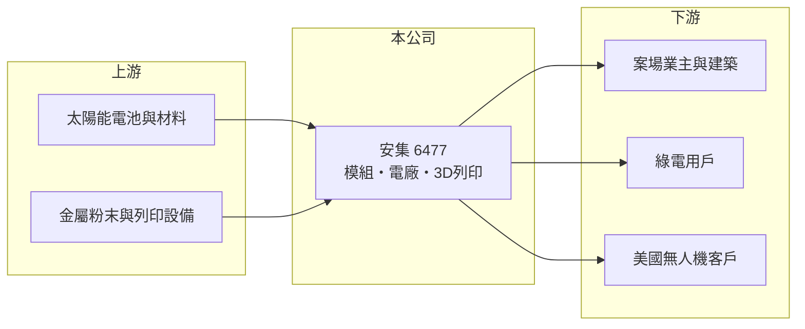

# 6477 安集

> 上市｜[[產業索引-光電業|光電業]]｜上市（櫃）日期 2016/06/21

# 第一章：企業模式與商業藍圖

> [!info] 撰寫說明
> 精簡版，由 Claude 依公開資料整理，架構比照 [[2330台積電]]，資料截至 2026-10-07。來源：優分析「利基模組、綠電轉供、3D列印齊發 安集(6477)尋求營運新動能」、winvest 營收快訊。#待校對

安集是太陽能模組與電廠經營商，正從一般模組轉向利基產品，並發展金屬 3D 列印。

- **核心業務：** 三大業務為[[太陽能模組]]、[[太陽能電廠]]經營與綠電供應，以及金屬 [[3D列印]]代工。
- **營收結構：** 本次未查到各業務比重；電廠售電被公司視為最穩定的獲利來源。
- **營運據點：** 2025 年 4 月累計電廠裝置容量 118.5MW，原預期 2025 年底達 128MW；工廠據點明細本次未查到。
- **長期方向：** 模組轉向光電建材（兼具發電、遮陽與隔熱）與海上型模組，3D 列印已量產美國客戶的無人機零件。

# 第二章：護城河深度與競爭優勢

安集的差異化在於避開一般模組的價格戰，改走利基產品與穩定售電收入。

- **競爭優勢：** 自有電廠提供長期穩定現金流，可與[[綠電長約]]客戶簽訂轉供合約，降低模組景氣波動的衝擊。
- **主要對手：** 太陽能模組同業 [[6443元晶]]、[[3576聯合再生]]，以及中國模組大廠；3D 列印領域則有國內外金屬積層製造業者。
- **觀察重點：** 3D 列印營收成長幅度、無人機相關訂單的延續性，以及電廠裝置容量擴增進度。

# 第三章：財務體質與盈利規模

資料日期：2026-10-07，以下數字是撰寫當時的快照；最新月營收、毛利率、累計 EPS 由自動排程寫在本筆記的屬性欄位（月營收、毛利率、累計EPS 等）。#待校對

安集營收規模不大，近年處於虧損與轉型期。

- **營收規模：** 2026 年 8 月營收 7,425.2 萬元，年減 17.3%；4 月營收 8,184.1 萬元、6 月 7,292.4 萬元。
- **獲利：** 2024 年 EPS -0.67 元，2025 年第一季仍虧損；2026 年獲利數字本次未查到。
- **財務特色：** 電廠售電收入穩定，但模組事業受價格下跌拖累；公司曾預期 2025 年 3D 列印營收成長三倍以上。

# 第四章：總體風險與地緣政治

安集的風險在於太陽能價格下跌與新事業規模仍小。

- **產業週期：** 太陽能模組受中國產能過剩影響，一般型模組價格競爭激烈。
- **營運風險：** 3D 列印依賴少數美國客戶與無人機需求，訂單集中度高；新產品需時間取得市場認可。
- **其他風險：** 綠電相關法規與電價政策變動、颱風等天候造成電廠損害，以及美國出口與國防相關法規。

# 專有名詞解析

## 產業

- **[[太陽能模組]]**：將多片太陽能電池串接並以玻璃、背板封裝成板，是案場實際安裝的產品。
- **[[太陽能電廠]]**：設置大量太陽能模組並併入電網售電的發電設施，收入來自長期售電。
- **[[綠電長約]]**：發電業者與企業用戶簽訂的長期再生能源購售電合約，又稱 CPPA。
- **[[3D列印]]**：以逐層堆疊材料的方式成形零件，金屬 3D 列印可做出傳統加工難以完成的複雜結構。

# 核心供應鏈

- 上游：太陽能電池、玻璃、背板，金屬粉末與 3D 列印設備（推估）
- 下游／客戶：案場業主與建築業者、綠電轉供用戶、美國無人機零件客戶
- 同業：[[6443元晶]]、[[3576聯合再生]]

## 最新新聞
<!-- news:start -->
<!-- news:end -->

## 相關連結
- [公開資訊觀測站](https://mopsov.twse.com.tw/mops/web/t05st03?step=1&firstin=1&co_id=6477)
- [Goodinfo](https://goodinfo.tw/tw/StockDetail.asp?STOCK_ID=6477)
- [Yahoo 股市](https://tw.stock.yahoo.com/quote/6477)
- [鉅亨網新聞](https://www.cnyes.com/twstock/6477/news)
