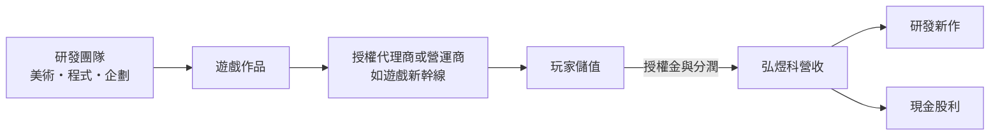
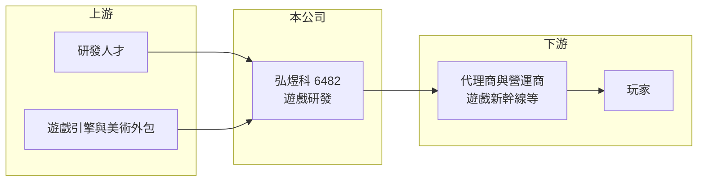

# 6482 弘煜科

> 上櫃｜[[產業索引-文化創意業|文化創意業]]｜上市（櫃）日期 2016/06/13

# 第一章：企業模式與商業藍圖

> [!info] 撰寫說明
> 精簡版，由 Claude 依公開資料整理，架構比照 [[2330台積電]] 的四章研究，資料截至 2026-10-08。來源：nStock 公司頁、Goodinfo 年度經營績效頁、櫃買中心開放資料（2026 年第二季綜合損益與資產負債、基本資料、每月營收、本益比殖利率）、Yahoo 股市新聞標題。公開資料有限，主要產品清單、營收結構與客戶未查得，產業描述為整理性內容。#待校對

弘煜科技（股票代號：6482，以下簡稱弘煜科）是總部位於台中的遊戲軟體研發公司。本章說明它的研發型商業模式，以及接近 100% 毛利率背後的意義。

## 一、核心定位：台中的遊戲研發商

依櫃買中心與 nStock 資料，弘煜科成立於 2009 年，2014 年 11 月登錄興櫃，2016 年 6 月上櫃，董事長為洪而立，實收資本額約 2.86 億元，主要業務為遊戲軟體的設計、研發及銷售，並有子公司納入合併報表。

公開資料中可以確認的產品線索是：Yahoo 股市新聞標題提到，[[5478智冠]]旗下的遊戲新幹線代理了弘煜科開發的《風色幻想 NeXus》。這顯示弘煜科以研發為主，再把作品交給代理商或營運商發行，屬於遊戲產業鏈中的開發端。其他產品與營收結構未查得。

## 二、收入特性：接近 100% 的毛利率

依 Goodinfo 資料，弘煜科 2021 年以後的[[毛利率]]都在 97.9% 至 99.8% 之間。這代表公司的營收幾乎沒有直接成本，可能的原因是收入主要來自[[遊戲授權]]金與分潤，或研發人力成本都列在營業費用而非營業成本（推估）。對研發型公司而言，真正的成本是研發人員薪資，因此觀察重點應放在營業利益率，而不是毛利率。

## 三、資本轉化邏輯

研發型遊戲公司是典型的輕資產事業。依櫃買中心資料，2026 年第二季底弘煜科總資產約 5.43 億元，其中流動資產約 4.82 億元，負債約 1.54 億元，權益總計約 3.90 億元。資產多為現金等流動資產，幾乎沒有廠房設備。

## 四、企業長期藍圖

弘煜科的營收從 2020 年約 0.56 億元成長到 2024 年約 5.52 億元，2024 年營運創新高（Yahoo 股市新聞標題）。長期能否持續成長，取決於能否穩定推出新作品並維繫與代理商的合作，降低對單一作品的依賴。

# 第二章：護城河深度與競爭優勢

在長期價值投資中，「護城河」指企業抵禦競爭、維持超額利潤的保護機制。本章評估中小型遊戲研發商的競爭條件。

## 一、弘煜科的競爭條件

* **1. 研發與內容產出能力：** 研發商的價值在於能否持續做出玩家喜歡的作品。弘煜科 2021 至 2025 年連續五年營業獲利，代表已有作品能穩定貢獻收入。
* **2. 與代理商的合作關係：** 透過代理商發行，弘煜科不必承擔大量行銷費用，但也要與代理商分享營收。
* **3. 成本結構：** 研發團隊位於台中，人力成本相對台北低（推估）。

整體而言，遊戲研發的護城河很淺，作品成敗難以預測，公司規模也小，難以同時開發多款大型作品分散風險。

## 二、主要競爭對手格局

| 對手 | 定位 | 對弘煜科的威脅 |
|---|---|---|
| [[3293鈊象]] | 台灣最大的遊戲研發商 | 在人才與玩家市場競爭 |
| [[3546宇峻]] | 台灣遊戲研發商 | 定位相近 |
| [[6542隆中]] | 台中的休閒博弈遊戲研發商 | 在台中研發人才上競爭 |
| 中國與韓國遊戲公司 | 研發資源遠大於台灣中小廠 | 搶占玩家時間與代理商資源 |

## 三、優勢轉化：哪些守得住、哪些守不住

* **守得住：** 輕資產與高現金比重的財務結構，讓公司在作品空窗期仍能維持營運。
* **守不住：** 營收成長。2025 年營收約 4.96 億元，較 2024 年下滑；2026 年上半年 EPS 0.47 元，nStock 資料顯示累計 EPS 年減約 80%。
* **觀察重點：** 新作品的上市時程、代理合作對象，以及研發費用與營收的比例。

# 第三章：財務體質與盈利規模

資料日期：2026-10-08，表格是撰寫當時的快照；最新月營收、毛利率、累計 EPS 由自動排程寫在本筆記的屬性欄位（月營收、毛利率、累計EPS 等）。#待校對

財務報表是檢驗護城河是否真實存在的最終標準。弘煜科的數字呈現研發型公司「高毛利、獲利隨作品起伏」的特性。

## 一、多年度經營績效

| 年度 | 營收（新台幣） | [[毛利率]] | [[營業利益率]] | EPS（元） | [[ROE]] |
|---|---|---|---|---|---|
| 2019 | 1.50 億 | 91.3% | -9.75% | -1.16 | -6.52% |
| 2020 | 0.56 億 | 82.2% | -106% | -3.39 | -22.6% |
| 2021 | 3.05 億 | 97.9% | 11.1% | 1.34 | 9.7% |
| 2022 | 3.83 億 | 99.6% | 16.6% | 3.06 | 21.1% |
| 2023 | 4.35 億 | 99.8% | 10.6% | 1.65 | 11.2% |
| 2024 | 5.52 億 | 99.4% | 17.7% | 3.53 | 23.8% |
| 2025 | 4.96 億 | 98.0% | 17.6% | 2.32 | 16.2% |
| 2026 上半年 | 1.89 億 | 98.7% | 11.0% | 0.47 | 不適用（半年） |

資料來源：2019 至 2025 年為 Goodinfo 年度經營績效，2026 上半年為櫃買中心開放資料。

* **轉折點：** 2020 年營收只有約 0.56 億元並大幅虧損，2021 年起營收與獲利同步成長，代表當時有新作品成功上線（推估）。
* **營業利益率：** 2021 至 2025 年維持 10% 至 18%，在高毛利下仍不算高，顯示研發與營運費用占營收比重很大。
* **長期指標：** 2021 至 2025 年平均 ROE 約 16.4%（推算）；2020 至 2025 年營收年複合成長率約 55%（推算），主要受 2020 年低基期影響。

## 二、股利與現金流

依櫃買中心本益比殖利率資料，最近一次現金股利為每股 2.0 元，相對 2025 年 EPS 2.32 元，配發率約 86%（推算）。依 nStock 資料，2024 年度曾配發現金股利 1 元與股票股利 2 元。Goodinfo 統計歷年平均現金股利約 0.70 元。輕資產模式下資本支出很低，[[自由現金流]]在獲利年度應為正（推估，現金流量表未查得）。

## 三、[[ROIC]] 與 [[WACC]]

**ROIC 推算：** 2025 年營業利益約 0.87 億元（4.96 億元 × 17.6%），稅後約 0.70 億元；投入資本以 2026 年第二季底權益總計約 3.90 億元計（有息負債推估極低，以 0 計），ROIC 約 17.8%（推算）。以 2021 至 2025 年平均營業利益約 0.66 億元計算，平均 ROIC 約 13.5%（推算）。

**WACC 推算：** 假設台灣 10 年期公債殖利率 1.75%、市場風險溢酬 6%、β 取遊戲同業常見值 1.0（假設），權益成本約 7.75%；公司幾乎無借款，WACC 約 7.75%（推算）。

**結論：** 弘煜科 2021 年以來的 ROIC 高於 WACC，代表研發成果有創造價值；但 2026 年上半年獲利大幅下滑，若新作接不上，ROIC 可能快速跌回資金成本以下。

# 第四章：總體風險與地緣政治

任何企業都無法脫離宏觀環境獨立存在。本章分析弘煜科長期必須面對的產業與營運風險。

## 一、產業週期與結構

* **作品成敗不確定：** 遊戲研發投入時間長，上市後的表現難以預測，一款作品失敗就可能讓公司陷入虧損，2019 至 2020 年的虧損就是例子。
* **市場競爭：** 中國與韓國遊戲公司資源龐大，大量作品進入台灣與亞洲市場，中小型研發商的作品較難突圍。

## 二、營運風險

* **依賴代理商：** 透過代理商發行時，營收分配與行銷資源由代理商主導，合作關係變動會影響收入。
* **人才流動：** 研發型公司的核心資產是人才，關鍵人員離職可能影響新作進度。
* **資訊揭露有限：** 公開資料中查不到完整的產品與營收結構，投資人較難判斷營收集中度。

## 三、其他風險

* **平台與法規：** 手機遊戲受 Apple 與 Google 平台抽成與政策影響；機率型商品的揭露規範趨嚴，可能影響遊戲的營收設計。

# 專有名詞解析

## 金融

- **[[自由現金流]]**：營業活動現金流減去資本支出，代表企業可自由用於配息、還債或併購的現金。
- **[[ROIC]]**：投入資本報酬率，稅後營業利益除以股東權益與有息負債的合計，衡量本業對所有資金提供者的報酬。
- **[[WACC]]**：加權平均資金成本，依股東權益與負債的比重加權計算的資金成本，ROIC 高於它才代表創造價值。

## 產業

- **[[遊戲授權]]**：遊戲開發商把遊戲內容授權給其他營運商或平台使用，收取授權金或依營收分潤。

# 核心供應鏈

## 1. 上游
- 研發人才、遊戲引擎與美術外包

## 2. 本公司
- 弘煜科：遊戲軟體研發，作品包括《風色幻想 NeXus》

## 3. 下游
- 代理商與營運商：[[5478智冠]]（遊戲新幹線）
- 玩家

## 4. 同業
- [[3293鈊象]]、[[3546宇峻]]、[[6542隆中]]

## 最新新聞
<!-- news:start -->
<!-- news:end -->

## 相關連結
- [公開資訊觀測站](https://mopsov.twse.com.tw/mops/web/t05st03?step=1&firstin=1&co_id=6482)
- [Goodinfo](https://goodinfo.tw/tw/StockDetail.asp?STOCK_ID=6482)
- [Yahoo 股市](https://tw.stock.yahoo.com/quote/6482)
- [鉅亨網新聞](https://www.cnyes.com/twstock/6482/news)
