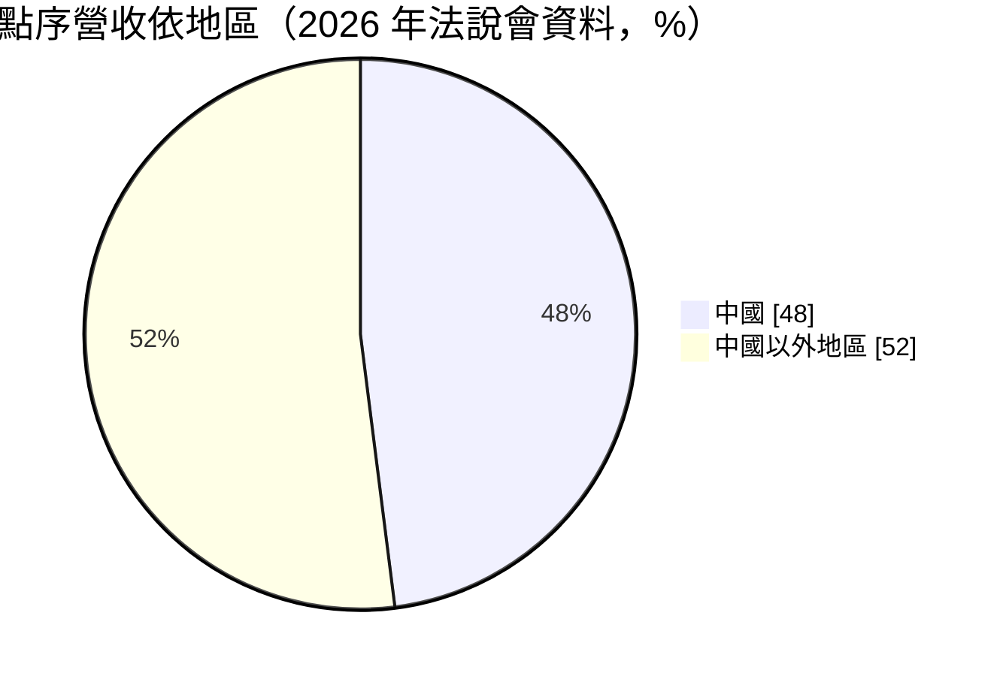
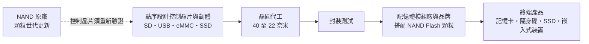
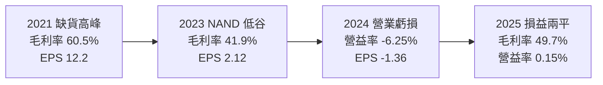
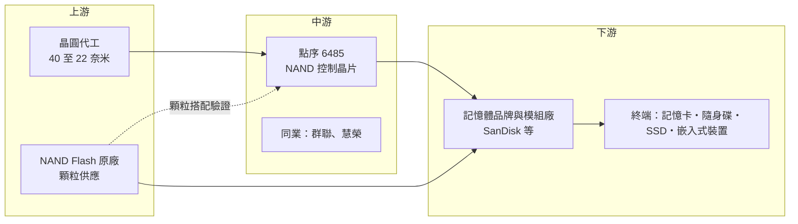

# 6485 點序

> 上櫃｜[[產業索引-半導體業|半導體業]]｜上市（櫃）日期 2015/11/17

# 第一章：企業模式與商業藍圖

> [!info] 撰寫說明
> 本文由 Claude 依公開資料整理，架構比照 [[2330台積電]] 的四章研究，資料截至 2026-10-08。財務數字來源：Goodinfo 年度經營績效與股利政策頁、MoneyDJ 資產負債表與現金流量表、Yahoo 股市公司基本資料、散戶鬥嘴鼓 2026 年 5 月法說會摘要、科技新報、旺得富（中時）報導；產業描述為整理性內容，尚未逐條比對原始文件。#待校對

在評估一家公司的長期價值時，第一步是看懂它的產品在產業中扮演什麼角色。本章針對點序科技（股票代號：6485，以下簡稱點序）的商業模式進行定性分析，說明一家專做記憶卡與隨身碟[[控制晶片]]的小型設計公司，如何在 NAND Flash 原廠與大型控制晶片廠之間找到生存空間。

## 一、核心定位：記憶卡與隨身碟控制晶片的專業設計公司

點序成立於 2008 年，總部位於新竹縣竹北，2015 年上櫃，董事長為劉坤旺。公司的業務是 [[NAND Flash]] 控制晶片的研發與銷售，屬於 [[Fabless]] IC 設計公司。依科技新報 2018 年的報導，集團成員還包括優存科技與銀燦科技，後者專做 USB 控制晶片。

要理解點序的角色，可以先想像一張記憶卡的內部：裡面有一顆或多顆 NAND Flash 記憶體負責存資料，另外有一顆控制晶片負責「管理」這些記憶體。NAND Flash 本身會隨著寫入次數增加而老化，部分區塊也天生有瑕疵，控制晶片要負責把寫入動作平均分散到各個區塊（[[Wear Leveling]]）、偵測並修正讀取錯誤（[[ECC]]）、把壞掉的區塊標記起來不再使用。控制晶片的好壞，決定了一張記憶卡能用多久、速度多快、資料是否可靠。

點序在記憶卡（SD 與 microSD）控制晶片領域長期居於領先地位，依 2026 年法說會摘要，公司稱其在 SD 控制器與 USB 3.2 控制器市場具全球第一的市占率。旺得富報導則指出，點序的控制晶片被應用在 SanDisk 的記憶卡、固態硬碟與 USB 隨身碟，是其上游供應商。

## 二、產品板塊：四大控制晶片產品線

點序的產品分成四條線：

* **SD 記憶卡控制晶片：** 最核心的產品線，用於相機、手機、遊戲機與行車記錄器的記憶卡。新一代產品支援 [[3D NAND]] 的 [[TLC]] 與 [[QLC]] 顆粒，以及 A1、A2 應用程式效能等級。
* **USB 隨身碟控制晶片（UFD）：** 由集團成員銀燦科技發展，支援 USB 3.x 高速傳輸。
* **[[eMMC]] 控制晶片：** 嵌入式儲存，直接焊在電路板上，用於平板、機上盒、工控與物聯網裝置。
* **[[SSD]] 控制晶片：** 包括 SATA 與 PCIe 介面，主打低成本、低功耗的消費型與嵌入式固態硬碟。

公司未公開產品別營收比重（未查得）。依 2026 年法說會摘要，中國市場占營收約 48%。

## 三、資本轉化邏輯：賣晶片也賣韌體

* **晶片加韌體的整體方案：** 控制晶片的價值有很大一部分在韌體。每當 NAND 原廠推出新一代顆粒（層數增加、從 TLC 轉向 QLC），錯誤率與特性都會改變，控制晶片的韌體要重新調校。點序的工程師占員工約 80%，反映這是以研發人力為核心的生意。
* **製程演進：** 公司產品的製程由 40 奈米（SD 與 USB）推進到 28 奈米（SATA SSD），再到 22 奈米（PCIe SSD 與 eMMC）。製程越先進，晶片效能與功耗越好，但光罩與開發成本也越高。
* **營收隨 NAND 景氣波動：** 控制晶片的出貨量取決於記憶卡、隨身碟與 SSD 的出貨，而模組廠的備貨意願又受 NAND 價格影響。NAND 價格上漲時，模組廠積極備貨，控制晶片需求增加；價格下跌時則保守觀望。

## 四、企業長期藍圖：從消費型往嵌入式與利基市場走

依 2026 年法說會摘要，點序的長期策略有三個方向：

* **技術升級：** 跟上 NAND 從 TLC 轉向 QLC 的趨勢。QLC 每個儲存單元存放更多位元，成本更低但錯誤率更高，對控制晶片的錯誤修正能力要求更高，是控制晶片廠展現技術差異的機會。
* **拓展嵌入式應用：** 由記憶卡與隨身碟往 eMMC、嵌入式 SSD 延伸，並進入車規、醫療等利基市場。這些市場的產品生命週期長、驗證嚴格，價格競爭較緩和。
* **深化與原廠及品牌合作：** 與 NAND 原廠與一線品牌建立長期合作，取得新顆粒的早期資料，縮短新產品的開發時間。

# 第二章：護城河深度與競爭優勢

護城河是企業抵禦競爭、長期維持超額利潤的機制。本章分析點序在 NAND 控制晶片市場的防守能力、主要競爭對手，以及它的利基定位能守住多少。

## 一、點序護城河的核心組成要素

點序的護城河屬於「利基型」，主要由三個要素構成：

* **1. 記憶卡控制晶片的專精與市占：** 記憶卡控制晶片要在極小的空間與功耗限制下運作，還要相容市面上各種相機、手機與讀卡機。點序在這個領域深耕多年，取得全球領先的市占，累積了大量相容性測試與韌體調校經驗。
* **2. 與 NAND 原廠和品牌的驗證關係：** 控制晶片必須和特定 NAND 顆粒搭配驗證，進入大品牌的供應鏈需要長時間測試。一旦成為品牌記憶卡的指定控制晶片，在該產品世代內不容易被替換。
* **3. 專利與韌體技術：** 公司擁有耗損平均、錯誤檢查修正與壞區管理等專利，這些技術直接決定產品的壽命與可靠度。

## 二、全球主要競爭對手格局

| 對手 | 定位 | 對點序的威脅 |
|---|---|---|
| [[8299群聯]] | 台灣最大 NAND 控制晶片與模組公司，產品線涵蓋記憶卡到企業級 SSD | 規模與產品廣度遠大於點序，可提供晶片加模組的整體方案 |
| 慧榮（Silicon Motion） | 全球獨立 SSD 控制晶片龍頭 | 在 SSD 與 eMMC 控制晶片具規模優勢 |
| NAND 原廠自製控制晶片 | 三星、SK 海力士、美光等自行設計控制晶片 | 高階 SSD 多採自家控制晶片，壓縮第三方空間 |
| 中國控制晶片廠 | 聯芸、得一微等，受國產替代政策支持 | 在中國市場以價格競爭，而中國占點序營收近半 |

## 三、優勢轉化：哪些市場守得住、哪些守不住

* **守得住：** SD 記憶卡與 USB 控制晶片。這個市場規模不大、技術要求特殊，大型控制晶片廠的投入意願較低，點序可以維持領先地位。
* **守不住：** 主流消費型 SSD 控制晶片。PCIe SSD 的開發成本高、技術更新快，群聯、慧榮與原廠自製方案的規模優勢明顯，點序在這塊市場較難取得大份額。
* **觀察重點：** 第一，記憶卡與隨身碟需求是否因手機內建容量增加、雲端儲存普及而長期萎縮；第二，eMMC 與嵌入式、車規產品能否成為新的成長來源；第三，中國市場在國產替代政策下的市占變化。

# 第三章：財務體質與盈利規模

資料日期：2026-10-08。數字取自 Goodinfo 年度經營績效、MoneyDJ 財務報表與法說會摘要，表格是撰寫當時的快照；最新月營收、毛利率、累計 EPS 由自動排程寫在本筆記的屬性欄位（月營收、毛利率、累計EPS 等）。#待校對

財務報表是檢驗護城河是否真實存在的最終標準。本章用多年度數據檢視點序在 NAND 景氣循環中的獲利起伏與資本效率。

## 一、獲利能力的基石：三率

| 年度 | 營收（億元） | [[毛利率]] | [[營業利益率]] | EPS（元） | [[ROE]] |
|---|---|---|---|---|---|
| 2019 | 10.7 | 50.3% | 8.40% | 1.55 | 5.99% |
| 2020 | 9.4 | 48.9% | 2.15% | 0.82 | 3.00% |
| 2021 | 19.5 | 60.5% | 31.9% | 12.20 | 36.7% |
| 2022 | 19.2 | 59.3% | 27.2% | 9.71 | 22.9% |
| 2023 | 16.8 | 41.9% | 5.07% | 2.12 | 4.81% |
| 2024 | 12.6 | 45.4% | -6.25% | -1.36 | -3.27% |
| 2025 | 14.7 | 49.7% | 0.15% | 0.71 | 1.74% |

資料來源：Goodinfo 合併報表年度經營績效。2025 年 EPS 另有法說會摘要列為 0.56 元，兩個來源不一致，待校對。

* **[[毛利率]]：** 點序的毛利率長期在 42% 至 60% 之間，屬於 IC 設計公司中偏高的水準，代表控制晶片具備一定的技術附加價值。依法說會摘要，2026 年第一季毛利率回升到約 57%。
* **[[營業利益率]]的劇烈波動：** 毛利率相對穩定，營業利益率卻從 2021 年的 31.9% 跌到 2024 年的負 6.25%。原因是研發費用固定且偏高，營收一旦下滑，費用無法同步縮減。2026 年第一季營業利益約為零，法說會摘要也指出營業費用偏高是獲利受壓的主因。
* **長期成長：** 2019 年至 2025 年營收年複合成長率約 5.4%（推算），2021 年至 2025 年則為負 6.8%（推算）。2021 年的高峰來自疫情期間的缺貨與漲價，並非常態。

## 二、[[ROE]]：資本效率

點序近 5 年（2021 至 2025 年）平均 ROE 約 12.6%（推算），但年度之間差異極大：2021 年 36.7%，2024 年負 3.27%。這反映了 NAND 相關產業的典型特性，平均值看起來不差，但實際上是兩年大賺、三年微利或虧損。公司幾乎沒有負債，依 MoneyDJ 資料，2025 年底股東權益約 18.6 億元，短期借款僅約 0.57 億元，ROE 的波動完全來自本業。

## 三、資本支出與自由現金流

* **[[CapEx]]：** IC 設計公司不需要廠房設備，2025 年購置設備僅約 0.24 億元（MoneyDJ 季度現金流量表加總）。
* **[[自由現金流]]：** 2025 年營業現金流約 4.63 億元，自由現金流約 4.39 億元（推算），帳上現金由 2024 年底的 3.69 億元增加到 6.40 億元。但 2026 年上半年營業現金流合計約負 3.86 億元，法說會摘要提到存貨由 2025 年底的 2.24 億元增加到 2026 年第一季的 4.01 億元。在 NAND 價格上漲期提前備貨，是控制晶片與模組廠常見的做法，但也帶來存貨跌價的風險。
* **股利政策：** 依 Goodinfo，2019 年至 2025 年度的現金股利分別約為 0.5、0.49、4.98、4、1.2、0.5、0.48 元。高峰年度大方配發，低谷年度降到 0.5 元左右，2024 年虧損仍維持 0.5 元，顯示公司願意動用累積盈餘維持基本股利。

## 四、[[ROIC]] 與 [[WACC]]：價值創造利差

* **ROIC（推算）：** 2025 年營業利益約 0.022 億元（營收 14.7 億元 × 營業利益率 0.15%），稅後約 0.018 億元。投入資本約 19.2 億元（2025 年底股東權益 18.64 億元加上短期借款 0.57 億元），ROIC 約 0.1%（推算）。2021 年高峰時，稅後營業利益約 5.0 億元（19.5 億元 × 31.9% × 0.8），以當年股東權益約 13.5 億元估算，ROIC 約 36%（推算）。
* **WACC（推算）：** 無風險利率取 1.75%，市場風險溢酬 6%，β 取記憶體相關 IC 設計同業常見值 1.2（未查得公司實際 β），股東權益成本約 8.95%。有息負債只占投入資本約 3%，WACC 約 8.7%（推算）。
* **解讀：** 點序的 ROIC 與 WACC 關係隨 NAND 週期劇烈擺盪。景氣高峰時 ROIC 是 WACC 的四倍，2023 至 2025 年則明顯低於 WACC。長期能否創造價值，關鍵在於能否把營業費用控制在與營收規模相稱的水準，以及嵌入式與車規等穩定型產品能否降低獲利波動。

# 第四章：總體風險與地緣政治

任何企業都無法脫離宏觀環境獨立存在。本章分析點序長期必須面對的地緣政治、產業週期、營運與技術風險。

## 一、地緣政治風險

* **中國營收占比近半：** 依法說會摘要，中國市場占營收約 48%。中國推動記憶體與控制晶片國產化，本土控制晶片廠在政策支持下成長，點序在中國的市占可能被侵蝕。
* **美中科技管制：** 若美國擴大限制對中國出口儲存相關晶片，或中國對外國晶片設限，點序必須在兩個市場之間調整產品與客戶配置。

## 二、產業週期與市場結構風險

* **NAND 價格週期：** 點序的營收與獲利高度跟隨 NAND 景氣。NAND 價格上漲時，模組廠積極備貨，控制晶片需求暢旺；價格崩跌時，模組廠停止拉貨，控制晶片出貨隨之下滑。2021 年與 2024 年的獲利差距就是這種週期的結果。
* **[[長鞭效應]]：** 記憶卡與隨身碟的通路庫存多，終端需求的變化傳到控制晶片時會被放大，造成營收劇烈起伏。
* **記憶卡市場的長期萎縮風險：** 手機內建儲存容量持續提高、雲端儲存普及，外接記憶卡與隨身碟的需求可能長期緩慢下滑。點序必須靠嵌入式與利基應用填補。

## 三、營運環境的隱性風險

* **費用結構僵化：** 研發人員占八成，費用以人事為主，營收下滑時難以快速縮減，造成營業利益率大幅波動。
* **存貨風險：** 2026 年上半年存貨明顯增加，若 NAND 價格反轉，可能需要提列存貨跌價損失。
* **客戶集中：** 點序是 SanDisk 等品牌的上游供應商，主要客戶的採購策略改變（例如改用自製或其他供應商控制晶片）會對營收造成明顯影響。公司未公開客戶比重（未查得）。

## 四、科技演進風險

NAND Flash 的技術每一兩年就推進一代，層數不斷增加，QLC 與未來更高密度的顆粒錯誤率更高，控制晶片的錯誤修正演算法與製程都要持續升級。若點序在新世代顆粒的支援上落後，就會失去品牌客戶的訂單。另外，記憶卡介面標準（例如 SD Express 引入 PCIe 介面）也在演進，產品規格向 SSD 靠攏，可能讓擅長 SSD 控制晶片的大型對手進入點序原本的利基市場。

# 專有名詞解析

## 半導體

- **[[NAND Flash]]**：斷電後仍能保存資料的快閃記憶體，用於記憶卡、隨身碟、手機與固態硬碟。
- **[[控制晶片]]**：管理記憶體讀寫、錯誤修正與壽命的晶片，決定儲存裝置的速度與可靠度。
- **[[Fabless]]**：無晶圓廠的 IC 設計公司，只負責設計與銷售，製造交給晶圓代工與封測廠。
- **[[SSD]]**：固態硬碟，以 NAND Flash 取代傳統機械硬碟，讀寫速度快、耐震動。
- **[[eMMC]]**：嵌入式多媒體記憶體，把 NAND Flash 與控制晶片封裝在一起，直接焊在電路板上使用。
- **[[ECC]]**：錯誤檢查與修正技術，在資料寫入時加入校驗碼，讀取時偵測並修正錯誤位元。
- **[[Wear Leveling]]**：耗損平均技術，把寫入動作平均分散到各個記憶區塊，避免部分區塊過早損壞。
- **[[TLC]]**：每個記憶單元存放 3 位元的 NAND 技術，成本較低，是目前消費型產品的主流。
- **[[QLC]]**：每個記憶單元存放 4 位元的 NAND 技術，容量更大、成本更低，但寫入壽命與速度較差。
- **[[3D NAND]]**：把記憶單元垂直堆疊多層的 NAND 技術，層數越多、單位容量成本越低。

## 金融

- **[[長鞭效應]]**：終端需求的小幅變動，沿供應鏈往上游傳遞時被逐級放大，造成上游庫存與訂單劇烈波動。
- **[[自由現金流]]**：營業活動現金流減去資本支出，代表企業可自由用於配息、還債或併購的現金。

# 核心供應鏈

## 1. 上游：晶圓代工與 NAND 原廠
- 控制晶片的晶圓代工夥伴未公開（未查得），台灣成熟製程代工廠包括 [[2330台積電]]、[[2303聯電]] 等
- NAND Flash 原廠：[[005930三星電子]]、SK 海力士、美光、鎧俠與 SanDisk，控制晶片須與各家顆粒搭配驗證

## 2. 中游：點序與同業
- 點序（集團成員包括優存科技、銀燦科技）
- 同業：[[8299群聯]]、慧榮；中國的聯芸、得一微

## 3. 下游：模組廠與品牌
- 記憶卡、隨身碟與 SSD 品牌：SanDisk（旺得富報導點序為其上游供應商）
- 台灣記憶體模組廠包括 [[3260威剛]]、[[2451創見]]、[[8271宇瞻]] 等，與點序的實際往來未查得

## 4. 終端市場
- 相機、手機、遊戲機、行車記錄器、工控與物聯網嵌入式裝置

## 最新新聞
<!-- news:start -->
<!-- news:end -->

## 相關連結
- [公開資訊觀測站](https://mopsov.twse.com.tw/mops/web/t05st03?step=1&firstin=1&co_id=6485)
- [Goodinfo](https://goodinfo.tw/tw/StockDetail.asp?STOCK_ID=6485)
- [Yahoo 股市](https://tw.stock.yahoo.com/quote/6485)
- [鉅亨網新聞](https://www.cnyes.com/twstock/6485/news)
