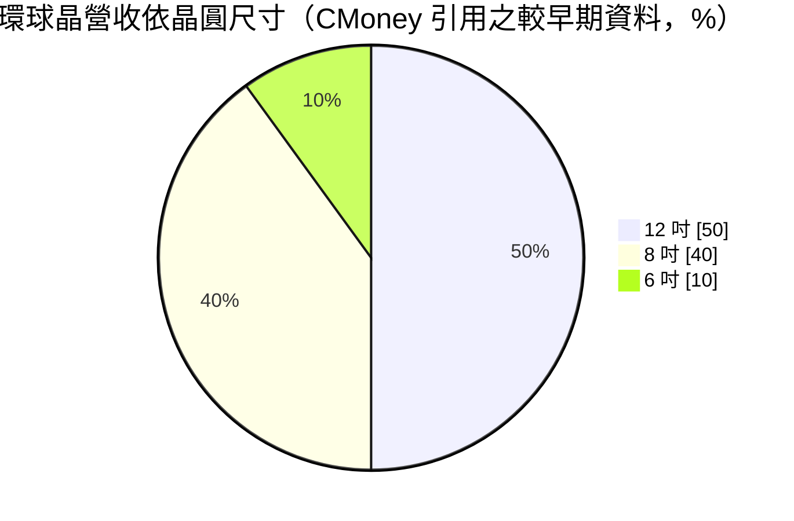
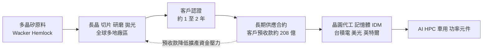
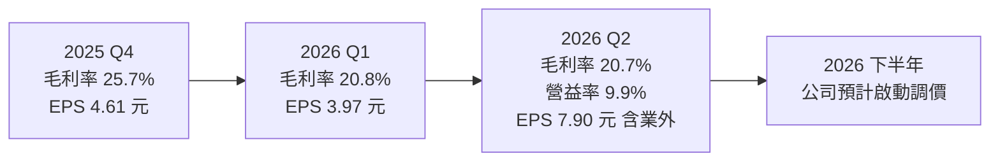
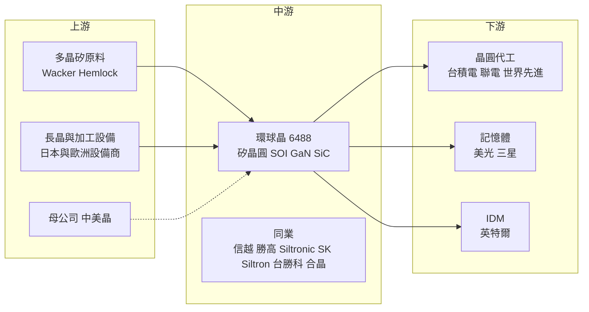

# 6488 環球晶

> 上櫃｜[[產業索引-半導體業|半導體業]]｜上市（櫃）日期 2015/09/25

# 第一章：企業模式與商業藍圖

> [!info] 撰寫說明
> 本文由 Claude 依公開資料整理，架構比照 [[2330台積電]] 的四章研究，資料截至 2026-10-07。財務數字來源：環球晶 2025 年第四季、2026 年第一季與第二季法說會報導（科技新報、優分析、富果研究）、美光長約報導（自由時報、科技新報）、德州廠啟用報導（科技新報）、CMoney 公司簡介；產業描述為整理性內容，尚未逐條比對原始文件。#待校對

在評估單一個股的長期投資價值時，首要步驟是拆解企業的底層獲利邏輯。本章針對環球晶圓（股票代號：6488，以下簡稱環球晶）的商業模式進行定性分析，說明它如何透過併購與全球建廠成為前三大矽晶圓廠，以及為何選擇在美國投入重資建立 12 吋產能。

## 一、核心定位：全球前三大、唯一在美國量產 12 吋的矽晶圓廠

環球晶於 2011 年由 [[5483中美晶]] 的半導體事業部分割成立，2015 年掛牌上櫃，中美晶至今仍是最大股東。環球晶專做半導體[[矽晶圓]]，也就是所有晶片製造的起點材料，產品涵蓋 3 吋到 12 吋，並延伸到 [[SOI]]（絕緣層上覆矽）、碳化矽（[[SiC]]）與矽基氮化鎵（[[GaN]] on Si）等特殊晶圓。

全球矽晶圓市場高度集中，由 [[4063信越化學]]、[[3436勝高]]、環球晶、德國 Siltronic 與韓國 SK Siltron 五家掌握大部分市占。依 CMoney 整理，環球晶為全球第三大，市占約 18%。這個定位有兩個商業意義：

* **以併購建立規模：** 先後併入日本 Covalent Materials 的矽晶圓事業與美國 SunEdison Semiconductor，成為全球化的多據點供應商。先前收購德國 Siltronic 的案子未獲德國政府核准，但仍持有 Siltronic 部分股權，這筆持股的評價變動是環球晶業外損益的重要來源。
* **以據點分散換取客戶信任：** 據點遍布亞、歐、美，符合晶圓廠「供應鏈在地化」的要求。

## 二、終端應用板塊：12 吋撐起 AI 需求，特殊晶圓是成長引擎

依 CMoney 引用的產品結構（較早期資料，近年 12 吋占比推估持續提高）：

* **12 吋先進製程晶圓：** 供應邏輯先進製程與記憶體，AI、[[HPC]]、[[CoWoS]] 與 [[HBM]] 需求讓單一系統消耗的晶圓面積增加，12 吋產線在 2026 年上半年接近滿載。
* **8 吋與 6 吋晶圓：** 主要用於電源管理、車用、類比與功率元件，2025 年下半年起產能利用率回升。
* **SOI：** 用於射頻與[[矽光子]]，2026 年第一季法說會表示產線接近滿載並已貢獻正毛利，第二季法說會稱矽光子為成長最強的產品線。
* **GaN on Si 與 SiC：** 化合物半導體基板，GaN 產能滿載並已完成約 30% 擴產；SiC 已推進到 12 吋產品開發與驗證，公司預期 SiC 產能於 2026 年下半年達到滿載。

## 三、資本轉化邏輯：重資產、長約與預收款

環球晶在台灣、日本、韓國、中國、新加坡、馬來西亞、丹麥、義大利與美國都有廠區，是矽晶圓業中據點最分散的一家。近年新建與擴產的重點：

* **美國德州謝爾曼（GlobalWafers America）：** 2022 年 12 月動土，2025 年 5 月 16 日啟用，是美國唯一能量產先進 12 吋矽晶圓的廠。初期投資 35 億美元，啟用時宣布再加碼 40 億美元，總計規劃 75 億美元，並獲美國 CHIPS 法案 4.06 億美元補助。
* **美國密蘇里州聖彼得斯：** SOI 與特殊晶圓產能。
* **義大利諾瓦拉：** 新建 12 吋產線。2026 年 7 月 20 日該廠 8 吋後段發生火災，新 12 吋產線未受影響，損失部分由保險理賠支應。
* **日本宇都宮、丹麥與亞洲廠：** 既有廠區的擴產，2025 年營收表現佳。

## 四、企業長期藍圖：在地化供應與長約綁定

環球晶的策略可以歸納為「在客戶附近蓋廠、用長約鎖住需求」。2026 年 7 月，美光（Micron）與環球晶簽訂 10 年長期供應協議（[[LTA]]），並提供 5 億美元（約新台幣 161 億元）策略性資金，支持環球晶在美國的業務發展，這是美光最高 30 億美元強化美國供應鏈計畫的一部分。截至 2026 年第二季，環球晶的客戶預收款約 208 億元。2026 年第一季法說會表示，因應成本上升，下半年預計啟動調價。

# 第二章：護城河深度與競爭優勢

在長期價值投資中，「護城河」指企業抵禦競爭、維持超額利潤的保護機制。本章分析環球晶的護城河構成、全球主要競爭對手，以及寡占結構在中國擴產下能守住多少。

## 一、環球晶護城河的核心組成要素

環球晶的護城河屬於「中等」，由四個要素組成：

* **1. 寡占產業結構：** 全球前五大矽晶圓廠掌握大部分市場，新進者需要投入數十億美元建廠，且要經過晶圓廠長達一到兩年的認證，進入門檻高。
* **2. 客戶認證與長約：** 矽晶圓的規格（平坦度、缺陷密度、氧含量）直接影響晶片[[良率]]，晶圓廠一旦認證某家供應商，通常不會輕易更換。預收款與美光 10 年長約更強化了這種綁定。
* **3. 地理分散與美國在地產能：** 德州廠是美國唯一的先進 12 吋矽晶圓廠，在台積電、三星、美光、英特爾在美設廠的背景下有稀缺性。
* **4. 特殊晶圓技術廣度：** 同時具備 SOI、GaN、SiC 能力，能跟隨矽光子、功率元件等新應用成長。

## 二、全球主要競爭對手格局

| 對手 | 定位 | 對環球晶的威脅 |
|---|---|---|
| [[4063信越化學]] | 全球最大，技術與成本領先 | 12 吋高階產品市占高 |
| [[3436勝高]] | 全球第二大，專注 12 吋 | 與台積電等先進製程客戶關係深厚 |
| Siltronic | 德國第四大，環球晶持有部分股權 | 既是競爭對手也是業外損益來源 |
| SK Siltron | 韓國 SK 集團旗下 | 主要供應韓系記憶體客戶 |
| 滬硅產業、中環等 | 中國矽晶圓廠，受國產替代支持 | 壓低 8 吋與成熟 12 吋報價 |
| [[3532台勝科]]、[[6182合晶]] | 國內同業 | 在部分尺寸與客戶直接競爭 |

## 三、優勢轉化：哪些市場守得住、哪些守不住

* **守得住：** 12 吋先進製程與記憶體用晶圓仍由前五大寡占，加上 AI 拉動需求、長約與預收款保障，高階產品地位穩固。美國在地產能是信越、勝高目前沒有的差異化優勢。
* **守不住：** 中國廠在成熟尺寸的低價擴產，可能長期壓抑 6 吋、8 吋與成熟 12 吋晶圓報價。
* **成本壓力：** 美國與義大利新廠初期稼動率低、折舊高，2026 年第一季[[毛利率]]降到 20.8%，第二季 20.7%，明顯低於 2025 年全年的 24.1%。
* **觀察重點：** 下半年漲價能否落實、德州廠客戶認證與放量速度、Siltronic 持股評價對 EPS 的波動，以及義大利廠火災的影響程度。

# 第三章：財務體質與盈利規模

資料日期：2026-10-07。數字取自公司法說會與財經媒體整理（科技新報、優分析、富果研究），表格是撰寫當時的快照；最新月營收、毛利率、累計 EPS 由自動排程寫在本筆記的屬性欄位（月營收、毛利率、累計EPS 等）。#待校對

財務報表是檢驗護城河是否真實存在的最終標準。本章用三率、ROE、現金流與資本報酬，檢視環球晶在新廠爬坡期的獲利品質，並區分本業與業外。

## 一、獲利能力的基石：三率

| 項目 | 2025 全年 | 2025 Q4 | 2026 Q1 | 2026 Q2 |
|---|---|---|---|---|
| 營收（新台幣） | 605.98 億 | 145.02 億 | 139.8 億 | 152.14 億 |
| [[毛利率]] | 24.1% | 25.7% | 20.8% | 20.7% |
| [[營業利益率]] | 14.3% | 16.4% | 未查得 | 9.9% |
| 稅後淨利 | 73.12 億 | 22.05 億 | 19 億 | 37.79 億 |
| EPS（元） | 15.29 | 4.61 | 3.97 | 7.90 |

* **年度：** 2025 年營收年減 3.2%，EPS 由 2024 年的 21.06 元降至 15.29 元，主因是矽晶圓價格處於谷底、新廠折舊增加。
* **業外主導第二季：** 2026 年第二季營收季增 8.8%，稅後淨利季增 99.3%、年增 124.7%，但營業利益率只有 9.9%，[[淨利率]]卻高達 24.8%，代表大部分獲利來自 Siltronic 持股評價利益。評估本業時應以營業利益為準。
* **折舊的影響：** 上半年營收 291.99 億元（年減 7.6%），EPS 11.87 元。第二季 [[EBITDA]] 69.69 億元，EBITDA 利潤率 45.8%，與 9.9% 的營業利益率對照，顯示折舊是壓低營業利益的主要因素。

## 二、[[ROE]]：資本效率

2024 年至 2025 年大舉投資新廠，資產規模擴大但新廠尚未貢獻相應獲利，使資本效率下降。ROE 精確值本次未查得；以 2025 年 EPS 較 2024 年下滑約 27% 推估，ROE 處於近年低點。新廠[[產能利用率]]提升與漲價是 ROE 回升的關鍵。股利方面，2025 年度合計配發每股現金股利 7.7 元（上半年 2 元、下半年 5.7 元），以 EPS 15.29 元計算配發率約五成，採半年配息。

## 三、資本支出與自由現金流

* **[[CapEx]]：** 2024 年達 483 億元高峰，2025 年降至 319 億元，公司預期 2026 年進一步下降，重心從建廠轉向產能放量。德州廠第二、三期擴產將視政府補助與客戶承諾條件再評估。
* **[[自由現金流]]：** 美光提供的 5 億美元策略性資金與客戶預收款（約 208 億元）能降低擴產的資金壓力。隨著資本支出下降、EBITDA 利潤率維持四成以上，自由現金流預期改善（推估）。

## 四、[[ROIC]] 與 [[WACC]]：價值創造利差

矽晶圓屬重資產產業，投入資本以廠房與長晶設備為主。2024 至 2025 年新廠大量投入但尚未貢獻獲利，本業營業利益率從 2025 年的 14.3% 降到 2026 年第二季的 9.9%，推估 ROIC 與資金成本的利差處於低點（具體數值未查得）。資本支出下降後分母趨穩，若漲價落實且德州廠放量，利差可望在 2027 年起回升；評估時應排除 Siltronic 評價利益，以免高估本業報酬。

# 第四章：總體風險與地緣政治

任何企業都無法脫離宏觀環境獨立存在。本章分析環球晶未來必須面對的地緣政治、矽晶圓週期、營運與技術風險。

## 一、地緣政治風險

* **美國在地化的機會與成本：** 德州廠讓環球晶受惠於美國 CHIPS 法案與供應鏈在地化，但美國建廠與營運成本遠高於亞洲，新廠初期會壓低毛利率。
* **中國廠區與中國競爭：** 環球晶在中國有廠區，面臨中國本土矽晶圓廠低價競爭與美中管制的雙重影響。
* **關稅政策：** 美國對半導體或材料課徵關稅的政策變化，可能影響各廠區之間的出貨配置。

## 二、產業週期與市場結構風險

* **矽晶圓週期：** 矽晶圓價格與晶圓廠稼動率高度相關，2024 年至 2025 年經歷一輪庫存調整，公司認為 2026 年第一季是週期底部；矽晶圓位在供應鏈最上游，受[[長鞭效應]]影響最大，若非 AI 需求復甦不如預期，報價回升會延後。
* **長約價格重議：** 景氣低迷時客戶會要求延後拉貨或重議長約價格，影響營收穩定性。
* **匯率：** 營收以美元、日圓、歐元計價，多幣別匯率波動會影響獲利。

## 三、營運環境的隱性風險

* **新廠爬坡：** 美國、義大利新廠的客戶認證與良率爬坡若不如預期，折舊壓力會持續。
* **意外事故：** 2026 年 7 月義大利諾瓦拉廠火災，雖然新 12 吋產線未受影響，但凸顯單一廠區意外對營運的衝擊。
* **業外波動：** Siltronic 持股評價變動讓 EPS 波動大，2026 年第二季 EPS 大幅成長主要來自此項，未來股價下跌時也會反向造成損失。

## 四、科技演進風險

先進製程（2 奈米以下）與 HBM 對矽晶圓平坦度、缺陷密度的要求持續提高，環球晶需要持續投資才能跟上信越與勝高。另一方面，SiC 與 GaN 技術進展快速，若 12 吋 SiC 驗證延後，可能錯失功率元件的成長機會。

# 專有名詞解析

## 半導體

- **[[矽晶圓]]**：以高純度單晶矽切成的圓形薄片，是製造晶片的基板材料，主流尺寸為 12 吋與 8 吋。
- **[[SOI]]**：絕緣層上覆矽晶圓，在矽層下方埋一層絕緣氧化層，可降低漏電與干擾，用於射頻與矽光子。
- **[[SiC]]**：碳化矽，耐高壓高溫的寬能隙半導體材料，主要用於電動車逆變器與充電設備。
- **[[GaN]]**：氮化鎵，寬能隙半導體材料，開關速度快、體積小，用於快充、資料中心電源與射頻。
- **[[矽光子]]**：在矽晶片上製作光學元件，以光取代電傳輸資料，可降低 AI 資料中心的傳輸耗電。
- **[[HBM]]**：高頻寬記憶體，以 TSV 垂直堆疊多層 DRAM，提供 AI 加速器所需的超高資料傳輸量。
- **[[CoWoS]]**：台積電的 2.5D 先進封裝技術，把運算晶片與 HBM 並排放在中介層上，是 AI 加速器的主流封裝。
- **[[良率]]**：合格產品占總產出的比例，矽晶圓的平坦度與缺陷密度會直接影響晶圓廠良率。

## 應用

- **[[HPC]]**：高效能運算，包括 AI 訓練與推論伺服器、超級電腦等需要大量運算的應用。

## 金融

- **[[LTA]]**：長期供應協議，買賣雙方約定多年的供貨數量或價格，常搭配預付款以保障產能。
- **[[EBITDA]]**：稅前息前折舊攤銷前利潤，排除折舊影響，適合比較重資產產業的本業現金獲利能力。
- **[[淨利率]]**：稅後淨利占營收的比例，會受匯兌損益、投資評價等業外項目影響。
- **[[產能利用率]]**：實際投產量占總產能的比例，重資產產業的毛利率高度取決於此數字。
- **[[自由現金流]]**：營業活動現金流減去資本支出，代表企業可自由用於配息、還債或併購的現金。
- **[[長鞭效應]]**：終端需求的小幅變動，沿供應鏈往上游傳遞時被逐級放大，造成上游庫存與訂單劇烈波動。

# 核心供應鏈

## 1. 上游：原料與設備
- 母公司與太陽能／多晶矽相關：[[5483中美晶]]
- 多晶矽原料：Wacker、Hemlock 等多晶矽供應商
- 長晶與加工設備：日本與歐洲設備商

## 2. 中游：環球晶本身與同業
- 國際同業：[[4063信越化學]]、[[3436勝高]]、Siltronic、SK Siltron
- 國內同業：[[3532台勝科]]、[[6182合晶]]

## 3. 下游：晶圓代工與記憶體客戶
- 晶圓代工：[[2330台積電]]、[[2303聯電]]、[[5347世界先進]]
- 記憶體：美光（Micron）、[[005930三星電子]]
- IDM：[[INTC英特爾]]

延伸閱讀：[[台積電供應鏈]]

## 供應鏈關係
- 供應給 [[2330台積電]]：台灣最大半導體矽晶圓（台積電供應鏈 › 上游：矽晶圓、再生晶圓與研磨耗材）

## 最新新聞
<!-- news:start（自動產生，請勿手動編輯此範圍） -->
- 2026-10-08 📰 媒體 13:05｜環球晶9月營收月增7.7%｜[TechNews 科技新報](https://news.google.com/rss/articles/CBMifEFVX3lxTE1VYjMzT1F5ZGdNVUpnWVdURFBpbVN3ZTF4NUpWZkxYSElRZHl1cG16QlZ1M0R6UGFGSlNPMHBkckJ2Yy1uM0xTOU9KZk0welRlU3IyalpkLWc0VUFNVlRKNkVoMGJNUGF3ZXJGbjFNS1h6cmFDaUNrd2FhbTU?oc=5)
- 2026-10-08 📰 媒體 11:44｜焦點股》環球晶：賣壓湧現 一度打入跌停｜[自由財經](https://news.google.com/rss/articles/CBMiZEFVX3lxTE9OeWluR29fa0NXdVBFQlRjRlgycmNtcnI4R0h0cnJpdUtRSkI1SkloQk83Y0lXc3VZeUFwUGVrLUNrUnYzSXZnNmF2NktISUhxcWIwQ0VaZENwbWc0VEdCcWRmT2jSAWRBVV95cUxPTnlpbkdvX2tDV3VQRUJUY0ZYMnJjbXJyOEdIdHJyaXVLUUpCNUpJaEJPN2NJV3N1WXlBcFBlay1Da1J2M0l2ZzZhdjZLSElIcXFiMENFWmRDcG1nNFRHQnFkZk9o?oc=5)
- 2026-10-08 📰 媒體 10:58｜環球晶矽光子需求旺；12吋SOI產出大增- 新聞｜[MoneyDJ理財網](https://news.google.com/rss/articles/CBMikgFBVV95cUxQUk9YN3JTalRmNUF3Sy1CMVpZOGNyU200YU5IYmNjcnBrVVpnZFdqVkdValpoTUY1LW9nd0lMZmxLOTVPSTg3c3ByUm1HaVh4Z0Zhbnh3Z09Bcy1wb3R1VVZ3NlVqUEM5ZW9BV0dyODdQeFpqSnBxV2x5eWNmNGZiNjJyTFlDSlZrZ3B6SzAwOHZpdw?oc=5)
- 2026-10-08 📰 媒體 10:11｜環球晶9月營收嚇壞市場觸跌停！矽晶圓族群承壓 台勝科、中美晶跌半根｜[ETtoday財經雲](https://news.google.com/rss/articles/CBMiUkFVX3lxTE51RnNKUkc4QWZJVTNtSnFhLXNsQ2NqLUYzRDZyd2w4RjlWWVFHMEZOdkUzTlBHX0o2S1FIcXEyZ3VFWmV1Z2h6ZmIwVm1WbVFrUnfSAVBBVV95cUxQUnRMOHJVMzlpckVYakZTTW5mWmVsSjFBOXJFdF9pc05ScUZyMHpHX2VGeDg4LWhMLThwT0pGTVFrbWc1Zy1YUzJ5M1B5NndlZA?oc=5)
- 2026-10-08 📰 媒體 07:54｜《半導體》注意股：環球晶 近5日漲17.39%｜[富聯網](https://news.google.com/rss/articles/CBMiiAFBVV95cUxQUUhza2dhWTRINFVKVzBEdDhOa09FQ05kUENEcnVNR2o0UzZEdGwwai1CME1YVk9JVVJxM3BJM0l2WjIwMTlJMjZEMzlSMkpjZnNJNXh0SEhLWGJjS1RNUVdEVC0zeFNyaE0zcjN6LWg4NHZOM29zTktOczZ5SVFrVVgtQUpncjZa?oc=5)

完整紀錄：[[6488環球晶 新聞]]
<!-- news:end -->

## 相關連結
- [公開資訊觀測站](https://mopsov.twse.com.tw/mops/web/t05st03?step=1&firstin=1&co_id=6488)
- [Goodinfo](https://goodinfo.tw/tw/StockDetail.asp?STOCK_ID=6488)
- [Yahoo 股市](https://tw.stock.yahoo.com/quote/6488)
- [鉅亨網新聞](https://www.cnyes.com/twstock/6488/news)
