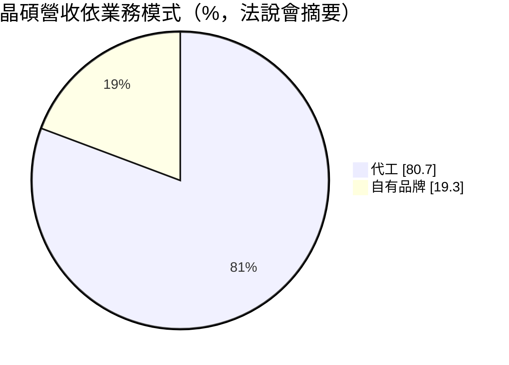
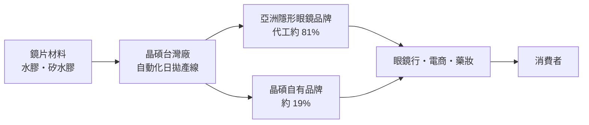
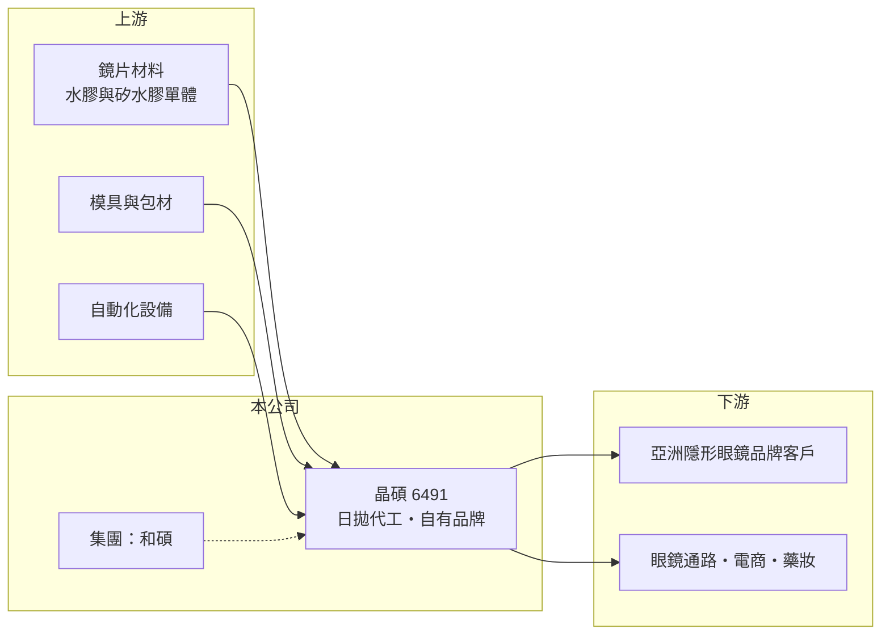

# 6491 晶碩

> 上市｜[[產業索引-生技醫療業|生技醫療業]]｜上市（櫃）日期 2019/10/07

# 第一章：企業模式與商業藍圖

> [!info] 撰寫說明
> 本文由 Claude 依公開資料整理，架構比照 [[2330台積電]] 的四章研究，資料截至 2026-10-08。財務數字來源：Goodinfo 年度經營績效表、證交所開放資料（基本資料、2026 年第二季財報、營益分析、股利、每月營收）；營收結構與客戶集中度取自富果研究整理的法說會摘要（摘要標示為 2024 年第一季資料，年份待校對；AI 摘要，非公司原始文件）。集團關係與產能數字為整理性內容，已標註待校對。#待校對

晶碩是台灣營收規模最大的隱形眼鏡製造商，以替國際與亞洲品牌代工日拋鏡片為主，同時經營自有品牌。本章說明晶碩光學（股票代號：6491，以下簡稱晶碩）的商業模式。

## 一、核心定位：大規模日拋隱形眼鏡代工廠

晶碩成立於 2009 年，2019 年在證交所上市，總部位於桃園市龜山區，董事長為郭明棟，總經理為楊德勝，實收資本額約 7.8 億元。晶碩屬於 [[4938和碩]] 集團轉投資的公司（持股比例待校對），把電子代工的大量製造與自動化經驗帶進[[隱形眼鏡]]產業。

* **代工為主：** 依法說會摘要，代工約占營收 81%、自有品牌約 19%，比重多年維持穩定。代工客戶包括亞洲的隱形眼鏡品牌與通路，晶碩負責設計、製造與取得各國醫材許可。
* **市場集中在亞洲：** 依同一資料，中國、日本與東南亞等亞洲其他地區約占營收 80%，台灣約 14%，歐洲等其他地區約 6%。
* **客戶集中度：** 最大客戶約占營收 25%，第二大客戶約 14%，公司表示持續推動客戶分散。

## 二、資本轉化邏輯：自動化產能與規模經濟

* **自動化是成本優勢：** 日拋鏡片單價低、用量大，生產效率與良率決定獲利。晶碩以高度自動化產線大量生產，[[毛利率]]長期維持在 50% 至 56%，營業利益率約 26% 至 31%。
* **擴產驅動成長：** 營收從 2019 年的 33.6 億元成長到 2025 年的 70.4 億元，主要靠持續擴充產能與爭取新客戶。2026 年 1 至 8 月累計營收年增約 22.5%，顯示擴產後的產能開始反映在營收上（推估）。

## 三、長期方向：功能性鏡片與客戶分散

隱形眼鏡市場的長期趨勢是從月拋、雙週拋轉向日拋，從水膠轉向透氧更高的[[矽水膠]]，並增加散光、多焦等功能性產品。晶碩的長期課題是在維持代工規模的同時，提高功能性鏡片與自有品牌的比重，並降低對前兩大客戶的依賴。

# 第二章：護城河深度與競爭優勢

護城河是企業抵禦競爭、長期維持超額利潤的機制。本章說明晶碩在隱形眼鏡代工市場的優勢，以及面對同業擴產時能守住多少。

## 一、晶碩護城河的核心組成要素

* **1. 規模與自動化：** 晶碩是台灣營收最大的隱形眼鏡廠，大量生產讓單片成本低於中小型同業，這是吸引品牌客戶長期下單的主因。
* **2. 醫材許可與品質系統：** 隱形眼鏡在各國都屬醫療器材，代工廠必須協助客戶取得當地許可；累積的許可與品質紀錄讓客戶更換代工廠的成本很高。
* **3. 集團製造經驗：** 和碩集團的大量製造與供應鏈管理經驗，有助於產線自動化與成本控制（待校對）。
* **4. 財務實力：** 2026 年第二季底權益約 116.7 億元，負債約 52.9 億元，有能力持續投入擴產。

## 二、主要競爭對手格局

| 對手 | 定位 | 對晶碩的影響 |
|---|---|---|
| [[1565精華]] | 老牌隱形眼鏡廠，代工與自有品牌 | 在日本與台灣市場直接競爭 |
| [[4771望隼]] | 彩片與日拋快速成長 | 在中國與日本彩片代工搶單 |
| [[6782視陽]] | 隱形眼鏡代工與品牌 | 日拋與彩片同質競爭 |
| 國際大廠（嬌生、愛爾康、庫博光學、博士倫） | 全球品牌，自有產能 | 主導高階矽水膠市場 |

## 三、優勢轉化：守得住與守不住的地方

* **守得住：** 2019 至 2025 年營收與營業利益都大幅成長，毛利率從 44.5% 升到 50% 以上，代表規模經濟持續發揮。
* **守不住：** 2025 年毛利率降到 52.3%、營業利益率降到 25.7%，EPS 從 23.47 元降到 20.87 元，顯示同業擴產與價格競爭開始影響獲利。
* **觀察重點：** 擴產後的產能利用率、矽水膠與功能性鏡片比重，以及最大客戶占比是否下降。

# 第三章：財務體質與盈利規模

資料日期：2026-10-08，表格是撰寫當時的快照；最新月營收、毛利率、累計 EPS 由自動排程寫在本筆記的屬性欄位（月營收、毛利率、累計EPS 等）。#待校對

財務報表是檢驗護城河是否真實存在的最終標準。本章用五年的三率、ROE 與資本報酬，檢視晶碩的獲利品質。

## 一、多年度財務表現

| 年度 | 營收（新台幣） | [[毛利率]] | [[營業利益率]] | EPS（元） | [[ROE]] |
|---|---|---|---|---|---|
| 2021 | 56.0 億 | 53.0% | 26.1% | 17.84 | 24.7% |
| 2022 | 63.2 億 | 52.4% | 28.8% | 22.03 | 25.8% |
| 2023 | 67.9 億 | 54.0% | 29.2% | 22.83 | 20.4% |
| 2024 | 68.2 億 | 56.1% | 30.6% | 23.47 | 17.6% |
| 2025 | 70.4 億 | 52.3% | 25.7% | 20.87 | 14.5% |

資料來源：Goodinfo 年度經營績效（合併報表）。2026 年上半年（證交所資料）營收約 40.0 億元、毛利率 53.15%、營業利益率 28.18%、EPS 13.13 元，獲利較 2025 年回升。

* **ROE 下滑的原因：** 2023 年股本從 7 億元增加到 7.8 億元，每股淨值從 2022 年約 92 元升到 2025 年約 149 元，權益擴大的速度快於淨利成長，ROE 從約 26% 降到約 15%。
* **長期指標：** 2020 至 2025 年營收年複合成長率約 12.1%（推算）；2021 至 2025 年平均 ROE 約 20.6%（推算）。2025 年度配發現金股利 10 元，配發率約 48%（推算），保留約一半盈餘支應擴產。

## 二、[[ROIC]] 與 [[WACC]]：價值創造利差

**ROIC 推算：** 2025 年營業利益約 18.1 億元，稅率 20% 後約 14.5 億元。官方資料揭露負債總計約 52.9 億元，以流動負債為主，假設三成為有息負債約 15.9 億元（推估），加上權益約 116.7 億元，投入資本約 132.6 億元，ROIC 約 10.9%（推算）。

**WACC 推算：** 台灣 10 年期公債殖利率取 1.75%、市場風險溢酬 6%、β 取 1.0（未查得公司實際 β，以醫材製造股常見值估計），股東權益成本約 7.75%。負債成本假設 2.0%，稅後約 1.6%，權益約占投入資本 88%，WACC 約 7.0%（推算）。

**結論：** ROIC 高於 WACC 約 4 個百分點，代表晶碩長期在創造價值。不過利差隨著權益累積與 2025 年毛利率下滑而縮小，未來擴產若遇到價格競爭，ROIC 可能進一步向資金成本靠攏。

# 第四章：總體風險與地緣政治

任何企業都無法脫離宏觀環境獨立存在。本章分析晶碩長期必須面對的客戶、競爭與地緣風險。

## 一、客戶與市場風險

* **客戶集中：** 前兩大客戶合計約四成營收，任一客戶轉單、自建產能或減少庫存，都會明顯影響營收。
* **亞洲市場集中：** 約八成營收來自中國、日本與東南亞，中國消費景氣與日圓匯率變化都會直接反映在營收與毛利。

## 二、產業與競爭風險

* **同業擴產：** 台灣與中國隱形眼鏡廠都在擴充日拋產能，供給增加可能引發價格競爭。
* **國際大廠的技術領先：** 高階矽水膠與功能性鏡片由國際大廠主導，晶碩若無法跟上材料與設計技術，可能被侷限在中低階市場。

## 三、法規與其他風險

* **醫材法規：** 各國對隱形眼鏡的上市許可、標示與上市後監督要求趨嚴，新產品取證時間可能拉長。
* **匯率：** 營收以外幣計價為主，新台幣升值會壓縮以台幣計算的營收與毛利。
* **地緣政治：** 中國是重要市場，兩岸關係與貿易政策變化可能影響出貨與通路經營。

# 專有名詞解析

## 應用

- **[[隱形眼鏡]]**：直接配戴在眼球表面的矯正或美容鏡片，屬醫療器材，需取得衛生主管機關許可。

## 金融

- **[[ROIC]]**：投入資本報酬率，稅後營業利益除以股東權益加有息負債，衡量本業運用資本的效率。
- **[[WACC]]**：加權平均資金成本，股東與債權人要求報酬率的加權平均，是 ROIC 要超越的門檻。

## 產業

- **[[矽水膠]]**：在水膠鏡片材料中加入矽，讓氧氣更容易穿透，適合長時間配戴，單價高於一般水膠鏡片。

# 核心供應鏈

## 1. 上游：材料與設備
- 鏡片單體材料、模具、包材與自動化設備供應商（名稱未查得）

## 2. 中游：晶碩與同業
- 集團母公司：[[4938和碩]]（持股比例待校對）
- 隱形眼鏡同業：[[1565精華]]、[[4771望隼]]、[[6782視陽]]

## 3. 下游：客戶與通路
- 亞洲隱形眼鏡品牌（客戶名稱未揭露）
- 眼鏡通路：[[5312寶島科]] 等連鎖眼鏡行（產業通路，實際往來未查得）

## 最新新聞
<!-- news:start（自動產生，請勿手動編輯此範圍） -->
- 2026-10-05 📰 媒體 08:10｜鉅亨速報 - Factset 最新調查：晶碩(6491-TW)目標價調升至412.5元，幅度約3.13%｜[鉅亨網](https://news.cnyes.com/news/id/6621404)

完整紀錄：[[6491晶碩 新聞]]
<!-- news:end -->

## 相關連結
- [公開資訊觀測站](https://mopsov.twse.com.tw/mops/web/t05st03?step=1&firstin=1&co_id=6491)
- [Goodinfo](https://goodinfo.tw/tw/StockDetail.asp?STOCK_ID=6491)
- [Yahoo 股市](https://tw.stock.yahoo.com/quote/6491)
- [鉅亨網新聞](https://www.cnyes.com/twstock/6491/news)
