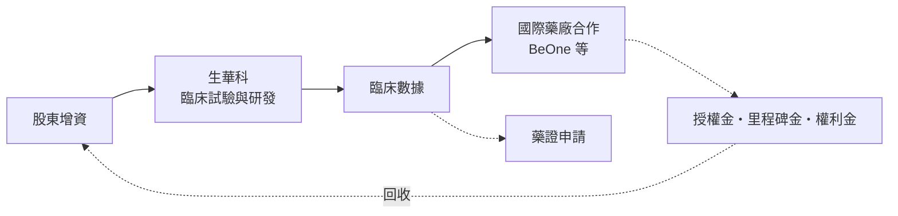
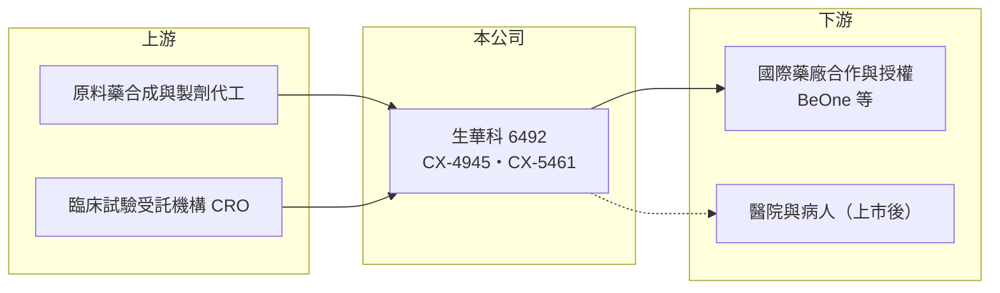

# 6492 生華科

> 上櫃｜[[產業索引-生技醫療業|生技醫療業]]｜上市（櫃）日期 2017/04/24

# 第一章：企業模式與商業藍圖

> [!info] 撰寫說明
> 本文由 Claude 依公開資料整理，架構比照 [[2330台積電]] 的四章研究，資料截至 2026-10-08。財務數字來源：Goodinfo 年度經營績效表、櫃買中心開放資料（基本資料、2026 年第二季財報、每月營收、本益比殖利率）；研發進度取自優分析轉載的 2025 年 12 月法說會報導。孤兒藥資格與早期臨床歷程為憑記憶整理，已標註待校對。公開資料有限。#待校對

生華科是一家沒有產品營收、專注開發抗癌新藥的研發型公司，它的價值幾乎完全取決於兩個藥物的臨床結果與授權機會。本章說明生華生物科技（股票代號：6492，以下簡稱生華科）的商業模式。

## 一、核心定位：以新機制抗癌小分子為核心的[[新藥]]公司

生華科成立於 2012 年，2017 年在櫃買中心掛牌，總部位於新北市新店區，董事長為胡定吾，總經理為黃品諺，實收資本額約 11.5 億元。公司目前推進兩項新藥：

* **CX-4945（Silmitasertib）：** 口服的 CK2 激酶抑制劑（作用機轉待校對）。公司過去以膽管癌等適應症進行臨床，並取得美國 FDA 的[[孤兒藥]]資格（取得年份與適應症待校對）。依 2025 年 12 月報導，Google DeepMind 以生物 AI 模型分析逾 4,000 項候選藥物後點名 CX-4945，認為它可能提升癌細胞的抗原呈現能力，讓免疫系統較難辨識的「冷腫瘤」轉為「熱腫瘤」。報導未說明 DeepMind 與生華科有合作關係。
* **CX-5461（Pidnarulex，學名待校對）：** 依 2025 年 12 月報導，生華科與 BeOne Medicines（原百濟神州，待校對）簽署國際臨床合作協議，將 CX-5461 與對方已上市的 PD-1 [[免疫檢查點抑制劑]] tislelizumab 合併使用，初步鎖定胰臟癌與對現有免疫療法產生抗藥性的黑色素瘤等晚期實體腫瘤。

## 二、資本轉化邏輯：募資換取臨床數據，數據換取授權

* **沒有產品營收：** 2019 至 2025 年營收每年都只有約 100 萬元，公司的支出幾乎全部是研發與管理費用，每年營業虧損約 2.8 億至 3.9 億元。
* **[[授權]]是回收的主要方式：** 小型新藥公司通常無力獨自完成三期臨床與全球上市，而是在取得二期數據後授權給國際藥廠，收取簽約金、里程碑金與銷售權利金。因此生華科的價值實現時點，取決於何時拿出足以吸引授權的臨床數據。

## 三、長期方向

依 2025 年 12 月報導，公司以 AI 驗證、精準臨床與國際合作為研發核心，未來 1 至 3 年的重點是多項臨床數據產出、深化與國際藥廠的合作與潛在授權。CX-5461 與 PD-1 的合併療法若初步成功，可切入全球免疫腫瘤市場；但目前仍處早期臨床階段，成功機率與時程都有高度不確定性。

# 第二章：護城河深度與競爭優勢

護城河是企業抵禦競爭、長期維持超額利潤的機制。對新藥公司而言，護城河主要來自專利、臨床數據與合作夥伴，而不是現有的獲利能力。

## 一、生華科護城河的核心組成要素

* **1. 新機制藥物與專利：** CX-4945 與 CX-5461 都屬於作用機制較新的小分子藥物，專利保護期內，其他公司無法開發相同化合物。
* **2. 孤兒藥資格：** 孤兒藥資格可提供美國上市後的市場獨占期與審查上的優惠，降低罕見適應症的開發成本（資格細節待校對）。
* **3. 國際藥廠合作：** 與 BeOne 的臨床合作讓 CX-5461 能使用已上市的 PD-1 藥物進行合併療法試驗，省下自行取得對照藥物的成本，也提高國際能見度。

## 二、主要競爭對手格局

| 對手 | 定位 | 對生華科的影響 |
|---|---|---|
| 國際大藥廠的免疫腫瘤藥 | PD-1、PD-L1 與新一代免疫療法 | 合併療法市場競爭者眾多 |
| [[4174浩鼎]] | 台灣抗癌新藥公司 | 爭取同類國際授權與資本市場資金 |
| [[6550北極星藥業-KY]] | 抗癌新藥 | 爭取同類國際授權與資本市場資金 |
| 膽管癌標靶藥物開發商 | FGFR、IDH 等標靶藥 | 在膽管癌適應症競爭 |

## 三、優勢轉化：守得住與守不住的地方

* **守得住：** 公司的研發計畫已獲國際藥廠合作與 AI 研究的關注，這些都是後續授權談判的籌碼。
* **守不住：** 2019 至 2025 年沒有任何授權收入入帳，股東權益從 2020 年每股約 26 元降到 2025 年約 8.5 元，資金持續被研發消耗。
* **觀察重點：** CX-5461 合併療法的人體試驗數據、CX-4945 的下一步臨床規劃，以及能否在下一輪募資前簽下授權合約。

# 第三章：財務體質與盈利規模

資料日期：2026-10-08，表格是撰寫當時的快照；最新月營收、毛利率、累計 EPS 由自動排程寫在本筆記的屬性欄位（月營收、毛利率、累計EPS 等）。#待校對

財務報表是檢驗護城河是否真實存在的最終標準。對尚無產品的新藥公司，重點不是三率，而是虧損規模、現金消耗速度與增資頻率。

## 一、多年度財務表現

| 年度 | 營收（新台幣） | [[毛利率]] | [[營業利益率]] | EPS（元） | [[ROE]] |
|---|---|---|---|---|---|
| 2021 | 約 0.01 億 | 58.7%（營收極小，不具意義） | 不具意義（營業虧損約 3.46 億） | -3.67 | -15.3% |
| 2022 | 約 0.01 億 | 50.5%（同上） | 不具意義（營業虧損約 3.56 億） | -3.92 | -19.5% |
| 2023 | 約 0.01 億 | 55.2%（同上） | 不具意義（營業虧損約 3.11 億） | -3.32 | -20.2% |
| 2024 | 約 0.01 億 | 47.7%（同上） | 不具意義（營業虧損約 3.06 億） | -3.29 | -25.1% |
| 2025 | 約 0.01 億 | 48.6%（同上） | 不具意義（營業虧損約 2.78 億） | -2.97 | -29.6% |

資料來源：Goodinfo 年度經營績效（合併報表）。2026 年上半年（櫃買中心資料）營收約 48 萬元、營業損失約 1.54 億元、EPS 負 1.67 元。

* **研發支出趨勢：** 年度營業虧損從 2021 至 2022 年的約 3.5 億元降到 2025 年的約 2.8 億元，代表研發與管理費用逐步收斂（費用細項未查得，推估以研發為主）。研發費用率因營收趨近於零而無法計算。
* **資金狀況：** 2026 年第二季底總資產約 6.8 億元，負債約 0.6 億元，權益約 6.2 億元。以 2026 年上半年營業虧損約 1.54 億元年化約 3.1 億元推算，帳上資源約可支應兩年左右的營運（推算）。官方基本資料的實收資本額約 11.5 億元，高於第二季財報的股本約 9.0 億元，推估第二季後辦理了[[現金增資]]（待校對）。
* **長期指標：** 2021 至 2025 年平均 ROE 約負 21.9%（推算），未配發股利，自由現金流長期為負。

## 二、[[ROIC]] 與 [[WACC]]：價值創造利差

**ROIC 推算：** 2025 年營業虧損約 2.78 億元，虧損年度不計稅盾。公司幾乎沒有有息負債（負債約 0.6 億元，以流動負債為主，假設有息負債為零），投入資本以 2026 年第二季權益約 6.17 億元計算，ROIC 約負 45%（推算）。

**WACC 推算：** 台灣 10 年期公債殖利率取 1.75%、市場風險溢酬 6%、β 取研發型新藥股常見值 1.2（未查得公司實際 β），股東權益成本約 8.95%。由於幾乎沒有負債，WACC 約等於權益成本 8.9%（推算）。

**結論：** 對尚未上市產品的新藥公司，ROIC 為大幅負值是常態，傳統的 ROIC 與 WACC 比較只能說明「目前每年消耗約四成投入資本」。生華科的價值不在現有報酬，而在未來授權或藥證帶來的現金流能否超過累積投入；投資人需要以臨床成功機率與授權條件來評估。

# 第四章：總體風險與地緣政治

任何企業都無法脫離宏觀環境獨立存在。本章分析生華科長期必須面對的研發、資金與市場風險。

## 一、研發風險

* **臨床失敗：** 抗癌新藥從一期到上市的成功率很低，任何一項試驗未達主要指標，都可能讓多年投入的價值大幅縮水。
* **時程延後：** 臨床收案速度、合作夥伴的優先順序與法規要求，都可能讓數據產出比公司規劃更晚。

## 二、資金風險

* **持續增資：** 沒有產品營收，研發資金只能靠增資或授權收入，每次增資都會稀釋既有股東；股東權益在 2020 至 2025 年持續下降。
* **授權條件：** 若在資金緊迫時談授權，議價能力會下降，簽約金與權利金條件可能不如預期。

## 三、市場與其他風險

* **免疫腫瘤競爭激烈：** 全球大量藥廠投入 PD-1 合併療法，即使 CX-5461 數據正面，也要與眾多新療法比較療效與安全性。
* **合作夥伴策略改變：** 國際藥廠若調整研發重心，合作專案可能被降低優先順序或終止。
* **話題與實質落差：** AI 模型點名等話題可能提高關注度，但不代表臨床療效，長期仍須以人體試驗數據為準。

# 專有名詞解析

## 應用

- **[[免疫檢查點抑制劑]]**：解除癌細胞對免疫系統「煞車」的藥物，例如 PD-1 抑制劑，讓免疫細胞重新攻擊腫瘤。

## 金融

- **[[現金增資]]**：公司發行新股向股東或投資人募集現金，可充實資本，但會稀釋既有股東持股。
- **[[ROIC]]**：投入資本報酬率，稅後營業利益除以股東權益加有息負債，衡量本業運用資本的效率。
- **[[WACC]]**：加權平均資金成本，股東與債權人要求報酬率的加權平均，是 ROIC 要超越的門檻。

## 產業

- **[[新藥]]**：含有新成分、新療效或新給藥途徑的藥品，需完成臨床前與一至三期臨床試驗才能取得藥證。
- **[[孤兒藥]]**：治療罕見疾病的藥物，美國等地提供市場獨占期、稅賦優惠與審查協助，以鼓勵藥廠投入。
- **[[授權]]**：藥廠把產品或技術的開發、銷售權利授予其他公司，以換取簽約金、里程碑金與銷售權利金。

# 核心供應鏈

## 1. 上游：研發服務
- 原料藥合成、製劑代工與臨床試驗受託機構（名稱未查得）

## 2. 中游：生華科與同業
- 台灣抗癌新藥公司：[[4174浩鼎]]、[[6550北極星藥業-KY]]

## 3. 下游：合作與授權對象
- BeOne Medicines（CX-5461 臨床合作）
- 潛在授權的國際藥廠與上市後的醫院、病人

## 最新新聞
<!-- news:start -->
<!-- news:end -->

## 相關連結
- [公開資訊觀測站](https://mopsov.twse.com.tw/mops/web/t05st03?step=1&firstin=1&co_id=6492)
- [Goodinfo](https://goodinfo.tw/tw/StockDetail.asp?STOCK_ID=6492)
- [Yahoo 股市](https://tw.stock.yahoo.com/quote/6492)
- [鉅亨網新聞](https://www.cnyes.com/twstock/6492/news)
