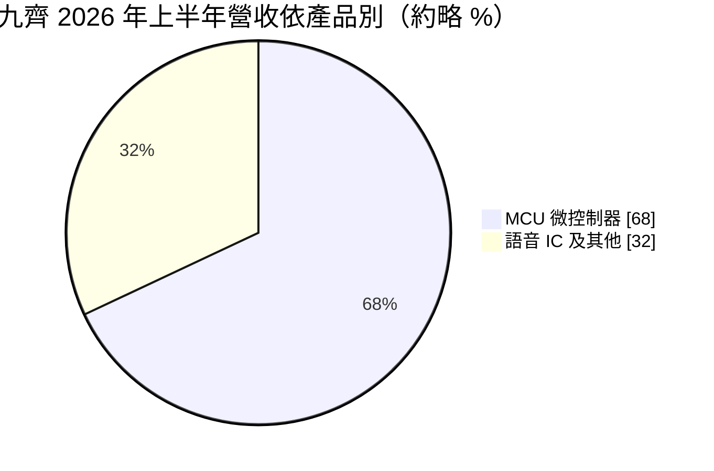
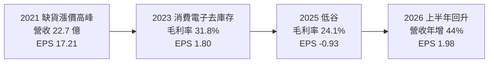
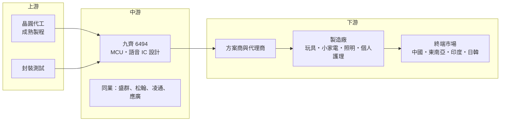

# 6494 九齊

> 上櫃｜[[產業索引-半導體業|半導體業]]｜上市（櫃）日期 2016/05/09

# 第一章：企業模式與商業藍圖

> [!info] 撰寫說明
> 本文由 Claude 依公開資料整理，架構比照 [[2330台積電]] 的四章研究，資料截至 2026-10-08。財務數字來源：Goodinfo 年度經營績效與股利政策頁、MoneyDJ 資產負債表與現金流量表、Yahoo 股市公司基本資料、nStock 公司資料、散戶鬥嘴鼓 2026 年 8 月法說會摘要；產業描述為整理性內容，尚未逐條比對原始文件。#待校對

在評估一家公司的長期價值時，第一步是看懂它的產品用在哪裡、怎麼賺錢。本章針對九齊科技（股票代號：6494，以下簡稱九齊）的商業模式進行定性分析，說明一家以玩具語音晶片起家的小型設計公司，如何把重心轉向小家電與電池管理用的微控制器。

## 一、核心定位：消費電子的「小腦」供應商

九齊成立於 2006 年，總部位於新竹市，2016 年上櫃，董事長與總經理皆由陳建隆擔任。公司是 [[Fabless]] IC 設計公司，產品包括語音控制 IC、[[MCU]]（微控制器）、LCD 微控制器、MIDI 音樂 IC、錄音 IC 與數位訊號處理器，主要應用在消費性電子。

九齊的產品可以理解為消費電子裡的「小腦」。一台會說話的玩具、一個有 LED 燈效的電動牙刷、一支電蚊拍、一個小風扇，裡面都需要一顆便宜的小晶片來控制按鍵、燈號、聲音與馬達。這類晶片單價很低，可能只有幾塊台幣，但出貨量以億顆計。九齊的競爭力在於能用極低的成本，提供夠用的功能與完整的開發工具，讓下游方案商與製造廠快速做出產品。

## 二、產品板塊：MCU 已成主力

依法說會摘要，九齊的產品結構近年明顯轉向 MCU：

* **MCU（微控制器）：** 營收占比由 2024 年的 63%、2025 年的 65%，升到 2026 年上半年的約 68%。細分來看，內建類比數位轉換器的 ADC 型 MCU 約占 45%，內建可重複寫入記憶體的 Flash 與 [[MTP]] 型 MCU 約占 25%，兩者都比 2022 年明顯提升；功能較陽春的 GPIO 型 MCU 出貨量穩定，但占比下降。
* **語音 IC：** 九齊的起家產品，用於發聲玩具、禮品與音效產品，占比由 2024 年的 35% 降到 2026 年第二季的約 31%。

從應用面看，九齊的產品用於智慧照明與安全、消費性小家電、個人護理、互動玩具、馬達控制、無線遙控與鋰電池管理。

## 三、資本轉化邏輯：低單價、大量、靠產品組合提升毛利

* **透過方案商銷售：** 消費型 MCU 的客戶多是中小型製造廠，它們沒有能力自己寫程式，通常由方案商把九齊的晶片加上程式與周邊電路，做成可以直接使用的方案。九齊的工作是提供晶片、開發工具與參考設計，讓方案商願意用它的平台。
* **輕資產：** 晶圓與封裝都外包，2025 年購置設備僅約 0.46 億元，公司沒有銀行借款。
* **產品組合決定毛利：** GPIO 型 MCU 與一般語音 IC 規格簡單、價格競爭激烈；ADC 型與 Flash／MTP 型 MCU 功能較多，可以用在電池管理、馬達控制等需要量測與調整的應用，單價與毛利較好。九齊近年把資源放在後者，目的是擺脫低價競爭。

## 四、企業長期藍圖：高附加價值 MCU 與海外市場

依 2026 年法說會摘要，九齊的長期策略有三個方向：

* **產品轉型：** 降低對傳統語音 IC 的依賴，轉向利基型、高附加價值的 MCU，重點發展高效驅動、消費升級與健康智能應用，並拓展鋰電池管理與馬達控制。
* **語音平台延伸與成本控制：** 延伸語音產品平台以分散地緣政治風險，並跟進主流製程縮小封裝以控制成本。
* **海外市場：** 深耕東南亞、印度、日本與韓國，與當地方案商合作。由於中國的消費電子製造業正部分移往東南亞與印度，跟著製造業移動是維持出貨量的必要做法（推估）。

# 第二章：護城河深度與競爭優勢

護城河是企業抵禦競爭、長期維持超額利潤的機制。本章分析九齊在高度競爭的消費型 MCU 市場中有哪些防守能力，主要競爭對手是誰，以及它的優勢能守住多少。

## 一、九齊護城河的核心組成要素

消費型 MCU 與語音 IC 是門檻相對低、競爭者眾多的市場，九齊的護城河偏窄，主要來自三方面：

* **1. 方案商生態系：** 方案商一旦熟悉某一家的開發工具與指令集，會把過去寫好的程式重複用在新產品上。換用另一家晶片，等於要重新學習工具、改寫程式，這種習慣成本是消費型 MCU 廠最重要的黏著力。
* **2. 成本控制能力：** 在單價只有幾塊錢的市場，晶片面積、封裝方式與測試時間的微小差異都會影響毛利。九齊長期專注低成本設計，並持續跟進製程微縮與小型封裝。
* **3. 語音技術累積：** 語音 IC 需要壓縮演算法、音質調校與錄放音功能，九齊在玩具與禮品市場累積了大量應用經驗與聲音素材平台。

## 二、全球主要競爭對手格局

| 對手 | 定位 | 對九齊的威脅 |
|---|---|---|
| [[6202盛群]] | 台灣消費與家電 MCU 大廠，產品線完整 | 在小家電、健康量測等應用直接競爭 |
| [[5471松翰]] | 台灣 MCU 與語音、影像 IC 設計公司 | 在語音與消費型 MCU 市場重疊 |
| [[4952凌通]] | 台灣語音與玩具 IC 設計公司 | 在玩具與語音 IC 市場正面競爭 |
| [[6716應廣]] | 台灣低價 MCU 設計公司 | 在 OTP 與低階 MCU 以價格競爭 |
| 中國消費型 MCU 廠 | 數量眾多，貼近中國製造廠 | 在最低價區間壓縮利潤 |

## 三、優勢轉化：哪些市場守得住、哪些守不住

* **守得住：** 已經用九齊平台開發多年的方案商與老客戶，以及 ADC 型、Flash／MTP 型 MCU 在電池管理與馬達控制的應用。這些產品的功能較多，方案商轉換成本較高。
* **守不住：** GPIO 型 MCU 與傳統語音 IC 的價格。2023 年九齊毛利率由 2022 年的 44.9% 降到 31.8%，2025 年再降到 24.1%，顯示低階產品在需求轉弱時幾乎沒有定價能力。
* **觀察重點：** 第一，ADC 型與 Flash／MTP 型 MCU 占比能否持續提高，帶動毛利率回到 30% 以上；第二，東南亞與印度市場的開拓成果；第三，中國消費電子需求與中國同業的價格競爭。2026 年上半年營收年增 44%、毛利率回升到 29%，是否能延續，是驗證轉型成效的關鍵。

# 第三章：財務體質與盈利規模

資料日期：2026-10-08。數字取自 Goodinfo 年度經營績效、MoneyDJ 財務報表與法說會摘要，表格是撰寫當時的快照；最新月營收、毛利率、累計 EPS 由自動排程寫在本筆記的屬性欄位（月營收、毛利率、累計EPS 等）。#待校對

財務報表是檢驗護城河是否真實存在的最終標準。本章用多年度數據檢視九齊在消費電子週期中的獲利起伏。

## 一、獲利能力的基石：三率

| 年度 | 營收（億元） | [[毛利率]] | [[營業利益率]] | EPS（元） | [[ROE]] |
|---|---|---|---|---|---|
| 2019 | 10.4 | 37.1% | 9.49% | 2.65 | 12.7% |
| 2020 | 11.6 | 40.6% | 13.9% | 3.94 | 17.8% |
| 2021 | 22.7 | 54.3% | 30.1% | 17.21 | 57.4% |
| 2022 | 17.8 | 44.9% | 17.0% | 9.54 | 25.3% |
| 2023 | 13.3 | 31.8% | 3.49% | 1.80 | 4.99% |
| 2024 | 13.5 | 30.4% | 3.18% | 2.63 | 7.67% |
| 2025 | 11.9 | 24.1% | -2.45% | -0.93 | -2.82% |

資料來源：Goodinfo 合併報表年度經營績效。股本七年間維持 3.16 億元，EPS 可直接比較。

* **[[毛利率]]：** 九齊的毛利率在 24% 至 54% 之間大幅擺盪。2021 年全球 MCU 缺貨，價格上漲，毛利率衝上 54.3%；之後消費電子需求轉弱、庫存調整，價格回落，2025 年降到 24.1%。2026 年上半年回到約 29%，與高附加價值 MCU 比重提高有關。
* **[[營業利益率]]：** 九齊的費用規模不大，2026 年上半年營業費用年增僅約 2%，營收成長 44% 就讓營業利益由虧轉盈。這說明公司的獲利對營收規模非常敏感。
* **長期成長：** 2019 年至 2025 年營收年複合成長率約 2.3%（推算），2021 年至 2025 年為負 14.9%（推算）。扣除 2021 至 2022 年的缺貨高峰，九齊的長期營收規模大約在 10 億至 14 億元之間。

## 二、[[ROE]]：資本效率

九齊近 5 年（2021 至 2025 年）平均 ROE 約 18.5%（推算），但其中 2021 年單年就有 57.4%，若只看 2023 至 2025 年，平均約 3.3%（推算）。這是消費型 IC 設計公司的典型樣貌：少數景氣高峰年度貢獻大部分獲利。公司沒有銀行借款，依 MoneyDJ 資料，2025 年底股東權益約 9.95 億元，帳上現金約 4.13 億元，財務結構保守。

## 三、資本支出與自由現金流

* **[[CapEx]]：** 2025 年購置設備約 0.46 億元，2026 年上半年約 0.08 億元，資本支出很低。
* **[[自由現金流]]：** 2025 年營業現金流約 1.07 億元，扣除資本支出後自由現金流約 0.61 億元（推算），即使在虧損年度仍為正。2026 年上半年營業現金流約 2.47 億元，隨營收回升明顯改善。
* **股利政策：** 依 Goodinfo，2019 年至 2025 年度的現金股利分別為 2、3.5、8、6.5、1.62、2.36、1 元。nStock 資料顯示 2024 年度現金配發率約 90%，2025 年雖然虧損仍配發 1 元。九齊的股利政策是「有賺就大部分發出去」，股利金額跟著獲利大起大落，不適合用過去平均值推估未來股利。

## 四、[[ROIC]] 與 [[WACC]]：價值創造利差

* **ROIC（推算）：** 2025 年營業利益為負（營收 11.9 億元 × 營業利益率負 2.45%，約負 0.29 億元），ROIC 為負值（推算約負 2% 至 3%）。以 2024 年計算，營業利益約 0.43 億元（13.5 億元 × 3.18%），稅後約 0.34 億元，除以 2024 年底股東權益 10.98 億元（無有息負債），ROIC 約 3.1%（推算）。2021 年高峰時稅後營業利益約 5.5 億元，以當年股東權益約 9.5 億元估算，ROIC 超過 50%（推算）。
* **WACC（推算）：** 無風險利率取 1.75%，市場風險溢酬 6%，β 取消費型 IC 設計同業常見值 1.0（未查得公司實際 β），股東權益成本約 7.75%。公司沒有有息負債，WACC 約 7.7%（推算）。
* **解讀：** 2023 至 2025 年九齊的 ROIC 都低於 WACC，代表在消費電子低迷期，公司沒有替股東創造超額報酬；但在景氣高峰時 ROIC 遠高於 WACC。長期能否創造價值，要看高附加價值 MCU 的轉型能否把「正常年度」的營業利益率提高到 10% 以上（推估門檻），讓 ROIC 在非高峰年度也能超過資金成本。

# 第四章：總體風險與地緣政治

任何企業都無法脫離宏觀環境獨立存在。本章分析九齊長期必須面對的地緣政治、產業週期、營運與技術風險。

## 一、地緣政治風險

* **依賴中國製造業：** 九齊的下游客戶以玩具、小家電、照明等消費電子製造廠為主，這些製造業的大本營在中國。美國對中國商品加徵關稅時，終端品牌會減少下單或要求降價，壓力會沿著供應鏈傳到晶片端。
* **製造業外移：** 部分消費電子製造正移往東南亞與印度。九齊已開始布局這些市場，但新市場需要重新建立方案商網絡，短期內難以完全彌補中國需求的變化。
* **中國本土替代：** 中國 MCU 廠商眾多，在本土製造廠的採購上具有地緣優勢與價格優勢。

## 二、產業週期與市場結構風險

* **消費電子需求波動：** 玩具、禮品與小家電屬於可選擇性消費，景氣不好時最先被削減。2023 至 2025 年九齊營收連續低迷，就是消費電子需求疲弱的反映。
* **缺貨與去庫存循環：** 2021 年 MCU 缺貨時下游重複下單，2022 至 2023 年轉為去庫存，這種[[長鞭效應]]讓九齊的營收在兩年內由 22.7 億元降到 13.3 億元。
* **價格競爭：** 消費型 MCU 的技術門檻低，中國與台灣同業眾多，低階產品長期面臨降價壓力。

## 三、營運環境的隱性風險

* **規模小：** 九齊年營收約 12 億至 14 億元，研發與行銷資源有限，難以同時在多個新應用市場投入。
* **晶圓代工成本：** 成熟製程晶圓價格若上漲，九齊這類低單價產品不容易轉嫁，毛利率會受壓。公司的晶圓代工夥伴未公開（未查得）。
* **股利與保留資金的平衡：** 公司習慣高比例配息，雖然沒有負債，但在轉型期若需要投入更多研發，資金彈性會受限。

## 四、科技演進風險

消費電子的智慧化趨勢讓 MCU 的功能需求逐步提高，例如藍牙連線、觸控、電池精準管理與語音辨識。若九齊的產品停留在簡單控制與錄放音，可能被整合度更高的晶片取代；反過來說，若能在 ADC 型、Flash 型 MCU 上持續加入新功能，就能跟著智慧化趨勢提高單價。另外，AI 語音生成技術普及後，傳統預錄式語音 IC 在高階玩具中的角色可能被可連網的語音方案取代，但低價玩具與禮品市場仍會需要成本極低的語音晶片。

# 專有名詞解析

## 半導體

- **[[MCU]]**：微控制器，把處理器、記憶體與輸入輸出介面整合在一顆晶片上，用於家電、玩具與工控的控制功能。
- **[[Fabless]]**：無晶圓廠的 IC 設計公司，只負責設計與銷售，製造交給晶圓代工與封測廠。
- **[[語音IC]]**：能儲存並播放聲音的晶片，常用於發聲玩具、禮品與家電提示音。
- **[[ADC]]**：類比數位轉換器，把溫度、電壓等連續變化的訊號轉成晶片可處理的數字。
- **[[GPIO]]**：通用輸入輸出腳位，晶片用來讀取按鍵或控制 LED 等簡單外部元件的接腳。
- **[[MTP]]**：多次可程式記憶體，可以反覆寫入，讓 MCU 能在出廠後更新程式或參數。
- **[[OTP]]**：一次可程式記憶體，只能寫入一次、成本最低，常用於低價 MCU 存放程式。

## 應用

- **[[BMS]]**：電池管理系統，監控電池的電壓、溫度與充放電狀態，確保電池安全並延長壽命。

## 金融

- **[[長鞭效應]]**：終端需求的小幅變動，沿供應鏈往上游傳遞時被逐級放大，造成上游庫存與訂單劇烈波動。
- **[[自由現金流]]**：營業活動現金流減去資本支出，代表企業可自由用於配息、還債或併購的現金。

## 產業

- **[[方案商]]**：替製造廠把晶片加上程式與周邊電路、做成可直接量產方案的設計服務公司。

# 核心供應鏈

## 1. 上游：晶圓代工與封測
- 晶圓代工與封裝測試夥伴未公開（未查得）。台灣成熟製程代工廠包括 [[2303聯電]]、[[5347世界先進]]、[[6770力積電]] 等，與九齊的實際合作關係未查得。

## 2. 中游：九齊與同業
- 台灣同業：[[6202盛群]]、[[5471松翰]]、[[4952凌通]]、[[6716應廣]]
- 中國消費型 MCU 設計公司

## 3. 下游：方案商與製造廠
- 方案商與代理商，負責軟體開發與應用方案
- 玩具、禮品、小家電、照明、個人護理、電動工具與鋰電池產品製造廠，公司未公開客戶名稱（未查得）

## 最新新聞
<!-- news:start -->
<!-- news:end -->

## 相關連結
- [公開資訊觀測站](https://mopsov.twse.com.tw/mops/web/t05st03?step=1&firstin=1&co_id=6494)
- [Goodinfo](https://goodinfo.tw/tw/StockDetail.asp?STOCK_ID=6494)
- [Yahoo 股市](https://tw.stock.yahoo.com/quote/6494)
- [鉅亨網新聞](https://www.cnyes.com/twstock/6494/news)
