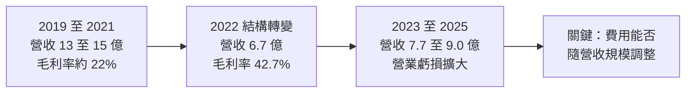
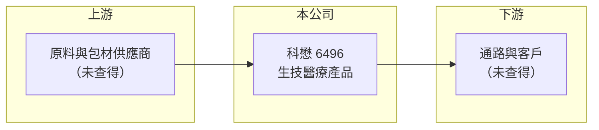

# 6496 科懋

> 上櫃｜[[產業索引-生技醫療業|生技醫療業]]｜上市（櫃）日期 2016/01/07

# 第一章：企業模式與商業藍圖

> [!info] 撰寫說明
> 本文由 Claude 依公開資料整理，架構比照 [[2330台積電]] 的四章研究，資料截至 2026-10-08。財務數字來源：Goodinfo 年度經營績效頁、櫃買中心開放資料（基本資料、2026 年第二季資產負債與綜合損益、本益比殖利率）。公開資料有限：本次查詢未能取得科懋主要產品與營收比重的可靠資料，第一、二章的業務描述以財報結構推論為主，需人工補充產品線。#待校對

在評估單一個股的長期投資價值時，首要步驟是拆解企業的底層獲利邏輯。本章針對科懋生物科技（股票代號：6496，以下簡稱科懋）的商業模式進行定性分析。由於本次查得的業務資料有限，本章著重說明從財報結構看得出來的事業轉變，產品細節留待校對補充。

## 一、核心定位：老牌生技公司，2022 年後事業結構明顯轉變

科懋成立於 1988 年，2016 年 1 月在櫃買中心上櫃，董事長兼總經理為陳澤民，實收資本額約 4.73 億元，櫃買中心產業分類為生技醫療業。公司主要產品與營收比重在本次查詢中未能確認，需以公司年報或法說會資料補充。

從財報可以看出一個重要的結構變化：2019 至 2021 年營收維持在 13 億至 15 億元，毛利率只有 21% 至 23%；2022 年營收腰斬到 6.72 億元，毛利率卻跳升到 42.7%。這種「營收大減、毛利率倍增」的組合，通常代表公司退出或分割了一塊低毛利、類似貿易或代工的業務，留下毛利較高的自有產品（推估）。理解這次轉變的原因，是判斷科懋長期價值的第一步。

## 二、事業板塊：營收比重未查得

* **營收結構：** 本次未查得產品別或地區別的營收比重，因此不放圓餅圖。依 2026 年上半年財報，營收 4.51 億元、毛利率 38.1%，顯示目前的產品組合仍維持約四成的毛利水準。
* **營業費用結構：** 2026 年上半年營業費用約 2.87 億元，高於毛利 1.71 億元，代表公司的費用規模（研發、推廣或管理）是依照比現在更大的營收規模配置的。費用能否隨營收調整，是虧損能否收斂的關鍵。

## 三、資本轉化邏輯：營收縮小後的費用槓桿

* **毛利率提升但費用未同步縮減：** 2022 年後毛利率維持在 40% 至 44%，但營業利益率從 -4.4% 一路擴大到 2025 年的 -19.1%，代表新產品組合的毛利不足以支撐費用。這是一種負向的營運槓桿：營收每少一塊，固定費用的負擔就更重。
* **資本結構：** 2026 年第二季底總資產約 14.2 億元、總負債約 7.29 億元、權益約 6.89 億元，負債比約 51%，保留盈餘已轉為負數（約 -0.30 億元），公司也持有少量庫藏股。持續虧損會逐步侵蝕股東權益。

## 四、企業長期藍圖

由於本次未查得公司的策略說明，長期方向無法具體描述。投資人追蹤時應優先確認三件事：第一，2022 年營收結構轉變的原因與目前主力產品；第二，公司有無費用精簡或產品轉型的明確計畫；第三，2025 年營業利益率擴大到 -19.1% 是否為一次性費用。這三點決定科懋是處於轉型投資期，還是本業競爭力下滑。

# 第二章：護城河深度與競爭優勢

本章分析科懋的競爭地位。由於產品資料有限，以下以財務數據推論護城河的強弱，具體對手需待產品線確認後補充。

## 一、護城河的核心組成要素

* **經營歷史與客戶基礎：** 科懋成立超過 35 年，長期經營累積的客戶關係與產品登記，是新進者需要時間才能建立的。不過，這類優勢的深度需要看產品是否具備法規許可或專利保護才能判斷。
* **毛利率的訊號：** 2022 年以後毛利率穩定在 40% 上下，說明現有產品具有一定的定價能力，不是純價格競爭的商品。但營業利益持續為負，代表這個定價能力不足以覆蓋經營成本，護城河屬於「窄」或「尚未形成」。

## 二、競爭格局

| 面向 | 觀察 |
|---|---|
| 主要對手 | 未查得，需依產品線補充 |
| 獲利對照 | 生技醫療業中有穩定獲利的公司，營業利益率多在 10% 以上；科懋連續五年營業虧損，競爭位置偏弱 |
| 規模 | 年營收不到 10 億元，屬小型公司，議價與研發規模有限 |

## 三、優勢轉化：守得住、守不住與觀察重點

* **守得住：** 約四成的毛利率顯示產品仍有基本競爭力，若費用結構調整得當，有機會回到損益兩平。
* **守不住：** 從 2021 年起營業利益率連續為負，且 2025 年虧損擴大，代表目前的經營模式並未創造足夠的規模經濟。
* **觀察重點：** 營業費用占營收比重是否下降、毛利率能否維持 40% 以上，以及公司是否有新產品或策略合作來擴大營收規模。

# 第三章：財務體質與盈利規模

資料日期：2026-10-08。數字取自 Goodinfo 年度經營績效頁與櫃買中心開放資料，表格是撰寫當時的快照；最新月營收、毛利率、累計 EPS 由自動排程寫在本筆記的屬性欄位（月營收、毛利率、累計EPS 等）。#待校對

財務報表是檢驗護城河是否真實存在的最終標準。本章用七年的營收、三率、EPS 與 ROE，檢視科懋從獲利轉為虧損的過程。

## 一、獲利能力的基石：多年度表格

| 年度 | 營收（新台幣） | [[毛利率]] | [[營業利益率]] | EPS（元） | [[ROE]] |
|---|---|---|---|---|---|
| 2019 | 15.4 億 | 23.0% | 5.63% | 1.52 | 5.40% |
| 2020 | 14.4 億 | 21.5% | 2.87% | 0.76 | 2.78% |
| 2021 | 13.4 億 | 21.9% | -0.66% | -0.34 | -1.25% |
| 2022 | 6.72 億 | 42.7% | -4.36% | -0.74 | -2.77% |
| 2023 | 7.72 億 | 39.8% | -10.5% | -1.98 | -7.87% |
| 2024 | 8.62 億 | 44.3% | -9.39% | -2.14 | -9.42% |
| 2025 | 8.98 億 | 40.1% | -19.1% | -3.97 | -20.4% |
| 2026 上半年 | 4.51 億 | 38.1% | -25.6% | -2.41 | 未查得 |

* **[[毛利率]]：** 2022 年由約 22% 跳升到約 43%，之後維持在 38% 至 44%。毛利率改善是產品組合改變的結果，不是同一批產品漲價。
* **[[營業利益率]]：** 從 2019 年的 5.6% 逐年下滑，2025 年擴大到 -19.1%，2026 年上半年再惡化到 -25.6%。費用成長快於毛利成長，是虧損擴大的主因。
* **營收趨勢：** 2019 至 2025 年營收年複合成長率約 -8.6%（推算），主要受 2022 年結構轉變影響；2022 至 2025 年則從 6.72 億元回升到 8.98 億元，年複合成長約 10%（推算），新事業本身仍在成長。

## 二、[[ROE]]：資本效率

2021 至 2025 年平均 ROE 約 -8.3%（推算），且逐年惡化。2026 年第二季底每股淨值 14.83 元，股價淨值比約 1.61 倍（櫃買中心資料），市場仍給予帳面價值以上的評價，但若虧損持續，淨值會逐年下降。現金股利方面，本益比殖利率資料顯示最近一期股利為 0 元，連續虧損下公司暫無配息能力。

## 三、[[ROIC]] 與 [[WACC]]：價值創造利差

**ROIC 推算：** 2025 年營收 8.98 億元、營業利益率 -19.1%，營業損失約 1.72 億元；虧損沒有所得稅抵減，直接以營業損失計。2026 年第二季底權益約 6.89 億元，有息負債以非流動負債約 2.82 億元推估，投入資本約 9.71 億元，ROIC 約 -17.7%（推算）。

**WACC 推算：** 台灣 10 年期公債殖利率取 1.75%、市場風險溢酬 6%、β 取生技醫療中小型股常見值 1.0（未查得公司實際 β），股東權益成本約 7.75%。負債成本假設 2.5%、稅率 20%，稅後約 2.0%；權益約占 71%、負債約占 29%，WACC 約 6.1%（推算）。

**結論：** ROIC 約 -18%，遠低於約 6% 的資金成本，代表目前每投入一元資本都在消耗股東價值。科懋要重新創造價值，至少需要先回到營業利益為正，並讓 ROIC 回到 6% 以上。

# 第四章：總體風險與地緣政治

任何企業都無法脫離宏觀環境獨立存在。本章分析科懋長期必須面對的營運、財務與產業風險。

## 一、營運與財務風險

* **連續虧損侵蝕淨值：** 2021 年起連續五年虧損，保留盈餘已轉為負數。若虧損持續，公司可能需要[[現金增資]]或減資彌補虧損，對既有股東造成稀釋。
* **費用結構僵化：** 營業費用高於毛利，若營收無法放大，虧損難以自然收斂；縮減費用則可能影響研發或銷售能力。
* **負債比偏高：** 負債比約 51%，在虧損公司中偏高，若營運資金緊縮，需要依賴銀行融資。

## 二、產業與市場風險

* **產品資訊不透明：** 本次未能確認主要產品與客戶，投資人難以判斷其市場規模與成長性，這本身就是研究上的風險。
* **小型公司的議價力：** 年營收不到 10 億元，面對上游原料商與下游通路時議價空間有限，成本上升時不易轉嫁。

## 三、其他風險

* **法規與許可：** 生技醫療產品多需主管機關登記或許可，法規變動會影響上市時程與成本。
* **匯率與原物料：** 若原料仰賴進口或產品外銷，新台幣匯率與原料價格會直接影響毛利率（推估）。

# 專有名詞解析

## 金融

- **[[毛利率]]**：營業毛利占營收的比例，反映產品定價能力與生產成本控制。
- **[[營業利益率]]**：扣除營業費用後的營業利益占營收的比例，衡量本業整體獲利能力。
- **[[ROE]]**：股東權益報酬率，稅後淨利除以股東權益，衡量公司運用股東資金的效率。
- **[[ROIC]]**：投入資本報酬率，稅後營業利益除以股東權益與有息負債的合計，衡量本業對所有資金提供者的報酬。
- **[[WACC]]**：加權平均資金成本，依股東權益與負債的比重加權計算的資金成本，ROIC 高於它才代表創造價值。
- **[[現金增資]]**：公司發行新股向股東或投資人募集現金，用於補充營運資金或投資，但會稀釋既有股東持股。

# 核心供應鏈

## 1. 上游
- 原料與包材供應商：未查得

## 2. 本公司
- 科懋生物科技：成立於 1988 年，2016 年上櫃，主要產品待校對

## 3. 下游／客戶
- 未查得，需依公司年報補充

## 4. 同業
- 未查得，需待產品線確認後補充

## 最新新聞
<!-- news:start -->
<!-- news:end -->

## 相關連結
- [公開資訊觀測站](https://mopsov.twse.com.tw/mops/web/t05st03?step=1&firstin=1&co_id=6496)
- [Goodinfo](https://goodinfo.tw/tw/StockDetail.asp?STOCK_ID=6496)
- [Yahoo 股市](https://tw.stock.yahoo.com/quote/6496)
- [鉅亨網新聞](https://www.cnyes.com/twstock/6496/news)
