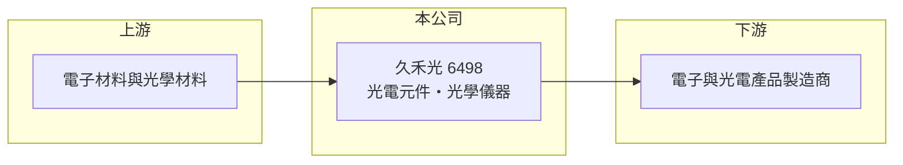

# 6498 久禾光

> 上櫃｜[[產業索引-光電業|光電業]]｜上市（櫃）日期 2025/05/20

# 第一章：企業模式與商業藍圖

> [!info] 撰寫說明
> 精簡版，由 Claude 依公開資料整理，架構比照 [[2330台積電]]，資料截至 2026-10-07。來源：nStock 久禾光公司簡介。公開資料有限。#待校對

久禾光電是 2025 年 5 月才上櫃的台中光電廠，規模小但毛利率高。

- **核心業務：** 公司登記主要經營電子零組件製造與光學儀器製造，屬光電產業；具體產品線本次未查到明細。
- **營收結構：** 本次未查到產品別營收比重。
- **營運據點：** 2003 年 11 月成立，總部位於台中市西屯區。
- **長期方向：** 上櫃後營收規模仍在擴大階段，2026 年前 8 月營收年增 17.14%；具體成長策略本次未查到。

# 第二章：護城河深度與競爭優勢

久禾光的毛利率在 4 成以上，顯示產品具利基性，但公開資訊不足以判斷護城河來源。

- **競爭優勢：** 2026 年第二季毛利率 44%、營益率 28.9%，獲利能力高於一般光電零組件廠，推估來自少量多樣的客製化產品。
- **主要對手：** 本次未查到公司自述的競爭對手，需參考公開說明書補充。
- **觀察重點：** 單月營收已轉為年減，觀察下半年訂單動能與高毛利率能否維持。

# 第三章：財務體質與盈利規模

資料日期：2026-10-07，以下數字是撰寫當時的快照；最新月營收、毛利率、累計 EPS 由自動排程寫在本筆記的屬性欄位（月營收、毛利率、累計EPS 等）。#待校對

久禾光營收規模小，但獲利率高並維持高配息。

- **營收規模：** 2026 年前 8 月累計營收 9.31 億元，年增 17.14%；8 月單月 0.96 億元，年減 19.26%。
- **獲利：** 2026 年第二季 EPS 1.85 元，[[毛利率]] 44%、[[營業利益率]] 28.9%。
- **財務特色：** 資本額 4.72 億元，2025 年度配發現金股利 4.5 元，近五年平均現金股利 2.62 元，nStock 標示最新現金[[殖利率]] 4.74%。

# 第四章：總體風險與地緣政治

久禾光的風險主要來自規模小與資訊透明度。

- **產業週期：** 光電零組件需求隨終端電子產品景氣波動，月營收已出現年減。
- **營運風險：** 規模小、產品與客戶可能集中（推估），單一客戶訂單變化對營收影響大。
- **其他風險：** 上櫃時間短，股價波動大；出口產品需留意匯率變化。

# 專有名詞解析

## 金融

- **[[毛利率]]**：營業毛利占營收的比例，反映產品的定價能力與成本控制。
- **[[營業利益率]]**：營業利益占營收的比例，反映扣除營業費用後的本業獲利能力。
- **[[殖利率]]**：每股現金股利除以股價，衡量以現價買進可領到的現金報酬。

# 核心供應鏈

- 上游：電子零件與光學材料供應商（推估）
- 下游／客戶：電子與光電產品製造商（推估）
- 同業：本次未查到，待補

## 最新新聞
<!-- news:start -->
<!-- news:end -->

## 相關連結
- [公開資訊觀測站](https://mopsov.twse.com.tw/mops/web/t05st03?step=1&firstin=1&co_id=6498)
- [Goodinfo](https://goodinfo.tw/tw/StockDetail.asp?STOCK_ID=6498)
- [Yahoo 股市](https://tw.stock.yahoo.com/quote/6498)
- [鉅亨網新聞](https://www.cnyes.com/twstock/6498/news)
