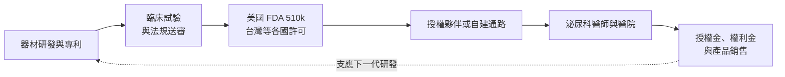
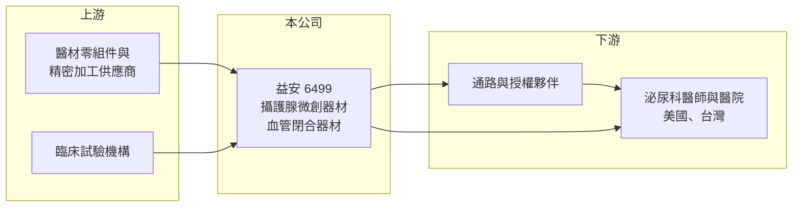

# 6499 益安

> 上櫃｜[[產業索引-生技醫療業|生技醫療業]]｜上市（櫃）日期 2016/07/27

# 第一章：企業模式與商業藍圖

> [!info] 撰寫說明
> 本文由 Claude 依公開資料整理，架構比照 [[2330台積電]] 的四章研究，資料截至 2026-10-08。財務數字來源：Goodinfo 年度經營績效頁（含 2026 年公告標題）、櫃買中心開放資料（基本資料、2026 年第二季資產負債與綜合損益、本益比殖利率）、財經媒體標題。公開資料有限：營收來源與產品比重未查得；標示「憑記憶」的產品與授權細節尚未比對原始文件。#待校對

在評估單一個股的長期投資價值時，首要步驟是拆解企業的底層獲利邏輯。本章針對益安生醫（股票代號：6499，以下簡稱益安）的商業模式進行定性分析，說明這家醫材研發公司如何從血管閉合器材轉向攝護腺微創治療，以及這種「研發先行、商業化在後」的模式有什麼特性。

## 一、核心定位：以創新醫材研發與授權為核心的公司

益安成立於 2012 年，2016 年 7 月上櫃，董事長兼總經理為張有德，實收資本額約 9.69 億元。公司定位是創新[[醫療器材]]的研發商，主要透過自行開發器材、取得各國上市許可，再以授權或合作夥伴商業化的方式取得收入。

益安早期的代表產品是血管閉合器材 Cross-Seal，用於心導管手術後封閉股動脈穿刺口，並曾授權日本醫材大廠泰爾茂（Terumo）在國際市場銷售（憑記憶，待校對）。2026 年 9 月，益安公告與泰爾茂簽訂 Cross-Seal 和解暨終止協議，代表這條授權關係正式結束，公司的發展重心轉向新一代產品。

## 二、事業板塊：攝護腺微創治療是新主軸

* **攝護腺微創醫材（Urocros 系統）：** 用於治療[[良性攝護腺肥大]]（BPH）的微創器材，搭配軟式膀胱鏡操作，目標是以門診等級的微創手術取代傳統刨除手術。依公司對外資訊，該系統已取得美國 [[FDA 510(k)]] 上市許可（2025 年，憑記憶，待校對），並於 2026 年美國泌尿科醫學會（AUA）年會發表。2026 年 8 月公司邀請國際 BPH 專家來台，同步啟動台灣上市的商業化準備。
* **血管閉合器材（Cross-Seal）：** 2026 年與泰爾茂終止協議後，這項產品未來的商業化方式尚待公司說明。
* **營收結構：** 本次未查得產品別營收比重，因此不放圓餅圖。2026 年上半年營收 2.21 億元，毛利率只有 13.3%，與一般創新醫材動輒六成以上的毛利率差距很大，顯示目前營收多數來自毛利較低的業務（推估，可能是子公司的經銷或代工，待校對）。

## 三、資本轉化邏輯：研發與臨床先行，授權與銷售在後

* **長期投入、晚期回收：** 醫材從開發到取得許可、再到醫師接受，往往需要數年。這段期間公司主要靠募資與既有資產支應研發，財報呈現長期虧損。
* **醫師採用曲線：** 微創器材即使取得許可，也需要訓練醫師、建立臨床證據與爭取保險給付，營收放量通常比取證晚一至數年。

## 四、企業長期藍圖

益安的長期方向是把攝護腺微創治療推向美國與台灣等市場，並以泌尿科為核心發展產品線。BPH 是中老年男性的常見疾病，市場規模大，若能建立醫師採用與保險給付，有機會成為長期營收來源。不過目前仍在商業化初期，能否成功取決於臨床證據、通路夥伴與給付進度。

# 第二章：護城河深度與競爭優勢

本章分析益安的競爭優勢，說明它在 BPH 微創治療市場面對哪些對手，以及這些優勢目前處於什麼階段。

## 一、護城河的核心組成要素

* **專利與法規許可：** 醫材取得 FDA 510(k) 等許可後，競爭者若要推出類似產品，也必須完成同樣的驗證與送審，這是醫材產業的基本門檻。益安的器材設計與專利是主要的無形資產。
* **臨床數據：** 微創治療要說服醫師改變手術習慣，需要長期療效與安全性的數據。率先累積臨床經驗的公司，在醫學會與醫師社群中較有話語權。
* **轉換成本仍低：** 由於產品仍在商業化初期，醫師尚未形成使用習慣，目前的護城河仍屬「潛在」而非「已實現」。

## 二、全球主要競爭對手格局

| 對手 | 主要產品 | 與益安的比較 |
|---|---|---|
| Teleflex（UroLift） | 攝護腺拉開植入物 | 已在美國建立大量醫師基礎與保險給付，是最主要的市場標竿 |
| Boston Scientific（Rezum） | 水蒸氣熱療 | 大型醫材集團，通路與資源遠大於益安 |
| Procept BioRobotics（Aquablation） | 水刀機器人手術 | 以機器人平台切入，定位較高階 |
| 傳統經尿道攝護腺刨除術（TURP） | 標準手術 | 仍是多數醫院的主流治療方式 |

## 三、優勢轉化：守得住、守不住與觀察重點

* **守得住：** 若臨床數據證明療效與恢復時間具優勢，器材有機會在門診微創市場取得一席之地。
* **守不住：** 面對國際大廠的通路與給付優勢，小型公司單獨推廣的難度很高，通常需要授權或併購合作。
* **觀察重點：** 美國首批醫院的採用情況、台灣上市時程、是否找到國際通路夥伴，以及 Cross-Seal 終止協議後的後續安排。

# 第三章：財務體質與盈利規模

資料日期：2026-10-08。數字取自 Goodinfo 年度經營績效頁與櫃買中心開放資料，表格是撰寫當時的快照；最新月營收、毛利率、累計 EPS 由自動排程寫在本筆記的屬性欄位（月營收、毛利率、累計EPS 等）。#待校對

財務報表是檢驗護城河是否真實存在的最終標準。對尚在商業化初期的醫材研發公司而言，重點在於虧損規模、現金是否足以支撐到產品放量，以及研發投入是否轉化為營收。

## 一、多年度表格

| 年度 | 營收（新台幣） | [[毛利率]] | [[營業利益率]] | EPS（元） | [[ROE]] |
|---|---|---|---|---|---|
| 2019 | 4.54 億 | 41.0% | -56.7% | -3.96 | -14.0% |
| 2020 | 1.23 億 | 37.6% | -278% | -2.91 | -6.93% |
| 2021 | 0.69 億 | 41.5% | -719% | 28.54 | 59.4% |
| 2022 | 2.98 億 | 62.6% | -164% | -4.95 | -12.7% |
| 2023 | 1.96 億 | 7.33% | -428% | -13.09 | -42.1% |
| 2024 | 2.93 億 | 28.5% | -302% | -8.74 | -44.6% |
| 2025 | 4.19 億 | 14.0% | -172% | -7.24 | -46.8% |
| 2026 上半年 | 2.21 億 | 13.3% | -123% | -2.54 | 未查得 |

* **營收與毛利率：** 營收在 0.7 億到 4.5 億元之間大幅波動，毛利率也在 7% 到 63% 之間跳動，代表營收組成不穩定，尚未有一項主力產品帶來規律收入。2020 至 2025 年營收年複合成長約 28%（推算），但基期很低。
* **營業虧損：** 營業利益率長期為大幅負值，2026 年上半年營業損失約 2.72 億元，營業費用約 3.01 億元，研發與推廣是主要支出。
* **2021 年的特殊獲利：** 2021 年營業虧損但 EPS 高達 28.54 元，代表當年有大額一次性業外收益（推估，性質待校對），不能視為本業獲利能力。

## 二、[[ROE]]、資本結構與研發強度

2021 至 2025 年平均 ROE 約 -17%（推算），若排除 2021 年的一次性收益，2022 至 2025 年平均約 -37%。2026 年第二季底總資產約 15.5 億元，其中流動資產約 10.8 億元；總負債約 2.82 億元，權益約 12.7 億元，負債比約 18%（櫃買中心資料）。保留盈餘累積虧損約 17.4 億元，公司過去主要靠股本與資本公積支應研發。以 2026 年上半年營業損失約 2.7 億元估算，流動資產可支應約兩年的營運（推算）。合併報表中有非控制權益，代表部分子公司有外部股東。

## 三、[[ROIC]] 與 [[WACC]]：價值創造利差

**ROIC 推算：** 2025 年營收 4.19 億元、營業利益率 -172%，營業損失約 7.21 億元，虧損無所得稅抵減。2026 年第二季底權益約 12.7 億元，有息負債以非流動負債約 1.18 億元推估，投入資本約 13.9 億元，ROIC 約 -52%（推算）。

**WACC 推算：** 台灣 10 年期公債殖利率取 1.75%、市場風險溢酬 6%、β 取研發型生技股常見值 1.2（未查得公司實際 β），股東權益成本約 8.95%。負債成本假設 2.5%、稅率 20%，稅後約 2.0%；權益約占 92%，WACC 約 8.4%（推算）。

**結論：** ROIC 為大幅負值，遠低於約 8% 的資金成本。這是研發型醫材公司在商業化前的常態，評價重點不在目前的報酬率，而在攝護腺器材能否在數年內放量，讓營收規模大到足以覆蓋研發與推廣費用。

# 第四章：總體風險與地緣政治

任何企業都無法脫離宏觀環境獨立存在。本章分析益安長期必須面對的商業化、法規與財務風險。

## 一、商業化與市場風險

* **醫師採用速度：** 微創醫材需要醫師訓練與臨床口碑累積，若採用速度不如預期，營收放量會延後，虧損期間拉長。
* **國際大廠競爭：** BPH 微創市場已有多家國際大廠，擁有成熟的業務團隊與保險給付，小型公司在推廣資源上明顯處於劣勢。
* **授權關係變動：** 2026 年與泰爾茂終止 Cross-Seal 協議，說明授權合作可能因策略或爭議而中止，未來新夥伴的條件仍不確定。

## 二、法規與給付風險

* **各國許可與給付：** 取得 FDA 510(k) 不等於取得保險給付，美國醫療保險的給付代碼與價格，會直接影響醫院採用意願。台灣上市也需經衛福部審查與健保給付評估。
* **醫材法規趨嚴：** 歐盟醫材法規（MDR）等新規範提高送審成本，進入新市場的時間與費用增加。

## 三、財務風險

* **持續虧損與增資：** 累積虧損已達 17 億元以上，若產品放量延後，未來可能需要[[現金增資]]，稀釋既有股東。
* **評價風險：** 股價淨值比約 6.19 倍（櫃買中心資料），市場已預先反映相當程度的成功預期，若商業化不如預期，評價修正幅度可能較大。

# 專有名詞解析

## 應用

- **[[醫療器材]]**：用於診斷、治療或監測疾病的儀器、耗材與植入物，上市前須取得各國主管機關許可。

## 金融

- **[[現金增資]]**：公司發行新股向股東或投資人募集現金，用於補充營運資金或投資，但會稀釋既有股東持股。
- **[[毛利率]]**：營業毛利占營收的比例，反映產品定價能力與生產成本控制。
- **[[營業利益率]]**：扣除營業費用後的營業利益占營收的比例，衡量本業整體獲利能力。
- **[[ROE]]**：股東權益報酬率，稅後淨利除以股東權益，衡量公司運用股東資金的效率。
- **[[ROIC]]**：投入資本報酬率，稅後營業利益除以股東權益與有息負債的合計，衡量本業對所有資金提供者的報酬。
- **[[WACC]]**：加權平均資金成本，依股東權益與負債的比重加權計算的資金成本，ROIC 高於它才代表創造價值。

## 產業

- **[[FDA 510(k)]]**：美國 FDA 的醫材上市前通報途徑，證明新器材與已上市器材實質相等後即可上市。
- **[[良性攝護腺肥大]]**：中老年男性常見的攝護腺增生，會壓迫尿道造成排尿困難，可用藥物、微創或手術治療。

# 核心供應鏈

## 1. 上游
- 醫材零組件、精密加工與滅菌包裝供應商（名稱未查得）
- 臨床試驗醫院與受託研究機構

## 2. 本公司
- 益安生醫：Urocros 攝護腺微創治療系統、Cross-Seal 血管閉合器材

## 3. 下游／客戶
- 美國與台灣的泌尿科醫師、醫院
- 前授權夥伴：泰爾茂（Terumo），2026 年 9 月簽訂和解暨終止協議

## 4. 同業
- 國際 BPH 微創器材：Teleflex（UroLift）、Boston Scientific（Rezum）、Procept BioRobotics
- 台灣醫材研發公司：[[4107邦特]]、[[6612奈米醫材]]

## 最新新聞
<!-- news:start -->
<!-- news:end -->

## 相關連結
- [公開資訊觀測站](https://mopsov.twse.com.tw/mops/web/t05st03?step=1&firstin=1&co_id=6499)
- [Goodinfo](https://goodinfo.tw/tw/StockDetail.asp?STOCK_ID=6499)
- [Yahoo 股市](https://tw.stock.yahoo.com/quote/6499)
- [鉅亨網新聞](https://www.cnyes.com/twstock/6499/news)
