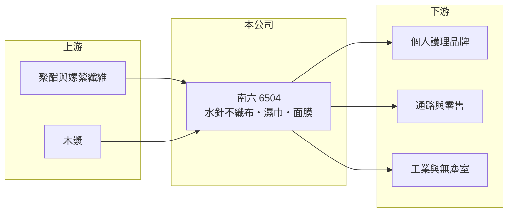

# 6504 南六

> 上市｜[[產業索引-其他業|其他業]]｜上市（櫃）日期 2013/05/07

# 第一章：企業模式與商業藍圖

> [!info] 撰寫說明
> 精簡版，由 Claude 依公開資料整理，架構比照 [[2330台積電]]，資料截至 2026-10-07。來源：winvest 營收快訊與公司資料。產品別營收比重、毛利率與營運據點未查到。#待校對

南六是水針不織布廠，並延伸到濕巾、面膜與保養品等下游成品。

- **核心業務：** 主要產品為[[水針不織布]]、水針木漿複合布、熱風與熱壓[[不織布]]，以及無塵擦拭布、家庭用擦拭布、地板拖布、嬰兒柔濕巾、美顏面膜、卸妝棉與乳液類保養品。
- **營收結構：** 產品別比重本次未查到；2026 年月營收約 5.4 億元。
- **營運據點：** 公司成立於 1978 年、2013 年上市，生產據點本次未查到。
- **長期方向：** 從不織布材料延伸到面膜與保養品等高附加價值成品，提高毛利（推估）。

# 第二章：護城河深度與競爭優勢

南六的優勢在於從布材到成品的垂直整合。

- **競爭優勢：** 自產水針不織布再加工成濕巾、面膜等成品，可掌握品質與成本，並提供客戶代工服務（推估）。
- **主要對手：** 國內外不織布與濕巾廠，例如 [[9919康那香]]，其他對手本次未查到。
- **觀察重點：** 2026 年獲利能否轉正並穩定、原料價格與產品售價的變化。

# 第三章：財務體質與盈利規模

資料日期：2026-10-07，以下數字是撰寫當時的快照；最新月營收、毛利率、累計 EPS 由自動排程寫在本筆記的屬性欄位（月營收、毛利率、累計EPS 等）。#待校對

南六營收穩定，但獲利在損益兩平附近徘徊。

- **營收規模：** 2026 年 6 月營收 5.44 億元（年增 10.13%）、8 月 5.39 億元（年增 4.36%）；1 至 8 月累計約 43.87 億元，年增 1.42%。
- **獲利：** 2026 年第二季 EPS -0.09 元，上半年累計 EPS 0.01 元；2025 年全年 EPS -1.09 元。[[毛利率]]本次未查到。
- **財務特色：** 資本額約 7.26 億元，市值約 26.64 億元；營收規模是股本的數倍，毛利率小幅變動就會明顯影響 EPS。

# 第四章：總體風險與地緣政治

南六的風險在於原料成本與價格競爭。

- **產業週期：** 不織布與濕巾屬民生消耗品，需求穩定，但疫情後市場供過於求，價格競爭激烈（推估）。
- **營運風險：** 獲利率薄，原料或能源成本上升會直接造成虧損；[[營運槓桿]]使獲利對產能利用率敏感。
- **其他風險：** 木漿、聚酯纖維等原料價格波動、匯率，以及中國同業的低價競爭。

# 專有名詞解析

## 金融

- **[[營運槓桿]]**：固定成本占比高時，營收小幅變動就會讓獲利大幅增減；營收萎縮時虧損也會被放大。
- **[[毛利率]]**：營業毛利占營收的比率，反映產品售價扣除直接成本後的獲利空間。

## 產業

- **[[不織布]]**：不經紡織、以纖維直接黏合或熱壓成型的布料，用於衛材、過濾與包裝。
- **[[水針不織布]]**：以高壓水柱使纖維互相纏結成布，觸感柔軟，用於濕巾、面膜與擦拭布。

# 核心供應鏈

- 上游：聚酯、嫘縈等纖維與木漿供應商（推估）
- 下游／客戶：個人護理品牌、零售通路、工業與無塵室客戶，名稱未揭露
- 同業：[[9919康那香]]，其他名稱未查到

## 最新新聞
<!-- news:start -->
<!-- news:end -->

## 相關連結
- [公開資訊觀測站](https://mopsov.twse.com.tw/mops/web/t05st03?step=1&firstin=1&co_id=6504)
- [Goodinfo](https://goodinfo.tw/tw/StockDetail.asp?STOCK_ID=6504)
- [Yahoo 股市](https://tw.stock.yahoo.com/quote/6504)
- [鉅亨網新聞](https://www.cnyes.com/twstock/6504/news)
