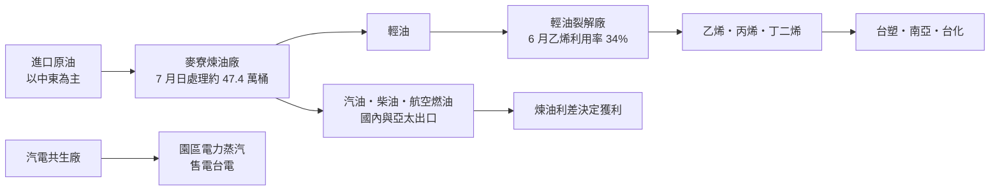
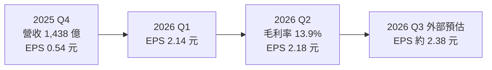
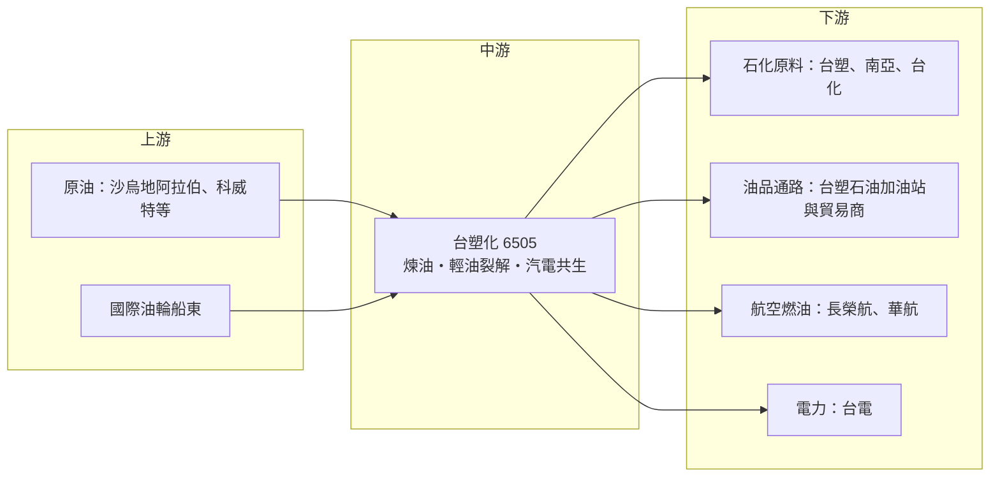

# 6505 台塑化

> 上市｜[[產業索引-油電燃氣業|油電燃氣業]]｜上市（櫃）日期 2003/12/26

# 第一章：企業模式與商業藍圖

> [!info] 撰寫說明
> 本文由 Claude 依公開資料整理，架構比照 [[2330台積電]] 的四章研究，資料截至 2026-10-07。財務數字來源：優分析、工商時報、自由時報、旺得富理財網、Money錢、鉅亨網 FactSet 整理（經轉載）、永豐金證券 AI 投資網、nstock、維基百科；產業描述為整理性內容，尚未逐條比對原始文件。#待校對

在評估單一個股的長期投資價值時，首要步驟是拆解企業的底層獲利邏輯。本章針對台塑石化（股票代號：6505，以下簡稱台塑化）的商業模式進行定性分析，說明它作為台塑集團「源頭」的角色、煉油與石化兩大事業如何此消彼長，以及 2026 年中東局勢如何讓它的獲利結構出現劇烈變化。

## 一、核心定位：台灣第一家民營煉油廠

台塑化於 1992 年 4 月 6 日核准設立，由 [[1301台塑]]、[[1326台化]]、[[1303南亞]] 共同出資，2003 年 12 月掛牌上市。依永豐金證券 AI 投資網的公司簡介，台塑化是台灣第一家民營石油煉製業者。公司的核心資產是雲林麥寮六輕園區的煉油廠、[[輕油裂解]]廠與[[汽電共生]]廠，營運項目包括油品、[[烯烴]]、電力與蒸汽。

台塑化在集團的角色可以從兩個面向理解：

* **能源供應者：** 把進口原油煉成汽油、柴油、航空燃油、燃料油等油品，在台灣與台灣中油分食國內市場，並大量出口到亞太地區。
* **集團原料源頭：** 把輕油送進裂解廠生產[[乙烯]]、丙烯、丁二烯等基本原料，再以管線供應台塑、南亞、台化做成塑膠與化纖原料。

## 二、事業板塊：煉油、烯烴與公用事業

本次未查得台塑化各事業的營收占比數字，因此不繪製營收結構圖，改以事業內容與 2026 年第二季的變化說明。

* **煉油（油品）：** 營收占比最高。產品包括汽油、柴油、航空燃油、液化石油氣與燃料油。旺得富 2026 年 7 月引述法人報告指出，第二季煉油營收季增 17%，主因[[荷莫茲海峽]]封鎖使出口油品利差擴大。
* **烯烴（石化）：** 輕油裂解生產乙烯、丙烯、丁二烯等，主要供應集團公司，也對外銷售。第二季烯烴營收季減 15%，反映下游需求弱、出貨遞延。
* **公用事業：** 麥寮汽電共生廠供應園區電力與蒸汽，並售電給台電。第二季公用事業營收季增 17%，受惠夏季電價與歲修完成。

## 三、資本轉化邏輯：煉油利差與開工率

* **煉油大好、烯烴疲弱：** Money錢 2026 年 9 月整理的營運數據顯示，台塑化 6 月原油處理量約 1,401.7 萬桶，相當於每日約 46.7 萬桶；7 月提高到每日約 47.4 萬桶；預估第三季煉油[[開工率]]約 87%。烯烴部分，6 月乙烯產能利用率僅 34%（前一年同期 60%），預估第三季約 42%。
* **[[煉油利差]]是核心變數：** 油品售價減去原油成本的差額決定煉油事業獲利，開工率高時營運槓桿明顯。
* **彈性調配：** 當煉油利差好、石化利差差時，台塑化會調整裂解廠進料與開工率，把資源轉向油品。

## 四、企業長期藍圖：平衡煉化與能源轉型

* **煉油與石化的平衡：** 依利差調整產品組合，在煉油與烯烴之間分散景氣風險。
* **集團上游供料：** 不論石化景氣好壞，台塑化都是集團三家公司的原料來源，具有穩定的內部需求。
* **能源轉型與減碳：** 汽電共生燃煤改燃氣、提高能效、發展低碳燃料，是因應台灣[[碳費]]與國際減碳規範的長期課題（未查得具體投資金額）。

# 第二章：護城河深度與競爭優勢

在長期價值投資中，「護城河」指企業抵禦競爭、維持超額利潤的保護機制。本章分析台塑化難以複製的資產、亞太煉油與石化市場的主要競爭對手，以及這些優勢在承平時期與危機時期分別能發揮多少作用。

## 一、護城河的核心組成要素

台塑化的護城河主要來自「難以複製的資產」，屬於「窄護城河」：

* **1. 大型煉化一體化園區：** 麥寮六輕擁有專用港口、儲槽、電廠與管線網路。台灣環保與土地條件已很難再核准同規模的新煉油廠，現有產能等於具有寡占地位。
* **2. 國內市場寡占：** 台灣油品市場主要由台塑化與台灣中油兩家供應，進口與新進者門檻很高。
* **3. 集團內需：** 烯烴產品透過管線直接供應台塑、南亞、台化，運輸成本低且需求穩定。

## 二、全球主要競爭對手格局

| 對手 | 定位 | 對台塑化的威脅 |
|---|---|---|
| 台灣中油 | 國營煉油廠 | 國內油品市場唯一同等規模對手，油價受政策影響 |
| SK 能源、GS Caltex、S-Oil | 南韓出口型煉油廠 | 在亞太油品出口市場直接競爭 |
| Reliance、新加坡煉油中心 | 印度與新加坡大型出口煉廠 | 規模大、成本低，影響區域利差 |
| 恆力石化、浙江石化、中石化 | 中國煉化一體化 | 中國恢復成品油出口會增加區域供給 |
| 美國乙烷裂解廠 | 以頁岩氣為原料的烯烴廠 | [[乙烷裂解]]原料成本明顯低於輕油裂解 |

## 三、優勢轉化：哪些守得住、哪些守不住

* **守得住：** 在供應中斷的時期，例如 2026 年中東戰事與荷莫茲海峽受阻，亞洲成品油供給受衝擊，汽柴油價格漲幅大於原油，台塑化以高開工率吃下利差擴大的好處，第二季 EPS 2.18 元。
* **守不住：** 烯烴面對美國乙烷裂解與中國新產能，成本與規模都不占優勢，2026 年乙烯產能利用率一度只有 34%。煉油在承平時期也只是賺取區域平均利差，2024 年營業利益率為 -0.10%。
* **觀察重點：** 亞洲煉油利差能否維持；中國成品油出口配額變化；烯烴開工率能否回升；以及油價下跌時的庫存損失。

# 第三章：財務體質與盈利規模

資料日期：2026-10-07。數字取自優分析、工商時報、旺得富理財網、Money錢、永豐金證券 AI 投資網與 nstock 整理，表格是撰寫當時的快照；最新月營收、毛利率、累計 EPS 由自動排程寫在本筆記的屬性欄位（月營收、毛利率、累計EPS 等）。#待校對

財務報表是檢驗護城河是否真實存在的最終標準。本章用三率、ROE、現金流與資本報酬，檢視台塑化從低利差週期到 2026 年利差爆發的獲利變化，並區分結構性與一次性因素。

## 一、獲利能力的基石：三率

| 項目 | 2024 全年 | 2025 全年 | 2026 Q1 | 2026 Q2 | 2026 上半年 |
|---|---|---|---|---|---|
| 營收（新台幣） | 6,638.2 億 | 6,261.6 億 | 約 1,620 億（推估） | 1,829.8 億 | 未查得 |
| [[毛利率]] | 1.55% | 3.52% | 未查得 | 13.9% | 15.25% |
| [[營業利益率]] | -0.10% | 1.74% | 未查得 | 12.51% | 13.74% |
| 稅後淨利 | 未查得 | 99.41 億 | 約 204 億 | 約 207.8 億 | 411.86 億 |
| EPS（元） | 0.63 | 1.04 | 2.14 | 2.18 | 4.32 |

* **推算說明：** 2026 年第一季營收為依第二季「季增 13%」反推的推估值；第一季淨利為上半年減第二季的推算值。
* **獲利跳升：** 2025 年第四季營收 1,438 億元、季減 12.1%，EPS 0.54 元；2025 年全年 EPS 1.04 元，為台塑四寶獲利冠軍。2026 年上半年 EPS 4.32 元，已是 2025 全年的四倍。
* **庫存損失：** 第二季認列約 32 億元[[存貨跌價損失]]，但煉油利差擴大仍使獲利優於市場預期。
* **後續動能：** 2026 年 7 月營收 748.21 億元，月增 17.5%、年增 32.35%。Money錢引述法人預估第三季 EPS 約 2.38 元、全年 EPS 上修至 8.4 元，屬外部預估。

## 二、ROE：資本效率

依永豐金證券 AI 投資網資料，台塑化 2022 至 2025 年 [[ROE]] 介於約 1.9% 至 6.8%，2026 年上半年已達 9.77%。公司負債比僅約 16.6%，財務結構保守，但大量資產投入在低周轉、低利差的煉化設施，景氣平淡時資本報酬偏低。

## 三、資本支出、自由現金流與股利

* **[[CapEx]]：** 未查得 2026 年資本支出總額。推估以設備維修、歲修、能效改善與減碳投資為主，因為台灣已難再新設大型煉油產能。
* **[[自由現金流]]：** 2026 年獲利大幅回升，營業現金流應同步改善（推估）；在缺乏大型擴產計畫下，現金多可用於配息。
* **股利：** 近五年現金股利為 2022 年 3.80 元、2023 年 1.10 元、2024 年 2.00 元、2025 年 0.80 元、2026 年 1.20 元，未配股票股利。股利跟隨前一年獲利調整，2026 年獲利大增，2027 年配息有機會提高（推估）。

## 四、[[ROIC]] 與 [[WACC]]：價值創造利差

2022 至 2025 年 ROE 僅個位數低段，推估 ROIC 長期低於或接近 WACC，煉化資產在承平時期難以創造超額報酬（具體數值未查得）。2026 年在利差爆發下 ROIC 明顯高於資金成本，但這主要來自地緣政治造成的供給中斷，屬於事件型利差。投資人應把 2026 年視為週期高點，而非新的常態水準。

# 第四章：總體風險與地緣政治

任何企業都無法脫離宏觀環境獨立存在，煉油業更是直接暴露在原油與地緣政治之下。本章分析台塑化未來必須面對的地緣政治、產業週期、營運與長期轉型風險。

## 一、地緣政治風險

* **中東戰事與荷莫茲海峽：** 台塑化原油主要從中東進口。2026 年荷莫茲海峽受阻雖使成品油利差擴大，但也造成原料供應風險與開工率下降，若衝突擴大，可能出現原油取得困難。
* **美伊關係：** Money錢列出的風險包括美伊緊張與原油價格上漲；若只有原油成本快速上升、成品油價格無法同步轉嫁，反而會產生成本與庫存風險。
* **兩岸風險：** 麥寮是台灣能源供應的關鍵設施，任何封鎖或衝突都會直接影響原油進口與產品出口。

## 二、產業週期與市場結構風險

* **煉油利差循環：** 利差受全球煉油產能、需求與突發事件影響，波動極大。優分析指出，中國恢復成品油出口後，利差繼續擴大的空間正在下降。
* **烯烴供過於求：** 美國乙烷裂解與中國新產能壓抑亞洲乙烯價格，烯烴事業短期難以好轉。
* **油價下跌的庫存損失：** 油價急跌時，高價原油庫存會造成存貨跌價損失。

## 三、營運環境的隱性風險

* **工安與環保：** 六輕曾多次發生火災與工安事故，也長期面臨空污、用水與地層下陷爭議。
* **電價與售電政策：** 汽電共生售電價格受政府能源政策影響。
* **歲修：** 煉油與裂解廠定期歲修會造成單季產量下降。

## 四、科技與法規演進風險

煉油是成熟技術，台塑化的風險不在技術落後，而在需求長期下降與碳成本上升。台灣碳費開徵，加上 [[EV]] 普及長期壓抑汽油需求，對煉油廠是結構性挑戰。若未來國際碳規範加嚴，以化石燃料為主的資產可能面臨價值減損壓力。

# 專有名詞解析

## 應用

- **[[EV]]**：電動車，以電池與馬達取代內燃機，長期會壓抑汽油需求。

## 金融

- **[[存貨跌價損失]]**：存貨的市價低於帳面成本時必須認列的損失，油價急跌時煉油廠常出現此項。
- **[[自由現金流]]**：營業活動現金流減去資本支出，代表企業可自由用於配息、還債或併購的現金。

## 產業

- **[[煉油利差]]**：成品油售價與原油成本之間的差額，是煉油廠獲利的核心指標，英文常稱 crack spread。
- **[[輕油裂解]]**：把輕油在高溫下裂解成乙烯、丙烯等基本石化原料的製程，台灣俗稱的「輕裂」。
- **[[烯烴]]**：乙烯、丙烯、丁二烯等含雙鍵的基本石化原料，是塑膠與合成橡膠的起點。
- **[[乙烯]]**：最重要的基本石化原料，用來生產聚乙烯、PVC 等塑膠，乙烯價格常被視為石化景氣指標。
- **[[乙烷裂解]]**：以天然氣中的乙烷為原料生產乙烯，美國頁岩氣使其原料成本遠低於輕油裂解。
- **[[汽電共生]]**：同時產生電力與蒸汽的發電方式，可提高能源效率，六輕園區用它供應自身用電與蒸汽。
- **[[開工率]]**：實際處理量占設計產能的比例，煉油與石化廠的獲利高度取決於此數字。
- **[[荷莫茲海峽]]**：波斯灣通往外海的唯一水道，全球大量原油運輸經過此處，封鎖會衝擊油價與供給。
- **[[碳費]]**：政府依企業碳排放量收取的費用，台灣已開徵，高耗能產業成本將上升。

# 核心供應鏈

## 1. 上游：原油與原料
- 原油：中東產油國（沙烏地阿拉伯、科威特等）及其他產油地區
- 原油運輸：國際油輪船東

## 2. 中游：台塑化本身與集團夥伴
- 煉油、輕油裂解、汽電共生：台塑化
- 股東與集團互供：[[1301台塑]]、[[1303南亞]]、[[1326台化]]

## 3. 同業競爭者
- 台灣：台灣中油
- 亞洲出口煉廠：SK 能源、GS Caltex、S-Oil、Reliance
- 中國煉化：恆力石化、浙江石化、中石化

## 4. 下游：客戶
- 石化原料：[[1301台塑]]、[[1303南亞]]、[[1326台化]]
- 油品通路：台塑石油加油站、國內外油品貿易商
- 航空燃油：[[2618長榮航]]、[[2610華航]]
- 電力：台灣電力公司

## 最新新聞
<!-- news:start（自動產生，請勿手動編輯此範圍） -->
- 2026-10-06 📰 媒體 08:10｜鉅亨速報 - Factset 最新調查：台塑化(6505-TW)目標價調升至108元，幅度約5.88%｜[鉅亨網](https://news.cnyes.com/news/id/6622248)

完整紀錄：[[6505台塑化 新聞]]
<!-- news:end -->

## 相關連結
- [公開資訊觀測站](https://mopsov.twse.com.tw/mops/web/t05st03?step=1&firstin=1&co_id=6505)
- [Goodinfo](https://goodinfo.tw/tw/StockDetail.asp?STOCK_ID=6505)
- [Yahoo 股市](https://tw.stock.yahoo.com/quote/6505)
- [鉅亨網新聞](https://www.cnyes.com/twstock/6505/news)
