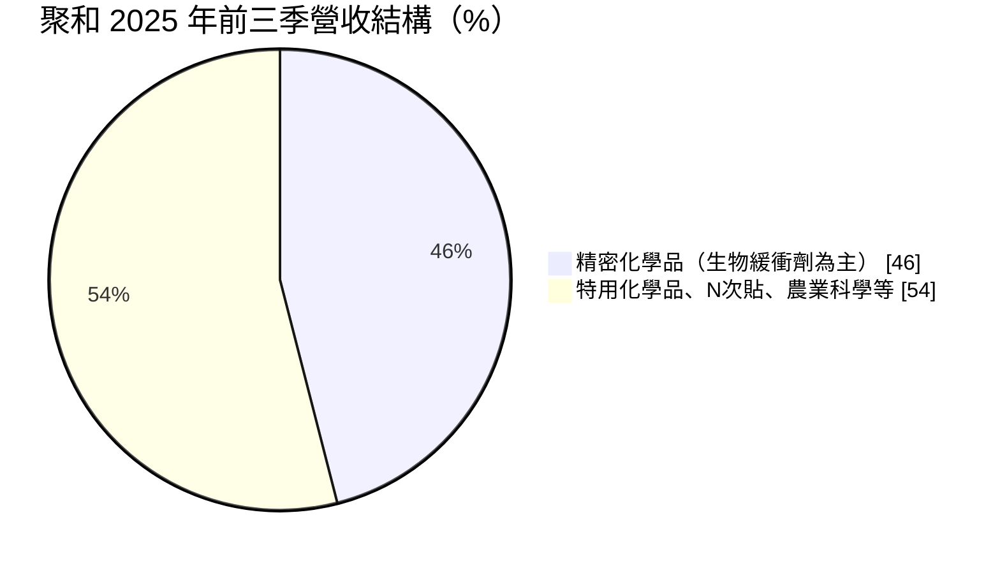
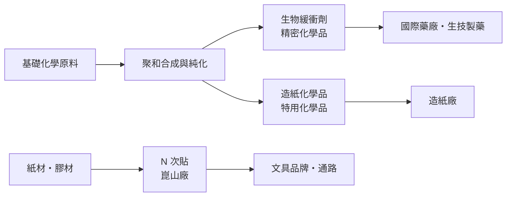
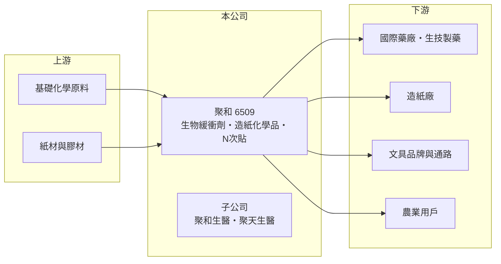

# 6509 聚和

> 上櫃｜[[產業索引-化學工業|化學工業]]｜上市（櫃）日期 2004/04/12

# 第一章：企業模式與商業藍圖

> [!info] 撰寫說明
> 本文由 Claude 依公開資料整理，架構比照 [[2330台積電]] 的四章研究，資料截至 2026-10-08。財務數字來源：Goodinfo 年度經營績效頁、nstock 公司資料頁（業務與股利）、富果研究 2025 年 11 月法說會整理、Yahoo 股市與旺得富報導標題；產業描述為整理性內容，尚未逐條比對原始文件。#待校對

在評估單一個股的長期投資價值時，首要步驟是拆解企業的底層獲利邏輯。本章說明聚和國際（股票代號：6509，以下簡稱聚和）這家老牌化學品公司，如何把獲利重心從造紙化學品與文具，轉移到生物製藥用的高純度緩衝劑。

## 一、核心定位：多角化的特用與精密化學品公司

聚和成立於 1975 年，營運總部位於高雄大發工業區，業務範圍涵蓋藥用、工業用及造紙用化學原料，以及辦公文具用品的製造與買賣。乍看之下產品線很分散，實際上可以理解為「一個核心、多個現金業務」：核心是[[生物緩衝劑]]，其他業務提供穩定但成長有限的營收。

生物緩衝劑是生物製藥製程中用來維持酸鹼值穩定的高純度化學品。抗體藥物、疫苗與細胞培養都必須在精確的酸鹼環境中進行，緩衝劑的純度與批次一致性直接影響藥品品質，因此藥廠對供應商的審核非常嚴格。依富果研究整理的 2025 年 11 月法說會，精密化學品（以生物緩衝劑為核心）在 2025 年前三季占營收近 46%，卻貢獻約 70% 的獲利，是聚和最重要的價值來源。

## 二、產品板塊

第一塊是精密化學品，以生物緩衝劑為主，客戶是國際大型藥廠與生技製藥供應鏈。第二塊是特用化學品，以造紙化學品為主，屬於成熟產業，需求跟著紙業景氣走。第三塊是 N 次貼，也就是可重複黏貼的便條紙，公司自稱是全球第二大製造商。第四塊是農業科學，以「高盟芽」品牌的生物肥料為主。另外有子公司聚和生醫經營個人保養與居家防護產品，聚天生醫則是長期性的新藥開發投資。

## 三、資本轉化邏輯：以高毛利精密化學品帶動整體利潤率

聚和的生產據點包括台灣、中國常熟（化學品）、崑山（N 次貼）與印尼（化學品），業務據點在台北與英國。這個布局讓公司可以就近服務亞洲的造紙與文具客戶，英國據點則對應歐洲的製藥客戶。

從財務結果看，生物緩衝劑比重提高是聚和利潤率改善的主因：毛利率從 2017 年的 21.1% 升到 2025 年的 32.3%，營業利益率從 5.07% 升到 16.7%。這是產品組合由低毛利的造紙化學品與文具，逐步轉向高毛利精密化學品的結果。

## 四、企業長期藍圖：屏東新廠

聚和的長期成長引擎是屏東科學園區新廠。依 2025 年 11 月法說會，第一期投資約 35 億元，土地採租賃，2026 年第一季動工，2027 年底前完成工程與試產，2028 年開始貢獻營收。新廠主要擴充生物緩衝劑產能，並全面升級為綠色製程。公司為此辦理現金增資籌資。國際大藥廠對供應鏈的永續、減碳要求日益嚴格，綠色製程不只是環保投資，也是爭取藥廠長期合約的條件。這項投資的規模接近公司股東權益的七成，是改變公司長期結構的關鍵決策。

# 第二章：護城河深度與競爭優勢

「護城河」指企業抵禦競爭、維持超額利潤的保護機制。本章分析聚和在生物緩衝劑與其他業務的競爭位置。

## 一、聚和護城河的核心組成要素

第一是藥廠供應鏈的認證。生物製藥用原料一旦登錄在藥品的製程文件中，更換供應商需要重新驗證並向主管機關申報變更，成本與時間都很高。這讓已經進入藥廠供應鏈的緩衝劑供應商擁有很高的客戶黏著度，也是精密化學品能貢獻七成獲利的原因。

第二是高純度化學合成的長期經驗。聚和有五十年的化學品生產經驗，從工業級化學品延伸到藥用等級，累積了純化、品質管理與法規文件的能力。

第三是綠色製程的差異化。公司在法說會表示，綠色製程可以和競爭對手形成區隔。若屏東新廠能以更低的碳排生產緩衝劑，在藥廠重視供應鏈減碳的趨勢下，將成為新的競爭優勢。

## 二、全球主要競爭對手格局

| 對手 | 定位 | 對聚和的威脅 |
|---|---|---|
| 默克（MilliporeSigma）、Avantor、Thermo Fisher 等生技原料大廠 | 生物製藥原料一站式供應商 | 產品線完整，與藥廠有全面合作關係 |
| 中國與印度緩衝劑製造商 | 成本低、擴產快 | 在一般等級緩衝劑以價格競爭 |
| 3M 等文具大廠 | 便條紙品牌龍頭 | 掌握品牌與通路，N 次貼以代工為主 |
| 國際造紙化學品廠 | 規模大 | 壓縮造紙化學品的利潤 |

## 三、優勢轉化：守得住／守不住／觀察重點

守得住的是已通過藥廠驗證的生物緩衝劑訂單。藥品生命週期長，原料一旦導入，往往可以穩定供應多年。

守不住的是造紙化學品與文具這類成熟業務的成長性。它們能提供穩定營收，但難以帶來更高的利潤率；2021 至 2025 年整體營收大致持平在 45 億至 55 億元，代表非核心業務沒有成長。

長期觀察重點是屏東新廠能否如期在 2028 年貢獻營收、新產能能否順利通過藥廠驗證，以及生物製藥產業的長期需求成長。

# 第三章：財務體質與盈利規模

資料日期：2026-10-08。數字取自 Goodinfo 年度經營績效、富果研究法說會整理與 nstock 股利資料，表格是撰寫當時的快照；最新月營收、毛利率、累計 EPS 由自動排程寫在本筆記的屬性欄位（月營收、毛利率、累計EPS 等）。#待校對

財務報表是檢驗護城河是否真實存在的最終標準。本章用五年的三率、ROE 與資本報酬，檢視聚和產品組合轉型的成果。

## 一、獲利能力的基石：三率

| 年度 | 營收（新台幣） | [[毛利率]] | [[營業利益率]] | EPS（元） | [[ROE]] |
|---|---|---|---|---|---|
| 2021 | 47.3 億 | 27.8% | 11.9% | 2.48 | 14.2% |
| 2022 | 54.6 億 | 27.7% | 13.5% | 3.46 | 17.9% |
| 2023 | 45.2 億 | 27.8% | 12.0% | 2.48 | 11.8% |
| 2024 | 47.5 億 | 30.6% | 13.9% | 2.71 | 11.2% |
| 2025 | 48.8 億 | 32.3% | 16.7% | 2.87 | 11.0% |

這五年的特色是「營收持平、利潤率上升」。2021 至 2025 年營收年複合成長率只有約 0.8%（推算），但毛利率從 27.8% 升到 32.3%、營業利益率從 11.9% 升到 16.7%。拉長到 2017 年看，營收從 31.9 億元成長到 48.8 億元，營業利益率從 5.07% 升到 16.7%，獲利成長遠快於營收，反映高毛利的精密化學品比重持續提高。

## 二、[[ROE]]：資本效率

近五年平均 ROE 約 13.2%（推算）。2024 年以後 ROE 降到 11% 左右，主因是現金增資讓股本由 17.3 億元增加到 19.9 億元，每股淨值由 21.51 元升到 25.29 元，權益基數擴大稀釋了報酬率，也讓 2025 年前三季 EPS 低於前一年同期。依法說會，負債比約 31%，財務結構穩健。

## 三、股利與現金流

依 nstock，近五年平均現金股利約 1.32 元，2024 年度配發 1.32 元、配發率約 49%，2025 年度配發 1.39 元。法說會表示營業活動現金流健康，在持續資本支出的同時仍有餘裕償還借款。屏東新廠 35 億元的投資集中在 2026 至 2027 年，這段期間自由現金流可能轉負（推估），配發率也可能維持在五成左右以保留資金。

## 四、[[ROIC]] 與 [[WACC]]：價值創造利差

**ROIC 推算：** 2025 年營業利益約 8.15 億元（48.8 億 × 16.7%），稅後約 6.52 億元。股東權益約 52.6 億元（每股淨值 26.7 元 × 約 1.97 億股），依 ROE 11% 與 ROA 7.47% 推算總負債約 25 億元，與法說會揭露的負債比約 31% 相符，假設其中一半為有息負債約 12 億元（推估），投入資本約 65 億元，ROIC 約 10%（推算）。

**WACC 推算：** 假設台灣 10 年期公債殖利率 1.75%、市場風險溢酬 6%、β 取化學品同業常見值 0.8，股東權益成本約 6.6%。負債成本假設 2.5%，稅後 2.0%，權益占資本約 81%（推估），WACC 約 5.7%（推算）。

**結論：** 聚和的 ROIC 約 10%，高於約 5.7% 的資金成本，代表公司持續創造經濟價值，且利差隨產品組合改善而擴大。屏東新廠是下一個考驗：35 億元投入後，若新產能能以同樣的高毛利填滿，ROIC 可望維持；若驗證與放量延後，2028 年前的折舊與利息會暫時壓低報酬率。

# 第四章：總體風險與地緣政治

任何企業都無法脫離宏觀環境獨立存在。本章分析聚和長期必須面對的產業、營運與法規風險。

## 一、產業週期與市場結構

生物製藥產業長期成長，但短期會有庫存調整，例如疫情期間藥廠大量備貨後，曾出現長達一兩年的去化期。緩衝劑雖然是必需品，訂單仍會隨藥廠的庫存與生產計畫波動。造紙化學品與文具業務則面臨紙業與辦公用品需求的長期萎縮。

## 二、建廠執行風險

屏東新廠投資約 35 億元，規模接近公司股東權益的七成。工程延誤、試產不順或藥廠驗證時間拉長，都會讓資本支出提前、營收延後，期間的折舊與資金成本會壓低獲利。新產能也需要足夠訂單填滿，否則[[產能利用率]]偏低會拉低毛利率。

## 三、地緣政治與匯率

生產據點分布在台灣、中國與印度尼西亞，中國廠區面臨當地政策與環保法規變化的風險。生物緩衝劑主要外銷歐美藥廠，以外幣計價，新台幣升值會壓縮獲利。

## 四、法規演進

藥用原料受各國藥品生產規範管理，法規變更或稽核缺失都可能影響出貨。另一方面，歐美藥廠逐步要求供應商揭露並降低碳排，對已投入綠色製程的聚和是機會，但也代表持續的合規成本。

# 專有名詞解析

## 金融

- **[[產能利用率]]**：實際產出占總產能的比例，固定成本高的製造業毛利率高度取決於此數字。
- **[[ROIC]]**：投入資本報酬率，稅後營業利益除以股東權益加有息負債，衡量本業運用資本的效率。
- **[[WACC]]**：加權平均資金成本，股東與債權人要求報酬的加權平均，ROIC 高於它才代表創造價值。

## 產業

- **[[生物緩衝劑]]**：生物製藥製程中維持酸鹼值穩定的高純度化學品，用於抗體、疫苗與細胞培養，藥廠對品質與批次一致性要求極高。
- **[[造紙化學品]]**：造紙過程中用來提高紙張強度、防水性或改善製程效率的化學添加劑。
- **[[綠色製程]]**：以較少能源、溶劑與廢棄物生產化學品的製程設計，國際藥廠逐步把它列為供應商評選條件。

# 核心供應鏈

## 1. 上游：原料
- 基礎化學原料、紙材與膠材供應商（未查得具體名稱）

## 2. 中游：聚和與同業
- 生技原料大廠：默克（MilliporeSigma）、Avantor、Thermo Fisher
- 中國與印度緩衝劑製造商；便條紙品牌 3M

## 3. 下游：應用產業
- 生物製藥：國際大型藥廠（公司未具名）
- 造紙廠、文具品牌與通路、農業用戶

## 最新新聞
<!-- news:start -->
<!-- news:end -->

## 相關連結
- [公開資訊觀測站](https://mopsov.twse.com.tw/mops/web/t05st03?step=1&firstin=1&co_id=6509)
- [Goodinfo](https://goodinfo.tw/tw/StockDetail.asp?STOCK_ID=6509)
- [Yahoo 股市](https://tw.stock.yahoo.com/quote/6509)
- [鉅亨網新聞](https://www.cnyes.com/twstock/6509/news)
