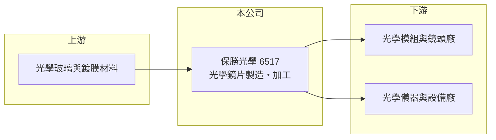

# 6517 保勝光學

> 上櫃｜[[產業索引-光電業|光電業]]｜上市（櫃）日期 2022/12/15

# 第一章：企業模式與商業藍圖

> [!info] 撰寫說明
> 精簡版，由 Claude 依公開資料整理，架構比照 [[2330台積電]]，資料截至 2026-10-07。來源：nStock 保勝光學公司簡介、winvest 營收快訊。公開資料有限。#待校對

保勝光學是 2022 年底上櫃的光學鏡片廠，以鏡片製造與代工加工為主。

- **核心業務：** 主要經營各類[[光學鏡片]]的製造、加工與委託加工，並提供製造方面的諮詢服務，內外銷皆有。
- **營收結構：** 本次未查到產品別或應用別營收比重。
- **營運據點：** 生產與總部據點本次來源未列明細。
- **長期方向：** 2026 年下半年營收明顯成長，7、8 月分別年增 95.02% 與 70.09%，成長來源本次未查到說明。

# 第二章：護城河深度與競爭優勢

保勝光學屬於少量多樣的光學加工廠，優勢在精密加工技術與客製能力（推估）。

- **競爭優勢：** 光學鏡片的研磨、拋光與鍍膜需要累積製程經驗，通過客戶認證後訂單較為穩定（推估）。
- **主要對手：** 國內光學元件同業如 [[6668中揚光]]、[[6742澤米]]，以及日本與中國的光學加工廠。
- **觀察重點：** 下半年營收高成長能否延續，以及成長來自哪些應用。

# 第三章：財務體質與盈利規模

資料日期：2026-10-07，以下數字是撰寫當時的快照；最新月營收、毛利率、累計 EPS 由自動排程寫在本筆記的屬性欄位（月營收、毛利率、累計EPS 等）。#待校對

保勝光學營收規模小，2026 年營收成長且維持獲利。

- **營收規模：** 2026 年 1 至 8 月累計營收 3.21 億元；8 月營收 0.47 億元，月減 17.41%、年增 70.09%；7 月營收 5,673.2 萬元。
- **獲利：** 2026 年第二季 EPS 0.59 元，[[毛利率]] 38.76%。
- **財務特色：** 資本額 3.06 億元，2025 年度配發現金股利 1.5 元，近五年平均現金股利 1.24 元。

# 第四章：總體風險與地緣政治

保勝光學的風險在於規模小與終端應用的景氣波動。

- **產業週期：** 光學鏡片需求跟隨消費電子、安控與工業設備等終端景氣，訂單具[[長鞭效應]]。
- **營運風險：** 營收規模小，少數大訂單即可讓月營收大幅波動，客戶集中度可能較高（推估）。
- **其他風險：** 光學玻璃等原料價格與匯率變動。

# 專有名詞解析

## 金融

- **[[毛利率]]**：營業毛利占營收的比例，反映產品的定價能力與成本控制。
- **[[長鞭效應]]**：終端需求的小幅變動沿供應鏈往上游傳遞時被逐級放大，造成上游庫存與訂單劇烈波動。

## 產業

- **[[光學鏡片]]**：以玻璃或塑膠製成、用來折射或聚焦光線的元件，用於相機、投影與各類光學儀器。

# 核心供應鏈

- 上游：光學玻璃與鍍膜材料供應商（推估）
- 下游／客戶：光學模組、鏡頭與儀器廠商（推估）
- 同業：[[6668中揚光]]、[[6742澤米]]

## 最新新聞
<!-- news:start -->
<!-- news:end -->

## 相關連結
- [公開資訊觀測站](https://mopsov.twse.com.tw/mops/web/t05st03?step=1&firstin=1&co_id=6517)
- [Goodinfo](https://goodinfo.tw/tw/StockDetail.asp?STOCK_ID=6517)
- [Yahoo 股市](https://tw.stock.yahoo.com/quote/6517)
- [鉅亨網新聞](https://www.cnyes.com/twstock/6517/news)
