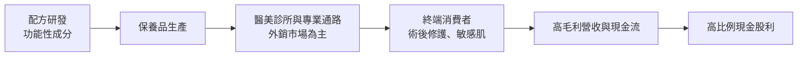
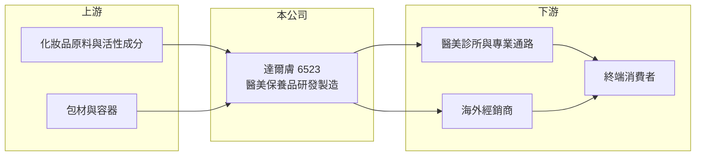

# 6523 達爾膚

> 上櫃｜[[產業索引-生技醫療業|生技醫療業]]｜上市（櫃）日期 2016/06/16

# 第一章：企業模式與商業藍圖

> [!info] 撰寫說明
> 本文由 Claude 依公開資料整理，架構比照 [[2330台積電]] 的四章研究，資料截至 2026-10-08。財務數字來源：Goodinfo 年度經營績效頁、櫃買中心開放資料（基本資料、2026 年第二季資產負債與綜合損益、本益比殖利率）、工商時報與旺得富 2025 年上半年財報報導標題。公開資料有限：產品別與地區別營收比重未查得；標示「憑記憶」的客戶與通路描述尚未比對原始文件。#待校對

在評估單一個股的長期投資價值時，首要步驟是拆解企業的底層獲利邏輯。本章針對達爾膚生醫科技（股票代號：6523，以下簡稱達爾膚）的商業模式進行定性分析，說明這家醫美保養品公司為什麼能長期維持七成毛利率與四成營業利益率，以及這種高獲利結構依賴哪些條件。

## 一、核心定位：專注醫美級保養品的高毛利公司

達爾膚成立於 2003 年，2016 年 6 月上櫃，董事長兼總經理為吳奕叡，實收資本額約 4.50 億元。公司專注於[[醫美保養品]]，也就是以醫學美容診所、專業通路為主要銷售場景的保養品，產品強調術後修護、敏感肌保養等功能訴求。

達爾膚的商業模式兼具研發配方、生產與品牌經營，並以外銷市場為主要營收來源（憑記憶，中國與亞洲市場為主，待校對）。2025 年第二季公司因新台幣兌美元快速升值認列匯兌評價損失，顯示公司持有相當比例的外幣資產或外幣收入，外銷導向的特性在財報上清楚可見。

## 二、事業板塊：營收比重未查得

* **營收結構：** 本次未查得產品別或地區別的營收比重，因此不放圓餅圖。從財務數據看，2019 至 2025 年營收在 7.65 億至 12.4 億元之間，毛利率穩定在 63% 至 72%，代表產品組合長期維持高附加價值。
* **獲利結構：** 2022 至 2024 年營業利益率達 40% 至 43%，在保養品公司中極為少見。一般品牌保養品需要大量廣告與通路費用，營業利益率多在 10% 至 20%；達爾膚的高營業利益率，代表它的銷售主要透過專業通路或品牌客戶完成，行銷費用負擔較輕（推估）。

## 三、資本轉化邏輯：輕資產、高現金、高配息

* **輕資產：** 保養品生產設備投資不高，2026 年第二季底非流動資產只有約 3.3 億元，總資產約 16.4 億元中有約 13.2 億元是流動資產（櫃買中心資料），公司的價值主要來自配方、品牌與客戶關係，而非廠房。
* **高配息：** 本益比殖利率資料顯示最近一期現金股利為每股 10 元，高於 2025 年 EPS 7.78 元，代表公司把多年累積的現金大方發還股東。

## 四、企業長期藍圖

達爾膚的長期課題是讓醫美保養品的成長延續到新市場與新通路。醫美市場的長期需求來自人口老化、外觀管理意識提高與醫美療程普及，術後修護產品會隨療程量增加。不過 2025 年起營收出現衰退，2026 年上半年營收 4.79 億元，較 2025 年同期約 5.7 億元明顯下滑，公司需要新產品或新市場來恢復成長。

# 第二章：護城河深度與競爭優勢

本章分析達爾膚的競爭優勢，說明它在醫美保養品市場的護城河從何而來，以及哪些部分容易受到競爭侵蝕。

## 一、護城河的核心組成要素

* **專業通路的信任：** 醫美保養品透過醫師或專業人員推薦，消費者購買時看重的是「醫師說好用」，品牌信任一旦建立，回購率高，價格敏感度也較低。這是達爾膚能維持七成毛利率的根本原因。
* **配方與功能訴求：** 術後修護產品需要溫和、低刺激且有效的配方，並通過安全性測試。長期累積的配方經驗與產品口碑，是新品牌難以短期複製的。
* **低費用結構：** 營業利益率長期維持在 30% 以上，代表公司不需要靠大量廣告推動銷售，這種費用結構本身就是競爭力。

## 二、主要競爭對手格局

| 對手 | 定位 | 與達爾膚的比較 |
|---|---|---|
| 國際醫美保養品牌（如理膚寶水、雅漾等藥妝品牌） | 藥局與醫美通路 | 品牌知名度高、通路廣，是醫美保養市場的標竿 |
| [[1786科妍]] | 玻尿酸填充劑與醫美產品 | 同屬醫美產業，但以醫材注射劑為主 |
| [[4137麗豐-KY]]、[[6666羅麗芬-KY]] | 專業美容保養品 | 以美容院與專業通路為主，市場重疊於中國與台灣 |
| [[6574霈方]] | 保養品品牌與醫美服務 | 同樣結合保養品與醫美，但以台灣自有通路為主 |
| 中國本土功效性護膚品牌 | 功效型保養品 | 價格與電商行銷能力強，是外銷市場的主要競爭壓力 |

## 三、優勢轉化：守得住、守不住與觀察重點

* **守得住：** 專業通路的品牌信任與高毛利率。即使營收衰退，2025 年毛利率仍有 69%、營業利益率 36.6%，代表定價能力沒有明顯流失。
* **守不住：** 營收規模。2024 年營收 12.4 億元後連續兩年下滑，顯示外銷市場的需求或競爭環境出現變化，單靠既有產品難以維持成長。
* **觀察重點：** 新產品與新市場的拓展成效、毛利率能否守在 65% 以上，以及高配息政策能否延續。

# 第三章：財務體質與盈利規模

資料日期：2026-10-08。數字取自 Goodinfo 年度經營績效頁與櫃買中心開放資料，表格是撰寫當時的快照；最新月營收、毛利率、累計 EPS 由自動排程寫在本筆記的屬性欄位（月營收、毛利率、累計EPS 等）。#待校對

財務報表是檢驗護城河是否真實存在的最終標準。本章用七年的三率、ROE 與資本報酬，檢視達爾膚高毛利模式的穩定性。

## 一、獲利能力的基石：三率

| 年度 | 營收（新台幣） | [[毛利率]] | [[營業利益率]] | EPS（元） | [[ROE]] |
|---|---|---|---|---|---|
| 2019 | 10.1 億 | 69.4% | 23.2% | 4.26 | 10.7% |
| 2020 | 7.65 億 | 67.4% | 31.0% | 14.68 | 34.1% |
| 2021 | 11.1 億 | 62.8% | 34.0% | 6.58 | 16.8% |
| 2022 | 9.27 億 | 71.0% | 40.2% | 7.55 | 22.2% |
| 2023 | 11.4 億 | 71.6% | 43.1% | 9.43 | 28.3% |
| 2024 | 12.4 億 | 70.7% | 42.3% | 10.57 | 32.5% |
| 2025 | 11.7 億 | 69.0% | 36.6% | 7.78 | 24.9% |
| 2026 上半年 | 4.79 億 | 65.4% | 24.2% | 2.20 | 未查得 |

* **[[毛利率]]：** 七年間毛利率在 63% 至 72% 之間，波動很小，代表產品定價能力穩定。2026 年上半年降到 65.4%，需觀察是否為產品組合或價格調整造成。
* **[[營業利益率]]：** 從 2019 年的 23% 提升到 2023 年的 43%，之後回落到 2026 年上半年的 24%。營收下滑時固定費用的比重上升，營業利益率的波動比毛利率大。
* **營收趨勢：** 2019 至 2025 年營收年複合成長率約 2.5%（推算），屬於低成長；2020 年 EPS 14.68 元明顯高於營業獲利水準，當年應有大額業外收益（推估）。

## 二、[[ROE]]：資本效率

2021 至 2025 年平均 ROE 約 24.9%（推算），在台灣生技醫療公司中屬於頂尖水準。2026 年第二季底總負債約 3.71 億元、權益約 12.7 億元，負債比約 23%，非流動負債僅約 0.26 億元，幾乎沒有財務槓桿，高 ROE 完全來自本業的高利潤率。每股淨值 28.28 元，股價淨值比約 3.15 倍，本益比約 13.5 倍（櫃買中心資料）。

## 三、股利與自由現金流

公司長期維持高配息，最近一期現金股利每股 10 元，殖利率約 11%（櫃買中心資料）。由於資本支出需求低，營業現金流大部分可轉為自由現金流，長期為正（推估，具體金額未查得）。不過現金股利高於當年 EPS 的發放方式，代表部分股利來自過去累積的盈餘，不宜視為可長期維持的水準。

## 四、[[ROIC]] 與 [[WACC]]：價值創造利差

**ROIC 推算：** 2025 年營收 11.7 億元、營業利益率 36.6%，營業利益約 4.28 億元，扣除 20% 稅率後約 3.43 億元。2026 年第二季底權益約 12.7 億元，有息負債以非流動負債約 0.26 億元推估，投入資本約 13.0 億元，ROIC 約 26%（推算）。若扣除帳上大量現金，實際營運資本的報酬率會更高。

**WACC 推算：** 台灣 10 年期公債殖利率取 1.75%、市場風險溢酬 6%、β 取消費型醫美股常見值 0.8（未查得公司實際 β），股東權益成本約 6.55%。負債成本假設 2.5%、稅後約 2.0%；權益約占 98%，WACC 約 6.5%（推算）。

**結論：** ROIC 約 26%，比約 6.5% 的資金成本高出近 20 個百分點，達爾膚長期明顯創造經濟價值，這是專業通路品牌信任在財報上的具體呈現。後續風險在於營收衰退若持續，利差會隨營業利益率下滑而收窄。

# 第四章：總體風險與地緣政治

任何企業都無法脫離宏觀環境獨立存在。本章分析達爾膚長期必須面對的市場、匯率與法規風險。

## 一、地緣政治與海外市場

* **外銷市場集中：** 公司以外銷為主（憑記憶，中國與亞洲市場比重高，待校對），兩岸關係、中國消費景氣與當地化妝品法規變化，都會直接影響營收。
* **中國本土品牌崛起：** 中國功效性護膚品牌近年快速成長，憑藉價格與電商行銷優勢搶占市場，外資與台灣品牌的市占面臨壓力。

## 二、產業週期與市場結構

* **醫美療程景氣：** 醫美保養品的需求跟隨醫美療程量，消費景氣轉弱時，療程與術後保養支出會同步減少。
* **營收成長停滯：** 2025 至 2026 年營收連續衰退，若無新產品或新市場，高獲利可能隨規模縮小而下降。

## 三、營運環境的隱性風險

* **匯率：** 2025 年第二季新台幣快速升值造成匯兌評價損失，外幣資產與收入比重高，使獲利對匯率敏感。
* **客戶或通路集中：** 若主要通路或經銷商集中於少數對象，任一方的策略改變都可能造成營收大幅波動（推估）。
* **化妝品法規：** 台灣與中國對化妝品的成分、功效宣稱與備案規定持續趨嚴，功效型產品需要更多測試與文件，增加上市成本與時間。

# 專有名詞解析

## 金融

- **[[毛利率]]**：營業毛利占營收的比例，反映產品定價能力與生產成本控制。
- **[[營業利益率]]**：扣除營業費用後的營業利益占營收的比例，衡量本業整體獲利能力。
- **[[ROE]]**：股東權益報酬率，稅後淨利除以股東權益，衡量公司運用股東資金的效率。
- **[[ROIC]]**：投入資本報酬率，稅後營業利益除以股東權益與有息負債的合計，衡量本業對所有資金提供者的報酬。
- **[[WACC]]**：加權平均資金成本，依股東權益與負債的比重加權計算的資金成本，ROIC 高於它才代表創造價值。

## 產業

- **[[醫美保養品]]**：以醫學美容診所與專業通路為主要銷售場景的保養品，強調術後修護、低刺激等功能訴求。

# 核心供應鏈

## 1. 上游
- 化妝品原料、活性成分與包材供應商（名稱未查得）

## 2. 本公司
- 達爾膚生醫：醫美保養品配方研發、生產與品牌經營

## 3. 下游／客戶
- 醫美診所與專業通路
- 海外經銷商（以中國與亞洲為主，憑記憶，待校對）

## 4. 同業
- 醫美與專業保養：[[1786科妍]]、[[4137麗豐-KY]]、[[6666羅麗芬-KY]]、[[6574霈方]]
- 國際藥妝品牌：理膚寶水、雅漾

## 最新新聞
<!-- news:start -->
<!-- news:end -->

## 相關連結
- [公開資訊觀測站](https://mopsov.twse.com.tw/mops/web/t05st03?step=1&firstin=1&co_id=6523)
- [Goodinfo](https://goodinfo.tw/tw/StockDetail.asp?STOCK_ID=6523)
- [Yahoo 股市](https://tw.stock.yahoo.com/quote/6523)
- [鉅亨網新聞](https://www.cnyes.com/twstock/6523/news)
