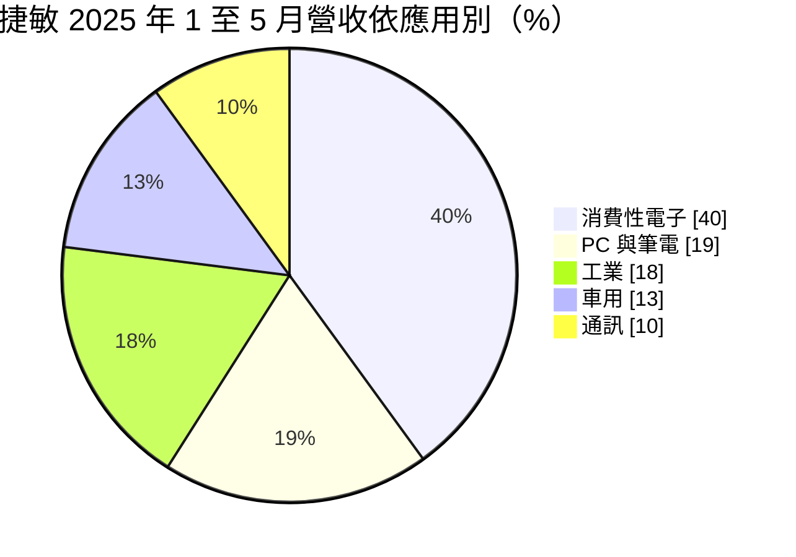
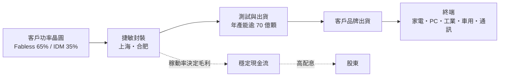
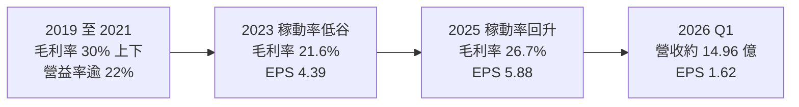
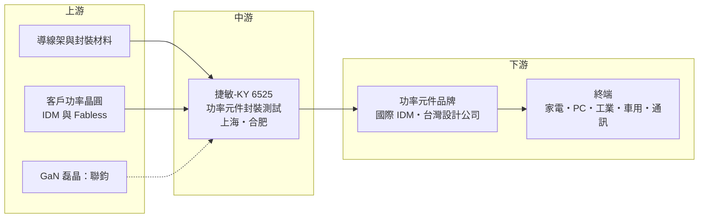

# 6525 捷敏-KY

> 上市｜[[產業索引-半導體業|半導體業]]｜上市（櫃）日期 2016/04/12

# 第一章：企業模式與商業藍圖

> [!info] 撰寫說明
> 本文由 Claude 依公開資料整理，架構比照 [[2330台積電]] 的四章研究，資料截至 2026-10-08。財務數字來源：Goodinfo 年度經營績效頁、MoneyDJ 資產負債表與現金流量表、Yahoo 股市公司基本資料、富果研究 2025 年 6 月法說會整理、優分析、理財周刊報導；產業描述為整理性內容，尚未逐條比對原始文件。#待校對

在評估一家公司的長期價值時，第一步是看懂它在產業鏈中的位置。本章針對捷敏-KY（股票代號：6525，以下簡稱捷敏）的商業模式進行定性分析，說明一家專做功率元件封裝的代工廠，如何靠大量、標準化的生產與 IDM 委外趨勢，維持穩定的獲利與高配息。

## 一、核心定位：專注功率元件的封裝測試代工

捷敏成立於 1998 年，註冊地在海外，2016 年在台灣上市，董事長為鄭祝良，總經理為湯彥鏘。依理財周刊報導，捷敏的母公司是光通訊與磊晶廠 [[3450聯鈞]]。公司的業務是[[功率半導體]]的封裝測試服務，對象包括高壓與低壓 [[MOSFET]]、[[IGBT]]、二極體與功率模組。

功率元件和一般邏輯晶片不同，它要承受大電流與高電壓，工作時會發熱。封裝的任務是把晶片固定在金屬框架上、接出電極、包覆保護，並讓熱能有效散出。功率元件的封裝形式以[[導線架]]類封裝為主，技術門檻不像先進封裝那麼高，但對散熱、可靠度與成本控制要求極嚴格。捷敏專注這個領域，屬於專業的委外封測代工廠（[[OSAT]]）。

依 2025 年 6 月法說會資料，捷敏的生產基地在中國上海嘉定與安徽合肥，台灣分公司負責接單。全年產能超過 70 億顆，其中上海約占 71%、合肥約占 29%，員工約 2,000 人。

## 二、終端應用板塊：消費性為主，車用與工業為輔

依法說會資料，2025 年前五個月的營收結構如下：

* **消費性電子：** 冷氣、照明與家電的電源與馬達控制元件，是最大宗的應用。
* **PC 與筆電：** 包括伺服器、印表機與硬碟的電源元件。
* **工業：** 馬達、太陽能與風力發電的功率轉換元件，單價與毛利通常較好。
* **車用：** 車載充電器與逆變器等元件，對可靠度要求最高。
* **通訊：** 手機與 5G 基地台的電源元件。

依客戶類型，[[Fabless]] IC 設計公司約占 65%，[[IDM]] 約占 35%；依地區，台灣客戶占四成以上，中國約 25%，日韓約 25%，歐美約 10%。碳化矽（[[SiC]]）封裝約占 3% 至 4%，以 1200 伏特以上的車用高功率產品為主。

## 三、資本轉化邏輯：規模、稼動率與成本

* **稼動率是獲利關鍵：** 封裝廠的設備與人力成本相對固定，稼動率越高，每顆元件分攤的成本越低。依法說會資料，捷敏的稼動率由 2024 年第一季的 55% 至 60% 回升到 2025 年第一季的近 70%，毛利率同期由 20% 升到 24%。公司表示滿載約為 90%。
* **IDM 委外是長期成長動能：** 國際功率元件大廠過去多在自家工廠封裝，近年為了降低成本、分散產能，逐步把成熟封裝委外。法說會資料提到，一家美國 IDM 因地緣政治要求把產能移往東南亞，並出售後段封測廠，可能釋出更多委外訂單。IDM 委外比重每提高一點，捷敏的潛在市場就擴大一點。
* **低負債、高配息：** 封裝產能已建置完成多年，捷敏沒有銀行借款，資本支出相對營業現金流不高，因此能長期維持高配息。

## 四、企業長期藍圖：第三代半導體與高價值應用

* **SiC 與 [[GaN]] 封裝：** 捷敏與客戶共同開發 SiC 模組，應用鎖定 5G、工業與車用；GaN 方面，母公司聯鈞在竹南生產 GaN 磊晶片，再交由捷敏封測。不過法說會也提到，車用需求平淡，SiC 處於觀望，GaN 的採用仍有限，這兩項屬於長期布局。
* **AI 伺服器與散熱相關：** 理財周刊報導，捷敏的成長動能來自 [[AI伺服器]]電源架構升級，以及車用與無人機市場的散熱相關封測訂單。
* **提高高價值產品比重：** 公司策略是把資源集中在高附加價值產品，提高工業與車用占比，改善整體產品組合與毛利率。

# 第二章：護城河深度與競爭優勢

護城河是企業抵禦競爭、長期維持超額利潤的機制。本章分析捷敏在功率元件封測市場的競爭優勢、主要對手，以及這些優勢在中國同業擴產下能守住多少。

## 一、捷敏護城河的核心組成要素

功率封測是成熟、標準化的產業，捷敏的護城河屬於「成本與信任型」，由三個要素構成：

* **1. 專注帶來的規模與成本優勢：** 捷敏只做功率元件封測，年產能超過 70 億顆。專注單一領域讓它在機台配置、材料採購與製程良率上累積經驗，單位成本低於把功率封裝當作副業的綜合型封測廠。
* **2. 客戶驗證與品質紀錄：** 功率元件的失效可能造成設備燒毀，客戶在選擇封測廠時重視長期品質紀錄。捷敏服務國際 IDM 與台灣設計公司多年，車用與工業產品都要經過客戶認證，一旦導入不會輕易更換。
* **3. 財務穩健與股東回報紀律：** 沒有負債、現金充裕，讓捷敏在景氣低谷時仍能維持營運與配息，在價格戰中也比財務槓桿高的對手更有耐力。

## 二、全球主要競爭對手格局

| 對手 | 定位 | 對捷敏的威脅 |
|---|---|---|
| 長電科技、華天科技、通富微電 | 中國大型綜合封測廠，政策支持 | 規模龐大，在中國市場具價格優勢 |
| 中國功率元件 IDM 自有封裝 | 華潤微、士蘭微等自建後段產能 | 中國本土客戶傾向內部封裝 |
| [[3711日月光投控]] | 全球最大封測集團 | 綜合實力強，可承接高階功率模組 |
| [[2441超豐]] | 台灣導線架類封測廠 | 在台灣設計公司客群有重疊 |
| 國際 IDM 自有後段廠 | 英飛凌、安森美等 | 若 IDM 選擇擴充自有產能，委外訂單會減少 |

## 三、優勢轉化：哪些市場守得住、哪些守不住

* **守得住：** 國際 IDM 的委外訂單與台灣設計公司的長期合作。這些客戶重視品質與交期穩定，捷敏多年的合作紀錄是主要優勢。
* **守不住：** 中國本土市場的一般型號價格。中國同業產能擴張快，法說會也提到公司正在觀察中國同業的競爭。2023 年毛利率降到 21.6%，就反映了稼動率下滑與價格壓力。
* **觀察重點：** 第一，IDM 委外是否如預期擴大；第二，車用與工業比重能否提升；第三，SiC 與 GaN 封裝能否在 2027 年以後形成有意義的營收；第四，生產基地全部在中國，若客戶要求「中國以外」產能，捷敏是否需要另建海外據點。

# 第三章：財務體質與盈利規模

資料日期：2026-10-08。數字取自 Goodinfo 年度經營績效、MoneyDJ 財務報表與富果研究法說會整理，表格是撰寫當時的快照；最新月營收、毛利率、累計 EPS 由自動排程寫在本筆記的屬性欄位（月營收、毛利率、累計EPS 等）。#待校對

財務報表是檢驗護城河是否真實存在的最終標準。本章用多年度數據檢視捷敏在功率元件景氣循環中的獲利穩定度與資本效率。

## 一、獲利能力的基石：三率

| 年度 | 營收（億元） | [[毛利率]] | [[營業利益率]] | EPS（元） | [[ROE]] |
|---|---|---|---|---|---|
| 2019 | 34.6 | 31.3% | 23.0% | 5.15 | 18.7% |
| 2020 | 37.5 | 32.1% | 24.5% | 5.31 | 18.4% |
| 2021 | 47.6 | 29.6% | 22.8% | 6.65 | 21.5% |
| 2022 | 52.2 | 24.0% | 16.6% | 7.21 | 22.0% |
| 2023 | 44.2 | 21.6% | 14.1% | 4.39 | 13.3% |
| 2024 | 46.7 | 22.7% | 14.6% | 5.15 | 15.3% |
| 2025 | 53.3 | 26.7% | 19.6% | 5.88 | 16.5% |

資料來源：Goodinfo 合併報表年度經營績效。股本七年間維持 12.9 億元，EPS 可直接比較。

* **[[毛利率]]：** 捷敏的毛利率在 21.6% 至 32.1% 之間，對封測代工廠而言屬於不錯的水準。2022 年營收創新高但毛利率下滑，推估與原物料與人力成本上升有關；2025 年毛利率回升到 26.7%，主要是稼動率改善。
* **[[營業利益率]]：** 營業利益率長期維持在 14% 以上，即使 2023 年景氣低谷也有 14.1%。營業費用占營收比重低，是代工廠精簡管理的特徵。
* **長期成長：** 2019 年至 2025 年營收年複合成長率約 7.5%（推算），2021 年至 2025 年約 2.9%（推算）。成長速度不快，但每年都維持獲利，是一家「穩定型」的封測廠。

## 二、[[ROE]]：資本效率

捷敏近 5 年（2021 至 2025 年）平均 ROE 約 17.7%（推算），景氣最差的 2023 年也有 13.3%。在沒有任何銀行借款的情況下維持這個水準，代表本業的資本報酬相當健康。依 MoneyDJ 資料，2025 年底股東權益約 46.95 億元，負債約 21.27 億元，主要是應付帳款與其他營運負債，有息負債僅有約 0.64 億元的租賃負債。

## 三、資本支出與自由現金流

* **[[CapEx]]：** 依 MoneyDJ 季度現金流量表加總，2025 年購置設備約 4.19 億元，約占營收 8%，2026 年上半年約 1.84 億元。
* **[[自由現金流]]：** 2025 年營業現金流約 12.96 億元，扣除資本支出後自由現金流約 8.77 億元（推算），大於當年發放的現金股利約 5.42 億元。2025 年底帳上現金約 18.68 億元。
* **股利政策：** 法說會資料指出，2024 年度現金配發率超過 80%，上市以來平均現金殖利率超過 5%。依現金流量表，2025 年發放現金股利約 5.40 億元、2026 年第二季發放約 6.43 億元，以約 1.29 億股計算，每股約 4.2 元與 5.0 元（推算），約占前一年度 EPS 的 81% 與 85%。高配息、低負債是捷敏長期最鮮明的財務特色。

## 四、[[ROIC]] 與 [[WACC]]：價值創造利差

* **ROIC（推算）：** 2025 年營業利益約 10.45 億元（營收 53.3 億元 × 營業利益率 19.6%），稅後約 8.36 億元（稅率依題設 20%；實際生產基地在中國，適用稅率可能不同）。投入資本約 47.6 億元（2025 年底股東權益 46.95 億元加上租賃負債約 0.64 億元），ROIC 約 17.6%（推算）；若扣除帳上現金 18.68 億元，約 29%。
* **WACC（推算）：** 無風險利率取 1.75%，市場風險溢酬 6%，β 取封測同業常見值 1.0（未查得公司實際 β），股東權益成本約 7.75%。公司沒有銀行借款，WACC 約 7.8%（推算）。考量營運據點全在中國的地緣風險，投資人可能要求更高的風險溢酬，WACC 實際可能落在 8% 至 9%（推估）。
* **解讀：** ROIC 約 17.6%，比 WACC 高出約 9 至 10 個百分點，代表捷敏長期在替股東創造價值。即使 2023 年低谷，以營業利益率 14.1% 推算的 ROIC 也在 12% 上下，仍高於資金成本。這種「低谷也能賺過資金成本」的特性，是成熟產業中具成本優勢企業的典型表現。

# 第四章：總體風險與地緣政治

任何企業都無法脫離宏觀環境獨立存在。本章分析捷敏長期必須面對的地緣政治、產業週期、營運與技術風險。

## 一、地緣政治風險

* **生產基地全在中國：** 捷敏的上海與合肥廠是全部產能所在。美中對立升溫後，部分國際客戶要求供應鏈分散到中國以外，若這個趨勢擴大到功率元件，捷敏可能面臨訂單轉移，或需要投資海外新廠。
* **關稅與出口管制：** 封裝在中國完成的元件，若最終產品出口美國，可能受到關稅或原產地規定影響。法說會提到 2025 年部分訂單有因應關稅的提前拉貨，這類需求不具持續性。
* **兩岸關係：** 公司在台上市、生產在中國，兩岸關係變化可能影響營運與資金調度。

## 二、產業週期與市場結構風險

* **功率元件景氣循環：** 消費性與 PC 合計約占六成，這兩個市場的庫存調整會直接影響稼動率。2023 年稼動率降到五成多，毛利率與 EPS 同步下滑。
* **中國同業擴產：** 中國功率半導體產業在政策支持下大舉擴產，封測價格長期面臨下行壓力。
* **車用需求放緩：** 電動車成長放緩，車用功率元件需求一度平淡，SiC 封裝的放量時程可能延後。

## 三、營運環境的隱性風險

* **人力與成本：** 中國勞動成本逐年上升，封測又屬於勞力與設備並重的產業，成本上升若無法轉嫁，毛利率會受壓。
* **母公司策略：** 母公司聯鈞的發展方向會影響捷敏在 GaN 等新業務的定位。
* **高配息與再投資的取捨：** 高配息對股東有利，但若未來需要建立海外產能或大舉投入第三代半導體，資金需求可能與配息政策衝突。

## 四、科技演進風險

功率元件正從矽基走向碳化矽與氮化鎵，封裝形式也從傳統導線架封裝走向雙面散熱、銅片連接（Clip）與功率模組。這些新封裝需要新的設備與製程能力，若捷敏轉型速度慢，可能在高階市場被綜合型封測廠或 IDM 自有後段廠拉開差距。另一方面，矽基 MOSFET 在家電、PC 與工業的大量應用仍會長期存在，傳統功率封裝的需求不會在短期內消失，捷敏的現有業務仍有穩定的基本盤。

# 專有名詞解析

## 半導體

- **[[功率半導體]]**：負責轉換與控制電力的半導體元件，例如 MOSFET、IGBT，用於電源供應器、馬達與電動車。
- **[[MOSFET]]**：金氧半場效電晶體，最常見的電源開關元件，用電壓控制電流通斷，幾乎所有電子產品的供電電路都會用到。
- **[[IGBT]]**：絕緣閘雙極電晶體，適合高電壓、大電流的開關元件，常用於變頻家電、工業馬達與電動車。
- **[[OSAT]]**：委外封裝測試代工廠，替 IC 設計公司與 IDM 進行晶片封裝與測試。
- **[[導線架]]**：承載晶片並把電訊號引出的金屬框架，是功率元件與傳統封裝的關鍵材料。
- **[[IDM]]**：整合元件製造商，從設計、製造到封測都自己做的半導體公司，例如英飛凌、德州儀器。
- **[[Fabless]]**：無晶圓廠的 IC 設計公司，只負責設計與銷售，製造交給晶圓代工與封測廠。
- **[[SiC]]**：碳化矽，耐高壓、耐高溫的寬能隙半導體材料，用於電動車與高階電源。
- **[[GaN]]**：氮化鎵，開關速度快、體積小的寬能隙半導體材料，用於快充與資料中心電源。
- **[[功率模組]]**：把多顆功率元件與驅動電路封裝在一起的模組，用於變頻器、電動車與再生能源。

## 應用

- **[[AI伺服器]]**：搭載 GPU 或 AI 加速器、用於訓練與推論的伺服器，電源與散熱需求遠高於一般伺服器。

## 金融

- **[[產能利用率]]**：實際生產量占總產能的比例，封測廠的毛利率高度取決於此數字。
- **[[自由現金流]]**：營業活動現金流減去資本支出，代表企業可自由用於配息、還債或併購的現金。

# 核心供應鏈

## 1. 上游：材料與客戶晶圓
- 導線架等封裝材料：台灣供應商包括 [[6548長科]]，與捷敏的實際採購關係未查得
- 母公司：[[3450聯鈞]]（在竹南生產 GaN 磊晶片，交由捷敏封測）

## 2. 中游：捷敏與同業
- 捷敏：上海嘉定與安徽合肥兩個生產基地
- 同業：[[3711日月光投控]]、[[2441超豐]]；中國的長電科技、華天科技、通富微電

## 3. 下游：客戶
- 國際 IDM 與台灣功率元件設計公司，公司未公開客戶名稱（未查得）。台灣功率元件設計公司包括 [[6435大中]]、[[8261富鼎]]、[[5299杰力]] 等，與捷敏的實際往來未查得。

## 最新新聞
<!-- news:start（自動產生，請勿手動編輯此範圍） -->
- 2026-10-06 📰 媒體 18:50｜營收速報 - 捷敏-KY(6525)9月營收5.95億元年增率高達30.03％｜[鉅亨網](https://news.cnyes.com/news/id/6622888)

完整紀錄：[[6525捷敏-KY 新聞]]
<!-- news:end -->

## 相關連結
- [公開資訊觀測站](https://mopsov.twse.com.tw/mops/web/t05st03?step=1&firstin=1&co_id=6525)
- [Goodinfo](https://goodinfo.tw/tw/StockDetail.asp?STOCK_ID=6525)
- [Yahoo 股市](https://tw.stock.yahoo.com/quote/6525)
- [鉅亨網新聞](https://www.cnyes.com/twstock/6525/news)
