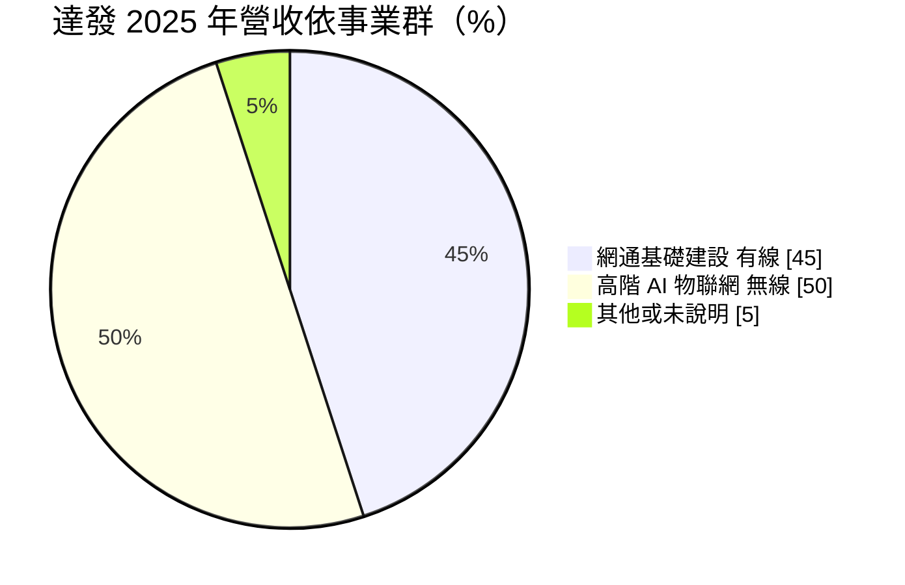
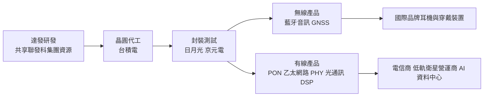
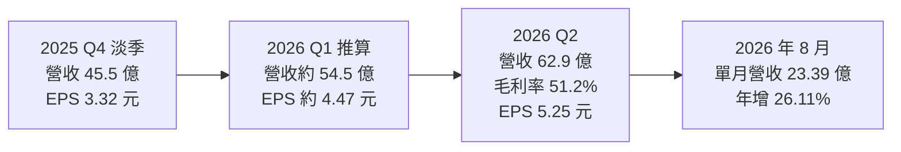
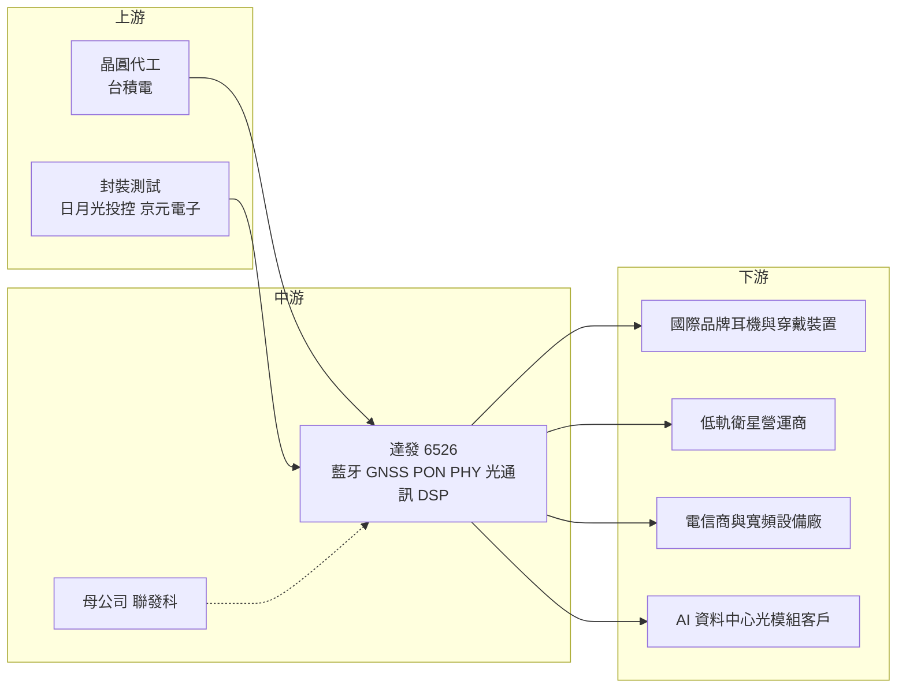

# 6526 達發

> 上市｜[[產業索引-半導體業|半導體業]]｜上市（櫃）日期 2023/10/19

# 第一章：企業模式與商業藍圖

> [!info] 撰寫說明
> 本文由 Claude 依公開資料整理，架構比照 [[2330台積電]] 的四章研究，資料截至 2026-10-07。財務數字來源：達發 2025 年第三季、第四季法說會整理（富果研究）、2025 年財報與 2026 年第二季財報報導（經濟日報、聯合新聞網）、2026 年第二季法說報導（工商時報）、旺得富、Yahoo 股市公司基本資料、winvest 營收快訊；產業描述為整理性內容，尚未逐條比對原始文件。#待校對

在評估單一個股的長期投資價值時，首要步驟是拆解企業的底層獲利邏輯。本章針對達發科技（股票代號：6526，英文 Airoha，以下簡稱達發）的商業模式進行定性分析，說明這家聯發科集團的通訊晶片公司，如何把營收重心從藍牙耳機轉向寬頻、乙太網路與 AI 光通訊等基礎建設。

## 一、核心定位：聯發科旗下的通訊與物聯網 IC 設計公司

達發成立於 2001 年 8 月 14 日，總部位於新竹縣竹北市，2023 年 10 月 19 日掛牌上市，董事長為謝清江，是 [[2454聯發科]] 集團旗下的 IC 設計公司。達發屬於 [[Fabless]] 模式，晶片委由晶圓代工廠生產，主要業務分為「無線通訊晶片」與「固網通訊晶片」兩大類。

達發的產品多半不是消費者直接看得到的品牌，而是藏在藍牙耳機、運動手錶、光纖數據機、網通設備與[[低軌衛星]]地面接收設備裡的關鍵晶片。這個定位有兩個商業意義：

* **集團內的專業分工：** 在聯發科集團內扮演「通訊與物聯網專業晶片」的角色，與母公司的手機、Wi-Fi 晶片形成互補，並可共享晶圓代工產能、[[IP]] 與研發資源。
* **有線與無線兼備：** 同時具備 [[PON]]、乙太網路 [[PHY]]、光通訊 [[DSP]]、藍牙與 [[GNSS]] 技術，能提供整合方案。

## 二、終端應用板塊：有線與無線各半

依富果研究整理，2025 年網通基礎建設事業群比重從 35% 提升到 45%，高階 AI 物聯網事業群從 55% 降到 50%；工商時報對 2026 年第二季法說的報導則指兩者各約占一半。下圖以 2025 年口徑繪製，未說明的部分列為其他：

* **藍牙音訊：** 達發是國際品牌真無線耳機的主要晶片供應商之一。工商時報報導，6 奈米藍牙平台與大品牌合作，目標年底前完成投片；公司也在擴展助聽器與穿戴裝置應用。
* **衛星定位（GNSS）：** 用於運動手錶、穿戴裝置與車用定位。
* **寬頻 PON：** 10G PON 營收年增近一倍，25G PON 預計 2027 年量產；歐洲市場持續推進。
* **乙太網路：** 1G 與 2.5G PHY 晶片。依旺得富報導，達發自 2020 年布局低軌衛星市場，乙太網路與 GNSS 晶片 2023 年開始供應主要衛星營運商，到 2025 年有一家客戶成為達發最大的單一乙太網路晶片客戶。新的低功耗 10G PHY 預計 2026 年底推出。
* **光通訊 DSP：** 工商時報報導，光通訊業務預估 2026 年營收年增超過 400%，目前以單通道 50G [[PAM4]] DSP 為主力，100G 與 200G 方案持續推進。依富果研究，光通訊營收占比預期從 2025 年的低個位數百分比提升至 2026 年的中個位數百分比；光通訊與乙太網路合計預期接近全公司營收的二成。

## 三、資本轉化邏輯：輕資產設計、跨市場出貨

* **委外製造：** 達發沒有自有晶圓廠，晶片主要委由晶圓代工廠生產並由封測廠封裝。
* **策略投資與併購：** 富果研究整理提到，達發在乙太網路方案上與聯發科整合，並持有工業網通相關公司約 20% 股權，另透過收購取得 [[PoE]] 晶片技術。
* **高毛利、高研發：** 毛利率穩定在五成以上，但研發費用占比高，營業利益率約一成多到一成五。

## 四、企業長期藍圖：從消費性走向基礎建設

* **降低消費景氣依賴：** 把營收重心從藍牙耳機等消費性產品，轉向光通訊、乙太網路、寬頻等基礎建設，降低季節性波動。
* **切入 AI 資料中心：** 以光通訊 DSP 與高速 [[SerDes]]（富果研究提到 100G SerDes 預計 2026 年中推出）切入 AI 資料中心的光模組市場。
* **低軌衛星與機上連網：** 擴大衛星地面接收設備與機上連網的應用。
* **先進製程藍牙晶片：** 以 6 奈米藍牙平台提升效能與功耗，鞏固品牌客戶。

# 第二章：護城河深度與競爭優勢

在長期價值投資中，「護城河」指企業抵禦競爭、維持超額利潤的保護機制。本章分析達發的護城河構成、各產品線的國內外競爭對手，以及作為後進者切入光通訊的勝算。

## 一、達發護城河的核心組成要素

達發的護城河屬於「窄到中等」，由四個要素組成：

* **1. 聯發科集團的資源：** 在晶圓代工產能、IP、研發人才與客戶關係上可以共享集團資源，議價能力優於一般中小型 IC 設計公司。
* **2. 品牌客戶的驗證門檻：** 國際品牌的藍牙耳機與穿戴裝置晶片需要長時間的音質、功耗與連線穩定性驗證，一旦打入供應鏈，下一代產品延續合作的機率較高。
* **3. 低軌衛星的先行者優勢：** 依旺得富報導，達發從 2020 年開始布局，產品經過嚴格測試才開始供應主要衛星營運商，並強調針對暴風雨、溫差等極端戶外環境的優化與工程支援。
* **4. 有線與無線兼備：** 能提供整合方案（如 1G／2.5G PHY 搭配 GNSS），單一功能的競爭者較難複製。

## 二、全球主要競爭對手格局

| 產品線 | 主要對手 | 對達發的威脅 |
|---|---|---|
| 藍牙音訊 | [[QCOM高通]]、[[2379瑞昱]]、恆玄科技、中科藍訊 | 高通主導高階，中國業者在白牌與中國品牌價格競爭激烈 |
| 寬頻 PON 與乙太網路 | [[AVGO博通]]、[[MRVL邁威爾]]、[[2379瑞昱]] | 博通的高階寬頻與網通產品線最完整 |
| 光通訊 DSP | [[MRVL邁威爾]]、[[AVGO博通]] | 主流供應商，達發屬於後進者 |
| GNSS | 博通、u-blox、中國定位晶片廠 | 在穿戴與車用定位直接競爭 |

## 三、優勢轉化：哪些市場守得住、哪些守不住

* **守得住：** 已經打入國際品牌的藍牙平台與低軌衛星客戶，轉換成本較高；寬頻 PON 在歐洲市場持續取得進展。
* **守不住：** 光通訊 DSP 面對邁威爾、博通等規模大得多的對手，達發目前占比仍小；藍牙音訊在中低階市場面臨中國業者的價格競爭。
* **觀察重點：** 光通訊營收能否如公司預期大幅成長並打進更多資料中心客戶、低軌衛星主要客戶的部署速度，以及 6 奈米藍牙平台能否守住品牌客戶。最大單一乙太網路客戶來自衛星營運商，客戶集中度也必須追蹤。

# 第三章：財務體質與盈利規模

資料日期：2026-10-07。數字取自達發財報與法說會的媒體整理（富果研究、經濟日報、聯合新聞網、工商時報），表格是撰寫當時的快照；最新月營收、毛利率、累計 EPS 由自動排程寫在本筆記的屬性欄位（月營收、毛利率、累計EPS 等）。#待校對

財務報表是檢驗護城河是否真實存在的最終標準。本章用三率、ROE、現金流與資本報酬，檢視達發在產品轉型期的獲利品質。

## 一、獲利能力的基石：三率

| 項目 | 2025 全年 | 2025 Q4 | 2026 Q1 | 2026 Q2 |
|---|---|---|---|---|
| 營收（新台幣） | 209.3 億 | 45.5 億 | 約 54.5 億（推算） | 62.9 億 |
| [[毛利率]] | 51.9% | 53.6% | 約 52.8% | 51.2% |
| [[營業利益率]] | 13.9% | 10.5% | 約 15% | 15.0% |
| EPS（元） | 17.32 | 3.32 | 約 4.47（推算） | 5.25 |

* **推算說明：** 2026 年第一季營收與 EPS 由上半年數字（營收 117.44 億元、EPS 9.72 元）減去第二季推算；毛利率與營業利益率依第二季「季減 1.6 個百分點」與「季持平」的說明回推。
* **毛利率：** 長期維持在五成以上，公司預期第三季延續季節性成長，毛利率目標維持在 50% 以上。
* **營業利益率：** 研發費用占比高，營業利益率約一成多到一成五。富果研究整理指出，公司預估 2026 年營業費用年增率與 2025 年的 11.6% 相當或略低，代表營收成長若快於費用，營業利益率可望擴張。
* **成長：** 2025 年營收 209.26 億元，年增 9.4% 創歷史新高，稅後淨利 28.25 億元，年增 8.2%。2026 年第二季稅後淨利 8.8 億元，季增 17.7%、年增 13.1%；上半年營收年增 9.3%，毛利率 51.9%。

## 二、[[ROE]]：資本效率

達發不需要投資晶圓廠，主要成本是研發人力，屬輕資產模式。ROE 具體數值本次未查得。依聯合新聞網報導，董事會通過 2025 年度配發現金股利每股 13.5 元，以 EPS 17.32 元計算配發率約 78%，高配發讓股東權益不至於快速膨脹，有助維持資本效率。

## 三、資本支出與自由現金流

* **[[CapEx]]：** IC 設計公司的資本支出主要在光罩、研發設備與辦公設施，金額相對營收不高，具體數字本次未查得。
* **[[自由現金流]]：** 營業現金流大致跟隨獲利，主要投入研發與併購小型技術公司（例如 PoE 晶片），推估自由現金流足以支應高配息。

## 四、[[ROIC]] 與 [[WACC]]：價值創造利差

輕資產模式下投入資本有限，營業利益率一成五即可支撐不錯的資本報酬，推估 ROIC 高於資金成本（具體數值未查得）。主要變數在於光通訊、高速 SerDes 等新產品的研發投入：若新產品放量順利，利差擴大；若後進者的投入未能換得客戶，研發費用會持續壓縮營業利益與 ROIC。

# 第四章：總體風險與地緣政治

任何企業都無法脫離宏觀環境獨立存在。本章分析達發未來必須面對的地緣政治、產業週期、營運與技術風險。

## 一、地緣政治風險

* **晶圓代工集中在台灣：** 達發的晶片依賴台灣晶圓代工廠生產，面臨與其他台灣 IC 設計公司相同的供應鏈集中風險。
* **中國市場與競爭：** 藍牙耳機的組裝與部分品牌客戶在中國，中國本土晶片廠在國產化政策支持下持續搶市占。美中科技管制若擴大，可能影響部分客戶或出貨。
* **美國關稅：** 終端消費性產品與網通設備若被課徵關稅，可能影響品牌客戶的拉貨節奏。

## 二、產業週期與市場結構風險

* **消費性電子：** 藍牙耳機與穿戴裝置受消費景氣與季節性影響大，2025 年第四季營收季減 19.2% 即反映淡季效應。
* **電信資本支出：** 寬頻 PON 業務取決於各國電信商的光纖建設進度，歐洲與其他地區的投資節奏變化會影響出貨。
* **AI 資料中心投資：** 光通訊 DSP 成長取決於雲端業者的資本支出，若 AI 投資放緩，成長預期可能落空，且需求轉弱時容易出現[[長鞭效應]]。

## 三、營運環境的隱性風險

* **客戶集中：** 低軌衛星營運商已成為最大的單一乙太網路晶片客戶，藍牙業務也集中在少數國際品牌。
* **研發費用：** 跨足光通訊、高速 SerDes 等新領域需要大量研發投入，若新產品放量不如預期，費用將壓縮營業利益率。
* **與母公司的關係：** 作為聯發科子公司，業務分工與關係人交易需要持續觀察。

## 四、科技演進風險

光通訊 DSP 與高速 SerDes 技術迭代快，從 50G、100G 到 200G 每一代都需要大量投入，達發作為後進者若落後一代就難以取得客戶；[[LPO]] 等拿掉 DSP 的光模組架構若普及，也會影響 DSP 需求。藍牙音訊方面，若主要品牌客戶改用自研晶片，達發可能失去重要訂單。

# 專有名詞解析

## 半導體

- **[[Fabless]]**：只做晶片設計、把製造委外給晶圓代工廠的 IC 設計公司模式。
- **[[IP]]**：矽智財，可重複授權的晶片電路設計模組，例如 CPU 核心、高速介面。
- **[[PHY]]**：實體層晶片，負責把數位資料轉成網路線或光纖上傳輸的電訊號，是乙太網路的基礎元件。
- **[[DSP]]**：數位訊號處理器，在光模組中負責補償高速訊號失真，讓 100G 以上的資料能正確傳輸。
- **[[PAM4]]**：四階脈衝振幅調變，每個訊號週期傳送 2 位元，速度是傳統 NRZ 的兩倍，是高速光通訊主流調變方式。
- **[[SerDes]]**：串列器與解串器，把平行資料轉成高速串列訊號傳輸再還原，是晶片間與光模組高速連線的核心 IP。
- **[[LPO]]**：線性驅動可插拔光學，光模組拿掉 DSP 晶片、由主晶片直接驅動，以降低功耗與成本。

## 應用

- **[[PON]]**：被動光纖網路，電信商把光纖拉到家戶的主流架構，10G PON、25G PON 代表傳輸速度世代。
- **[[GNSS]]**：全球導航衛星系統，包括 GPS、北斗、伽利略等，用於手錶、手機與車用定位。
- **[[PoE]]**：乙太網路供電，用同一條網路線同時傳輸資料與電力，常見於監視器、無線基地台。
- **[[低軌衛星]]**：運行在約 500 至 2,000 公里高度的通訊衛星群，延遲較低，需大量地面接收設備，代表業者為 Starlink。

## 金融

- **[[自由現金流]]**：營業活動現金流減去資本支出，代表企業可自由用於配息、還債或併購的現金。
- **[[長鞭效應]]**：終端需求的小幅變動，沿供應鏈往上游傳遞時被逐級放大，造成上游庫存與訂單劇烈波動。

# 核心供應鏈

## 1. 上游：晶圓代工與封測
- 晶圓代工：[[2330台積電]]
- 封裝測試：[[3711日月光投控]]、[[2449京元電子]]

## 2. 中游：達發本身與集團
- 母公司：[[2454聯發科]]（乙太網路方案整合）
- 藍牙音訊 SoC、GNSS、PON、乙太網路 PHY、光通訊 DSP

## 3. 下游：客戶
- 國際品牌耳機與穿戴裝置業者（公司未揭露名稱）
- 低軌衛星營運商（地面接收設備）
- 電信商與寬頻設備廠
- 雲端 AI 資料中心光模組客戶

## 4. 同業
- [[QCOM高通]]、[[2379瑞昱]]、[[AVGO博通]]、[[MRVL邁威爾]]
- 中國藍牙晶片廠：恆玄科技、中科藍訊

延伸閱讀：[[聯發科供應鏈]]

## 最新新聞
<!-- news:start -->
<!-- news:end -->

## 相關連結
- [公開資訊觀測站](https://mopsov.twse.com.tw/mops/web/t05st03?step=1&firstin=1&co_id=6526)
- [Goodinfo](https://goodinfo.tw/tw/StockDetail.asp?STOCK_ID=6526)
- [Yahoo 股市](https://tw.stock.yahoo.com/quote/6526)
- [鉅亨網新聞](https://www.cnyes.com/twstock/6526/news)
