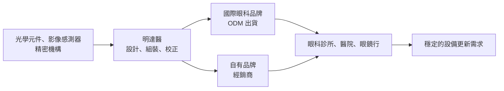
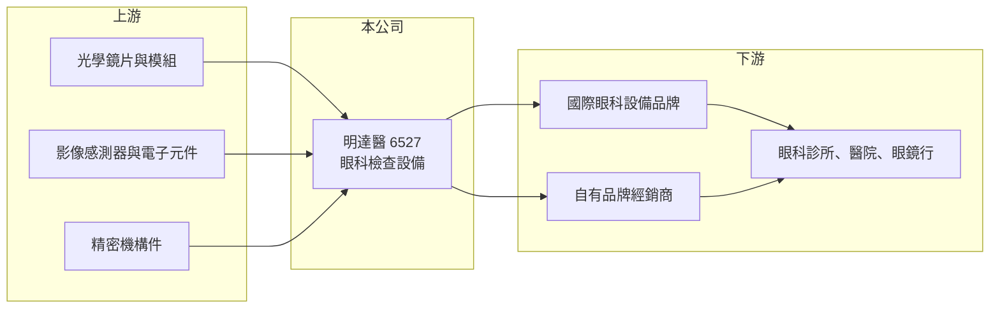

# 6527 明達醫

> 上櫃｜[[產業索引-生技醫療業|生技醫療業]]｜上市（櫃）日期 2019/12/25

# 第一章：企業模式與商業藍圖

> [!info] 撰寫說明
> 本文由 Claude 依公開資料整理，架構比照 [[2330台積電]] 的四章研究，資料截至 2026-10-08。財務數字來源：Goodinfo 年度經營績效頁、櫃買中心開放資料（基本資料、2026 年第二季資產負債與綜合損益、本益比殖利率）。公開資料有限：產品別營收比重未查得；標示「憑記憶」的產品、集團關係與客戶描述尚未比對原始文件。#待校對

在評估單一個股的長期投資價值時，首要步驟是拆解企業的底層獲利邏輯。本章針對明達醫學科技（股票代號：6527，以下簡稱明達醫）的商業模式進行定性分析，說明這家眼科設備製造商如何以光學與機構整合能力，在國際品牌主導的眼科檢查市場中占有一席之地。

## 一、核心定位：眼科檢查設備的研發製造商

明達醫成立於 2009 年，2019 年 12 月上櫃，董事長為李重儀、總經理為莊仲平，實收資本額約 2.55 億元。公司專注於[[眼科檢查設備]]，產品涵蓋自動驗光儀、眼底攝影機、非接觸式眼壓計等，用於眼科診所、醫院與眼鏡行的視力與眼睛健康檢查（憑記憶，待校對）。

明達醫的商業模式以 [[ODM]] 替國際眼科設備品牌設計製造為主，同時經營自有品牌（憑記憶，待校對），並與 [[2352佳世達]] 集團的醫療事業有股權關係（憑記憶，待校對）。眼科檢查設備需要整合光學、影像感測、精密機構與軟體演算法，屬於技術門檻較高、但市場規模相對利基的醫材領域。

## 二、事業板塊：營收比重未查得

* **營收結構：** 本次未查得產品別或地區別營收比重，因此不放圓餅圖。依常見產品線，驗光與屈光檢查設備服務眼鏡行與驗光市場，眼底攝影與眼壓檢查設備服務眼科診所與健檢市場（推估）。
* **市場需求來源：** 近視人口增加、高齡化帶來的青光眼與黃斑部病變篩檢，以及糖尿病患者的視網膜檢查，是眼科檢查設備長期需求的主要來源。這些需求與景氣關聯較低，屬於長期穩定成長的醫療支出。

## 三、資本轉化邏輯：光學整合能力轉化為穩定訂單

* **ODM 的規模效益：** 替國際品牌代工，可以借用品牌商的全球通路，降低自建業務團隊的成本。代價是毛利率受客戶議價影響，明達醫的毛利率長期落在 29% 至 37%，低於品牌醫材公司。
* **費用控管：** 2026 年上半年營業費用只占營收約 20%，營業利益率約 20.6%，顯示公司以精簡的費用結構換取穩定獲利。

## 四、企業長期藍圖

明達醫的長期方向可能包括兩條路：一是提高自有品牌比重，以取得較高毛利；二是結合 AI 影像判讀，讓眼底攝影等設備從單純的拍攝工具，升級為輔助篩檢的系統（推估）。2019 至 2025 年營收從 6.61 億元成長到 9.49 億元，年複合成長約 6.2%（推算），顯示產品在國際市場的滲透持續擴大。

# 第二章：護城河深度與競爭優勢

本章分析明達醫的競爭優勢，說明它在全球眼科檢查設備市場面對哪些對手，以及 ODM 模式帶來的優勢與限制。

## 一、護城河的核心組成要素

* **醫材認證與客戶驗證：** 眼科設備須取得各國醫材許可，ODM 客戶導入新供應商也需要長時間驗證。一旦進入品牌商的產品線，通常會合作多個世代，轉換成本高。
* **光機電整合經驗：** 驗光、眼底攝影等設備需要精準的光路設計與校正，台灣光學與精密機構產業聚落提供零組件與人才支援，這是明達醫的產業基礎。
* **成本與彈性：** 相較日本、歐洲的設備大廠，台灣 ODM 廠能以較低成本與較快的開發速度，支援品牌商推出中階機種。

## 二、全球主要競爭對手格局

| 對手 | 定位 | 與明達醫的比較 |
|---|---|---|
| 拓普康（Topcon）、尼德克（Nidek） | 日本眼科設備大廠 | 品牌與產品線完整，是高階市場的主導者，也可能是 ODM 客戶或競爭者 |
| 蔡司（Zeiss） | 德國光學與眼科設備大廠 | 高階眼科診斷與手術設備的標竿 |
| 中國眼科設備廠 | 中低階檢查設備 | 價格競爭力強，壓縮中低階機種報價 |
| [[4106雃博]]、[[4735豪展]] | 台灣醫療器材製造商 | 同屬台灣醫材 ODM 與品牌廠，但產品領域不同 |

## 三、優勢轉化：守得住、守不住與觀察重點

* **守得住：** 與國際品牌的長期 ODM 關係，以及中階眼科設備的成本優勢。2021 至 2025 年營業利益率從 12.3% 穩定提升到 19.1%，代表產品組合與效率都在改善。
* **守不住：** 毛利率天花板。ODM 模式的毛利率受客戶議價限制，若中國廠商以低價搶單，毛利率可能承壓。
* **觀察重點：** 自有品牌比重的變化、新產品（如 AI 判讀或多功能整合機種）的推出，以及 2026 年營收下滑是否為短期客戶庫存調整。

# 第三章：財務體質與盈利規模

資料日期：2026-10-08。數字取自 Goodinfo 年度經營績效頁與櫃買中心開放資料，表格是撰寫當時的快照；最新月營收、毛利率、累計 EPS 由自動排程寫在本筆記的屬性欄位（月營收、毛利率、累計EPS 等）。#待校對

財務報表是檢驗護城河是否真實存在的最終標準。本章用七年的三率、ROE 與資本報酬，檢視明達醫的獲利穩定度。

## 一、獲利能力的基石：三率

| 年度 | 營收（新台幣） | [[毛利率]] | [[營業利益率]] | EPS（元） | [[ROE]] |
|---|---|---|---|---|---|
| 2019 | 6.61 億 | 36.5% | 17.3% | 4.26 | 15.7% |
| 2020 | 5.04 億 | 32.8% | 11.4% | 2.34 | 8.23% |
| 2021 | 7.22 億 | 29.3% | 12.3% | 3.24 | 11.1% |
| 2022 | 7.95 億 | 32.9% | 15.7% | 4.82 | 15.4% |
| 2023 | 8.24 億 | 32.4% | 14.3% | 4.13 | 12.7% |
| 2024 | 8.68 億 | 34.5% | 16.7% | 5.02 | 14.2% |
| 2025 | 9.49 億 | 35.0% | 19.1% | 5.80 | 14.9% |
| 2026 上半年 | 4.06 億 | 40.1% | 20.6% | 3.01 | 未查得 |

* **[[毛利率]]：** 2021 年低點 29.3% 後逐年回升，2026 年上半年達 40.1%，顯示產品組合往高毛利機種移動，或自有品牌比重提高（推估）。
* **[[營業利益率]]：** 2020 年受疫情影響降到 11.4%，之後穩定回升到 2025 年的 19.1%。營收成長時費用控制得宜，營運槓桿效果明顯。
* **營收趨勢：** 2019 至 2025 年營收年複合成長約 6.2%（推算），除 2020 年疫情衰退外，每年都穩定成長。2026 年 1 至 8 月累計營收較去年同期減少約 10%（櫃買中心資料），但獲利率反而提升。

## 二、[[ROE]]：資本效率

2021 至 2025 年平均 ROE 約 13.7%（推算），波動不大。2026 年第二季底總負債約 3.24 億元、權益約 10.3 億元，負債比約 24%，非流動負債約 0.32 億元，財務結構保守。每股淨值 40.70 元，股價淨值比約 1.83 倍、本益比約 12.7 倍（櫃買中心資料）。

## 三、股利與自由現金流

最近一期現金股利每股 2.9 元，殖利率約 3.9%（櫃買中心資料），以 2025 年 EPS 5.80 元計算，配息率約 50%（推算）。設備組裝屬輕資產製造，資本支出需求不高，自由現金流長期為正（推估，具體金額未查得）。

## 四、[[ROIC]] 與 [[WACC]]：價值創造利差

**ROIC 推算：** 2025 年營收 9.49 億元、營業利益率 19.1%，營業利益約 1.81 億元，扣除 20% 稅率後約 1.45 億元。2026 年第二季底權益約 10.3 億元，有息負債以非流動負債約 0.32 億元推估，投入資本約 10.6 億元，ROIC 約 13.6%（推算）。

**WACC 推算：** 台灣 10 年期公債殖利率取 1.75%、市場風險溢酬 6%、β 取醫材製造股常見值 0.9（未查得公司實際 β），股東權益成本約 7.15%。負債成本假設 2.5%、稅後約 2.0%；權益約占 97%，WACC 約 7.0%（推算）。

**結論：** ROIC 約 13.6%，比約 7% 的資金成本高出約 6.6 個百分點，明達醫長期穩定創造經濟價值。利差雖不如品牌醫材公司大，但近五年持續擴大，代表 ODM 模式下的效率改善是真實的。

# 第四章：總體風險與地緣政治

任何企業都無法脫離宏觀環境獨立存在。本章分析明達醫長期必須面對的市場、客戶與法規風險。

## 一、地緣政治與國際市場

* **外銷導向：** 眼科設備主要銷往國際品牌與海外經銷商，美國關稅政策、各國醫材採購政策都會影響出貨（推估）。
* **中國競爭：** 中國眼科設備廠在中低階市場快速成長，可能壓縮報價與市占。

## 二、產業週期與市場結構

* **設備更新週期：** 眼科設備屬資本財，診所與眼鏡行的採購會受景氣與利率影響，景氣轉弱時可能延後換機，2026 年營收衰退即可能與此有關（推估）。
* **客戶集中：** ODM 模式下，少數品牌客戶可能占營收的大部分，任一客戶轉單或調整庫存，都會造成營收明顯波動（推估）。

## 三、營運環境的隱性風險

* **匯率：** 以美元或外幣計價的營收比重高，新台幣升值會壓縮毛利率與業外匯兌收益。
* **醫材法規：** 歐盟醫材法規（MDR）與各國註冊要求趨嚴，增加產品認證的時間與成本。

## 四、科技演進風險

AI 影像判讀正在改變眼科篩檢流程，未來設備的價值可能更多來自軟體與演算法。若明達醫只做硬體代工，附加價值可能被軟體平台或品牌商拿走；若能整合 AI 功能，則有機會提高產品單價與客戶黏著度。

# 專有名詞解析

## 金融

- **[[毛利率]]**：營業毛利占營收的比例，反映產品定價能力與生產成本控制。
- **[[營業利益率]]**：扣除營業費用後的營業利益占營收的比例，衡量本業整體獲利能力。
- **[[ROE]]**：股東權益報酬率，稅後淨利除以股東權益，衡量公司運用股東資金的效率。
- **[[ROIC]]**：投入資本報酬率，稅後營業利益除以股東權益與有息負債的合計，衡量本業對所有資金提供者的報酬。
- **[[WACC]]**：加權平均資金成本，依股東權益與負債的比重加權計算的資金成本，ROIC 高於它才代表創造價值。

## 產業

- **[[眼科檢查設備]]**：用於驗光、眼底攝影、眼壓測量等視力與眼睛健康檢查的醫療器材，使用於眼科診所、醫院與眼鏡行。
- **[[ODM]]**：原廠委託設計製造，由代工廠負責產品設計與生產，再以客戶品牌出貨。

# 核心供應鏈

## 1. 上游
- 光學鏡片、影像感測器、電子元件與精密機構件供應商（名稱未查得）

## 2. 本公司
- 明達醫學科技：眼科檢查設備設計製造，ODM 與自有品牌並行（憑記憶，待校對）
- 集團關係：[[2352佳世達]]（憑記憶，待校對）

## 3. 下游／客戶
- 國際眼科設備品牌（客戶名稱未公開）
- 眼科診所、醫院、眼鏡行

## 4. 同業
- 國際眼科設備：拓普康、尼德克、蔡司
- 台灣醫材製造：[[4106雃博]]、[[4735豪展]]

## 最新新聞
<!-- news:start -->
<!-- news:end -->

## 相關連結
- [公開資訊觀測站](https://mopsov.twse.com.tw/mops/web/t05st03?step=1&firstin=1&co_id=6527)
- [Goodinfo](https://goodinfo.tw/tw/StockDetail.asp?STOCK_ID=6527)
- [Yahoo 股市](https://tw.stock.yahoo.com/quote/6527)
- [鉅亨網新聞](https://www.cnyes.com/twstock/6527/news)
