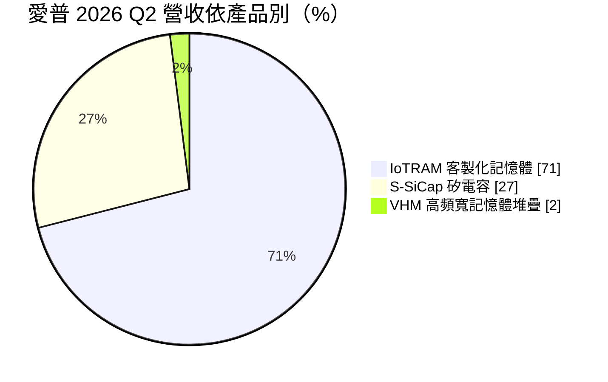
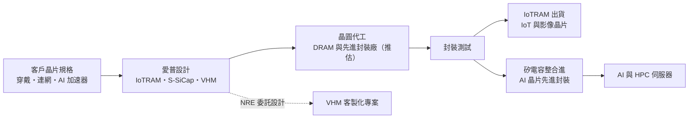
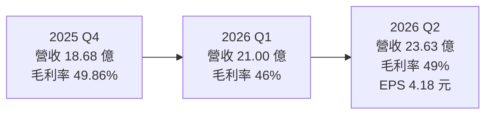
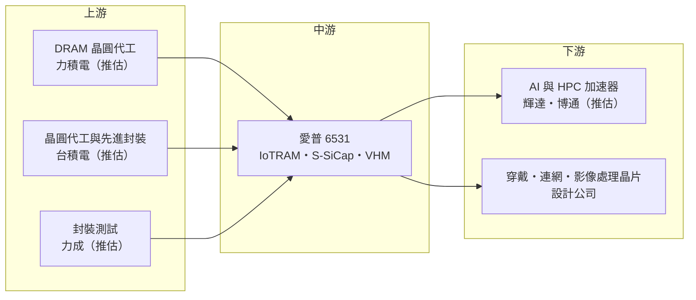

# 6531 愛普

> 上市｜[[產業索引-半導體業|半導體業]]｜上市（櫃）日期 2016/05/31

# 第一章：企業模式與商業藍圖

> [!info] 撰寫說明
> 本文由 Claude 依公開資料整理，架構比照 [[2330台積電]] 的四章研究，資料截至 2026-10-07。財務數字來源：工商時報（2025 年財報與 2026 年 8 月法說報導）、富果研究（2026 年 8 月法說整理）、風傳媒（2026 年第一季法說報導）；產業描述為整理性內容，尚未逐條比對原始文件。#待校對

在評估單一個股的長期投資價值時，首要步驟是拆解企業的底層獲利邏輯。本章針對愛普科技（股票代號：6531，股票簡稱愛普*，以下簡稱愛普）的商業模式進行定性分析，說明一家以利基型記憶體起家的 IC 設計公司，如何靠矽電容打進 AI 加速器的先進封裝供應鏈，以及這個轉變對營收結構與長期定位的意義。

## 一、核心定位：從利基型記憶體走向 AI 先進封裝供應商

愛普是一家 [[Fabless]] 型態的 IC 設計公司，以客製化低功耗記憶體起家。愛普不自己蓋晶圓廠，而是設計記憶體與被動元件，再委託晶圓代工廠生產。

過去市場對愛普的印象是「物聯網記憶體公司」，主要賣給穿戴裝置、連網設備與影像處理晶片使用的小容量、低功耗記憶體。近兩年最大的變化，是它的[[矽電容]]產品打進 AI 加速器的[[先進封裝]]供應鏈。依風傳媒對 2026 年第一季法說的整理，愛普的營運已從「低功耗記憶體供應商」轉向「AI／[[HPC]] 先進封裝供應商」。這個轉變有兩層商業意義：

* **從消費性景氣轉向 AI 資本支出：** 舊業務跟著穿戴、連網裝置的消費景氣走，新業務則跟著雲端業者與 AI 晶片廠的擴產走，成長斜率與毛利率都不同。
* **從賣顆粒轉向賣封裝內的關鍵元件：** 矽電容直接整合在 AI 晶片封裝內部，一旦通過驗證就跟著晶片世代出貨，客戶黏著度高於一般記憶體。

## 二、產品板塊：三大產品線

2026 年第二季營收 23.63 億元，依產品別的結構如下：

* **IoTRAM（客製化記憶體）：** 營收約 16.9 億元，占 71%，年增 55%。主要是低功耗、小容量的虛擬靜態記憶體（[[PSRAM]]）等產品，應用在穿戴裝置、連網裝置、影像訊號處理器（ISP）、安全監控攝影機等 [[IoT]] 產品。新一代 ApSRAM 已量產並獲客戶採用，超過 10 項設計案進行中。這是愛普的營收基本盤。
* **S-SiCap（矽電容）：** 營收約 6.38 億元，占 27%，季增 12%、年增 273%。矽電容是用半導體製程做出來的電容，可以直接整合在先進封裝的中介層（[[Interposer]]）或基板中，放在 AI 晶片旁邊穩定供電。AI 與 HPC 加速器功耗不斷攀升，先進封裝除了需要更高頻寬，也必須強化近端供電，因此矽電容需求快速成長。第二代產品電容密度提升一倍，並推出整合被動元件（[[IPD]]）與 LSC 等新產品。
* **VHM（高頻寬記憶體堆疊）：** 營收約 3,700 萬元，占 2%，目前主要是委託設計（[[NRE]]）收入。VHM 是愛普把客製化 DRAM 與邏輯晶片垂直堆疊的方案，定位類似客製化的 [[HBM]]。VHMStack 1+8 堆疊已完成並進入功能測試，預計 2027 至 2028 年完成量產驗證。

公司預期，隨著嵌入基板型產品大量放量，S-SiCap 的營收可望在 2027 年超越 IoTRAM。

## 三、資本轉化邏輯：輕資產的設計與委外製造

身為 Fabless 公司，愛普的記憶體與矽電容都委託外部晶圓廠生產。記憶體晶圓推估主要由台灣的 DRAM 代工廠（如 [[6770力積電]]）供應，矽電容則需要配合先進封裝流程，與晶圓代工及封裝廠密切合作（推估）。由於矽電容最終整合在 AI 晶片的先進封裝中，愛普的客戶與合作夥伴推估包括先進封裝產能最大的晶圓代工廠與其 AI 晶片客戶，但公司未公開具體名單。

這種模式的特點是：

* **固定資產輕：** 不必負擔晶圓廠折舊，營收成長時毛利率與營業利益率容易同步擴張。2026 年第二季[[毛利率]] 49%、[[營業利益率]] 31%，在台灣 IC 設計公司中屬於前段。
* **產品組合決定毛利：** 矽電容毛利率高於 IoTRAM，S-SiCap 占比每提高一點，整體毛利率就被往上拉。公司長期毛利率目標約 45%。
* **NRE 先行、量產後補：** VHM 這類客製化記憶體先收委託設計費，等客戶晶片量產才會轉為大量產品營收，時間差可能長達兩年以上。

## 四、企業長期藍圖：記憶體設計加先進封裝

愛普的長期策略是把「記憶體設計能力」與「先進封裝」結合：

* **短期：** IoTRAM 維持穩定獲利，S-SiCap 搭上 AI 先進封裝擴產快速成長，嵌入基板型產品是下一波放量重點。
* **中期：** VHM 打入 AI 與高效能運算的客製化記憶體市場，2027 年後開始貢獻量產營收。
* **籌資：** 2026 年 8 月宣布擬以發行海外存託憑證（[[GDR]]）方式現金增資，上限 1,500 萬股，為後續擴張籌措資金。

# 第二章：護城河深度與競爭優勢

在長期價值投資中，「護城河」指企業抵禦競爭、維持超額利潤的保護機制。本章分析愛普的護城河構成、在矽電容與記憶體兩個戰場上的主要競爭對手，以及這些優勢能否在大型被動元件廠與記憶體大廠加入競爭後守住。

## 一、護城河的核心組成要素

愛普的護城河屬於「窄但具特色」，由三個要素組成：

* **1. 矽電容的先行者優勢：** 依富果研究整理的法說內容，愛普在 S-SiCap 與 IPD 市場具有先行優勢，與客戶已有多年合作。矽電容整合進先進封裝需要長時間共同驗證，一旦導入量產，客戶在同一世代產品中不易更換。
* **2. 客製化記憶體設計經驗：** IoTRAM 需要針對客戶的晶片規格客製化，愛普累積多年設計經驗與大量設計案，形成穩定的客戶基礎。
* **3. 記憶體與封裝的跨領域整合：** VHM 需要同時懂 DRAM 設計、邏輯晶片介面與 3D 堆疊封裝，具備這種跨領域能力的公司不多。

## 二、全球主要競爭對手格局

| 對手 | 定位 | 對愛普的威脅 |
|---|---|---|
| 村田製作所等國際被動元件廠 | 具矽電容業務與大規模被動元件產能 | 若擴大投入 AI 封裝用矽電容，可直接搶單 |
| 先進封裝廠自有整合被動元件方案 | 在封裝流程內自行整合電容 | 降低對外部矽電容的需求 |
| [[2344華邦電]]、[[5351鈺創]]、ISSI | 利基型與低功耗記憶體 | 在 IoTRAM 市場價格競爭 |
| [[005930三星電子]]、SK 海力士、美光 | 標準 HBM 三大廠 | VHM 須在客製化與成本上找到差異 |

## 三、優勢轉化：哪些市場守得住、哪些守不住

* **守得住：** S-SiCap 已進入量產並快速成長，2026 年第二季營收年增 273%，毛利率推升到 49%，顯示產品具有定價能力；在已通過驗證的 AI 晶片世代內，轉換成本高。
* **守不住：** 矽電容技術並非無法複製，若大型被動元件廠或晶圓代工廠本身擴大投入，愛普的先行優勢可能被稀釋；VHM 面對的是三大記憶體廠，難度更高。IoTRAM 屬消費性產品，價格競爭較激烈。
* **觀察重點：** S-SiCap 嵌入基板型產品放量速度、客戶數是否增加以降低集中度；VHM 能否如期在 2027 至 2028 年量產；IoTRAM 在消費性市場的穩定度。

# 第三章：財務體質與盈利規模

資料日期：2026-10-07。數字取自工商時報、富果研究、風傳媒等財經媒體整理，表格是撰寫當時的快照；最新月營收、毛利率、累計 EPS 由自動排程寫在本筆記的屬性欄位（月營收、毛利率、累計EPS 等）。#待校對

財務報表是檢驗護城河是否真實存在的最終標準。本章用三率、ROE、現金流與資本報酬，檢視愛普在產品組合轉向矽電容之後的獲利品質，並特別說明匯率對稅後淨利的干擾。

## 一、獲利能力的基石：三率

| 項目 | 2025 全年 | 2025 Q4 | 2026 Q1 | 2026 Q2 |
|---|---|---|---|---|
| 營收（新台幣） | 56.66 億 | 18.68 億 | 21.00 億 | 23.63 億 |
| [[毛利率]] | 未查得 | 49.86% | 46% | 49% |
| [[營業利益率]] | 約 24.7%（推算） | 30.64% | 28% | 31% |
| EPS（元） | 7.74 | 未查得 | 4.15 | 4.18 |

* **營收：** 2025 年營收年增 35.16%，營業利益 13.99 億元（營業利益率依此推算約 24.7%），年增 31.62%。2026 年上半年營收約 44.6 億元，連續三季成長。
* **[[毛利率]]：** 2026 年第二季毛利 11.59 億元，毛利率回到 49%，主因矽電容占比提升。毛利率高低與產品組合高度相關。
* **[[營業利益率]]：** 第二季營業利益 7.26 億元，營業利益率 31%。研發費用相對固定，營收放大時營業利益率擴張比毛利率更明顯。
* **[[淨利率]]與業外：** 2025 年稅後淨利 12.58 億元、年減 20.31%，主因 2025 年第二季新台幣急升造成匯兌損失，該季 EPS 為虧損 3.37 元。2026 年第二季稅後淨利 6.67 億元（年增 221%），歸屬母公司淨利 6.81 億元；上半年 EPS 合計約 8.33 元。評估本業時應以營業利益為準。

## 二、[[ROE]]：資本效率

愛普採 Fabless 模式，不需要投資晶圓廠，固定資產少，資本效率天生較高。毛利率接近五成、營業利益率三成左右，在台灣 IC 設計公司中屬於前段水準。確切 ROE 數字本次未查得。需要注意的是，愛普持有大量外幣資產，匯率劇烈波動時業外損益會大幅影響稅後淨利，進而讓 ROE 出現與本業無關的大起大落。

## 三、資本支出與自由現金流

* **[[CapEx]]：** Fabless 模式下資本支出不高，主要是研發設備與光罩費用，確切金額本次未查得。
* **[[自由現金流]]：** 高毛利、低資本支出的組合，使營業現金流多數可轉為自由現金流（推估）。
* **增資：** 2026 年 8 月宣布擬發行海外存託憑證現金增資，上限 1,500 萬股，發行價不低於參考價的九成，需經 9 月 11 日股東臨時會通過。增資將帶來資金，但也會稀釋每股盈餘。
* **股利：** 2025 年度配發現金股利 7 元，以 2025 年 EPS 7.74 元計算，配發率約九成。

## 四、[[ROIC]] 與 [[WACC]]：價值創造利差

企業創造價值的條件是投入資本報酬率高於資金成本。愛普的投入資本主要是研發人力、營運資金與少量設備，營業利益率三成上下時，ROIC 推估明顯高於 WACC（具體數值未查得）。後續觀察重點是：增資資金若投入新產能或新產品線，能否維持相同的資本報酬；以及 VHM 長期 NRE 階段的研發投入，何時能轉為量產營收。

# 第四章：總體風險與地緣政治

任何企業都無法脫離宏觀環境獨立存在。本章分析愛普未來必須面對的地緣政治、AI 投資週期、匯率與技術路線風險。

## 一、地緣政治

* **台灣集中：** 愛普的晶圓與封裝供應鏈主要在台灣，面臨兩岸風險。
* **中國市場：** IoTRAM 的部分客戶推估為中國的穿戴與連網裝置晶片業者，美中貿易限制可能影響這部分需求。
* **AI 晶片出口管制：** 矽電容與 VHM 最終用在 AI 加速器上，美國對 AI 晶片出口的管制政策，會間接影響終端需求。

## 二、產業週期與市場結構

* **AI 投資週期：** S-SiCap 的成長高度依賴 AI 加速器與先進封裝擴產，若雲端業者削減資本支出，矽電容需求將受影響。
* **客戶集中：** 矽電容的客戶推估集中在少數 AI 晶片與先進封裝供應鏈，集中度高。
* **消費性需求：** IoTRAM 主要用於消費性與連網裝置，受消費景氣與[[長鞭效應]]影響。

## 三、營運環境的隱性風險

* **匯率：** 2025 年第二季因新台幣急升造成大額匯損，單季轉為虧損，顯示外幣資產部位對獲利影響很大。
* **代工產能：** 身為 Fabless，愛普依賴外部晶圓廠與封裝廠產能，先進封裝產能吃緊時可能影響出貨。
* **股本稀釋：** 海外存託憑證增資將增加股本，EPS 成長會被部分稀釋。

## 四、科技或法規演進

先進封裝的供電方案仍在演進，例如背面供電、嵌入式電容等不同技術路線。若主流 AI 晶片改用其他供電架構，矽電容需求可能不如預期。VHM 則需要與 HBM 標準產品競爭，技術與量產驗證都還有不確定性。

# 專有名詞解析

## 半導體

- **[[PSRAM]]**：虛擬靜態隨機存取記憶體，內部用 DRAM 結構、對外像 SRAM 一樣好用，容量小、耗電低，常用在穿戴與連網裝置。
- **[[矽電容]]**：用半導體製程在矽晶圓上做出的電容，體積小、可整合進先進封裝，放在 AI 晶片旁穩定供電。
- **[[IPD]]**：整合被動元件，把電容、電感、電阻等被動元件做在同一片基板或晶片上，節省封裝空間。
- **[[HBM]]**：高頻寬記憶體，把多顆 DRAM 垂直堆疊並與 GPU 封裝在一起，提供 AI 運算所需的大頻寬。
- **[[先進封裝]]**：把多顆晶片以中介層、混合鍵合等方式高密度整合的封裝技術，例如 CoWoS、SoIC。
- **[[Interposer]]**：中介層，放在晶片與載板之間、內含細微線路的矽片，用來連接並排的多顆晶片。
- **[[Fabless]]**：只做晶片設計、把製造委外給晶圓代工廠的 IC 設計公司模式。

## 應用

- **[[IoT]]**：物聯網，泛指可連網的穿戴、家電、監控與感測裝置，通常需要低功耗晶片。
- **[[HPC]]**：高效能運算，泛指資料中心、AI 訓練與推論等需要大量運算的應用。

## 金融

- **[[NRE]]**：一次性工程費，客戶為客製化晶片支付的設計與開發費用，與量產後的產品營收分開計算。
- **[[GDR]]**：海外存託憑證，台灣公司在海外市場發行、代表本國股票的憑證，用來向國際投資人募資。
- **[[長鞭效應]]**：終端需求的小幅變動，沿供應鏈往上游傳遞時被逐級放大，造成上游庫存與訂單劇烈波動。

# 核心供應鏈

## 1. 上游：晶圓代工與封裝
- DRAM 晶圓代工（推估）：[[6770力積電]]
- 晶圓代工與先進封裝（推估）：[[2330台積電]]
- 封裝測試（推估）：[[6239力成]]

## 2. 中游：愛普本身
- 產品：IoTRAM 客製化記憶體、S-SiCap 矽電容與 IPD、VHM 高頻寬記憶體堆疊

## 3. 下游：客戶類型
- AI 與 HPC 加速器晶片（推估）：[[NVDA輝達]]、[[AVGO博通]]
- 穿戴、連網與影像處理晶片設計公司

## 4. 同業與競爭者
- 利基型記憶體：[[2344華邦電]]、[[5351鈺創]]、ISSI
- 高頻寬記憶體：[[005930三星電子]]、SK 海力士、美光
- 矽電容與被動元件：村田製作所

延伸閱讀：[[台積電供應鏈]]

## 最新新聞
<!-- news:start -->
<!-- news:end -->

## 相關連結
- [公開資訊觀測站](https://mopsov.twse.com.tw/mops/web/t05st03?step=1&firstin=1&co_id=6531)
- [Goodinfo](https://goodinfo.tw/tw/StockDetail.asp?STOCK_ID=6531)
- [Yahoo 股市](https://tw.stock.yahoo.com/quote/6531)
- [鉅亨網新聞](https://www.cnyes.com/twstock/6531/news)
