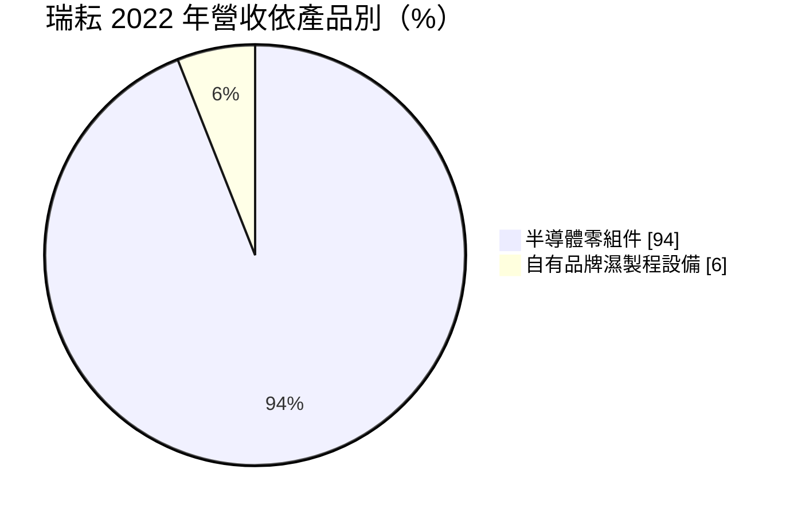
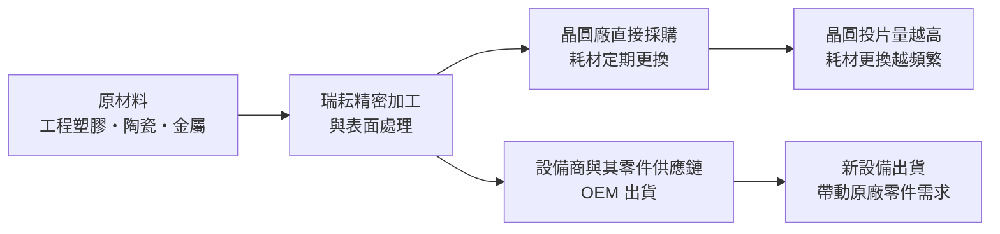
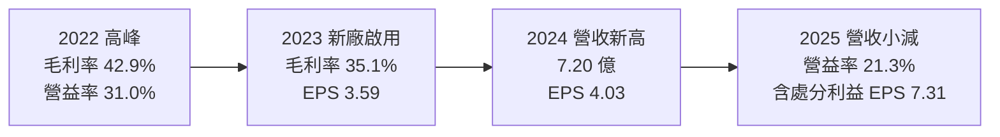
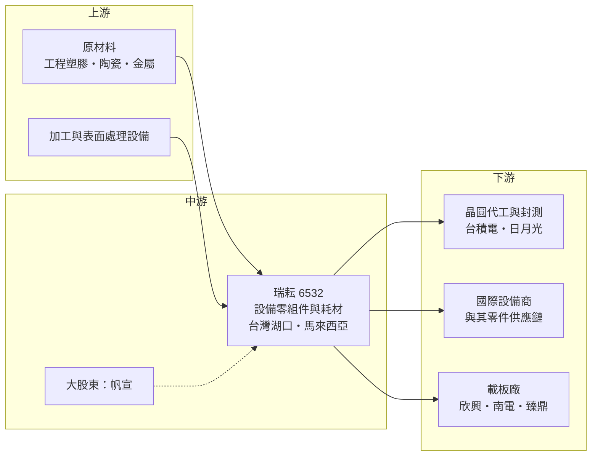

# 6532 瑞耘

> 上櫃｜[[產業索引-半導體業|半導體業]]｜上市（櫃）日期 2016/09/26

# 第一章：企業模式與商業藍圖

> [!info] 撰寫說明
> 本文由 Claude 依公開資料整理，架構比照 [[2330台積電]] 的四章研究，資料截至 2026-10-08。財務數字來源：Goodinfo 年度經營績效與股利政策頁、MoneyDJ 資產負債表與現金流量表、Yahoo 股市公司基本資料、旺得富（中時）2026 年 6 月與 9 月報導、理財周刊報導；產業描述為整理性內容，尚未逐條比對原始文件。#待校對

在評估一家公司的長期價值時，第一步是看懂它的產品在產業中扮演什麼角色。本章針對瑞耘科技（股票代號：6532，以下簡稱瑞耘）的商業模式進行定性分析，說明一家位於新竹湖口的精密加工廠，如何成為晶圓廠與設備商的關鍵零組件供應商，並靠「晶圓廠越忙、耗材換得越快」的特性賺錢。

## 一、核心定位：半導體前段製程的精密零組件供應商

瑞耘成立於 1998 年，2016 年上櫃，董事長兼總經理為呂學恒。依理財周刊報導，兆豐銀行與廠務工程公司 [[6196帆宣]] 是公司大股東。瑞耘的主業是半導體前段製程設備的零組件與耗材，另外也開發自有品牌的濕製程設備。

晶圓廠裡的每一台設備都有許多需要定期更換的零件。以化學機械研磨（[[CMP]]）為例，晶圓在研磨時要被一個「夾持環」固定住，這個環會隨研磨磨耗，必須定期更換；在[[蝕刻]]與薄膜沉積設備裡，把氣體均勻噴灑到晶圓表面的「氣體擴散板」，也會被製程氣體侵蝕。這些零件尺寸精度要求極高，材料要能耐腐蝕、不能掉落微粒污染晶圓。瑞耘的工作就是用精密加工與表面處理，生產這些零件。

依理財周刊報導，瑞耘在 2019 年成為晶圓大廠的設備零組件供應商，主要客戶包括 [[2330台積電]]、[[3711日月光投控]]，以及載板廠 [[3037欣興]]、[[8046南電]]、[[4958臻鼎-KY]] 等。2022 年外銷約占 85%，主要銷往美國、中國、日本、德國與新加坡，推估多數是經由國際設備商或其零件供應鏈出貨。

## 二、產品板塊：耗材零組件為主，自有設備為輔

依理財周刊引述的 2022 年資料：

* **耗材零組件：** 涵蓋研磨、蝕刻、化學與物理氣相沉積（[[CVD]]、[[PVD]]）、擴散等製程。代表產品是 CMP 用的晶圓夾持環與薄膜製程用的氣體擴散板。這類產品會隨晶圓廠的投片量持續消耗，是營收的主體。
* **設備：** 以晶圓旋乾機、批次蝕刻去光阻機為主，另開發晶圓與光罩搬運倉儲等自動化物料搬運系統（AMHS），並加強軟體系統整合。設備占比小，但能讓公司從零件供應商延伸到小型系統供應商。

## 三、資本轉化邏輯：耗材型的經常性收入

* **兩種需求來源：** 第一是晶圓廠的耗材更換，與[[產能利用率]]直接連動，晶圓廠越忙，零件磨耗越快；第二是設備商的新機出貨，晶圓廠蓋新廠、裝新機時，設備內建的零件也需要供應。前者穩定，後者隨半導體資本支出起伏。
* **驗證門檻：** 進入晶圓廠或設備商的供應鏈，零件要經過長時間的材料、尺寸與潔淨度驗證，一旦通過，客戶不會輕易更換。這讓瑞耘的訂單具有一定的延續性。
* **產能擴充：** 瑞耘在 2023 年前後啟用新廠，2025 年第四季出售湖口舊廠房，處分利益列為業外收入。依旺得富 2026 年 9 月報導，台灣總部產能已全數滿載，公司正招募人員、採購設備以消化訂單。

## 四、企業長期藍圖：馬來西亞與先進製程零件

* **馬來西亞據點：** 依 2026 年 9 月報導，瑞耘馬來西亞廠的機械加工與化學清洗線已完成安裝，正接受一家美系客戶的現地稽核，預計 2026 年第四季取得認證。取得資格後，子公司可以直接接單出貨，並逐步發展當地的新產品開發能量。馬來西亞鄰近國際設備大廠在東南亞的生產基地，是分散地緣風險、擴大海外營收的布局。
* **高價值新產品：** 公司積極爭取原子層沉積（[[ALD]]）等高價值產品的送樣機會，目標是提高營收與毛利率。董事長在 2026 年的說明中提到，AI、[[HBM]]、先進製程與先進封裝需求強勁，28 奈米以上成熟製程則成長趨緩或衰退，因此產品方向會往先進製程相關零件移動。
* **美系客戶的去中國化：** 一家美系客戶將供應鏈移出中國，帶來新產品送樣機會，公司預期 2026 年進入量產。

# 第二章：護城河深度與競爭優勢

護城河是企業抵禦競爭、長期維持超額利潤的機制。本章分析瑞耘在半導體零組件市場的競爭優勢、主要對手，以及這些優勢能否轉化為長期穩定的獲利。

## 一、瑞耘護城河的核心組成要素

瑞耘屬於規模小但專精的零組件廠，護城河由三個要素構成：

* **1. 客戶驗證與料號綁定：** 晶圓廠與設備商對零件的材料成分、尺寸精度與潔淨度有嚴格規範，新供應商要經過送樣、試用、小量導入等多個階段，往往需要一年以上。一旦某個零件被列入合格供應清單，客戶在製程不變的情況下很少更換，這是瑞耘最主要的防守力。
* **2. 精密加工與表面處理技術：** 零件表面的粗糙度、塗層與清洗品質會直接影響晶圓良率。瑞耘多年累積的加工與化學清洗技術，讓它能承接要求較高的先進製程零件。
* **3. 地理位置與服務速度：** 總部在新竹湖口，鄰近台灣主要晶圓廠，可以快速回應客戶的急件與客製需求；馬來西亞據點則讓它能就近服務國際設備商在東南亞的工廠。

## 二、全球主要競爭對手格局

| 對手 | 定位 | 對瑞耘的威脅 |
|---|---|---|
| 設備原廠自製或指定零件 | 應用材料、科林研發等設備商的原廠零件 | 原廠零件有品牌與規格主導權，第三方零件須取得認證 |
| [[3413京鼎]] | 台灣設備模組與零組件大廠 | 規模遠大於瑞耘，在設備商供應鏈地位穩固 |
| [[8091翔名]] | 台灣半導體耗材零件與再生服務公司 | 在晶圓廠耗材市場直接競爭 |
| 日本與韓國零件廠 | 材料與精密加工技術成熟 | 在高階材料與先進製程零件具優勢 |
| 中國零組件廠 | 受國產化政策支持 | 在中國市場以價格與本土關係競爭 |

## 三、優勢轉化：哪些市場守得住、哪些守不住

* **守得住：** 已通過驗證的 CMP 與薄膜製程耗材。這些零件跟著晶圓廠的投片量持續消耗，只要製程不變，訂單會延續。瑞耘 2019 年至 2025 年營業利益率都維持在 21% 以上，顯示這類耗材具有不錯的定價能力。
* **守不住：** 純粹比價的一般加工件，以及成熟製程客戶的需求。董事長已提到 28 奈米以上的需求成長趨緩，若成熟製程晶圓廠稼動率下滑，相關耗材的需求也會減少。
* **觀察重點：** 第一，馬來西亞廠能否如期取得認證並帶來海外新訂單；第二，ALD 等先進製程零件能否從送樣進入量產；第三，台灣產能滿載後的擴充速度，能否跟上客戶需求。

# 第三章：財務體質與盈利規模

資料日期：2026-10-08。數字取自 Goodinfo 年度經營績效、MoneyDJ 財務報表與財經媒體報導，表格是撰寫當時的快照；最新月營收、毛利率、累計 EPS 由自動排程寫在本筆記的屬性欄位（月營收、毛利率、累計EPS 等）。#待校對

財務報表是檢驗護城河是否真實存在的最終標準。本章用多年度數據檢視瑞耘的獲利穩定度、資本效率與股利紀錄。

## 一、獲利能力的基石：三率

| 年度 | 營收（億元） | [[毛利率]] | [[營業利益率]] | EPS（元） | [[ROE]] |
|---|---|---|---|---|---|
| 2019 | 4.57 | 35.7% | 22.7% | 2.63 | 15.0% |
| 2020 | 5.48 | 37.2% | 25.2% | 3.06 | 15.2% |
| 2021 | 5.06 | 37.2% | 24.3% | 2.63 | 11.7% |
| 2022 | 6.63 | 42.9% | 31.0% | 5.00 | 20.4% |
| 2023 | 6.94 | 35.1% | 23.0% | 3.59 | 13.6% |
| 2024 | 7.20 | 35.9% | 24.1% | 4.03 | 14.2% |
| 2025 | 6.75 | 36.6% | 21.3% | 7.31 | 23.2% |

資料來源：Goodinfo 合併報表年度經營績效。2025 年 EPS 7.31 元中，約 5.64 元來自出售湖口舊廠的一次性處分利益（旺得富報導），本業 EPS 約 1.7 元（推算），2025 年 ROE 也因此偏高。

* **[[毛利率]]：** 七年間維持在 35% 至 43% 之間，波動不大。2023 年毛利率下滑，主要是新廠啟用與增聘人力帶來的折舊與人事成本增加（理財周刊報導）。2026 年上半年毛利率約 39.4%。
* **[[營業利益率]]：** 長期維持在 21% 至 31%，對一家小型零件廠來說相當穩定，反映耗材型產品的定價能力。
* **長期成長：** 2019 年至 2025 年營收年複合成長率約 6.7%（推算），2021 年至 2025 年約 7.5%（推算）。成長速度溫和，與半導體產業的長期成長率接近。

## 二、[[ROE]]：資本效率

瑞耘近 5 年（2021 至 2025 年）平均 ROE 約 16.6%（推算），但 2025 年的 23.2% 含一次性處分利益；若以 2021 至 2024 年計算，平均約 15%（推算）。公司幾乎沒有借款，依 MoneyDJ 資料，2025 年底股東權益約 12.73 億元，短期借款約 0.5 億元，ROE 完全來自本業獲利，沒有財務槓桿成分。

## 三、資本支出與自由現金流

* **[[CapEx]]：** 依 MoneyDJ 季度現金流量表加總，2025 年購置設備約 1.83 億元，其中第三季約 1.22 億元，推估與馬來西亞廠建置有關；2026 年上半年約 0.21 億元。
* **[[自由現金流]]：** 2025 年營業現金流約 1.70 億元，扣除資本支出後自由現金流約負 0.13 億元（推算），主要是海外擴產所致。2024 年以前的年度現金流資料本次未查得。
* **股利政策：** 依 Goodinfo，2019 年至 2025 年度的現金股利分別約為 1.6、2、1.8、2.69、2.4、2.6、3 元，金額大致逐年上升，波動遠小於 EPS。2024 年度配發率約 65%（推算）。2025 年度雖然 EPS 因處分利益跳升到 7.31 元，股利只發 3 元，顯示公司沒有把一次性利益全數發放，而是維持穩定成長的股利政策。

## 四、[[ROIC]] 與 [[WACC]]：價值創造利差

* **ROIC（推算）：** 2025 年營業利益約 1.44 億元（營收 6.75 億元 × 營業利益率 21.3%），稅後約 1.15 億元（稅率 20%）。投入資本約 13.2 億元（2025 年底股東權益 12.73 億元加上短期借款 0.5 億元），ROIC 約 8.7%（推算）。2024 年稅後營業利益約 1.39 億元，除以當年股東權益約 10.9 億元，ROIC 約 12.7%（推算）。2025 年 ROIC 下降，一方面是營收小減，另一方面是處分利益增加了股東權益，分母變大。
* **WACC（推算）：** 無風險利率取 1.75%，市場風險溢酬 6%，β 取半導體設備零組件同業常見值 1.1（未查得公司實際 β），股東權益成本約 8.35%。有息負債只占投入資本約 4%，WACC 約 8.1%（推算）。
* **解讀：** 瑞耘的 ROIC 長期約在 9% 至 13% 之間，略高於約 8% 的資金成本，屬於「穩定小幅創造價值」的類型。若馬來西亞廠與先進製程零件帶來營收成長，同時維持 20% 以上的營業利益率，利差可望擴大；反之，若新廠稼動率長期偏低，新增的投入資本會稀釋 ROIC。

# 第四章：總體風險與地緣政治

任何企業都無法脫離宏觀環境獨立存在。本章分析瑞耘長期必須面對的地緣政治、產業週期、營運與技術風險。

## 一、地緣政治風險

* **供應鏈去中國化的機會與風險：** 美系客戶把供應鏈移出中國，為瑞耘帶來新產品送樣機會，這是地緣政治帶來的正面效果。但瑞耘也有部分外銷到中國，若中國推動零組件國產化，這部分需求可能減少。
* **美國出口管制：** 若美國擴大限制對中國出口半導體設備與零件，透過設備商出貨到中國的零件需求可能下降。
* **台灣集中風險：** 主要產能在台灣湖口，馬來西亞廠正在建立中，短期內仍以台灣為主要生產基地。

## 二、產業週期與市場結構風險

* **半導體資本支出週期：** 設備新機出貨帶動的零件需求，會隨全球晶圓廠的資本支出起伏。旺得富報導引述 SEMI 預估，2026 年全球半導體製造設備銷售額年增約 23%，但設備投資本身具有明顯的循環性。
* **成熟製程放緩：** 董事長指出 28 奈米以上成熟製程成長趨緩或衰退，若瑞耘的耗材集中在成熟製程，需求可能受到影響。
* **客戶集中：** 主要客戶為少數晶圓廠與設備商，單一客戶的製程變更或供應商調整，會對營收造成明顯影響。公司未公開客戶比重（未查得）。

## 三、營運環境的隱性風險

* **規模小、人才需求：** 瑞耘年營收約 7 億元，產能滿載時需要快速招募技術人員，精密加工人才在台灣半導體產業中競爭激烈。
* **海外擴廠的執行風險：** 馬來西亞廠需要通過客戶稽核才能接單，認證延後或初期稼動率偏低，都會影響獲利。
* **一次性收益的干擾：** 2025 年處分舊廠的利益讓 EPS 大幅跳升，投資人評估公司時應以本業獲利為準，避免把一次性收益當作常態。

## 四、科技演進風險

半導體製程每推進一代，設備內部的零件材料、尺寸與潔淨度要求都會提高，例如先進製程的蝕刻與沉積需要更耐電漿侵蝕的材料。若瑞耘無法跟上新材料與新規格，現有零件可能隨製程汰換而失去市場；反過來說，ALD、先進封裝等新製程也會帶來新的零件需求。能否持續取得新製程的零件認證，是瑞耘長期最重要的技術課題。

# 專有名詞解析

## 半導體

- **[[CMP]]**：化學機械研磨，用研磨液與研磨墊把晶圓表面磨平，是先進製程多層堆疊的關鍵步驟。
- **[[蝕刻]]**：用化學液體或電漿把晶圓上不需要的材料移除，形成電路圖形的製程。
- **[[CVD]]**：化學氣相沉積，利用化學反應在晶圓表面形成薄膜的製程。
- **[[PVD]]**：物理氣相沉積，以濺鍍等物理方式把金屬鍍到晶圓表面，常用於形成金屬導線。
- **[[ALD]]**：原子層沉積，一次只沉積一層原子厚度的薄膜，厚度控制極精準，用於先進製程。
- **[[HBM]]**：高頻寬記憶體，把多顆 DRAM 垂直堆疊，提供 AI 加速器所需的大量資料頻寬。

## 金融

- **[[產能利用率]]**：實際投片量占總產能的比例，晶圓廠利用率越高，設備耗材的更換也越頻繁。
- **[[自由現金流]]**：營業活動現金流減去資本支出，代表企業可自由用於配息、還債或併購的現金。

## 產業

- **[[耗材零組件]]**：晶圓廠設備中會隨使用磨耗、需要定期更換的零件，需求與晶圓投片量連動。
- **[[AMHS]]**：自動化物料搬運系統，在晶圓廠內自動運送與儲存晶圓盒及光罩的設備。
- **[[OEM]]**：原廠委託製造，替其他品牌或設備商生產零件或產品。

# 核心供應鏈

## 1. 上游：原材料與加工設備
- 工程塑膠、陶瓷與金屬原料，以及精密加工設備，供應商名稱未查得

## 2. 中游：瑞耘與同業
- 大股東：[[6196帆宣]]
- 台灣同業：[[3413京鼎]]、[[8091翔名]]

## 3. 下游：主要客戶
- 晶圓代工：[[2330台積電]]
- 封測：[[3711日月光投控]]
- 載板：[[3037欣興]]、[[8046南電]]、[[4958臻鼎-KY]]
- 國際設備商：前段設備大廠包括 [[AMAT應用材料]]、[[LRCX科林研發]]、[[8035東京威力科創]] 等，瑞耘與各家的實際往來未查得

延伸閱讀：[[台積電供應鏈]]

## 最新新聞
<!-- news:start -->
<!-- news:end -->

## 相關連結
- [公開資訊觀測站](https://mopsov.twse.com.tw/mops/web/t05st03?step=1&firstin=1&co_id=6532)
- [Goodinfo](https://goodinfo.tw/tw/StockDetail.asp?STOCK_ID=6532)
- [Yahoo 股市](https://tw.stock.yahoo.com/quote/6532)
- [鉅亨網新聞](https://www.cnyes.com/twstock/6532/news)
