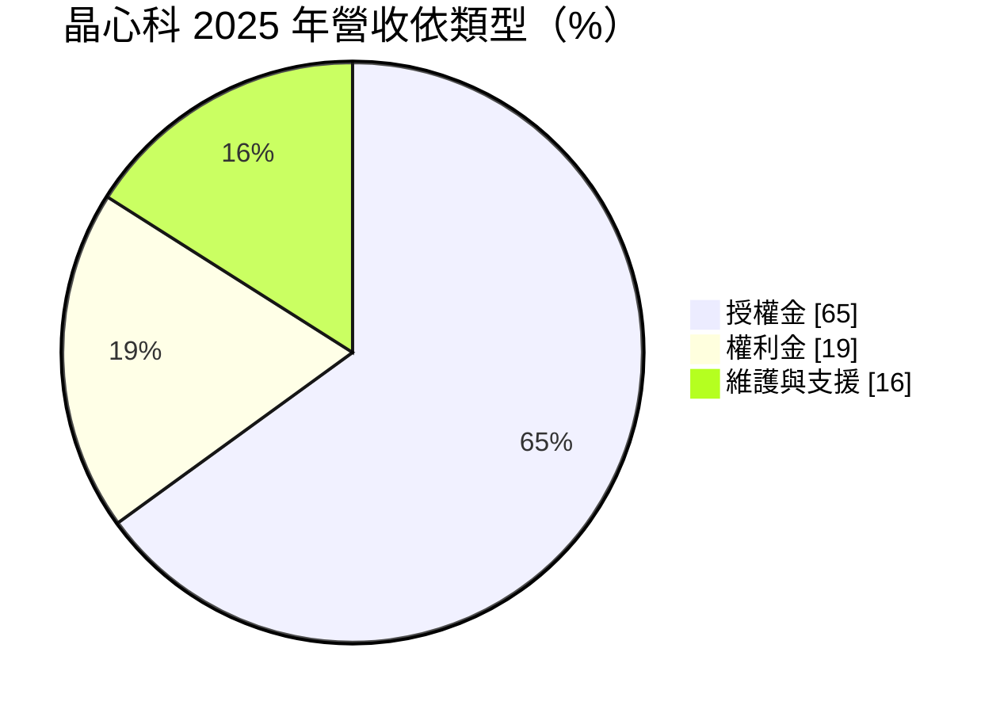
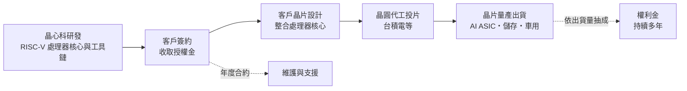
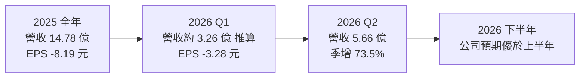
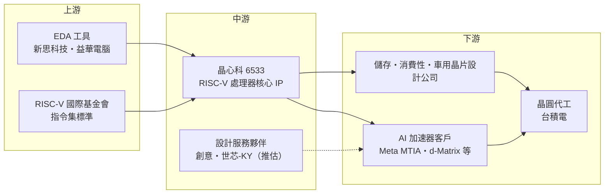

# 6533 晶心科

> 上市｜[[產業索引-半導體業|半導體業]]｜上市（櫃）日期 2017/03/14

# 第一章：企業模式與商業藍圖

> [!info] 撰寫說明
> 本文由 Claude 依公開資料整理，架構比照 [[2330台積電]] 的四章研究，資料截至 2026-10-07。財務數字來源：富果研究（2026 年 3 月法說整理）、聯合報與旺得富／中時（2026 年 7 月營收報導）、優分析（2026 年 9 月）、科技新報與 winvest 月營收快訊；產業描述為整理性內容，尚未逐條比對原始文件。#待校對

在評估單一個股的長期投資價值時，首要步驟是拆解企業的底層獲利邏輯。本章針對晶心科技（股票代號：6533，以下簡稱晶心科）的商業模式進行定性分析，說明一家不生產任何晶片的處理器 [[IP]] 公司如何賺錢，以及為什麼它的營收與獲利會呈現「先授權、後權利金」的長週期特性。

## 一、核心定位：台灣代表性的 RISC-V 處理器 IP 公司

晶心科是一家矽智財公司，專門設計 CPU 處理器核心，授權給晶片設計公司使用。晶心科的「產品」是處理器的設計藍圖與開發工具，客戶把晶心科的處理器核心放進自己的晶片中，再交給晶圓廠生產。

晶心科是 RISC-V 國際基金會的創始會員之一，也是全球主要的 [[RISC-V]] 處理器 IP 供應商。RISC-V 是一種開放、免授權費的[[指令集架構]]，任何人都可以依照規格設計處理器，不必像使用 [[ARM安謀]] 架構那樣支付架構授權費。晶心科的角色有兩層：

* **把開放規格做成可量產的產品：** 規格是公開的，但要做出經過驗證、效能與功耗都達標、可以直接放進晶片的處理器核心，需要大量工程投入。客戶向晶心科購買，是為了省下自行開發處理器的時間與風險。
* **提供完整的軟體工具鏈：** 編譯器、除錯器與開發環境，讓客戶的軟體工程師能直接在晶心科的核心上寫程式。工具鏈的成熟度，往往比處理器本身更影響客戶選擇。

## 二、產品板塊：營收模式與應用

IP 公司的營收主要分成三種，2025 年的結構如下：

* **[[授權金]]（License fee）：** 客戶在晶片設計階段，一次性支付使用處理器核心的費用。2025 年授權金 9.65 億元，約占營收 65%。
* **[[權利金]]（Royalty）：** 客戶的晶片量產出貨後，按每顆晶片售價或數量抽成。2025 年權利金 2.82 億元，約占 19%。權利金會在晶片量產後持續多年，是 IP 公司長期獲利的關鍵。
* **維護與支援：** 約占 16%。

晶心科的產品線涵蓋從低功耗 [[MCU]] 到高效能 AI 運算的處理器核心：

* **AX45／AX46／AX65 系列：** 中高階處理器，支援[[向量運算]]，用於 AI 加速器中的控制與運算核心。
* **Cuzco 系列：** 新一代旗艦高效能處理器，目標 2026 年進入市場。
* **D25F-SE／D45-SE 等車用系列：** 具備[[功能安全]]認證，鎖定車用市場。
* **ACE 客製化指令擴充：** 讓客戶自行加入專屬指令，是晶心科與其他業者的主要差異化工具。

依富果研究整理，2025 年應用別為：AI 約 40%、消費性電子 22%、儲存 12%、車用 5%。2026 年第一季 AI 營收已占約五成。主要客戶與案例包括 [[META臉書]] 的 MTIA AI 加速器專案、存內運算晶片公司 d-Matrix，以及 Fractile.ai、Axelera、TetraMem 等 AI 新創。2025 年地區別營收為：美國 37%、台灣 36%、中國 16%、歐洲 7%、印度 2%。

## 三、資本轉化邏輯：先授權、後權利金的長週期

* **時間落差：** 晶片從設計到量產通常需要兩到四年，今天簽下的授權案，要到數年後才會轉成權利金。依優分析整理，權利金比重預估由 2025 年約 18% 提升到 2026 年約 23%。
* **2027 年是轉折觀察點：** 優分析指出，雲端服務業者（[[CSP]]）AI [[ASIC]] 專案的權利金預計在 2027 年第四季開始出現。
* **認列集中：** 大型授權案集中在少數月份認列。2026 年 6 月認列大型 CSP 客戶專案授權金，單月營收 3.72 億元創新高；8 月則回落到 1.14 億元。投資人應以年度或累計數字觀察，不宜以單月推估。

## 四、企業長期藍圖：讓 RISC-V 成為 AI 與車用的主流選項

* **AI 加速器：** AI ASIC 需要大量客製化的控制與向量運算核心，RISC-V 的開放與可擴充特性正好符合需求，晶心科以 ACE 客製化指令爭取設計案。
* **車用：** 車用營收占比約 4% 至 5%，公司目標 2027 年提升到約 20%，並積極擴大歐洲車用市場。車用晶片單價高、生命週期長，可帶來長期權利金。
* **獲利改善：** 2026 年原本以損益兩平為目標，7 月後公司表示有機會轉為獲利，下半年營運可望優於上半年。

# 第二章：護城河深度與競爭優勢

在長期價值投資中，「護城河」指企業抵禦競爭、維持超額利潤的保護機制。本章分析晶心科的護城河構成、在處理器 IP 市場面對的國際對手，以及開放架構本身帶來的競爭限制。

## 一、護城河的核心組成要素

晶心科的護城河屬於「窄但具潛力」，由四個要素組成：

* **1. 設計進晶片後的高轉換成本：** 處理器核心一旦被放進晶片並完成軟體開發，客戶後續世代通常會沿用同一套架構與工具鏈，轉換需要重寫大量軟體，成本極高。
* **2. RISC-V 生態系的先行者地位：** 晶心科是 RISC-V 國際基金會創始會員，長期參與標準制定，擁有大量經過量產驗證的處理器核心。
* **3. 軟體工具與客製化能力：** ACE 客製化指令與完整開發工具，是晶心科相對其他 RISC-V 業者的主要賣點。
* **4. AI 大客戶案例：** Meta MTIA 等大型專案的導入，對其他客戶具有示範效果。

## 二、全球主要競爭對手格局

| 對手 | 定位 | 對晶心科的威脅 |
|---|---|---|
| [[ARM安謀]] | 全球最大處理器 IP 公司，生態系最完整 | 軟體相容性與客戶慣性強 |
| SiFive | 美國 RISC-V 處理器 IP 公司 | 最直接的同架構對手，爭奪相同 AI 設計案 |
| 客戶自研 | 大型科技公司依開放規格自行設計 | 開放架構降低自研門檻，可能不再外購 |
| 中國 RISC-V 業者 | 政策支持發展本土處理器 IP | 壓縮晶心科在中國市場的空間 |

晶心科強調 RISC-V 的可客製化與開放，對比 ARM 較封閉的架構；面對 SiFive 時，則強調自身在開發工具與量產經驗上的優勢。

## 三、優勢轉化：哪些市場守得住、哪些守不住

* **守得住：** 已導入量產的晶片與長期合作客戶，轉換成本高；AI 與車用案例累積的信任度，是新進業者短期內難以取代的。
* **守不住：** RISC-V 的開放性本身就降低了進入門檻，大客戶有能力自研；ARM 在軟體生態上的優勢仍然明顯。晶心科 2025 年仍處於虧損，顯示授權金規模尚不足以支撐高額研發支出。
* **觀察重點：** 授權案能否如期轉為權利金（尤其 2027 年 CSP AI ASIC 量產）、車用營收占比能否拉高到兩成，以及費用控制能否讓公司在 2026 年接近或達到損益兩平。

# 第三章：財務體質與盈利規模

資料日期：2026-10-07。數字取自富果研究、聯合報、旺得富／中時、優分析等財經媒體整理與月營收快訊，表格是撰寫當時的快照；最新月營收、毛利率、累計 EPS 由自動排程寫在本筆記的屬性欄位（月營收、毛利率、累計EPS 等）。#待校對

財務報表是檢驗護城河是否真實存在的最終標準。本章用三率、ROE、現金流與資本報酬，檢視晶心科在研發大幅擴張期間的損益狀況，以及轉盈所需的營收條件。

## 一、獲利能力的基石：三率

| 項目 | 2025 全年 | 2026 Q1 | 2026 Q2 |
|---|---|---|---|
| 營收（新台幣） | 14.78 億 | 約 3.26 億（推算） | 5.66 億 |
| [[毛利率]] | 未查得 | 未查得 | 未查得 |
| [[營業利益率]] | 未查得（虧損） | 未查得（虧損） | 未查得 |
| EPS（元） | -8.19 | -3.28 | 未查得 |

* **營收：** 2025 年營收 14.78 億元，年增 7.0%，其中授權金 9.65 億元、年增 4.4%，權利金 2.82 億元、年減 0.5%，全年每股虧損 8.19 元。
* **2026 年上半年：** 營收 8.92 億元，年增 62%；第二季營收 5.66 億元，季增 73.5%、年增 1.02 倍（另有報導為 5.45 億元，以公開資訊觀測站財報為準）。第一季營收為上半年減去第二季推算。
* **月營收波動：** 6 月單月營收 3.72 億元創新高，8 月回落到 1.14 億元，年減 25.7%；1 至 8 月累計 11.27 億元，年增 40.4%。
* **[[毛利率]]與費用結構：** IP 公司的毛利率通常很高，主要成本是研發費用，獲利與否取決於營收規模能否超過研發與營業費用。這是典型的高營運槓桿：營收越過損益兩平點後，增加的營收大部分會直接轉為營業利益。

## 二、[[ROE]]：資本效率

晶心科屬於輕資產的 IP 授權模式，不需要廠房與設備，主要資產是研發人力與智慧財產。近年為了開發高階 AI 處理器與車用產品大幅擴充研發團隊，費用增加速度快於營收，因此 2025 年仍處於虧損，ROE 為負值。若權利金比重提升並轉為獲利，資本效率可望大幅改善（推估）。

## 三、資本支出與自由現金流

* **[[CapEx]]：** IP 公司資本支出很低，主要是研發用伺服器、[[EDA]] 軟體與辦公設備。
* **[[自由現金流]]：** 虧損期間營業現金流可能為負或偏低，需依靠過去累積的現金支應研發。授權金通常依合約里程碑收取，現金流入時點也較不平均。
* **股利：** 在虧損期間，晶心科的股利發放受限，2025 年度股利本次未查得。

## 四、[[ROIC]] 與 [[WACC]]：價值創造利差

晶心科目前處於虧損，ROIC 低於 WACC，尚未創造經濟價值。IP 公司的投入資本小，一旦權利金累積到一定規模，ROIC 有機會快速翻正並大幅超越資金成本（推估）。關鍵在於 2027 年起 CSP AI ASIC 權利金能否如期出現，讓營收結構從「一次性授權金」轉向「可累積的權利金」。

# 第四章：總體風險與地緣政治

任何企業都無法脫離宏觀環境獨立存在。本章分析晶心科未來必須面對的地緣政治、AI 投資週期、營運與技術路線風險。

## 一、地緣政治

* **中國市場：** 2025 年中國營收約占 16%。美國對中國先進晶片與相關技術的管制，以及中國扶植本土 RISC-V 業者，都可能讓中國業務萎縮。
* **美國客戶比重高：** 美國營收占 37%，AI 客戶多在美國；若美國對 RISC-V 技術出口或合作施加限制，可能影響業務。
* **台灣集中：** 研發團隊主要在台灣，面臨與其他台灣科技業者相同的兩岸風險。

## 二、產業週期與市場結構

* **AI 投資週期：** AI 營收已占五成左右，若雲端業者削減 AI ASIC 專案，授權與未來權利金都會受影響。
* **授權金認列波動：** 大型授權案集中在少數月份認列，季度營收與獲利波動大，不易預測。
* **客戶量產時程：** 權利金要等客戶晶片量產才會產生，若客戶專案延期或失敗，預期中的權利金可能落空。

## 三、營運環境的隱性風險

* **研發費用：** 為了與 ARM、SiFive 競爭，必須持續投入大量研發，費用控制與營收成長之間的平衡是長期挑戰。
* **匯率：** 授權金多以美元計價，新台幣升值會壓低以台幣計算的營收與獲利。
* **人才：** 高階處理器設計人才稀缺，國際大廠與新創都在爭搶。

## 四、科技或法規演進

RISC-V 仍在快速演進，高效能運算所需的擴充指令、軟體生態與作業系統支援，都還不如 ARM 與 x86 成熟。如果 RISC-V 在高階應用的普及速度不如預期，或主要客戶轉回 ARM 架構，晶心科的成長假設將受到挑戰。車用市場則需要持續取得功能安全認證，法規要求提高時，驗證成本也會增加。

# 專有名詞解析

## 半導體

- **[[RISC-V]]**：開放、免架構授權費的處理器指令集，任何人都可依規格設計 CPU，是 ARM 與 x86 之外的第三大架構。
- **[[指令集架構]]**：定義處理器能執行哪些基本指令的規格，是軟體與硬體之間的介面，常見有 x86、ARM、RISC-V。
- **[[IP]]**：矽智財，可重複授權給其他晶片設計公司使用的電路設計模組，例如處理器核心、介面電路。
- **[[ASIC]]**：特殊應用積體電路，為特定用途客製化設計的晶片，例如雲端業者自研的 AI 加速器。
- **[[向量運算]]**：處理器一次對一整組資料做同樣運算的能力，適合 AI 與影像處理這類大量平行計算。
- **[[EDA]]**：電子設計自動化軟體，晶片設計、模擬與驗證必備的工具。
- **[[MCU]]**：微控制器，把處理器、記憶體與周邊整合在一顆晶片上，用於家電、車用與工業控制。

## 應用

- **[[功能安全]]**：車用電子須符合的安全標準（如 ISO 26262），確保晶片發生故障時系統仍能進入安全狀態。
- **[[CSP]]**：雲端服務業者，例如亞馬遜、谷歌、微軟、Meta，近年大量自研 AI ASIC。

## 金融

- **[[授權金]]**：客戶在設計階段一次性支付、取得 IP 使用權的費用，認列時點集中、波動大。
- **[[權利金]]**：客戶晶片量產後依出貨量或售價抽成的費用，可持續多年，是 IP 公司長期獲利的核心。

# 核心供應鏈

## 1. 上游：開發工具與標準組織
- EDA 工具：[[SNPS新思科技]]、[[CDNS益華電腦]]
- 指令集標準：RISC-V 國際基金會

## 2. 中游：晶心科本身與設計服務夥伴
- 產品：RISC-V 處理器核心 IP、ACE 客製化指令、軟體開發工具
- 設計服務夥伴（推估）：[[3443創意]]、[[3661世芯-KY]]

## 3. 下游：授權客戶
- AI 加速器：[[META臉書]]（MTIA）、d-Matrix、Fractile.ai、Axelera、TetraMem
- 儲存控制、消費性電子、車用晶片設計公司

## 4. 晶片製造
- [[2330台積電]]

## 5. 同業與競爭者
- [[ARM安謀]]、SiFive
- 台灣 IP 同業：[[3529力旺]]、[[6643M31]]

延伸閱讀：[[台積電供應鏈]]

## 供應鏈關係
- 供應給 [[2454聯發科]]：RISC-V 開源架構 IP 合作（聯發科供應鏈 › 上游：矽智財 (IP) 與設計工具 (EDA)）

## 最新新聞
<!-- news:start（自動產生，請勿手動編輯此範圍） -->
- 2026-10-08 📰 媒體 14:55｜晶心科9月營收1.93 億元｜[TechNews 科技新報](https://news.google.com/rss/articles/CBMie0FVX3lxTE5VT1gyOE9WVHYwc3o5MDA3dnc4blRTVnFhRzI5S2ZTd3pxRF92TTFLczhqMV83eWNleE5LQlpnU2Nvd3dpelVCUW53bW5sbzkxQnhXUTFTTWtmNXpFVF9rRGxVUVNrbzREUzJkXzIyOFRfdkdHLXE5eU9jRQ?oc=5)
- 2026-10-08 📰 媒體 14:07｜營收：晶心科(6533)9月營收1億9294萬元，月增率69.22%，年增率-10.11%｜[富聯網](https://news.google.com/rss/articles/CBMiiAFBVV95cUxNRmY1RmViWW9CVzUyUHUwUlhGRmxIS2dLdjJ2RHgzOU84Ump3UTNReWZxbWZxenk0OUs1WDZ2VXNKeTZiX0lNQVhsNXhjTUFhWGQzSEVEYzRFcjhKMkFBVDJCVE5Hc1VXU0x5aHluWkw4c05mVWhFQjFwNDNzQ25ZQ1QxRlM4Z3cz?oc=5)
- 2026-10-08 📰 媒體 12:01｜本土金控系大幅喊多晶心科至430｜今日8份研報｜[CMoney](https://news.google.com/rss/articles/CBMiWEFVX3lxTE1yck9kMTN1ajdWd2ZxWWIwN09wLXlrZm1ESnRLSVZ5TFRiVUlhTVc0dy1KUThPal9rRjhIalZlTVZPMEg0ZkdpNXQ2NXlHNGx0R2I2X1d5cXA?oc=5)
- 2026-10-08 📰 媒體 12:01｜本土金控系大幅喊多晶心科至430｜今日8份研報｜[CMoney](https://news.google.com/rss/articles/CBMiWEFVX3lxTE1yck9kMTN1ajdWd2ZxWWIwN09wLXlrZm1ESnRLSVZ5TFRiVUlhTVc0dy1KUThPal9rRjhIalZlTVZPMEg0ZkdpNXQ2NXlHNGx0R2I2X1d5cXA?oc=5)
- 2026-10-08 📰 媒體 09:51｜晶心科(6533) 個股概覽 ／ 個股 - 股市｜[CMoney](https://news.google.com/rss/articles/CBMiU0FVX3lxTE8tVHA5c21hbVVQQ2Y0YzhVdExwRGpMYVUwVUpIQVBjTFhEMWVQQ2tpTjB1WndobHRuNXYwN0Y3a3ZCVF8yUzM2Q1dkS2tXRVdtbF9Z?oc=5)

完整紀錄：[[6533晶心科 新聞]]
<!-- news:end -->

## 相關連結
- [公開資訊觀測站](https://mopsov.twse.com.tw/mops/web/t05st03?step=1&firstin=1&co_id=6533)
- [Goodinfo](https://goodinfo.tw/tw/StockDetail.asp?STOCK_ID=6533)
- [Yahoo 股市](https://tw.stock.yahoo.com/quote/6533)
- [鉅亨網新聞](https://www.cnyes.com/twstock/6533/news)
