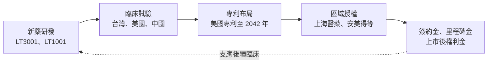
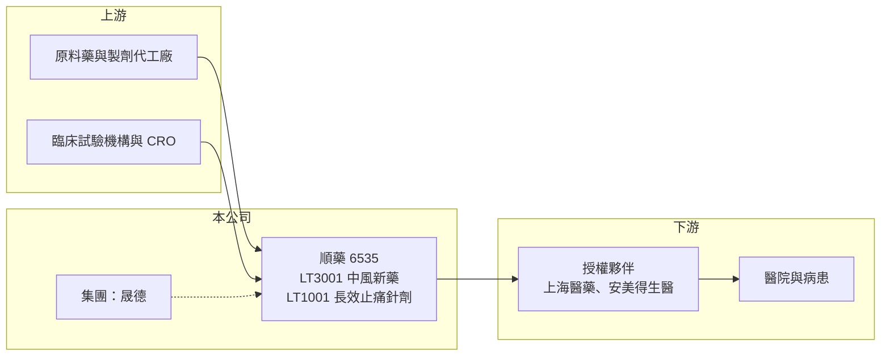

# 6535 順藥

> 上櫃｜[[產業索引-生技醫療業|生技醫療業]]｜上市（櫃）日期 2016/09/26

# 第一章：企業模式與商業藍圖

> [!info] 撰寫說明
> 本文由 Claude 依公開資料整理，架構比照 [[2330台積電]] 的四章研究，資料截至 2026-10-08。財務數字來源：Goodinfo 年度經營績效頁與基本資料頁（含 2026 年公告標題）、櫃買中心開放資料（基本資料、2026 年第二季資產負債與綜合損益、本益比殖利率）、科技新報 2026 年報導標題。標示「憑記憶」的藥品上市年份與授權細節尚未比對原始文件。#待校對

在評估單一個股的長期投資價值時，首要步驟是拆解企業的底層獲利邏輯。本章針對順天醫藥生技（股票代號：6535，以下簡稱順藥）的商業模式進行定性分析，說明這家新藥公司如何以「授權」而非「自行銷售」的方式把研發成果變現，以及它的價值為什麼幾乎完全取決於中風新藥 LT3001 的臨床進度。

## 一、核心定位：以授權為主要變現方式的新藥開發公司

順藥成立於 2000 年，2016 年 9 月上櫃，董事長為王素琦、總經理為葉聖文，實收資本額約 16.8 億元，英文名稱 Lumosa。Goodinfo 基本資料將其主要業務列為新藥開發。公司屬於 [[4123晟德]] 集團的新藥事業（憑記憶，待校對），2026 年 7 月媒體報導晟德加碼投資引正基因，並與順藥一起聚焦中樞神經領域。

順藥的商業模式是典型的[[新藥授權]]：公司負責早期研發與臨床試驗，取得概念驗證後，把特定區域的開發與銷售權授權給大藥廠，收取簽約金、[[里程碑金]]與上市後的[[權利金]]。這種模式不需要自建大型業務團隊與工廠，但收入高度集中在少數授權事件，財報會出現劇烈波動。

## 二、產品管線：兩條主線

* **LT3001（急性缺血性腦中風新藥）：** 公司最核心的資產，目標是在中風後提供兼具溶栓與神經保護效果的治療。2026 年 5 月取得美國給藥方法專利，專利權期至 2042 年；同月 LT3001 多劑量作用機轉探索性臨床試驗通過台灣食藥署審核。中國授權夥伴上海醫藥於 2026 年 6 月完成中國藥監局（NMPA）二／三期臨床試驗諮詢，依 2026 年 5 月報導，中國二／三期無縫試驗規劃於 2026 年下半年啟動。公司並持續尋求其他區域的授權合作。
* **LT1001（長效止痛針劑）：** 已在台灣上市的長效型術後止痛針劑（上市年份憑記憶約 2017 年，待校對），採多國授權經銷模式。2026 年 8 月公司終止與巴基斯坦 AJM Pharma、烏克蘭 Darnytsia 的授權合約，同時與安美得生醫簽訂東南亞市場授權增補協議，顯示公司正在重整這項產品的海外授權布局。
* **外泌體技術：** 2026 年 5 月董事會通過外泌體技術專屬授權契約增補協議，屬於早期平台型技術。

## 三、資本轉化邏輯：研發投入換取授權收入

* **營收極小、費用固定：** 2026 年上半年營收不到 0.1 億元，營業費用約 1.91 億元，主要是研發與臨床支出。授權收入未入帳的年度，財報幾乎只有費用。
* **授權分散臨床成本：** 把中國權利授權給上海醫藥，由夥伴負擔當地臨床費用，是小型新藥公司降低資金壓力的常見做法。

## 四、企業長期藍圖

順藥的長期價值取決於 LT3001 能否完成關鍵臨床試驗並取得藥證。急性缺血性中風是全球主要死因與失能原因之一，現有溶栓藥物的治療時間窗口短且有出血風險，若 LT3001 能證明更好的安全性或更寬的治療窗口，市場潛力很大。但新藥從二期到上市通常還需要多年，期間的臨床失敗風險很高。

# 第二章：護城河深度與競爭優勢

本章分析順藥的競爭優勢。對新藥公司而言，護城河主要來自專利、臨床數據與授權夥伴的品質，而不是現有營收。

## 一、護城河的核心組成要素

* **專利保護：** LT3001 的美國給藥方法專利保護至 2042 年，加上化合物與用途專利，構成產品上市後的獨占期。新藥的價值很大一部分取決於專利剩餘年限。
* **臨床數據累積：** 中風新藥的臨床試驗難度高，能完成早期試驗並與主管機關取得共識，本身就是門檻。上海醫藥完成 NMPA 二／三期諮詢，代表在中國的臨床路徑已初步確立。
* **授權夥伴背書：** 大型藥廠願意授權，代表其評估過藥物的科學價值，也為後續區域授權提供參考。

## 二、全球主要競爭對手格局

| 對手類型 | 代表 | 與順藥的比較 |
|---|---|---|
| 現行溶栓藥物 | 阿替普酶（rt-PA）、替奈普酶 | 標準治療，但治療時間窗口短、有出血風險 |
| 機械取栓 | 血管內取栓器材 | 針對大血管阻塞，效果顯著，但需要具備設備與醫師的醫院 |
| 神經保護新藥 | 國際藥廠與生技公司 | 歷史上多數神經保護藥物在三期臨床失敗，代表此領域難度極高 |
| 台灣新藥公司 | [[4174浩鼎]]、[[4162智擎]]、[[6576逸達]] | 同屬台灣新藥研發，適應症不同，但競爭相同的資本市場資金 |

## 三、優勢轉化：守得住、守不住與觀察重點

* **守得住：** 專利與已建立的中國授權關係，讓 LT3001 在中國的開發有夥伴支撐。
* **守不住：** LT1001 的海外授權。2026 年終止兩國授權，顯示長效止痛針劑在部分市場的商業化不如預期。
* **觀察重點：** 中國二／三期無縫試驗的啟動與收案進度、歐美區域授權是否談成，以及 LT1001 東南亞授權的銷售表現。

# 第三章：財務體質與盈利規模

資料日期：2026-10-08。數字取自 Goodinfo 年度經營績效頁與櫃買中心開放資料，表格是撰寫當時的快照；最新月營收、毛利率、累計 EPS 由自動排程寫在本筆記的屬性欄位（月營收、毛利率、累計EPS 等）。#待校對

財務報表是檢驗護城河是否真實存在的最終標準。對新藥公司而言，損益表的意義有限，重點在於虧損規模、現金能支撐多久，以及研發費用是否投入在關鍵試驗上。

## 一、多年度表格

| 年度 | 營收（新台幣） | [[毛利率]] | [[營業利益率]] | EPS（元） | [[ROE]] |
|---|---|---|---|---|---|
| 2019 | 1.72 億 | 83.4% | -87.2% | -2.05 | -20.8% |
| 2020 | 0.22 億 | 60.8% | -1,578% | -2.67 | -24.5% |
| 2021 | 0.17 億 | 57.0% | -2,478% | 0.64 | 5.18% |
| 2022 | 0.27 億 | 54.7% | -1,148% | -3.05 | -26.6% |
| 2023 | 0.57 億 | 72.9% | -660% | -1.47 | -16.2% |
| 2024 | 0.39 億 | 45.2% | -912% | -2.60 | -26.0% |
| 2025 | 0.36 億 | 61.0% | -931% | -2.05 | -20.1% |
| 2026 上半年 | 0.10 億 | 35.7% | -1,951% | -1.70 | 未查得 |

* **營收：** 年營收多在 0.2 億至 0.6 億元，主要是 LT1001 的銷售與授權收入。2019 年 1.72 億元較高，應包含授權相關收入（推估）。營業利益率動輒負 1,000% 以上，對新藥公司而言不具比較意義。
* **年度虧損：** 每年營業虧損約 3 億至 4 億元（推算：營收乘以營業利益率），這就是公司每年的「燒錢速度」。
* **2021 年轉盈：** 當年營業仍虧損，EPS 卻為正，代表有一次性業外收益（推估，性質待校對）。
* **業外損失：** 2026 年上半年業外損失約 0.97 億元，依 2026 年 8 月媒體報導，主要來自轉投資晟德的帳列虧損，但淨現金流仍為正。

## 二、[[ROE]]、資本結構與研發強度

2021 至 2025 年平均 ROE 約 -16.7%（推算）。2026 年第二季底總資產約 13.7 億元，其中流動資產約 8.0 億元；總負債約 1.24 億元、無非流動負債，權益約 12.5 億元，負債比約 9%（櫃買中心資料）。以每年營業虧損約 3.5 億元估算，流動資產約可支撐兩年多的營運（推算）。研發費用占營業費用的多數，研發費用率以營收計算超過 1,000%，代表公司幾乎完全依賴資本市場與授權收入支應研發。2026 年 4 月董事會決議不繼續辦理 2025 年股東會通過的私募案。股價淨值比約 10.9 倍（櫃買中心資料），市場評價主要反映對 LT3001 的期待。

## 三、[[ROIC]] 與 [[WACC]]：價值創造利差

**ROIC 推算：** 2025 年營收 0.36 億元、營業利益率 -931%，營業損失約 3.35 億元，虧損無所得稅抵減。2026 年第二季底權益約 12.5 億元，無非流動負債，有息負債推估為 0，投入資本約 12.5 億元，ROIC 約 -27%（推算）。

**WACC 推算：** 台灣 10 年期公債殖利率取 1.75%、市場風險溢酬 6%、β 取新藥研發股常見值 1.2（未查得公司實際 β），股東權益成本約 8.95%。公司幾乎沒有有息負債，WACC 約等於股東權益成本，約 9.0%（推算）。

**結論：** ROIC 為負，低於約 9% 的資金成本，這是新藥公司在取得藥證前的常態。順藥能否創造價值，取決於 LT3001 未來的授權與權利金收入，折現後是否超過一路累積的研發投入。

# 第四章：總體風險與地緣政治

任何企業都無法脫離宏觀環境獨立存在。本章分析順藥長期必須面對的臨床、授權、法規與財務風險。

## 一、臨床與科學風險

* **中風新藥的高失敗率：** 急性缺血性中風的新藥開發歷史上失敗案例很多，特別是神經保護類藥物。LT3001 即使早期數據良好，後期大型試驗（如[[三期臨床試驗]]）仍可能無法達到主要療效指標。
* **臨床時程延誤：** 中國二／三期無縫試驗涉及大量收案，收案速度、試驗設計調整都可能延後上市時程。

## 二、地緣政治與授權風險

* **中國市場依賴：** LT3001 目前最明確的臨床路徑在中國，兩岸關係、中國藥價政策（如集中採購與醫保談判）都會影響未來收益。
* **授權關係變動：** 2026 年 LT1001 終止兩國授權，說明授權合作可能因市場或夥伴策略改變而中止。

## 三、財務與集團風險

* **持續燒錢與增資：** 若臨床推進需要更多資金，而授權收入未及時入帳，公司可能需要現金增資，稀釋股東權益。
* **轉投資評價波動：** 持有晟德股票等轉投資，其評價變動會直接影響損益，2026 年上半年即因此擴大虧損。

## 四、法規演進風險

各國對新藥核准的要求持續提高，特別是中風這類重大疾病，主管機關通常要求大型、長期的臨床證據，增加開發成本與時間。

# 專有名詞解析

## 金融

- **[[毛利率]]**：營業毛利占營收的比例，反映產品定價能力與生產成本控制。
- **[[營業利益率]]**：扣除營業費用後的營業利益占營收的比例，衡量本業整體獲利能力。
- **[[ROE]]**：股東權益報酬率，稅後淨利除以股東權益，衡量公司運用股東資金的效率。
- **[[ROIC]]**：投入資本報酬率，稅後營業利益除以股東權益與有息負債的合計，衡量本業對所有資金提供者的報酬。
- **[[WACC]]**：加權平均資金成本，依股東權益與負債的比重加權計算的資金成本，ROIC 高於它才代表創造價值。

## 產業

- **[[新藥授權]]**：新藥公司把特定區域或適應症的開發與銷售權授權給其他藥廠，以換取簽約金、里程碑金與權利金。
- **[[里程碑金]]**：授權合約中，當藥物達成臨床進展、取得藥證或銷售目標等特定里程碑時，被授權方支付的款項。
- **[[權利金]]**：產品上市後，被授權方依銷售額的一定比例持續支付給授權方的費用。
- **[[三期臨床試驗]]**：新藥上市前規模最大的人體試驗，用來確認療效與安全性，結果是申請藥證的主要依據。

# 核心供應鏈

## 1. 上游
- 原料藥與製劑委託生產廠（名稱未查得）
- 臨床試驗醫院與受託研究機構

## 2. 本公司與集團
- 順天醫藥生技：LT3001、LT1001、外泌體技術
- 集團關係：[[4123晟德]]（憑記憶，待校對；2026 年轉投資晟德的帳列損益影響順藥財報）

## 3. 下游／授權夥伴
- 上海醫藥：LT3001 中國授權夥伴
- 安美得生醫：LT1001 東南亞授權（2026 年 8 月增補協議）
- 已終止：巴基斯坦 AJM Pharma、烏克蘭 Darnytsia（2026 年 8 月）

## 4. 同業
- 台灣新藥公司：[[4174浩鼎]]、[[4162智擎]]、[[6576逸達]]

## 最新新聞
<!-- news:start -->
<!-- news:end -->

## 相關連結
- [公開資訊觀測站](https://mopsov.twse.com.tw/mops/web/t05st03?step=1&firstin=1&co_id=6535)
- [Goodinfo](https://goodinfo.tw/tw/StockDetail.asp?STOCK_ID=6535)
- [Yahoo 股市](https://tw.stock.yahoo.com/quote/6535)
- [鉅亨網新聞](https://www.cnyes.com/twstock/6535/news)
