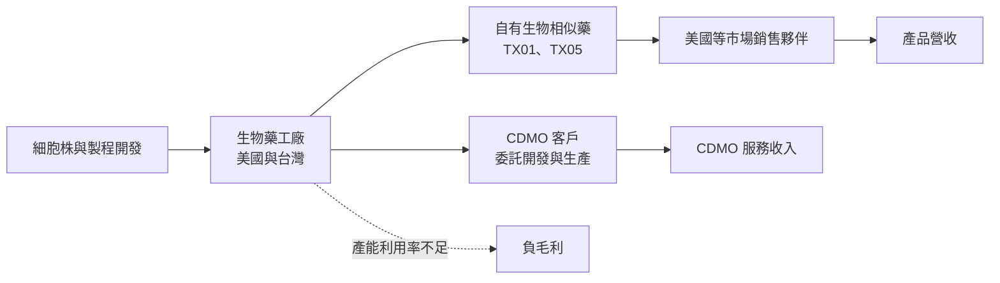
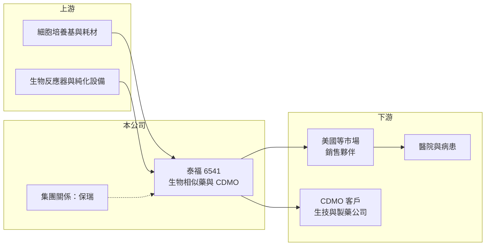

# 6541 泰福-KY

> 上市｜[[產業索引-生技醫療業|生技醫療業]]｜上市（櫃）日期 2017/10/26

# 第一章：企業模式與商業藍圖

> [!info] 撰寫說明
> 本文由 Claude 依公開資料整理，架構比照 [[2330台積電]] 的四章研究，資料截至 2026-10-08。財務數字來源：Goodinfo 年度經營績效頁、證交所開放資料（基本資料、2026 年第二季資產負債、綜合損益與營益分析、股利）、聯合報與旺得富 2026 年 6 月報導標題。標示「憑記憶」的藥證年份、合併案與集團關係尚未比對原始文件。#待校對

在評估單一個股的長期投資價值時，首要步驟是拆解企業的底層獲利邏輯。本章針對泰福生技（股票代號：6541，以下簡稱泰福）的商業模式進行定性分析，說明這家生物相似藥公司如何從單純的藥物開發，轉向「自有產品＋生物藥代工」的雙軌模式，以及為什麼它至今仍處於大幅虧損。

## 一、核心定位：生物相似藥開發商，兼營生物藥 CDMO

泰福是在開曼群島註冊的外國企業，成立於 2013 年，2017 年 10 月在證交所上市，董事長為盛保熙、執行長為官振儀，實收資本額約 26.5 億元，台灣營運據點位於新竹縣竹北。

泰福的核心業務是[[生物相似藥]]：在原廠生物藥專利到期後，開發與原廠藥品高度相似的版本，以較低價格進入市場。代表產品包括白血球生成素 TX01（Filgrastim，在美國以 Nypozi 品名取得 FDA 核准，2024 年，憑記憶，待校對）與乳癌標靶藥 TX05（Trastuzumab，原廠為賀癌平）。2023 年泰福與 [[6472保瑞]] 旗下的生物藥 [[CDMO]] 事業 Bora Biologics 合併（憑記憶，待校對），董事長盛保熙也是保瑞集團的負責人，此後泰福同時經營生物藥委託開發製造服務。

## 二、事業板塊：營收比重未查得

* **自有生物相似藥：** TX01 已在美國取得上市許可（憑記憶，待校對），是目前產品銷售的主要來源。TX05 的美國上市申請進展不順，依 2026 年 6 月媒體報導，TX05 美國上市再受挫，公司預計 7 月底前完成補件。
* **生物藥 CDMO：** 替其他藥廠進行細胞株開發、製程開發與臨床到商業化的生物藥生產，利用自有工廠的產能創造收入。
* **營收結構：** 本次未查得產品別與 CDMO 營收比重，因此不放圓餅圖。2025 年營收 4.01 億元，較 2024 年的 0.35 億元大幅增加；2026 年 1 至 8 月累計營收約 4.80 億元，年增約 250%（證交所資料），營收已進入放量階段。

## 三、資本轉化邏輯：高固定成本的生物藥工廠

* **負毛利的原因：** 2025 年毛利率 -110%、2026 年上半年 -139.4%，營業成本遠高於營收。生物藥工廠的折舊、人員與品質系統成本大多是固定的，產能利用率不足時，這些成本無法被營收分攤，造成毛利為負（推估）。
* **規模是關鍵：** 生物藥 CDMO 與生物相似藥都需要足夠的生產量才能攤平固定成本，營收放大是泰福轉虧的必要條件。

## 四、企業長期藍圖

泰福的長期方向是讓工廠產能填滿：一方面推動 TX05 等自有產品取得美國藥證並放量，另一方面爭取更多 CDMO 客戶。生物藥專利陸續到期與美國推動降低藥價，長期有利生物相似藥的市場擴大；CDMO 則受惠於中小型生技公司委外生產的趨勢。能否把這兩條線同時做起來，決定泰福能否脫離長期虧損。

# 第二章：護城河深度與競爭優勢

本章分析泰福的競爭優勢，說明它在生物相似藥與 CDMO 兩個市場面對的對手，以及目前的護城河處於什麼狀態。

## 一、護城河的核心組成要素

* **美國藥證與 GMP 工廠：** 生物相似藥必須通過美國 FDA 的類似性分析、臨床比較與工廠查核，取得藥證本身就是高門檻。已取證產品與通過查核的工廠，是泰福最主要的資產。
* **生物藥製程能力：** 生物藥以活細胞生產，製程細微差異就會影響產品品質，累積的製程開發經驗可延伸到 CDMO 服務。
* **集團資源：** 與保瑞集團的關係（憑記憶，待校對），在製藥 CDMO 客戶與國際業務上有潛在綜效。

## 二、全球主要競爭對手格局

| 對手 | 定位 | 與泰福的比較 |
|---|---|---|
| Sandoz、Amgen、Celltrion、三星生物製劑 | 國際生物相似藥大廠 | 產品線完整、規模大、通路成熟，是生物相似藥市場的主導者 |
| 三星生物製劑、Lonza、藥明生物 | 國際生物藥 CDMO | 產能規模遠大於泰福，具價格與經驗優勢 |
| [[6589台康生技]] | 台灣生物相似藥與 CDMO | 業務模式最接近，同樣以乳癌標靶生物相似藥與 CDMO 雙軌發展 |
| [[6472保瑞]] | 台灣製藥 CDMO | 集團關係企業（憑記憶，待校對），以小分子製劑為主 |

## 三、優勢轉化：守得住、守不住與觀察重點

* **守得住：** 已取得的美國藥證與工廠資格，是新進者短期無法複製的門檻。
* **守不住：** 價格。生物相似藥上市後通常面臨多家同時競爭，售價逐年下滑，規模小的公司較難靠成本取勝。
* **觀察重點：** TX05 美國藥證進度、CDMO 新客戶與訂單規模，以及毛利率何時轉正。

# 第三章：財務體質與盈利規模

資料日期：2026-10-08。數字取自 Goodinfo 年度經營績效頁與證交所開放資料，表格是撰寫當時的快照；最新月營收、毛利率、累計 EPS 由自動排程寫在本筆記的屬性欄位（月營收、毛利率、累計EPS 等）。#待校對

財務報表是檢驗護城河是否真實存在的最終標準。對仍在商業化初期的生物藥公司而言，重點在於營收能否放量、毛利何時轉正，以及資金能否支撐到損益兩平。

## 一、多年度表格

| 年度 | 營收（新台幣） | [[毛利率]] | [[營業利益率]] | EPS（元） | [[ROE]] |
|---|---|---|---|---|---|
| 2019 | 約 0 | 未查得 | 未查得 | -9.26 | -62.8% |
| 2020 | 約 0 | 47.7% | 不具意義 | -7.84 | -74.5% |
| 2021 | 0.05 億 | 65.7% | 不具意義 | -4.74 | -57.0% |
| 2022 | 0.22 億 | -86.4% | 不具意義 | -4.65 | -78.4% |
| 2023 | 0.61 億 | 97.2% | 不具意義 | -16.58 | -193% |
| 2024 | 0.35 億 | 23.9% | 不具意義 | -8.90 | -161% |
| 2025 | 4.01 億 | -110% | -346% | -6.13 | -45.5% |
| 2026 上半年 | 3.53 億 | -139.4% | -217.2% | -2.91 | 未查得 |

* **營收：** 2024 年以前幾乎沒有營收，2025 年起明顯放量。營收基期太低，營業利益率在 2020 至 2024 年動輒負數千至數十萬個百分點，不具比較意義。
* **虧損規模：** 2025 年稅後淨損約 15.0 億元（證交所股利資料），2026 年上半年稅後淨損約 7.71 億元，虧損規模仍大。2023 年 EPS -16.58 元特別高，可能與合併相關的一次性費用或減損有關（推估）。
* **毛利為負：** 營收放量後毛利率反而轉為大幅負值，代表工廠成本開始計入營業成本，而營收規模還不足以覆蓋。

## 二、[[ROE]]、資本結構與研發強度

2021 至 2025 年平均 ROE 約 -107%（推算），反映多年累積虧損使股東權益持續縮小。截至 2025 年底待彌補虧損約 156 億元（證交所股利資料），2025 年度不配發股利。2026 年第二季底總資產約 76.3 億元，總負債約 26.7 億元（其中非流動負債約 18.5 億元），權益約 49.7 億元，負債比約 35%；流動資產約 12.1 億元。以上半年營業虧損約 7.7 億元估算，流動資產只能支撐不到一年的營運（推算），後續資金需求需要靠增資、借款或集團支持。

## 三、[[ROIC]] 與 [[WACC]]：價值創造利差

**ROIC 推算：** 2025 年營收 4.01 億元、營業利益率 -346%，營業損失約 13.9 億元，虧損無所得稅抵減。2026 年第二季底權益約 49.7 億元，有息負債以非流動負債約 18.5 億元推估，投入資本約 68.1 億元，ROIC 約 -20%（推算）。

**WACC 推算：** 台灣 10 年期公債殖利率取 1.75%、市場風險溢酬 6%、β 取生技研發股常見值 1.2（未查得公司實際 β），股東權益成本約 8.95%。負債成本假設 2.5%、稅後約 2.0%；權益約占 73%、負債約占 27%，WACC 約 7.1%（推算）。

**結論：** ROIC 約 -20%，遠低於約 7% 的資金成本，泰福目前每年都在消耗大量資本。生物藥工廠一旦產能利用率提高，固定成本攤提會快速改善，因此 ROIC 對營收規模非常敏感；但在營收放大到數十億元之前，難以創造正的經濟價值。

# 第四章：總體風險與地緣政治

任何企業都無法脫離宏觀環境獨立存在。本章分析泰福長期必須面對的法規、市場、地緣政治與財務風險。

## 一、地緣政治與政策風險

* **美國藥價與生物相似藥政策：** 美國政府推動降低藥價、簡化生物相似藥審查，長期有利產業，但也會吸引更多競爭者進入，壓低售價。
* **美國製造與關稅：** 美國對藥品進口的關稅與在地生產要求，會影響生物藥 CDMO 的接單與產能配置。

## 二、產業週期與市場結構

* **生物相似藥價格侵蝕：** 同一原廠藥通常有多家生物相似藥競爭，上市後售價逐年下滑，獲利空間受壓。
* **CDMO 需求波動：** 生技公司的委外生產需求受資金環境影響，生技募資冷卻時，CDMO 訂單會延後或取消。

## 三、營運與財務風險

* **藥證進度不確定：** TX05 的美國上市已多次延後，補件後仍可能需要更長的審查時間。
* **資金缺口：** 累積虧損逾百億元，流動資產有限，可能需要持續增資，稀釋既有股東。
* **工廠查核風險：** 生物藥工廠需定期接受 FDA 查核，若發現缺失，可能影響既有產品供貨與 CDMO 客戶信任。

# 專有名詞解析

## 金融

- **[[毛利率]]**：營業毛利占營收的比例，反映產品定價能力與生產成本控制。
- **[[營業利益率]]**：扣除營業費用後的營業利益占營收的比例，衡量本業整體獲利能力。
- **[[ROE]]**：股東權益報酬率，稅後淨利除以股東權益，衡量公司運用股東資金的效率。
- **[[ROIC]]**：投入資本報酬率，稅後營業利益除以股東權益與有息負債的合計，衡量本業對所有資金提供者的報酬。
- **[[WACC]]**：加權平均資金成本，依股東權益與負債的比重加權計算的資金成本，ROIC 高於它才代表創造價值。

## 產業

- **[[生物相似藥]]**：原廠生物藥專利到期後，由其他藥廠開發、與原廠品質與療效高度相似的生物藥，價格通常較低。
- **[[CDMO]]**：委託開發暨製造服務，替藥廠從製程開發到量產一條龍代工，類似製藥業的晶圓代工。

# 核心供應鏈

## 1. 上游
- 細胞培養基、一次性耗材、生物反應器與純化設備供應商（名稱未查得）

## 2. 本公司與集團
- 泰福生技：TX01（Filgrastim）、TX05（Trastuzumab）與生物藥 CDMO
- 集團關係：[[6472保瑞]]（憑記憶，待校對）

## 3. 下游／客戶
- 美國等市場的銷售夥伴與藥品通路
- CDMO 委託客戶（名稱未查得）

## 4. 同業
- 台灣：[[6589台康生技]]
- 國際：Sandoz、Celltrion、三星生物製劑、Lonza、藥明生物

## 最新新聞
<!-- news:start -->
<!-- news:end -->

## 相關連結
- [公開資訊觀測站](https://mopsov.twse.com.tw/mops/web/t05st03?step=1&firstin=1&co_id=6541)
- [Goodinfo](https://goodinfo.tw/tw/StockDetail.asp?STOCK_ID=6541)
- [Yahoo 股市](https://tw.stock.yahoo.com/quote/6541)
- [鉅亨網新聞](https://www.cnyes.com/twstock/6541/news)
