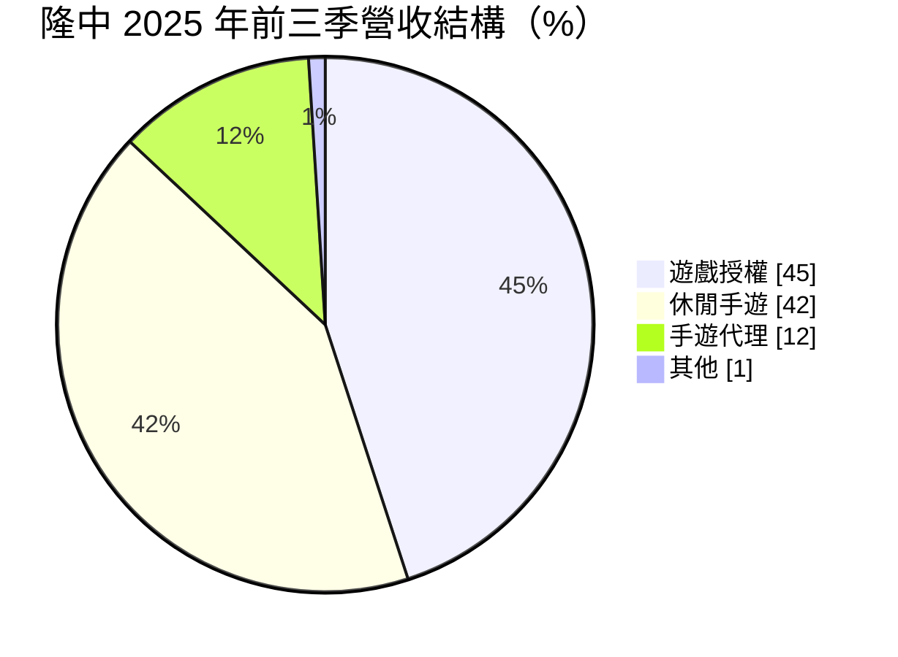
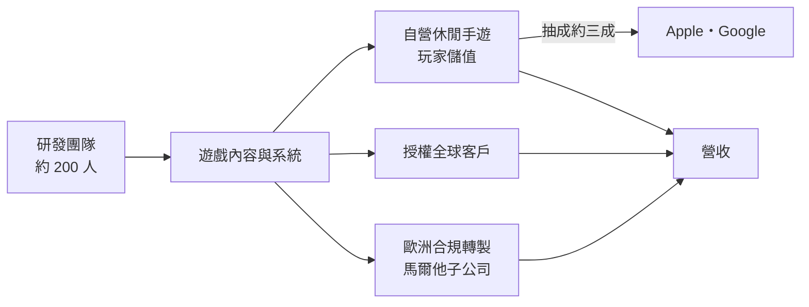
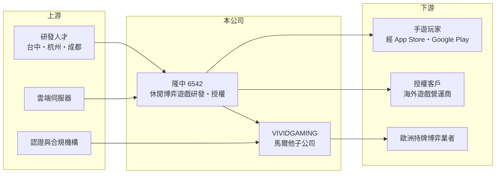

# 6542 隆中

> 上櫃｜[[產業索引-文化創意業|文化創意業]]｜上市（櫃）日期 2016/09/08

# 第一章：企業模式與商業藍圖

> [!info] 撰寫說明
> 精簡版，由 Claude 依公開資料整理，架構比照 [[2330台積電]] 的四章研究，資料截至 2026-10-08。來源：富果 2025 年 11 月 28 日法說會摘要、Goodinfo 年度經營績效頁、櫃買中心開放資料（2026 年第二季綜合損益與資產負債、基本資料、每月營收、本益比殖利率）、CMoney 與 Yahoo 股市新聞標題；法說會摘要為 AI 整理，數字待對照公司簡報。#待校對

隆中網絡（股票代號：6542，以下簡稱隆中）是總部位於台中的遊戲研發公司，主力產品是休閒博弈類手機遊戲與遊戲授權。本章說明它的三種收入來源，以及從[[社交博弈]]走向歐洲真錢市場的策略。

## 一、核心定位：以研發為主的休閒博弈遊戲公司

依櫃買中心資料，隆中成立於 2010 年，2016 年 9 月上櫃，董事長為顧剛維，實收資本額約 4.2 億元。依富果整理的 2025 年 11 月法說會，公司在台中、台北、杭州、成都設有據點，2024 年新增馬爾他據點；員工約 300 人，其中研發人員超過六成、接近 200 人。

隆中的核心產品是《角子共玩》這類以老虎機（角子機）玩法為主的休閒手遊。玩家用虛擬點數遊玩，點數不能兌換現金，因此屬於社交博弈，不需要[[博弈執照]]。公司也把開發好的遊戲內容授權給全球客戶使用，形成「自營加授權」的雙軌模式。

## 二、營收結構

依法說會摘要，2025 年前三季營收比重如下，與前一年同期結構相近：

* **[[遊戲授權]]（45%）：** 開發新遊戲後授權給全球客戶，收取授權金或依營收分潤。授權收入不需負擔玩家行銷與通路抽成，利潤率較高。
* **休閒手遊（42%）：** 以《角子共玩》為核心，收入來自玩家儲值。公司近期完成底層系統重製與升級，以延長產品生命週期。
* **手遊代理（12%）：** 2025 年 10 月重啟代理業務，鎖定女性玩家市場，作為市場測試。

## 三、資本轉化邏輯

隆中的主要成本是研發人力。依法說會摘要，2025 年前三季研發費用約 2.62 億元，高於前一年同期約 2.17 億元，營業費用率約 78.6%。因為毛利率很高（約 76% 至 80%），只要營收增加，獲利就能明顯改善；反之，研發投入擴大期間就容易出現營業虧損。

## 四、企業長期藍圖

依法說會摘要，隆中的長期策略有四個方向：第一，透過系統升級延長《角子共玩》等核心產品的生命週期；第二，以馬爾他子公司 VIVIDGAMING 為基地，申請歐洲[[博弈執照]]，初期與馬爾他、義大利、葡萄牙的持牌業者合作，從社交博弈跨入真錢線上博弈市場；第三，持續開發新遊戲擴大授權客戶；第四，建立 AI 團隊，用於行銷素材製作並導入客服。日本市場的 App 推出後成效不如預期，公司已縮減廣告並改尋求當地合作夥伴。

# 第二章：護城河深度與競爭優勢

在長期價值投資中，「護城河」指企業抵禦競爭、維持超額利潤的保護機制。本章分析隆中的研發與授權能力，以及在全球博弈遊戲市場的競爭位置。

## 一、隆中護城河的核心組成要素

* **1. 博弈玩法的研發累積：** 老虎機類遊戲需要大量的數學模型、美術與機率設計，隆中長期專注這個類型，累積了大量的遊戲內容與底層系統，可以重複用於自營與授權。
* **2. 授權客戶網絡：** 授權占營收近一半，代表公司的遊戲內容已被海外客戶採用。客戶一旦整合隆中的遊戲內容到自家平台，更換供應商需要重新整合與測試，形成轉換成本。
* **3. 研發成本優勢：** 研發據點設在台中與中國大陸，人力成本低於歐美同業，能以較低成本產出大量遊戲內容。

這些優勢屬於窄護城河：博弈遊戲類型競爭激烈，單款遊戲的生命週期有限。

## 二、主要競爭對手格局

| 對手 | 定位 | 對隆中的威脅 |
|---|---|---|
| [[3293鈊象]] | 台灣最大的博弈類手遊開發商，自營《明星三缺一》等 | 在台灣社交博弈市場規模遠大於隆中 |
| [[6482弘煜科]] | 台中遊戲研發公司 | 同為中小型研發商 |
| Playtika、Aristocrat 等國際廠商 | 全球社交博弈與真錢博弈大廠 | 在授權與海外市場競爭 |
| 歐洲博弈內容供應商 | 為持牌業者提供遊戲內容 | 在歐洲市場擁有先行優勢 |

## 三、優勢轉化：哪些守得住、哪些守不住

* **守得住：** 授權客戶關係與遊戲內容庫，以及高毛利的營收結構。
* **守不住：** 平台抽成與雲端成本。法說會指出，雲端伺服器費用上升與儲值管道抽成比例提高，讓 2025 年前三季毛利率年減約 3 個百分點。
* **觀察重點：** 第一，歐洲執照取得後的實際營收貢獻；第二，授權新品在 2026 年上線後的表現；第三，研發費用率能否隨營收成長而下降。

# 第三章：財務體質與盈利規模

資料日期：2026-10-08，表格是撰寫當時的快照；最新月營收、毛利率、累計 EPS 由自動排程寫在本筆記的屬性欄位（月營收、毛利率、累計EPS 等）。#待校對

財務報表是檢驗護城河是否真實存在的最終標準。隆中的數字顯示「毛利率高、費用率也高」的研發型遊戲公司特性。

## 一、多年度經營績效

| 年度 | 營收（新台幣） | [[毛利率]] | [[營業利益率]] | EPS（元） | [[ROE]] |
|---|---|---|---|---|---|
| 2019 | 14.8 億 | 45.6% | 5.92% | -2.55 | -2.08% |
| 2020 | 8.37 億 | 61.5% | 7.34% | 1.20 | 9.11% |
| 2021 | 7.36 億 | 71.2% | -13.0% | -3.89 | -24.6% |
| 2022 | 7.81 億 | 77.7% | 13.8% | 2.35 | 15.5% |
| 2023 | 7.74 億 | 78.6% | 16.0% | 2.43 | 12.7% |
| 2024 | 8.02 億 | 80.2% | 9.77% | 2.03 | 9.64% |
| 2025 | 8.84 億 | 76.5% | 0.59% | 0.02 | -0.55% |
| 2026 上半年 | 5.08 億 | 79.8% | 1.1% | 0.28 | 不適用（半年） |

資料來源：2019 至 2025 年為 Goodinfo 年度經營績效，2026 上半年為櫃買中心開放資料。Goodinfo 頁面的 2019 年 ROE 與 2025 年 ROE 與 EPS 方向不一致，可能為口徑差異（如含非控制權益），使用前應對照年報。

* **毛利率結構改善：** 毛利率從 2019 年約 46% 提升到 2022 年後的 76% 至 80%，反映營收從低毛利業務轉向授權與自營遊戲（推估）。
* **費用侵蝕：** 2025 年研發投入擴大，營業利益率降到 0.59%，獲利幾乎打平。
* **長期指標：** 2021 至 2025 年平均 ROE 約 2.5%（推算）；2020 至 2025 年營收年複合成長率約 1.1%（推算），營收規模多年持平。

## 二、資產負債與股利

依櫃買中心資料，2026 年第二季底總資產約 9.41 億元，其中流動資產約 8.05 億元；負債約 1.56 億元，權益總計約 7.85 億元（歸屬母公司約 7.05 億元），財務結構穩健、幾乎沒有借款（推估）。最近一次現金股利約每股 0.02 元（櫃買中心資料），Goodinfo 統計歷年平均現金股利約 0.72 元。

## 三、[[ROIC]] 與 [[WACC]]

**ROIC 推算：** 2025 年營業利益約 0.05 億元（8.84 億元 × 0.59%），稅後約 0.04 億元；投入資本以權益總計約 7.85 億元計（有息負債推估極低，以 0 計），ROIC 約 0.5%（推算）。以 2021 至 2025 年平均營業利益約 0.44 億元計算，平均 ROIC 約 4.4%（推算）。

**WACC 推算：** 假設台灣 10 年期公債殖利率 1.75%、市場風險溢酬 6%、β 取遊戲同業常見值 1.0（假設），權益成本約 7.75%；公司幾乎無借款，WACC 約 7.75%（推算）。

**結論：** 隆中近五年的 ROIC 低於 WACC，即使在 2022 至 2023 年獲利較好的年度，ROIC 也只約 11% 至 13%（推算）。高毛利沒有轉成高資本報酬，關鍵在於研發費用率過高；歐洲市場若能帶來新營收，營運槓桿才可能讓 ROIC 回到資金成本以上。

# 第四章：總體風險與地緣政治

任何企業都無法脫離宏觀環境獨立存在。本章分析隆中長期必須面對的法規、產業與營運風險。

## 一、法規風險

* **博弈監管：** 真錢博弈在各國受嚴格監管，執照申請、遊戲認證與合規要求的變動，會直接影響歐洲布局的時程與成本。法說會時馬爾他執照仍在申請中。
* **社交博弈的法律定位：** 各國對虛擬點數博弈遊戲的看法不一，若被認定為賭博或受到更嚴格的消費者保護規範，自營手遊可能受影響。

## 二、產業與營運風險

* **平台抽成：** 透過 Apple 與 Google 儲值須支付約三成抽成，抽成比例提高會直接壓縮毛利率。
* **雲端成本：** 伺服器費用上升已影響 2025 年毛利率。
* **單一產品依賴：** 自營手遊以《角子共玩》為核心，產品老化時營收會下滑。
* **海外拓展：** 日本市場成效不如預期，顯示跨市場複製並不容易。

## 三、地緣政治

* **兩岸據點：** 研發據點位於杭州與成都，兩岸關係與中國對遊戲、資料的監管政策，可能影響研發營運。

# 專有名詞解析

## 金融

- **[[ROIC]]**：投入資本報酬率，稅後營業利益除以股東權益與有息負債的合計，衡量本業對所有資金提供者的報酬。
- **[[WACC]]**：加權平均資金成本，依股東權益與負債的比重加權計算的資金成本，ROIC 高於它才代表創造價值。

## 產業

- **[[社交博弈]]**：玩家以虛擬點數遊玩博弈玩法、不能兌換真錢的遊戲，通常不受博弈執照規範。
- **[[博弈執照]]**：各國主管機關核發、允許業者合法提供真錢博弈服務的許可，取得前須通過公平性與技術稽核。
- **[[遊戲授權]]**：遊戲開發商把遊戲內容授權給其他營運商或平台使用，收取授權金或依營收分潤。

# 核心供應鏈

## 1. 上游
- 研發人力、雲端伺服器服務、博弈遊戲認證與合規機構

## 2. 本公司
- 隆中：休閒博弈手遊《角子共玩》、遊戲授權、手遊代理
- 子公司：VIVIDGAMING（馬爾他）

## 3. 下游
- 全球授權客戶、歐洲持牌博弈業者、手遊玩家

## 4. 同業
- [[3293鈊象]]、[[6482弘煜科]]、Playtika、Aristocrat

## 最新新聞
<!-- news:start -->
<!-- news:end -->

## 相關連結
- [公開資訊觀測站](https://mopsov.twse.com.tw/mops/web/t05st03?step=1&firstin=1&co_id=6542)
- [Goodinfo](https://goodinfo.tw/tw/StockDetail.asp?STOCK_ID=6542)
- [Yahoo 股市](https://tw.stock.yahoo.com/quote/6542)
- [鉅亨網新聞](https://www.cnyes.com/twstock/6542/news)
