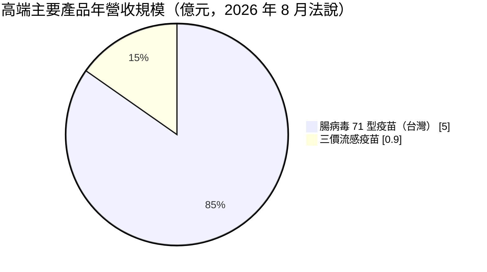
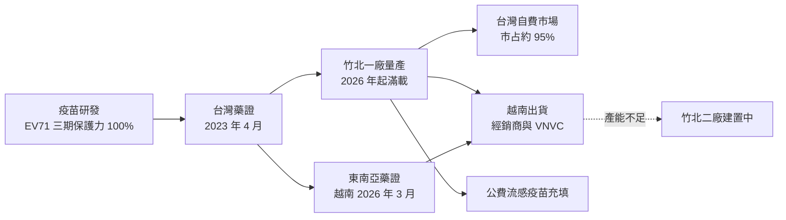
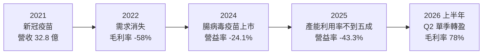
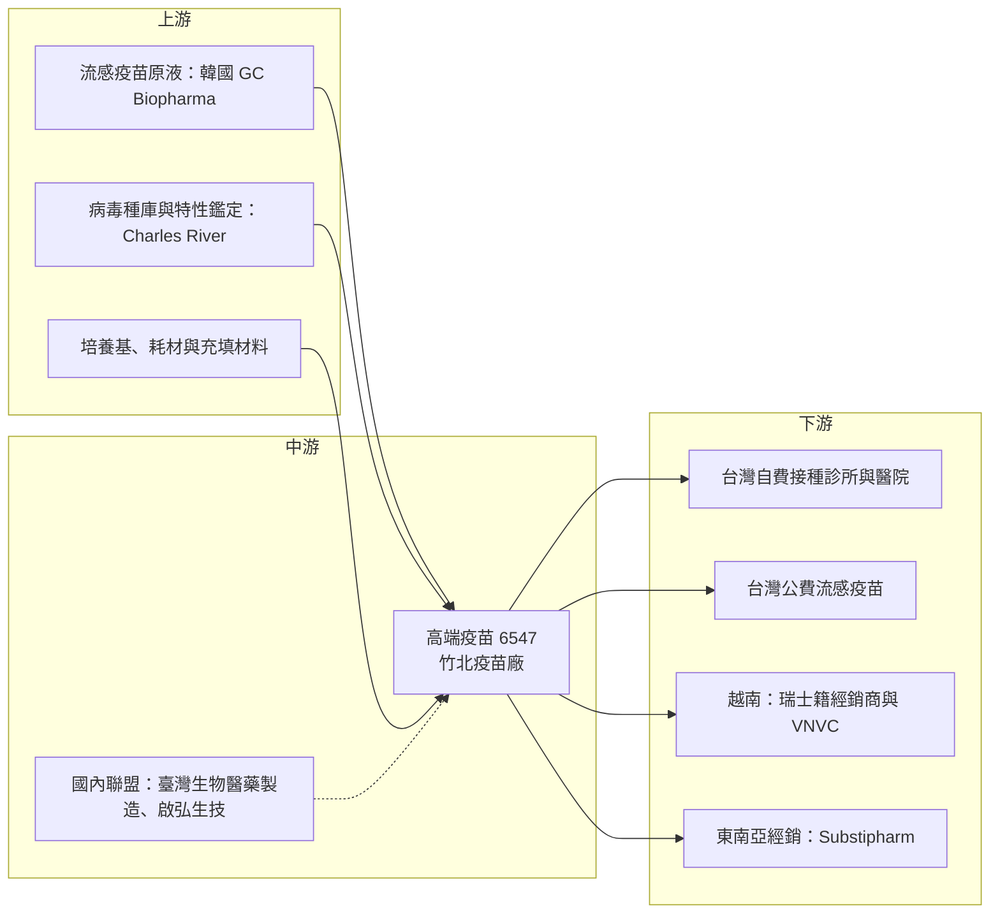

# 6547 高端疫苗

> 上櫃｜[[產業索引-生技醫療業|生技醫療業]]｜上市（櫃）日期 2018/04/17

# 第一章：企業模式與商業藍圖

> [!info] 撰寫說明
> 本文由 Claude 依公開資料整理，架構比照 [[2330台積電]] 的四章研究，資料截至 2026-10-08。財務數字來源：Goodinfo 年度經營績效頁、櫃買中心開放資料（基本資料、綜合損益、資產負債）、富果研究 2026 年 8 月法說會整理、旺得富（2023 年 4 月腸病毒疫苗藥證報導）、科技新報（2025 年 1 月 Substipharm 合作報導）；產業描述為整理性內容，尚未逐條比對原始文件。#待校對

高端疫苗是台灣投資人最熟悉的生技公司之一，因為新冠疫情期間它曾站上舞台中央。但若要評估它的長期價值，必須把那段一次性的經歷放在一旁，看它真正可以持續經營的事業是什麼。本章針對高端疫苗生物製劑（股票代號：6547，以下簡稱高端）的商業模式進行定性分析，說明它如何從新冠疫苗的大起大落，轉向以腸病毒疫苗為核心、往東南亞擴張的疫苗廠。

## 一、核心定位：台灣少數具備疫苗研發與量產能力的公司

高端成立於 2012 年，2018 年在櫃買中心掛牌，2026 年第二季底實收資本額約 32.9 億元（櫃買中心基本資料），廠區位於新竹縣竹北生醫園區。疫苗是高度管制的產品，從研發、臨床、工廠認證到批次放行都需要主管機關審查，台灣具備人用疫苗量產能力的公司屈指可數。

高端的發展可以分成三個階段：

* **新冠疫苗時期（2021 至 2022 年）：** 2021 年供應台灣的新冠疫苗，使當年營收跳升到約 32.8 億元、EPS 6.65 元；2022 年需求消失，營收降到約 3.65 億元，毛利率為 -58%（Goodinfo）。公司法說會在問答中說明了該疫苗未完成三期臨床的原因（富果研究，2026 年 8 月）。這段經歷證明了高端的量產能力，但不是可持續的事業。
* **腸病毒疫苗時期（2023 年起）：** 2023 年 4 月 12 日，高端的腸病毒 71 型疫苗取得台灣藥證，是國內第一個以完整三期臨床有效性數據核准的腸病毒疫苗；三期試驗保護力 100%，數據刊登於《刺胳針》期刊（旺得富，2023 年 4 月）。這是高端第一個長期性的核心產品。
* **海外擴張時期（2026 年起）：** 2026 年 3 月 17 日取得越南藥證，是當地首家且唯一獲准的腸病毒疫苗，8 月起分批出貨（富果研究，2026 年 8 月法說）。

## 二、終端應用／產品板塊：腸病毒疫苗為主、流感疫苗為輔

依富果研究整理的 2026 年 8 月法說內容，高端主要產品的年營收規模如下（越南訂單 2026 年第三季起才開始貢獻，尚未計入）：

* **腸病毒 71 型疫苗（恩穩健）：** 適用於 2 個月至 6 歲以下幼兒，台灣市占率約 95%，年營收約 5 億元，上市以來施打近 60 萬劑。公司已向食藥署申請把適用年齡擴大到 10 歲以下。腸病毒 71 型是造成幼兒重症的主要腸病毒型別，台灣家長的接種意願高，但台灣出生人數有限，市場規模受到人口限制。
* **三價流感疫苗（福喜健）：** 供應台灣公費流感疫苗市場，年營收約 9,000 萬元。這項產品採用進口韓國 GC Biopharma 的原液在台灣充填，屬於[[代充填]]性質，利潤較低，但可以提高工廠利用率。
* **越南與東南亞市場：** 越南訂單透過瑞士籍經銷商出貨，並與越南最大的疫苗接種機構 VNVC 合作。泰國、馬來西亞、菲律賓已送件，預估 2027 年底左右可能取得藥證；印尼與新加坡則準備送件（富果研究）。2025 年 1 月另與法國 Substipharm Biologics 簽署東南亞區域經銷合作（科技新報，2025 年 1 月）。

## 三、資本轉化邏輯（營運模式）：以台灣藥證打開東南亞市場

* **固定成本攤提決定獲利：** 疫苗廠的折舊、品管與人員成本大多是固定的，產能利用率高低直接決定毛利率。2025 年產能利用率低於 50%，2026 年越南訂單投產後一廠滿載，毛利率升到 80% 以上，第二季單季轉虧為盈（富果研究，2026 年 8 月法說）。
* **台灣臨床數據作為國際敲門磚：** 東南亞是腸病毒 71 型的流行區，但多數國家沒有自己的疫苗。高端以台灣藥證與《刺胳針》刊登的臨床數據向各國申請藥證，省去在每個國家重做大型三期試驗的成本。
* **產能是成長瓶頸：** 一廠滿載後已成為越南市場的主要限制，腸病毒與流感疫苗換線還需要 7 至 8 天的清線消毒。竹北二廠已啟動建置，完工年份未查得。

## 四、企業長期藍圖：第二代多價腸病毒疫苗與區域擴張

* **第二代多價腸病毒疫苗：** 近年克沙奇病毒（CVA6、CVA10、CVA16）流行，高端正開發同時涵蓋多種腸病毒型別的第二代疫苗，與美國 Charles River 合作建置病毒種庫，並與臺灣生物醫藥製造公司、啟弘生技組成國內聯盟開發製程（富果研究）。若成功，可把單價與市場規模同時提高。
* **東南亞多國上市：** 從越南開始，逐步擴展到泰國、馬來西亞、菲律賓、印尼與新加坡。這些國家的出生人數遠多於台灣，是高端長期成長的主要來源。
* **資金彈性：** 公司已取得私募額度但尚未執行，表示沒有立即執行的壓力（富果研究），可作為二廠建置或新產品開發的備用資金來源。

# 第二章：護城河深度與競爭優勢

在長期價值投資中，「護城河」指企業抵禦競爭、維持超額利潤的保護機制。疫苗是法規門檻最高的藥品類別之一，本章分析高端在腸病毒疫苗市場的優勢、主要競爭對手，以及這些優勢的邊界。

## 一、高端護城河的核心組成要素

* **1. 法規與臨床門檻：** 疫苗是給健康幼兒施打的產品，主管機關對安全性與有效性的要求極高。高端以完整三期臨床、100% 保護力取得藥證，這份臨床數據本身就是進入其他國家的通行證，新進者需要數年與大量資金才能複製。
* **2. 先行者優勢：** 在台灣市占率約 95%，在越南是首家且唯一獲准的腸病毒疫苗（富果研究）。疫苗接種一旦被納入醫師與家長的接種習慣，後來者要改變既有選擇並不容易。
* **3. 疫苗量產與品管能力：** 新冠疫苗期間建立的量產經驗、品管系統與工廠認證，是台灣少有的疫苗製造能力。疫苗的製程就是產品，不是任何藥廠都能代工生產。

## 二、全球主要競爭對手格局

| 對手 | 定位 | 對高端的威脅 |
|---|---|---|
| 安特羅生技 | 台灣另一家腸病毒 71 型疫苗廠 | 在台灣與海外市場直接競爭，2023 年報導即指出台灣有 2 家廠商準備推出 |
| 中國腸病毒 71 型疫苗廠 | 2023 年時全球僅中國 3 家廠商的 EV71 疫苗已上市（旺得富） | 產能大、價格低，可能以價格競爭東南亞市場 |
| [[4142國光生]] | 台灣流感疫苗廠 | 在台灣公費流感疫苗標案中競爭 |
| 國際疫苗大廠 | 流感與其他兒童疫苗 | 資源與產品線遠大於高端，若投入多價腸病毒疫苗會形成強大競爭 |

## 三、優勢轉化：哪些市場守得住、哪些守不住

* **守得住：** 台灣腸病毒疫苗自費市場，以及已取得首家藥證的越南市場。這些市場高端已建立先行者地位與臨床口碑，短期內不易被取代。
* **守不住：** 流感疫苗充填業務與價格敏感的公費標案。這類業務技術門檻較低、價格由標案決定，利潤有限。此外，若中國廠商以低價進入東南亞市場，高端在海外的定價也會受壓。
* **觀察重點：** 第一，越南出貨的實際規模與毛利率；第二，泰國、馬來西亞、菲律賓的藥證進度；第三，竹北二廠的完工時程。三者共同決定高端能否從「台灣單一市場」轉型為「區域型疫苗廠」。

# 第三章：財務體質與盈利規模

資料日期：2026-10-08。數字取自 Goodinfo 年度經營績效頁、櫃買中心開放資料（綜合損益、資產負債）與富果研究法說會整理，表格是撰寫當時的快照；最新月營收、毛利率、累計 EPS 由自動排程寫在本筆記的屬性欄位（月營收、毛利率、累計EPS 等）。#待校對

高端正處於從虧損走向損益兩平的轉折點。本章依生技公司的特性，把重點放在營收與費用結構、現金燃燒與可支應年數、產品上市進度，以及資本報酬。

## 一、獲利能力的基石：營收與三率

| 年度 | 營收（新台幣） | [[毛利率]] | [[營業利益率]] | EPS（元） | [[ROE]] |
|---|---|---|---|---|---|
| 2019 | 0.01 億 | 100% | 未具意義 | -3.97 | -41.5% |
| 2020 | 0.12 億 | 66.4% | 未具意義 | -3.61 | -29.9% |
| 2021 | 32.8 億 | 70.3% | 29.4% | 6.65 | 36.1% |
| 2022 | 3.65 億 | -58.2% | -421% | -4.56 | -30.4% |
| 2023 | 3.9 億 | 59.1% | -312% | -3.53 | -26.1% |
| 2024 | 6.06 億 | 65.5% | -24.1% | -0.24 | -2.09% |
| 2025 | 6.13 億 | 59.5% | -43.3% | -0.86 | -7.69% |
| 2026 上半年 | 2.21 億 | 78.28% | -4.77% | -0.02 | 未查得 |

註：2019 至 2025 年取自 Goodinfo 年度經營績效，2019 與 2020 年營收極小，營業利益率為數千至數萬個百分點的負值，故不列出；2026 上半年取自櫃買中心綜合損益開放資料推算。

* **營收結構：** 2024 年起營收穩定在每年約 6 億元，主要由台灣腸病毒疫苗約 5 億元與流感疫苗約 0.9 億元組成。2026 年第三季起越南出貨將成為新的成長來源。
* **[[毛利率]]與產能利用率：** 疫苗廠固定成本高，2025 年產能利用率不到五成時毛利率約 59.5%；2026 年越南訂單投產、工廠滿載後，上半年毛利率升到約 78%，第二季單季超過 80%（富果研究）。
* **[[營業利益率]]：** 營業費用包含研發、品管與管理費用，2026 年上半年營業費用約 1.84 億元、營業毛利約 1.73 億元（櫃買中心綜合損益），已接近損益兩平。

## 二、[[ROE]] 與現金燃燒：可支應年數

* **ROE：** 除 2021 年新冠疫苗年度外，高端歷年 ROE 皆為負，但虧損幅度從 2022 年的 -30.4% 大幅收斂到 2024 至 2025 年的 -2% 至 -8%。
* **現金燃燒：** 2025 年營業淨損約 2.65 億元（營收 6.13 億元 × 營業利益率 -43.3%，推算），2026 年上半年營業淨損僅約 0.1 億元。燃燒速度已大幅下降。
* **可支應年數：** 2026 年第二季底流動資產約 28 億元，流動負債僅約 1.25 億元（櫃買中心資產負債資料）。即使以 2025 年每年約 2.65 億元的營業淨損計算，流動資產約可支應 10 年以上（推算，未扣除二廠建置的資本支出）。對一家生技公司而言，高端的財務壓力相對小。

## 三、資本支出與產品上市進度

二廠建置是未來幾年最主要的資本支出，具體金額未查得；2026 年第二季底非流動負債約 10.8 億元（櫃買中心資產負債資料），推估包含與廠房相關的長期借款（推估）。產品進度如下：

| 項目 | 進度 | 時間與來源 |
|---|---|---|
| 腸病毒 71 型疫苗台灣藥證 | 已取得 | 2023 年 4 月 12 日（旺得富） |
| 適用年齡擴大至 10 歲以下 | 已向食藥署申請 | 富果研究，2026 年 8 月法說 |
| 越南藥證 | 已取得，8 月起出貨 | 2026 年 3 月 17 日（富果研究） |
| 泰國、馬來西亞、菲律賓藥證 | 審查中 | 預估 2027 年底前後（富果研究） |
| 印尼、新加坡 | 準備送件 | 富果研究 |
| 第二代多價腸病毒疫苗 | 開發中 | 無明確上市年份（富果研究） |

## 四、[[ROIC]] 與 [[WACC]]：價值創造利差

**ROIC 推算：** 2025 年營業淨損約 2.65 億元，虧損情況下不計所得稅。2026 年第二季底權益總計約 35.6 億元，非流動負債約 10.8 億元，假設其中約 10 億元為有息負債（推估），投入資本約 45.6 億元，ROIC 約 -5.8%（推算）。若以 2026 年上半年的營業淨損約 0.1 億元年化，ROIC 約 -0.5%（推算），已接近損益兩平。

**WACC 推算：** 假設台灣 10 年期公債殖利率 1.75%、市場風險溢酬 6%、β 取生技股常見值 1.2（假設值），股東權益成本約 8.95%。負債成本假設 2.5%、稅後約 2.0%；權益約占 78%、負債約占 22%，WACC 約 7.4%（推算）。

**結論：** 高端目前的 ROIC 仍低於 WACC，尚未創造股東價值，但差距正在快速縮小。若越南出貨與東南亞藥證順利推進，並讓工廠持續滿載，ROIC 有機會在未來幾年轉正並逐步接近 WACC；二廠完工後若產能無法被訂單填滿，則可能再次拉低資本報酬。

# 第四章：總體風險與地緣政治

任何企業都無法脫離宏觀環境獨立存在。本章分析高端未來必須面對的地緣政治、產業週期、營運環境以及法規演進。

## 一、地緣政治

* **東南亞市場的政策風險：** 各國疫苗採購常與政府政策、國家免疫計畫與外交關係有關。若中國廠商以政府間合作方式進入東南亞，高端的海外擴張可能受阻。
* **台灣生產集中：** 所有產能都在竹北，供應海外市場也完全依賴台灣工廠，若台灣發生供電、天災或區域衝突，海外供貨會中斷。

## 二、產業週期與市場結構

* **少子化：** 台灣出生人數逐年下降，腸病毒疫苗的國內市場規模會隨之縮小。這也是高端必須往東南亞擴張的根本原因。
* **疫情的一次性需求：** 新冠疫苗的經驗顯示，疫情帶來的需求來得快、去得也快。投資人在評估疫苗公司時，應以常規疫苗的經常性需求為基礎，而不是以疫情高峰為基準。
* **腸病毒流行週期：** 腸病毒疫情有大小年之分，流行年份的接種意願通常較高，可能讓營收出現年度波動。

## 三、營運環境的隱性風險

* **產能瓶頸與換線：** 一廠已滿載，腸病毒與流感疫苗換線需要 7 至 8 天，若二廠延誤，越南與其他新市場的需求將無法完全滿足。
* **經銷依賴：** 海外銷售透過經銷商與當地接種機構，高端對終端定價與推廣的掌控力有限。
* **品質事件風險：** 疫苗施打於健康幼兒，任何品質或安全事件都可能對品牌造成長期傷害。

## 四、科技或法規演進

* **多價疫苗的技術趨勢：** 兒童疫苗的發展方向是把多種抗原合併成一劑，減少注射次數。若競爭者先推出涵蓋多種腸病毒型別的疫苗，單價 EV71 疫苗的市場可能被取代，這也是高端積極開發第二代多價疫苗的原因。
* **各國審查制度：** 東南亞各國的藥證審查約需 2 年，且常要求當地臨床或額外資料，審查時程的不確定性會影響擴張節奏。

# 專有名詞解析

## 金融

- **[[產能利用率]]**：實際產量占總產能的比例，固定成本高的工廠毛利率高度取決於此數字。
- **[[私募]]**：公司以非公開方式向特定投資人發行股票或債券籌資，股票通常有三年閉鎖期。
- **[[ROE]]**：股東權益報酬率，稅後淨利除以股東權益，衡量公司運用股東資金賺錢的效率。
- **[[ROIC]]**：投入資本報酬率，稅後營業利益除以股東權益加有息負債，衡量本業運用全部資本的效率。
- **[[WACC]]**：加權平均資金成本，股東權益成本與負債成本依資本結構加權的平均值，是投資報酬的最低門檻。

## 產業

- **[[腸病毒71型]]**：腸病毒的一種，可能引發幼兒腦炎、心肌炎等重症，是亞洲幼兒腸病毒重症的主要病原。
- **[[克沙奇病毒]]**：腸病毒的一群，常引起手足口病與疱疹性咽峽炎，近年 CVA6、CVA10、CVA16 等型別流行。
- **[[代充填]]**：向其他藥廠購入疫苗或藥品原液，在自家工廠完成分裝、充填與包裝後銷售的生產方式。
- **[[三期臨床試驗]]**：新藥或疫苗上市前規模最大的人體試驗，用來確認有效性與安全性，結果是申請藥證的主要依據。
- **[[多價疫苗]]**：一劑同時涵蓋多種病原或型別抗原的疫苗，可減少注射次數並提高保護範圍。
- **[[少子化]]**：出生人數持續下降的人口趨勢，會縮小幼兒疫苗、教育、嬰幼兒用品等產業的國內市場。

# 核心供應鏈

## 1. 上游：原液、種庫與耗材
- 流感疫苗原液：GC Biopharma（韓國）
- 病毒種庫建置：Charles River（美國）
- 培養基與耗材：國際供應商（未逐一查證）

## 2. 中游：高端本身與合作夥伴
- 疫苗研發與生產：高端（竹北一廠、二廠建置中）
- 製程開發聯盟：臺灣生物醫藥製造、啟弘生技
- 台灣疫苗同業：[[4142國光生]]、安特羅生技

## 3. 下游：接種通路
- 台灣：自費接種院所、公費流感疫苗採購
- 越南：瑞士籍經銷商、VNVC
- 東南亞其他國家：Substipharm Biologics 等經銷夥伴

## 最新新聞
<!-- news:start（自動產生，請勿手動編輯此範圍） -->
- 2026-10-08 📰 媒體 19:51｜營收速報 - 高端疫苗(6547)9月營收2.07億元年增率高達98.84％｜[鉅亨網](https://news.cnyes.com/news/id/6625900)

完整紀錄：[[6547高端疫苗 新聞]]
<!-- news:end -->

## 相關連結
- [公開資訊觀測站](https://mopsov.twse.com.tw/mops/web/t05st03?step=1&firstin=1&co_id=6547)
- [Goodinfo](https://goodinfo.tw/tw/StockDetail.asp?STOCK_ID=6547)
- [Yahoo 股市](https://tw.stock.yahoo.com/quote/6547)
- [鉅亨網新聞](https://www.cnyes.com/twstock/6547/news)
