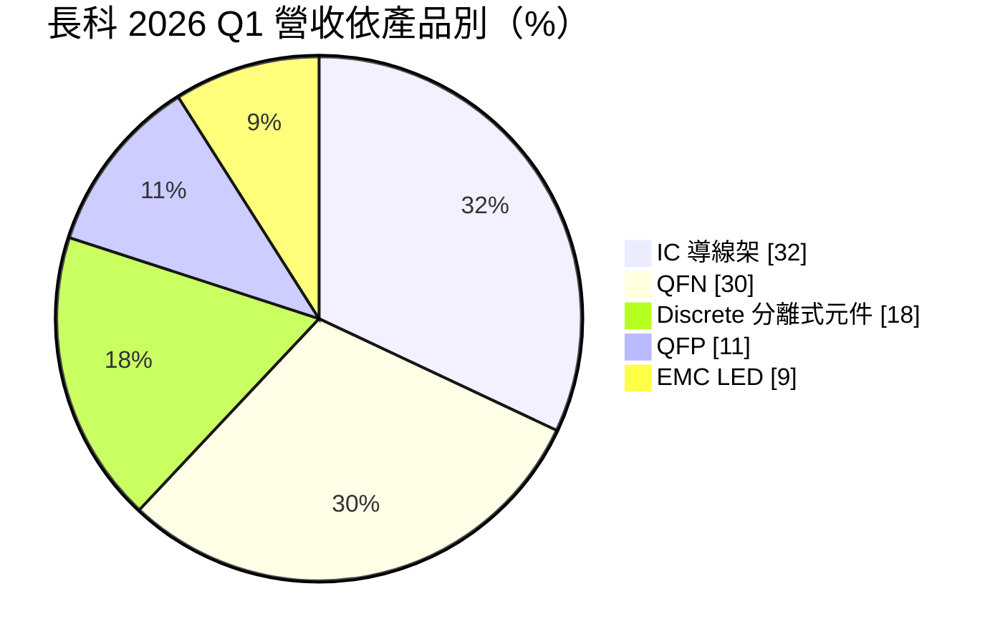
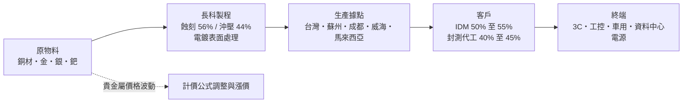
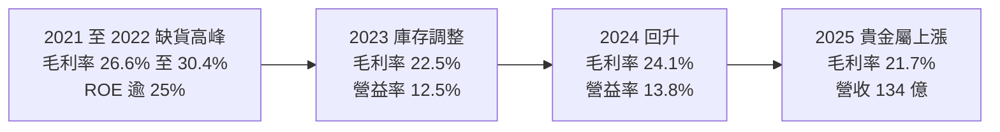
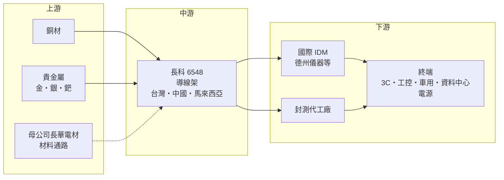

# 6548 長科

> 上櫃｜[[產業索引-半導體業|半導體業]]｜上市（櫃）日期 2016/09/13

# 第一章：企業模式與商業藍圖

> [!info] 撰寫說明
> 本文由 Claude 依公開資料整理，架構比照 [[2330台積電]] 的四章研究，資料截至 2026-10-08。財務數字來源：Goodinfo 年度經營績效與股利政策頁、MoneyDJ 資產負債表與現金流量表、Yahoo 股市公司基本資料、富果研究 2025 年第三季與 2026 年第一季法說會整理、經濟日報、中央社、自由時報報導；產業描述為整理性內容，尚未逐條比對原始文件。#待校對

在評估一家公司的長期價值時，第一步是看懂它的產品在供應鏈中扮演什麼角色。本章針對長華科技（股票代號：6548，股票簡稱長科*，以下簡稱長科）的商業模式進行定性分析，說明一家生產「晶片骨架」的材料廠，如何透過併購與多地擴產，成為全球主要的導線架供應商。

## 一、核心定位：全球前段班的導線架供應商

長科成立於 2009 年，總部位於高雄楠梓加工出口區，2016 年上櫃，母公司是半導體材料通路與製造商長華電材（股票簡稱長華*）。目前董事長為陳志宏，總經理為洪全成，創辦人為黃嘉能。

長科的產品是[[導線架]]。晶片本身是一小片矽，無法直接焊到電路板上，必須先固定在一個金屬框架上，再用細線把晶片的電極連到框架的引腳，最後用塑膠封起來。這個金屬框架就是導線架，它同時負責支撐晶片、傳導電訊號與散熱。電源管理晶片、功率元件、車用晶片、LED 等大量使用傳統封裝的產品，都需要導線架。

依中央社 2022 年報導，長科的 IC 導線架全球市占率約 11%，是全球第二大 IC 導線架供應商。2018 年，長科完成收購日本住友金屬礦山的導線架事業，取得日系技術、客戶與海外產能，這是公司從台灣廠商躍升為全球供應商的關鍵一步。

## 二、產品板塊：IC 導線架與 QFN 為兩大主力

依富果研究整理的 2026 年第一季法說會資料：

* **IC 導線架：** 用於各種積體電路的傳統封裝，是長科的基本盤。
* **[[QFN]]：** 一種無引腳、底部散熱的小型封裝，適合電源與網通晶片。2025 年第四季 QFN 首度成為最大產品線，需求來自網通與資料中心電源，產能已滿載。
* **Discrete（分離式元件）：** 用於 [[MOSFET]] 與二極體等功率元件的導線架。
* **[[QFP]]：** 引腳在四周的封裝，多用於車用 [[MCU]]，近年隨車用需求放緩而轉弱。
* **EMC LED：** 以環氧樹脂成型的 LED 導線架，是毛利率最高的產品線。

依製程，[[蝕刻]]型導線架約占 56%、[[沖壓]]型約占 44%；依應用，3C 消費性約 47%、工業控制約 26%、車用約 24%；依客戶類型，[[IDM]] 約 50% 至 55%，封測代工廠（[[OSAT]]）約 40% 至 45%。法說會資料提到 德州儀器 等國際 IDM 是重要客戶。

## 三、資本轉化邏輯：材料加工、規模與貴金屬轉嫁

* **兩種製程：** 沖壓是用模具把銅片沖出形狀，適合大量、引腳較粗的產品；蝕刻是用化學藥水把銅片蝕刻出細線路，適合引腳細密的 QFN 與高階 IC。蝕刻導線架技術門檻較高，長科持續擴充蝕刻產能，2022 年時規劃由 2020 年約 4,800 萬條擴增到 2025 年 1 億 3,000 萬條。
* **貴金屬是成本關鍵：** 導線架表面要電鍍金、銀、鈀等貴金屬，以確保焊接品質與耐腐蝕。2025 年第四季起貴金屬價格大漲，壓縮了毛利率。長科的做法是與 IDM 客戶協商修改計價公式、與封測廠客戶按季檢討價格，但由於訂單交期長達約 21 週，調價與成本上升之間約有一季的時間差。
* **規模經濟：** 導線架單價低、量大，生產效率與良率決定獲利。長科在多個據點同時生產，可以把高階產品放在台灣、大量產品放在中國與馬來西亞，依客戶需求分配產能。

## 四、企業長期藍圖：中國加一的三地擴產

依 2026 年第一季法說會資料，長科正在三地同步擴產：

* **台灣：** 定位為技術中心，以擴線方式提升產能，新的 QFN 產線預計 2026 年第四季開出。
* **馬來西亞：** 第一期已完成，第二期於 2026 年 3 月動工，預計 2027 年第三季貢獻營收，完成後馬來西亞總產能翻倍。設廠主要因應歐美 IDM 客戶在東南亞的產能需求。
* **中國威海：** 新設廠區，產能為現有中國產能的兩倍，完成後中國總產能變為三倍，最快 2026 年底至 2027 年初貢獻營收。公司認為全球近半數新建成熟製程晶圓廠位於中國，中國將成為最大的導線架市場。
* **高壓直流電源相關產品：** 資料中心 800 伏特 [[HVDC]] 電源的功率元件需要特殊表面處理的導線架，平均單價比一般產品高 30% 至 50%，約占營收 6% 至 8%。法說會資料提到，長科為某 AI 領導廠商公布的三家 HVDC 電源合作夥伴中的兩家供貨。

管理層表示，新產能全部開出後，若市場沒有重大變化，單月營收有機會挑戰 20 億元。創辦人黃嘉能曾說：「沒有長科不會做的導線架，只有長科要不要做的導線架。」這反映公司以產品廣度與技術能力作為核心競爭策略。

# 第二章：護城河深度與競爭優勢

護城河是企業抵禦競爭、長期維持超額利潤的機制。本章分析長科在導線架這個看似傳統的材料產業中，靠什麼維持領先地位、面對哪些對手，以及這些優勢能守住多少。

## 一、長科護城河的核心組成要素

長科的護城河屬於「規模與認證型」，由三個要素構成：

* **1. 客戶認證與長期合作：** 導線架直接影響晶片的可靠度，IDM 與車用客戶要對每一款導線架做長時間的認證，車用產品還要符合嚴格的[[車規驗證]]。管理層在法說會中提到合格供應商有限，公司在全球導線架市場具備話語權。一旦通過認證，客戶在產品生命週期內很少更換供應商。
* **2. 全球規模與多地產能：** 收購住友金屬礦山導線架事業後，長科擁有台灣、中國、馬來西亞的多地產能，可以同時服務中國內需與歐美 IDM 的「中國加一」需求。小型對手難以同時在多個地區建廠並通過認證。
* **3. 產品廣度與蝕刻技術：** 長科同時提供沖壓與蝕刻、IC 與功率元件、QFN 與 LED 等多種導線架，並持續擴充技術門檻較高的蝕刻產能與特殊表面處理。產品線越完整，越能滿足大客戶「一次採購」的需求。

## 二、全球主要競爭對手格局

| 對手 | 定位 | 對長科的威脅 |
|---|---|---|
| 三井高科技（Mitsui High-tec） | 日本導線架大廠，沖壓技術領先 | 在 IDM 與車用市場具長期合作關係 |
| 新光電氣（Shinko）、大日本印刷（DNP） | 日系封裝材料廠 | 在高階蝕刻導線架與載板技術具優勢 |
| 韓國 Haesung DS | 韓國導線架大廠 | 在蝕刻導線架與車用市場直接競爭 |
| 中國導線架廠 | 康強電子等，受國產化政策支持 | 在中國內需市場以價格競爭 |
| 台灣導線架廠 | 順德工業、界霖等 | 在功率元件導線架市場有重疊 |

## 三、優勢轉化：哪些市場守得住、哪些守不住

* **守得住：** 國際 IDM 的長期供應合約、車用與工控等高可靠度產品，以及 HVDC 這類需要特殊表面處理的高階產品。這些市場重視認證與穩定供貨，價格敏感度相對較低。法說會中管理層表示目前供給小於需求，有能力把成本轉嫁給客戶。
* **守不住：** 一般 LED 導線架與標準型產品的價格。法說會資料提到，[[Mini LED]] 的 1515 產品在電視背光市場面臨中國 COB 方案的價格競爭；LED 導線架自 2026 年起調漲，公司表示目的之一是避免市場陷入惡性價格競爭。
* **觀察重點：** 第一，馬來西亞與威海新產能能否如期開出並維持高稼動率；第二，貴金屬價格波動下，計價公式調整能否讓毛利率回到 25% 以上；第三，碳化矽相關產品受專利限制尚無法生產，公司正在評估專利授權，這會影響長科在 [[SiC]] 功率元件市場的參與程度。

# 第三章：財務體質與盈利規模

資料日期：2026-10-08。數字取自 Goodinfo 年度經營績效、MoneyDJ 財務報表與富果研究法說會整理，表格是撰寫當時的快照；最新月營收、毛利率、累計 EPS 由自動排程寫在本筆記的屬性欄位（月營收、毛利率、累計EPS 等）。#待校對

財務報表是檢驗護城河是否真實存在的最終標準。本章用多年度數據檢視長科在半導體週期與貴金屬波動中的獲利能力。

## 一、獲利能力的基石：三率

| 年度 | 營收（億元） | [[毛利率]] | [[營業利益率]] | EPS（元） | [[ROE]] |
|---|---|---|---|---|---|
| 2019 | 93.2 | 17.0% | 8.94% | 1.72 | 12.2% |
| 2020 | 96.8 | 18.6% | 9.92% | 2.19 | 15.2% |
| 2021 | 128 | 26.6% | 17.3% | 4.81 | 25.1% |
| 2022 | 144 | 30.4% | 21.6% | 3.01 | 30.6% |
| 2023 | 116 | 22.5% | 12.5% | 1.67 | 15.6% |
| 2024 | 120 | 24.1% | 13.8% | 2.02 | 17.5% |
| 2025 | 134 | 21.7% | 12.5% | 1.63 | 13.4% |

資料來源：Goodinfo 合併報表年度經營績效。長科於 2019 年 9 月把每股面額由 10 元改為 1 元（台股首家上櫃公司），股數增為 10 倍；2022 年起流通股數又明顯增加（以稅後淨利除以 EPS 推算，由約 3.6 億股增至約 9 億股以上，原因本次未查得），因此 2021 年以前與 2022 年以後的 EPS 不能直接比較，看獲利趨勢應以營業利益率與 ROE 為準。

* **[[毛利率]]：** 長科的毛利率在 17% 至 30% 之間，主要受兩個因素影響：一是半導體景氣與稼動率，二是貴金屬與匯率。2025 年營收成長 12%，毛利率卻由 24.1% 降到 21.7%，主要是貴金屬價格與匯率不利（經濟日報報導）。
* **[[營業利益率]]：** 長期維持在 9% 至 22% 之間，2023 年以後穩定在 12% 至 14%。作為材料製造業，這個水準反映長科具備一定的規模優勢與定價能力。
* **長期成長：** 2019 年至 2025 年營收年複合成長率約 6.2%（推算），2021 年至 2025 年約 1.2%（推算）。2022 年的 144 億元是缺貨期的高峰，之後的成長要靠新產能開出。

## 二、[[ROE]]：資本效率

長科近 5 年（2021 至 2025 年）平均 ROE 約 20.4%（推算），即使在 2023 年庫存調整期也有 15.6%。對一家資本密集的材料製造廠來說，這是相當好的資本效率。依 MoneyDJ 資料，2025 年底股東權益約 114.6 億元，負債約 113.9 億元，其中有息負債（短期借款、一年內到期長期負債、長期借款與租賃負債）約 74.3 億元。長期借款由 2024 年底的 44.6 億元增至 54.4 億元，反映擴產需要的資金。適度的財務槓桿也是長科 ROE 維持在較高水準的原因之一。

## 三、資本支出與自由現金流

* **[[CapEx]]：** 依 MoneyDJ 季度現金流量表加總，2025 年購置設備約 6.73 億元。2026 年第一季投資活動現金流出約 4.7 億元，主要是馬來西亞廠工程款。隨著馬來西亞第二期與威海新廠動工，2026 至 2027 年的資本支出推估會明顯高於 2025 年。
* **[[自由現金流]]：** 2025 年營業現金流約 18.79 億元，扣除資本支出後自由現金流約 12.06 億元（推算），足以支應當年約 12.44 億元的現金股利。管理層表示資本支出雖大，但現金流穩定。
* **股利政策：** 長科採季配息。依 Goodinfo 各季加總，2023 年至 2025 年度的現金股利分別約為 1.61、1.73、1.35 元，以 EPS 計算的配發率約 96%、86%、83%（推算）。管理層在 2026 年第一季法說會表示，未來不排除提高配息，但要觀察第二季以後的獲利。

## 四、[[ROIC]] 與 [[WACC]]：價值創造利差

* **ROIC（推算）：** 2025 年營業利益約 16.8 億元（營收 134.3 億元 × 營業利益率 12.5%），稅後約 13.4 億元（稅率 20%）。投入資本約 189 億元（2025 年底股東權益 114.6 億元加上有息負債約 74.3 億元），ROIC 約 7.1%（推算）；若扣除帳上現金約 54 億元，約 9.9%。2022 年高峰時，稅後營業利益約 24.9 億元（144 億元 × 21.6% × 0.8），ROIC 推估在 15% 以上。
* **WACC（推算）：** 無風險利率取 1.75%，市場風險溢酬 6%，β 取封裝材料同業常見值 1.0（未查得公司實際 β），股東權益成本約 7.75%。稅前負債成本假設 2.5%、稅率 20%，稅後約 2.0%。以帳面價值計算，權益約占 61%、負債約占 39%，WACC 約 5.5%（推算）。若以市值計算權益比重，WACC 會接近 7%。
* **解讀：** 2025 年 ROIC 約 7% 至 10%，高於約 5.5% 至 7% 的資金成本，但利差不大，主要是貴金屬成本壓低了毛利率，且帳上同時持有大量現金與借款。若漲價順利反映成本、新產能在 2027 年後開出並維持高稼動率，ROIC 有機會回到 2021 至 2022 年的兩位數水準；反之，若新產能開出時遇到景氣下行，大量新增資本會拉低 ROIC。

# 第四章：總體風險與地緣政治

任何企業都無法脫離宏觀環境獨立存在。本章分析長科長期必須面對的地緣政治、產業週期、營運與技術風險。

## 一、地緣政治風險

* **中國產能的雙重角色：** 長科在蘇州、成都有生產基地，又新設威海廠，中國是它最重要的生產與銷售地區之一。公司看好中國成熟製程擴產帶來的導線架需求，但這也代表長科高度暴露在美中對立之下。若美國進一步限制中國半導體產業，或中國推動封裝材料國產化，中國業務可能受影響。
* **中國加一策略：** 馬來西亞廠就是為了因應歐美 IDM 要求的非中國產能。長科同時在中國與馬來西亞擴產，是在兩邊都押注的策略，好處是分散風險，代價是資本支出大幅增加。
* **關稅與供應鏈重組：** 國際 IDM 調整全球生產布局時，導線架供應商也必須跟著移動，新廠認證需要時間，期間可能出現訂單空窗。

## 二、產業週期與市場結構風險

* **半導體景氣循環：** 導線架需求跟著功率元件、類比 IC 與車用晶片的出貨量走。2023 年半導體庫存調整時，長科營收由 144 億元降到 116 億元，毛利率由 30.4% 降到 22.5%。
* **車用需求放緩：** 車用約占營收四分之一，法說會中管理層多次提到車用尚未明顯回溫，QFP 需求疲弱。
* **新產能與需求的時間錯配：** 長科同時在三地擴產，若新產能開出時遇到景氣下行，稼動率不足會讓折舊壓低毛利率。

## 三、營運環境的隱性風險

* **貴金屬價格波動：** 金、銀、鈀的價格大幅波動會直接影響成本。雖然長科可以透過計價公式轉嫁，但約一季的時間差會在價格急漲時壓縮毛利率；法說會也提到部分地區的貴金屬庫存只能存放約一個月。
* **公司治理事件：** 依自由時報報導，創辦人黃嘉能在 2023 年因涉嫌內線交易遭羈押調查，案件涉及某科技公司掛牌前的股票交易，長科與長華當時表示營運由專業經理人持續運作。之後董事長由他人接任。這類事件雖未直接影響本業營運，但投資人應持續關注公司治理與經營團隊的穩定性。
* **母公司關係：** 長科是長華電材的子公司，集團內的交易、資金與策略安排，可能影響長科的股利與資本配置。
* **人力與滿載運轉：** 法說會資料提到工廠採三班三輪制、假日也加班，長期滿載運轉可能帶來人力疲勞與品質風險。

## 四、科技演進風險

先進封裝（例如覆晶、晶圓級封裝）在高階晶片中逐步取代導線架封裝，長期來看會限制導線架在高階邏輯晶片的市場。不過，功率元件、類比 IC、車用與工業晶片仍以導線架封裝為主，資料中心電源升級更帶來特殊導線架的新需求，這些領域短期內不會被取代。另外，碳化矽功率元件需要的特殊導線架涉及他人專利，長科目前尚無法生產，若無法取得授權，可能錯過碳化矽市場的成長。能否持續提高蝕刻與特殊表面處理等高階產品的比重，是長科長期維持競爭力的關鍵。

# 專有名詞解析

## 半導體

- **[[導線架]]**：承載晶片並把電訊號引出的金屬框架，是功率元件與傳統封裝的關鍵材料。
- **[[QFN]]**：四方扁平無引腳封裝，引腳與散熱片都在底部，體積小、散熱好，常用於電源與網通晶片。
- **[[QFP]]**：四方扁平封裝，引腳從封裝四邊伸出，常用於車用與工業用微控制器。
- **[[蝕刻]]**：用化學藥水把金屬或材料移除以形成圖形的製程，蝕刻型導線架可做出更細密的引腳。
- **[[IDM]]**：整合元件製造商，從設計、製造到封測都自己做的半導體公司，例如德州儀器、英飛凌。
- **[[OSAT]]**：委外封裝測試代工廠，替 IC 設計公司與 IDM 進行晶片封裝與測試。
- **[[MOSFET]]**：金氧半場效電晶體，最常見的電源開關元件，用電壓控制電流通斷，幾乎所有電子產品的供電電路都會用到。
- **[[SiC]]**：碳化矽，耐高壓、耐高溫的寬能隙半導體材料，用於電動車與高階電源。

## 應用

- **[[車規驗證]]**：車用零件須通過 AEC-Q 等可靠度測試與車廠認證，流程常需 2 至 3 年，因此轉換成本高。
- **[[Mini LED]]**：晶粒尺寸縮小到百微米級的 LED，用於電視背光與車用顯示，可做更精細的分區控光。

## 金融

- **[[自由現金流]]**：營業活動現金流減去資本支出，代表企業可自由用於配息、還債或併購的現金。

## 產業

- **[[沖壓]]**：用模具把金屬板材沖切成特定形狀的加工方式，適合大量生產引腳較粗的導線架。
- **[[HVDC]]**：高壓直流供電架構，資料中心用較高的直流電壓配電以降低傳輸損耗，對功率元件與封裝材料要求更高。

# 核心供應鏈

## 1. 上游：原物料與母公司
- 銅材與金、銀、鈀等貴金屬，供應商名稱未查得
- 母公司：[[8070長華]]（半導體材料通路與製造）

## 2. 中游：長科與同業
- 長科：台灣（技術中心）、中國蘇州、成都、威海與馬來西亞生產據點
- 國際同業：三井高科技、新光電氣、大日本印刷、Haesung DS
- 台灣同業：順德工業、界霖

## 3. 下游：客戶
- 國際 IDM：德州儀器 等（法說會資料點名德州儀器為重要客戶），其他客戶名稱未查得
- 封測代工廠：台灣與中國的功率元件與 IC 封測廠，例如 [[3711日月光投控]]、[[6525捷敏-KY]] 等，實際往來未查得
- 終端：消費電子、工業控制、車用電子與資料中心電源

## 最新新聞
<!-- news:start -->
<!-- news:end -->

## 相關連結
- [公開資訊觀測站](https://mopsov.twse.com.tw/mops/web/t05st03?step=1&firstin=1&co_id=6548)
- [Goodinfo](https://goodinfo.tw/tw/StockDetail.asp?STOCK_ID=6548)
- [Yahoo 股市](https://tw.stock.yahoo.com/quote/6548)
- [鉅亨網新聞](https://www.cnyes.com/twstock/6548/news)
