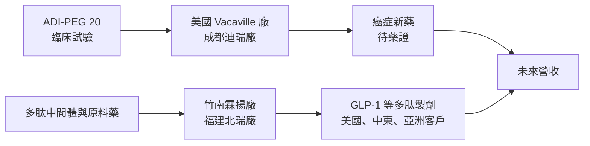
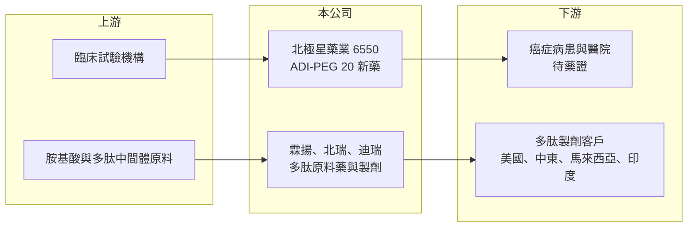

# 6550 北極星藥業-KY

> 上市｜[[產業索引-生技醫療業|生技醫療業]]｜上市（櫃）日期 2022/06/06

# 第一章：企業模式與商業藍圖

> [!info] 撰寫說明
> 本文由 Claude 依公開資料整理，架構比照 [[2330台積電]] 的四章研究，資料截至 2026-10-08。財務數字來源：Goodinfo 年度經營績效頁（含 2026 年公告標題）、富果研究 2025 年 12 月 11 日法說會整理、證交所開放資料（基本資料、2026 年第二季資產負債、綜合損益與營益分析、股利）。標示「憑記憶」的併購年份尚未比對原始文件。#待校對

在評估單一個股的長期投資價值時，首要步驟是拆解企業的底層獲利邏輯。本章針對北極星藥業集團（股票代號：6550，以下簡稱北極星）的商業模式進行定性分析，說明這家公司如何從單一癌症新藥 ADI-PEG 20，擴展為「新藥＋多肽」雙引擎，以及 2026 年撤回美國藥證申請對長期結構的影響。

## 一、核心定位：癌症代謝新藥與多肽產品雙引擎

北極星是在開曼群島註冊的外國企業，成立於 2006 年，2022 年 6 月在證交所上市，董事長陳賢哲並暫代總經理，2026 年 10 月的實收資本額約 46.5 億元。公司的核心技術是 ADI-PEG 20，一種分解精胺酸（arginine）的酵素藥物，原理是讓缺乏自行合成精胺酸能力的腫瘤細胞「餓死」，屬於[[癌症代謝療法]]。

2025 年 12 月法說會中，公司將自己定位為「雙引擎」：一是 ADI-PEG 20 癌症新藥，二是透過併購霖揚生技（2023 年，憑記憶，待校對）建立的[[多肽藥物]]事業，從中間體、原料藥到製劑垂直整合，產品包括司美格魯肽（Semaglutide）、替爾泊肽（Tirzepatide）等 [[GLP-1]] 類藥物，以及特力帕太、升糖素、Carfilzomib 等針劑，客戶涵蓋美國、中東、馬來西亞與印度（已簽約或洽談中）。

## 二、事業板塊：新藥管線與多肽事業

* **ADI-PEG 20 間皮瘤（MPM）：** 原本進度最快的適應症，已向美國 FDA 提交生物製劑上市申請（BLA），2025 年 12 月時公司預期 2026 年中取得藥證。但 2026 年 7 月公司公告主動撤回 BLA，同時暫緩軟組織肉瘤（LMS）三期試驗，商業化時程大幅延後。
* **ADI-PEG 20 其他適應症：** 腦癌（GBM）與急性骨髓性白血病（AML）等仍在臨床階段；2025 年 12 月法說時，AML 1B 期客觀反應率 91.3%，下一階段試驗預計 2027 年第一季啟動。
* **多肽事業：** 以 GLP-1 學名藥與多肽針劑為主，公司目標取得全球 GLP-1 市場 1% 至 2% 的市占。目前營收規模仍小，2026 年上半年營收約 0.44 億元。
* **營收結構：** 本次未查得營收比重，因此不放圓餅圖。

## 三、資本轉化邏輯：多地工廠與高額研發

* **多地生產據點：** 美國 Vacaville、台灣霖揚（竹南）、中國成都迪瑞與福建北瑞。2026 年 7 月公司增資香港子公司以增資成都迪瑞；2026 年 8 月公告愛爾蘭與歐洲子公司辦理解散，顯示公司正在收斂海外據點。
* **高固定成本：** 多座工廠加上全球臨床試驗，使營業費用遠大於營收，2026 年上半年營業費用約 9.85 億元，營收只有約 0.44 億元。

## 四、企業長期藍圖

北極星的長期價值建立在兩件事上：ADI-PEG 20 能否在某個適應症取得藥證，以及多肽事業能否在競爭激烈的 GLP-1 學名藥市場以成本優勢取得訂單。2026 年撤回 BLA 後，新藥時程不確定性提高，多肽事業的重要性相對上升。公司也在 2026 年辦理減資，並變更 2024 年度現金增資資金用途，顯示資本配置正在調整。

# 第二章：護城河深度與競爭優勢

本章分析北極星的競爭優勢，說明它在癌症代謝療法與多肽藥物兩個市場的位置，以及 2026 年的挫折對護城河的影響。

## 一、護城河的核心組成要素

* **獨特作用機轉：** ADI-PEG 20 針對精胺酸缺乏型腫瘤，屬於少數以代謝為標的的癌症藥物，若能證明療效，在特定適應症具備差異化。
* **垂直整合的多肽供應鏈：** 從中間體、原料藥到製劑一條龍生產，理論上可以降低成本並掌握品質，是在學名藥市場競爭的基礎。
* **多地產能：** ADI-PEG 20 美國與成都合計最大產能預估超過 300 萬劑（2025 年 12 月法說），具備商業化量產準備。

## 二、全球主要競爭對手格局

| 對手類型 | 代表 | 與北極星的比較 |
|---|---|---|
| 間皮瘤與肉瘤現行治療 | 化療、免疫檢查點抑制劑 | 標準治療已建立，新藥必須證明明顯的存活效益 |
| GLP-1 原廠 | 諾和諾德、禮來 | 品牌與專利仍在保護期，學名藥須待專利到期才能進入主要市場 |
| GLP-1 學名藥與原料藥廠 | 中國、印度多肽藥廠 | 產能大、成本低，是多肽事業最直接的競爭者 |
| 台灣新藥公司 | [[6446藥華藥]]、[[4147中裕]] | 同為台灣自主研發並追求美國藥證的新藥公司 |

## 三、優勢轉化：守得住、守不住與觀察重點

* **守得住：** 多肽事業的垂直整合與多國客戶基礎，提供相對可預期的長期營收來源。
* **守不住：** ADI-PEG 20 的時程。2026 年撤回 BLA，代表監管機關對資料的要求尚未滿足，先前的上市預期需要重新評估。
* **觀察重點：** 是否重新提交 BLA 及時程、GBM 與 AML 試驗進度、多肽產品在美國與新興市場的實際訂單與營收。

# 第三章：財務體質與盈利規模

資料日期：2026-10-08。數字取自 Goodinfo 年度經營績效頁與證交所開放資料，表格是撰寫當時的快照；最新月營收、毛利率、累計 EPS 由自動排程寫在本筆記的屬性欄位（月營收、毛利率、累計EPS 等）。#待校對

財務報表是檢驗護城河是否真實存在的最終標準。對尚未取得主力藥證的新藥公司而言，重點在於燒錢速度、資金能撐多久，以及研發投入的效率。

## 一、多年度表格

| 年度 | 營收（新台幣） | [[毛利率]] | [[營業利益率]] | EPS（元） | [[ROE]] |
|---|---|---|---|---|---|
| 2019 | 約 0 | 未查得 | 未查得 | -2.46 | -39.0% |
| 2020 | 0.09 億 | 25.8% | 不具意義 | -1.01 | -20.3% |
| 2021 | 0.15 億 | 13.9% | 不具意義 | -1.09 | -14.7% |
| 2022 | 0.06 億 | 22.0% | 不具意義 | -1.57 | -14.5% |
| 2023 | 0.07 億 | -41.0% | 不具意義 | -2.01 | -18.4% |
| 2024 | 1.07 億 | -71.9% | -2,463% | -3.35 | -35.3% |
| 2025 | 0.41 億 | -666% | -7,090% | -5.10 | -65.4% |
| 2026 上半年 | 0.44 億 | -223% | -2,452% | -1.62 | 未查得 |

* **營收：** 長年不到 1.1 億元，營業利益率為負數千個百分點，不具比較意義。毛利率轉為大幅負值，代表多肽工廠的成本已開始認列，但銷售量仍小。
* **虧損擴大：** EPS 從 2021 年的 -1.09 元擴大到 2025 年的 -5.10 元，2025 年營業損失約 29 億元（推算：營收乘以營業利益率），反映臨床試驗與工廠營運成本同步增加。
* **業外損失：** 2026 年上半年業外損失約 3.40 億元，稅後淨損約 14.0 億元。

## 二、[[ROE]]、資本結構與研發強度

2021 至 2025 年平均 ROE 約 -30%（推算），且逐年惡化。2026 年第二季底總資產約 73.8 億元，總負債約 28.4 億元（非流動負債約 23.4 億元），權益約 45.4 億元，負債比約 38%；保留盈餘累積虧損約 199 億元。帳上股本約 89.5 億元，2026 年下半年辦理[[減資彌補虧損]]後，實收資本額降為約 46.5 億元（證交所資料）。每股淨值 5.07 元（減資前）。流動資產約 25.7 億元，以 2025 年的營業虧損規模估算，約可支撐不到一年（推算），資金需求高。

## 三、[[ROIC]] 與 [[WACC]]：價值創造利差

**ROIC 推算：** 2025 年營收 0.41 億元、營業利益率 -7,090%，營業損失約 29.1 億元，虧損無所得稅抵減。2026 年第二季底權益約 45.4 億元，有息負債以非流動負債約 23.4 億元推估，投入資本約 68.8 億元，ROIC 約 -42%（推算）。

**WACC 推算：** 台灣 10 年期公債殖利率取 1.75%、市場風險溢酬 6%、β 取新藥研發股常見值 1.2（未查得公司實際 β），股東權益成本約 8.95%。負債成本假設 2.5%、稅後約 2.0%；權益約占 66%、負債約占 34%，WACC 約 6.6%（推算）。

**結論：** ROIC 約 -42%，遠低於資金成本，北極星目前大量消耗資本。新藥公司的價值不在當期報酬率，而在未來藥證帶來的現金流；但 2026 年撤回 BLA 後，這筆未來現金流的時間點與機率都下降，資本消耗與價值創造之間的落差擴大。

# 第四章：總體風險與地緣政治

任何企業都無法脫離宏觀環境獨立存在。本章分析北極星長期必須面對的臨床、法規、地緣政治與財務風險。

## 一、地緣政治風險

* **中國產能比重：** 成都迪瑞與福建北瑞是重要生產據點，美中關係、美國《生物安全法》類型的立法與中國出口管制，可能影響產品進入美國市場。
* **全球據點收斂：** 2026 年解散愛爾蘭與歐洲子公司，代表歐洲布局縮減，未來市場重心需重新評估。

## 二、臨床與法規風險

* **藥證延後：** ADI-PEG 20 間皮瘤 BLA 於 2026 年撤回，重新送件需補足資料，時程不確定。
* **後期試驗失敗：** GBM、LMS、AML 等適應症仍需大型試驗驗證，任何一項失敗都會影響整體價值。
* **工廠查核：** 多座工廠都需要通過 FDA 或各國 GMP 查核，2025 年法說提到南科廠因 GMP 問題撤案，顯示品質系統風險真實存在。

## 三、產業與市場風險

* **GLP-1 學名藥競爭：** GLP-1 市場吸引大量學名藥與原料藥廠投入，專利到期後價格可能快速下跌，成本與規模是決勝關鍵。
* **專利時程：** 原廠 GLP-1 藥物在主要市場仍受專利保護，學名藥只能先進入專利已到期或未保護的國家。

## 四、財務風險

累積虧損近 200 億元，2026 年已辦理減資並調整現金增資用途，未來若仍需資金，可能再次增資或私募，稀釋既有股東。

# 專有名詞解析

## 金融

- **[[減資彌補虧損]]**：公司以減少股本的方式沖銷累積虧損，股東持股數減少但持股比例不變，常見於長期虧損的公司。
- **[[毛利率]]**：營業毛利占營收的比例，反映產品定價能力與生產成本控制。
- **[[營業利益率]]**：扣除營業費用後的營業利益占營收的比例，衡量本業整體獲利能力。
- **[[ROE]]**：股東權益報酬率，稅後淨利除以股東權益，衡量公司運用股東資金的效率。
- **[[ROIC]]**：投入資本報酬率，稅後營業利益除以股東權益與有息負債的合計，衡量本業對所有資金提供者的報酬。
- **[[WACC]]**：加權平均資金成本，依股東權益與負債的比重加權計算的資金成本，ROIC 高於它才代表創造價值。

## 產業

- **[[癌症代謝療法]]**：針對腫瘤細胞特殊代謝需求設計的治療方式，例如分解腫瘤無法自行合成的胺基酸，使其無法生長。
- **[[多肽藥物]]**：由數個到數十個胺基酸組成的藥物，介於小分子藥與蛋白質藥之間，GLP-1 減重藥即屬此類。
- **[[GLP-1]]**：類升糖素胜肽-1 受體促效劑，用於治療糖尿病與肥胖的多肽藥物，代表藥物為司美格魯肽、替爾泊肽。

# 核心供應鏈

## 1. 上游
- 胺基酸、多肽中間體與包材供應商（名稱未查得）
- 全球臨床試驗醫院與受託研究機構

## 2. 本公司與子公司
- 北極星藥業：ADI-PEG 20 與次世代管線 PN-02 至 PN-04
- 生產據點：美國 Vacaville、台灣霖揚（竹南）、成都迪瑞、福建北瑞

## 3. 下游／客戶
- 多肽製劑客戶：美國、中東、馬來西亞、印度（已簽約或洽談中）
- 癌症新藥：取得藥證後的醫院與病患

## 4. 同業
- 台灣新藥：[[6446藥華藥]]、[[4147中裕]]
- 國際 GLP-1：諾和諾德、禮來（原廠），中國與印度多肽藥廠

## 最新新聞
<!-- news:start -->
<!-- news:end -->

## 相關連結
- [公開資訊觀測站](https://mopsov.twse.com.tw/mops/web/t05st03?step=1&firstin=1&co_id=6550)
- [Goodinfo](https://goodinfo.tw/tw/StockDetail.asp?STOCK_ID=6550)
- [Yahoo 股市](https://tw.stock.yahoo.com/quote/6550)
- [鉅亨網新聞](https://www.cnyes.com/twstock/6550/news)
