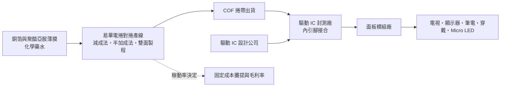
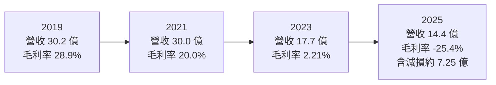
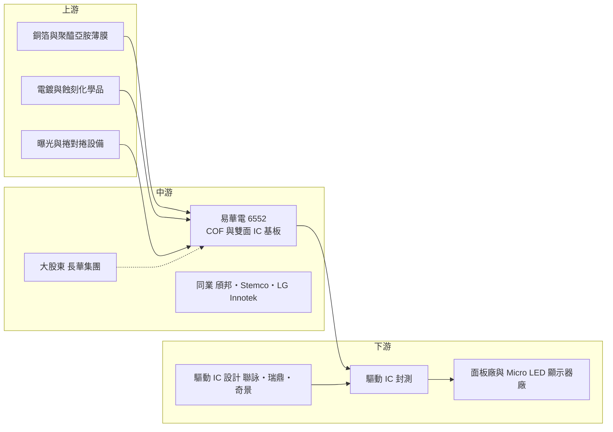

# 6552 易華電

> 上市｜[[產業索引-半導體業|半導體業]]｜上市（櫃）日期 2017/01/10

# 第一章：企業模式與商業藍圖

> [!info] 撰寫說明
> 本文由 Claude 依公開資料整理，架構比照 [[2330台積電]] 的四章研究，資料截至 2026-10-08。財務數字來源：Goodinfo 歷年經營績效與股利政策頁、富果研究 2025/08/19 與 2025/12/10 法說會備忘錄、優分析轉載之 2025/12 減損報導、中央社 2019/12 報導、自由時報 2019 年報導、Yahoo 股市公司基本資料；產業描述為整理性內容，尚未逐條比對原始文件。#待校對

在評估單一個股的長期投資價值時，首要步驟是拆解企業的底層獲利邏輯。本章針對易華電子（股票代號：6552，以下簡稱易華電）的商業模式進行定性分析，說明它在顯示器驅動晶片供應鏈中扮演什麼角色、為何在 2025 年出現上市以來最大的虧損，以及公司如何試圖從單一面板市場走向新的應用。

## 一、核心定位：顯示驅動晶片的「軟性載板」供應商

易華電的主力產品是捲帶式高階覆晶薄膜 IC 基板，業界通稱 [[COF]]（Chip on Film）。簡單來說，面板上的顯示驅動 IC（[[DDI]]）需要一片可以彎折的薄膜載板，把晶片和玻璃面板連接起來，COF 就是這片載板。它的上面有極細的銅線路，驅動 IC 以覆晶方式黏在薄膜上，再由封測廠把整條捲帶送到面板模組廠組裝。易華電不設計晶片、也不做封裝，它賣的是這條「帶線路的薄膜」，在供應鏈中屬於 IC 基板與材料的中游位置。

公司董事長為溫文郁、總經理為黃梅雪，最大股東是半導體材料與導線架通路商 8070長華*，依 2025 年 12 月報導持股 42.81%。這層關係讓易華電在原物料採購與客戶接觸上，能借重長華集團在封裝材料領域的通路，但也意味著公司的資本決策與集團策略高度連動。

全球具量產能力的 COF 廠商數量不多。依中央社 2019 年報導，當時全球約有 5 家，包括韓國 Stemco、LG Innotek，日本 Flexceed，台灣的 [[6147頎邦]] 與易華電。後來中國大陸也積極建立本土 COF 產能。供應商少代表技術與設備門檻高，但需求端高度集中在面板產業，也讓這個市場的景氣幾乎完全跟著面板走。

## 二、終端應用／產品板塊：從單面 COF 走向雙面基板

易華電沒有公開揭露各產品線的營收比重，因此這裡不畫圓餅圖，改以產品線的定性說明呈現。依 2025 年兩次法說會的內容，公司的產品可以分成三大板塊：

* **單面 COF（1-Metal）：** 這是公司的傳統主力，用於液晶面板的驅動 IC，終端為電視、顯示器、筆電與穿戴裝置。其中又分兩種製程：[[減成法]]技術成熟、成本較低，用在大尺寸面板；[[半加成法]]可以做出更細的線路與更厚的銅層，適合高解析度與需要散熱的產品。單面業務是過去的獲利來源，但成長已趨緩。
* **厚銅散熱 COF：** 以半加成法做出約 12 微米的厚銅層，讓驅動 IC 在高解析度、高更新率面板上能更好地散熱。公司在 2025 年 12 月法說會表示已與客戶開發多款產品，視為單面業務的新成長點。
* **雙面 IC 基板（2-Metal）：** 這是公司押注的未來動能，主攻 [[Micro LED]] 顯示器使用的 IC 基板。Micro LED 需要把大量微小的發光晶粒精準排列，公司認為捲對捲製程在尺寸穩定度上有優勢，適合[[巨量轉移]]製程。依法說會說法，該產品已與客戶共同開發約三年，原訂 2025 年量產，因客戶端晶片瑕疵延後到 2026 年。

回顧歷史，易華電的應用結構曾經大幅改變。2019 年中央社報導指出，手機用 COF 占營收超過五成，其中中國手機品牌約占手機產能的八成；同年自由時報引述分析師說法，指出公司是華為 COF 主要供應商之一。隨後手機面板轉向 [[COG]] 與 [[COP]] 技術、加上美國對華為的禁令，手機 COF 需求快速萎縮，公司重心轉回電視與顯示器等大尺寸應用。這段經歷說明了 COF 廠的核心風險：產品本身好壞之外，更取決於面板技術路線的選擇。

## 三、資本轉化邏輯（營運模式）：高固定成本的連續式製程

易華電的生產採捲對捲（[[捲對捲製程]]）的連續式設計，一整捲薄膜從曝光、顯影、蝕刻到電鍍一路走完。這種製程的好處是效率高、品質穩定，但缺點是固定成本很重：設備折舊、電費和槽液中的化學藥水，不論產量多少都得持續支出。總經理在 2025 年 12 月法說會指出，當時需求只剩過往的五至六成，低[[產能利用率]]下固定成本無法攤提，是毛利率轉負的主因。

因此易華電的獲利模式可以理解為「量決定一切」。景氣好時，2019 年毛利率可達 28.9%、營業利益率 21.3%；但面板廠減產時，營收從 2021 年的 30 億元降到 2025 年的 14.4 億元，毛利率也從正轉負。這種高度的營運槓桿，是投資人理解易華電最重要的一點。

另一個值得注意的營運特徵是收款條件。2025 年法說會提到，由於主要客戶處於產業困境，公司為維持合作而延長收款天期，應收帳款週轉天數由前期增加到 67 天。小型材料廠在客戶議價力強的產業中，常需用信用條件換取訂單，這會增加資金壓力。

## 四、企業長期藍圖：資產重整與 Micro LED 轉型

2025 年第四季，易華電認列約 7.25 億元的資產減損，主要針對減成法相關的 COF 設備。依報導，這筆減損屬非現金項目，目的是讓帳面資產反映經濟實質，並把資源轉向半加成法與 Micro LED。這是公司長期結構上的重要轉折：管理層等於承認傳統大尺寸 COF 的產能不再具備原本的獲利能力。

公司 2025 年底對外說明的三個方向是：第一，穩定單面業務，轉向厚銅散熱與細線距等高附加價值產品；第二，主攻雙面業務，推動 Micro LED IC 基板量產；第三，嘗試把雙面技術用在非面板的 IC 基板，降低對面板景氣的依賴，但公司也坦言這類新應用開發週期長，短期貢獻有限。此外，公司國內第一次有擔保轉換公司債於 2026 年 10 月到期還本並終止櫃買中心買賣，代表一項長期負債已清償。

整體來看，易華電的長期藍圖能否成功，關鍵在 Micro LED 是否真的從高階商用顯示走向大量應用。如果 Micro LED 只停留在小眾市場，雙面基板的規模可能不足以填補傳統 COF 的空缺。

# 第二章：護城河深度與競爭優勢

在長期價值投資中，「護城河」指企業抵禦競爭、維持超額利潤的保護機制。本章分析易華電的競爭優勢來源、全球主要對手，以及這些優勢在面板產業結構性轉移下能守住多少。

## 一、護城河的核心組成要素

易華電的護城河屬於「窄且受侵蝕」的類型，主要由以下三個要素構成：

* **1. 細線路製程技術：** COF 的線距越細，能承載的驅動 IC 腳位越多，面板解析度就能越高。依法說會說法，易華電的半加成法技術源自日本住友金屬礦山，能做出比傳統減成法更細的線路與更厚的銅層。這項技術在高解析度與散熱需求上有實際價值，是公司與一般減成法業者區隔的主要依據。
* **2. 驗證與轉換成本：** COF 必須和特定驅動 IC、特定面板設計一起驗證，客戶一旦導入某家的載板，中途更換需要重新測試可靠度。這讓既有供應商具備一定黏著度，但黏著度只維持在單一產品世代，換新機種時客戶仍會重新比價。
* **3. 少數玩家的產業結構：** 全球具量產能力的 COF 廠一直只有少數幾家，新進者必須投入昂貴的捲對捲設備與良率學習。不過中國大陸在政策支持下擴充本土 COF 產能，讓這道門檻的保護效果逐年下降。

## 二、全球主要競爭對手格局

| 對手 | 定位 | 對易華電的威脅 |
|---|---|---|
| [[6147頎邦]] | 台灣驅動 IC 封測龍頭，同時擁有 COF 基板產能 | 可提供封測加基板的整合服務，對客戶議價力較強 |
| Stemco（韓國） | 三星集團旗下 COF 廠 | 綁定韓系面板與驅動 IC 客戶，產能規模大 |
| LG Innotek（韓國） | LG 集團旗下零組件廠 | 2019 年後產能釋出曾加速價格競爭 |
| Flexceed（日本） | 日系 COF 廠 | 在特定細線路產品上與易華電重疊 |
| 中國大陸 COF 廠 | 受政策扶植的本土供應商 | 中國面板產能約占全球六至七成，本土化採購壓縮台廠份額 |

## 三、優勢轉化：守得住／守不住／觀察重點

* **守得住：** 需要細線距與厚銅散熱的高階單面 COF。這類產品對製程精度要求高，也需要較長的驗證時間，價格敏感度相對較低。如果高解析度與高更新率面板持續普及，這塊業務有機會維持合理毛利。
* **守不住：** 一般大尺寸電視與顯示器使用的減成法 COF。這塊市場技術成熟、產能過剩，面板客戶又集中在中國，報價主導權不在供應商手上。2025 年的大額減損，正反映出這部分資產已無法賺回原本的投資。
* **觀察重點：** 第一是 Micro LED 雙面基板何時真正放量，以及能否擴展到一個以上的客戶；第二是非面板 IC 基板的開發是否有具體訂單；第三是在大股東長華集團的支持下，公司是否進一步調整產能規模或尋求策略合作。這三點決定易華電是「轉型成功的利基材料廠」，還是「被產業結構淘汰的單一產品供應商」。

# 第三章：財務體質與盈利規模

資料日期：2026-10-08。數字取自 Goodinfo 歷年經營績效與股利政策頁、富果研究法說會備忘錄，表格是撰寫當時的快照；最新月營收、毛利率、累計 EPS 由自動排程寫在本筆記的屬性欄位（月營收、毛利率、累計EPS 等）。#待校對

財務報表是檢驗護城河是否真實存在的最終標準。本章用多年度的三率、ROE、現金股利與資本報酬，檢視易華電在面板景氣循環與產業結構轉移下的獲利品質。

## 一、獲利能力的基石：三率

| 年度 | 營收（新台幣） | [[毛利率]] | [[營業利益率]] | EPS（元） | [[ROE]] |
|---|---|---|---|---|---|
| 2019 | 30.2 億 | 28.9% | 21.3% | 5.24 | 25.3% |
| 2020 | 26.5 億 | 14.3% | 6.9% | 1.57 | 6.56% |
| 2021 | 30.0 億 | 20.0% | 12.0% | 3.91 | 12.8% |
| 2022 | 21.1 億 | 10.5% | 0.24% | 0.88 | 2.8% |
| 2023 | 17.7 億 | 2.21% | -5.76% | 0.09 | 0.3% |
| 2024 | 19.6 億 | 2.43% | -5.41% | 0.16 | 0.51% |
| 2025 | 14.4 億 | -25.4% | -37.3% | -14.35 | -54.3% |

* **[[毛利率]]：** 這張表最清楚地呈現了高固定成本產業的特性。營收從 30 億元降到 20 億元以下，毛利率不是等比例下降，而是從近三成一路掉到個位數。原因在於連續式產線的折舊、電費與化學藥水屬於固定成本，產量下滑時單位成本快速上升。
* **[[營業利益率]]：** 2023 年起本業已轉為虧損，2023 與 2024 年的小幅正 EPS 主要靠業外收入支撐。2025 年的 -37.3% 除了需求只剩過往五至六成外，也包含減成法設備的大額減損，依報導對 EPS 的影響約 -8.73 元。
* **2025 年分段觀察：** 依富果整理，2025 年上半年營收 8.21 億元、EPS -2.16 元，前三季營收 11.43 億元、EPS -3.5 元，這是公司成立以來首次虧損；第四季再認列減損，使全年 EPS 擴大到 -14.35 元。若扣除減損這種一次性項目，本業每股虧損約在 -5 至 -6 元之間（推估）。

## 二、[[ROE]]：資本效率

易華電 2019 年的 ROE 達 25.3%，屬於資本效率極佳的水準；但 2022 至 2024 年 ROE 都在 3% 以下，2025 年更因虧損與減損降到 -54.3%。以 2021 至 2025 年計算，近 5 年平均 ROE 約為 -7.6%（推算：12.8、2.8、0.3、0.51、-54.3 的簡單平均）；若排除 2025 年的一次性減損，2021 至 2024 年平均也只有約 4.1%，明顯低於股東合理要求的報酬。

營收方面，2019 年 30.2 億元到 2025 年 14.4 億元，6 年間的年複合成長率約為 -11.6%（推算）。這不是單純的景氣循環，而是手機 COF 需求消失、中國面板本土化、大尺寸 COF 價格競爭三個結構因素疊加的結果。

## 三、資本支出與自由現金流

易華電沒有在本次查得的來源中揭露逐年資本支出與自由現金流數字，以下以定性方式說明。

* **資本支出特性：** COF 產線屬於重設備投資，2019 年前後公司仍在擴充減成法產能，以服務大尺寸面板需求。2025 年的減損顯示，這批投資在需求反轉後未能如預期回收，是資本配置上值得記取的教訓。
* **現金股利：** Goodinfo 資料顯示，股利所屬年度 2019 至 2025 年的現金股利依序為 2、1.5、2、0.45、0.3、0.2、0 元。股利隨獲利快速下降，2025 年停發，說明公司在虧損期以保留現金為優先。
* **財務結構：** 2025 年上半年負債比率 36.84%、前三季 35.07%，尚在可控範圍；有擔保可轉債於 2026 年 10 月到期還本。後續觀察重點是現金能否支撐 Micro LED 量產初期的營運資金需求。

## 四、[[ROIC]] 與 [[WACC]]：價值創造利差

**ROIC 推算：** 本次未查得有息負債的逐年數字，因此以稅後營業利益除以股東權益做近似（若加入有息負債，ROIC 會更低）。2019 年營業利益約 6.43 億元（30.2 億 × 21.3%），以 20% 稅率估算稅後約 5.15 億元；股東權益以淨利 5.24 億 ÷ ROE 25.3% 推得約 20.7 億元，ROIC 推算約 25%。2025 年營業虧損約 5.37 億元（14.4 億 × -37.3%），平均股東權益以淨損 11.9 億 ÷ ROE 54.3% 推得約 21.9 億元，ROIC 推算約 -25%（虧損不計稅盾）。2022 至 2024 年本業接近損益兩平或虧損，ROIC 推算介於約 0% 至 -5%。

**WACC 推算：** 採 CAPM，台灣 10 年期公債殖利率取 1.75%，市場風險溢酬 6%，β 取面板供應鏈中小型股常見值約 1.2（未查得來源數字），股東權益成本約 1.75% + 1.2 × 6% = 8.95%。負債成本假設 3%，稅後約 2.4%；以負債比約 35% 中有息負債約占總資本 20% 估算（推估），WACC 約 0.8 × 8.95% + 0.2 × 2.4% ≈ 7.6%（推算）。

**結論：** 易華電在 2019 至 2021 年的景氣高點，ROIC 明顯高於 WACC，是創造價值的階段；2022 年起 ROIC 長期低於 WACC，2025 年更是大幅為負，代表這段期間公司實際上在消耗股東資本。未來 ROIC 能否回到 8% 以上，取決於減損後較輕的資產基礎能否搭配 Micro LED 與厚銅產品，把產能利用率拉回正常水準。

# 第四章：總體風險與地緣政治

任何企業都無法脫離宏觀環境獨立存在。本章分析易華電長期必須面對的地緣政治、產業週期、營運與技術風險。

## 一、地緣政治

中國大陸面板產能約占全球六至七成，是 COF 最大的需求來源。在中美科技競爭與中國推動供應鏈本土化的背景下，中國面板廠有政策誘因優先採用本土 COF 供應商，這對台系 COF 廠是長期的結構壓力。另一方面，易華電曾因華為手機需求而受惠，又在美國禁令後失去這塊業務，這段歷史說明客戶的地緣政治風險會直接傳導到上游材料廠。

## 二、產業週期與市場結構

面板產業本身是典型的景氣循環產業，供給由少數大廠的投資決策決定，需求則隨電視、顯示器、筆電換機週期波動。COF 位於面板供應鏈上游，承受的是放大後的[[長鞭效應]]：面板廠減產時，驅動 IC 與 COF 的訂單往往縮減得更快。2022 至 2025 年營收從 30 億元降到 14.4 億元，就是這種放大效應的展現。此外，產業結構偏向買方市場，主要客戶議價力強，上游廠商只能用延長收款天期等方式維持合作。

## 三、營運環境的隱性風險

* **固定成本與電價：** 連續式製程對電力與化學藥水依賴高。2025 年法說會提到原物料與電費上漲是虧損原因之一，台灣工業電價若持續上升，將長期壓縮毛利空間。
* **匯率：** 產品以外銷為主，2025 年新台幣升值造成匯損。對毛利率已經很薄的公司而言，匯率波動的影響會被放大。
* **新產品集中風險：** Micro LED 雙面基板已因客戶晶片瑕疵延後一年，目前公開資訊只提到少數合作客戶。新事業若過度依賴單一客戶，時程與規模都不在公司掌控之中。
* **大股東與資本決策：** 長華持股約四成，對公司未來的產能調整、增資或合併方向有決定性影響，小股東需要關注集團層級的策略變化。

## 四、科技或法規演進

最根本的風險來自顯示技術路線。手機面板已從 COF 轉向 COG 與 COP，讓易華電失去曾經過半的手機營收；如果大尺寸面板未來也出現類似的封裝方式改變，COF 的總需求可能進一步萎縮。反過來說，Micro LED、高解析度與高更新率面板，以及先進封裝對細線路基板的需求，則是可能的新機會。易華電能否把捲對捲細線路技術延伸到面板以外的 IC 基板市場，是決定公司十年後是否仍具競爭力的關鍵。

# 專有名詞解析

## 半導體

- **[[COF]]**：覆晶薄膜，把驅動 IC 以覆晶方式黏在可彎折的薄膜載板上，再與面板連接，常見於電視、顯示器與穿戴裝置。
- **[[COG]]**：玻璃覆晶，把驅動 IC 直接黏在面板玻璃上，省去薄膜載板，成本較低但需佔用面板邊框空間。
- **[[COP]]**：塑膠覆晶，把驅動 IC 黏在可彎折的 OLED 面板基板上，可做出極窄邊框，是高階手機主流做法。
- **[[DDI]]**：顯示驅動 IC，負責控制面板每個像素的電壓，需要高壓製程，聯詠、奇景為主要設計公司。

## 應用

- **[[Micro LED]]**：以微米等級的 LED 晶粒直接作為像素發光的顯示技術，亮度高、壽命長，但製造成本與良率挑戰大。

## 金融

- **[[產能利用率]]**：實際生產量占總產能的比例，固定成本高的產業毛利率高度取決於此數字。
- **[[資產減損]]**：資產未來能回收的金額低於帳面價值時，把差額認列為損失，屬非現金費用但會降低淨值。
- **[[轉換公司債]]**：可在約定條件下轉換為公司股票的債券，到期未轉換時公司須以現金還本。
- **[[長鞭效應]]**：終端需求的小幅變動，沿供應鏈往上游傳遞時被逐級放大，造成上游庫存與訂單劇烈波動。

## 產業

- **[[捲對捲製程]]**：材料以整捲方式連續送入產線，依序完成曝光、蝕刻、電鍍等步驟，效率高但固定成本重。
- **[[減成法]]**：先在基材上覆蓋整片銅，再把不要的部分蝕刻掉形成線路，技術成熟、成本低，但線路難以做細。
- **[[半加成法]]**：先鍍上很薄的銅種子層，再只在需要的位置電鍍加厚線路，可做出更細的線距與更厚的銅層。
- **[[巨量轉移]]**：把數百萬顆微小 LED 晶粒一次精準移轉到基板上的製程，是 Micro LED 量產的關鍵瓶頸。

# 核心供應鏈

## 1. 上游：材料與設備
- 主要原料為銅箔與聚醯亞胺薄膜，以及電鍍、蝕刻用的化學藥水；具體供應商名稱未查得。
- 半加成法技術源自日本住友金屬礦山（依 2025 年法說會說法）。

## 2. 中游：易華電本身、股東與同業
- 最大股東：8070長華*（持股約 42.81%，2025 年 12 月報導）
- 國內同業：[[6147頎邦]]
- 海外同業：Stemco、LG Innotek、Flexceed，以及中國大陸本土 COF 廠

## 3. 下游：驅動 IC 與封測
- 驅動 IC 設計公司：[[3034聯詠]]、[[3592瑞鼎]]、奇景（推估為潛在客戶群，公司未揭露具體客戶）
- 驅動 IC 封測：[[6147頎邦]] 等

## 4. 下游：面板與終端
- 面板廠：[[2409友達]]、[[3481群創]] 與中國大陸面板廠（推估）
- 終端應用：電視、顯示器、筆電、穿戴裝置、Micro LED 顯示器

## 最新新聞
<!-- news:start（自動產生，請勿手動編輯此範圍） -->
- 2026-10-06 🏛️ 重訊 17:05｜公告本公司國內第一次有擔保轉換公司債到期還本暨終止上櫃 買賣事宜｜[觀測站](https://mops.twse.com.tw/mops/#/web/t05st01)

完整紀錄：[[6552易華電 新聞]]
<!-- news:end -->

## 相關連結
- [公開資訊觀測站](https://mopsov.twse.com.tw/mops/web/t05st03?step=1&firstin=1&co_id=6552)
- [Goodinfo](https://goodinfo.tw/tw/StockDetail.asp?STOCK_ID=6552)
- [Yahoo 股市](https://tw.stock.yahoo.com/quote/6552)
- [鉅亨網新聞](https://www.cnyes.com/twstock/6552/news)
