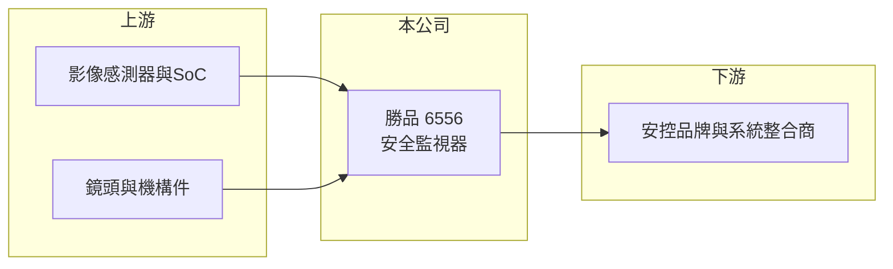

# 6556 勝品

> 上櫃｜[[產業索引-光電業|光電業]]｜上市（櫃）日期 2017/10/31

# 第一章：企業模式與商業藍圖

> [!info] 撰寫說明
> 精簡版，由 Claude 依公開資料整理，架構比照 [[2330台積電]]，資料截至 2026-10-07。來源：nStock 勝品公司簡介、winvest 營收快訊。公開資料有限。#待校對

勝品電通是安全監視器製造商，規模不大但獲利率與配息穩定。

- **核心業務：** 主要從事安全監視器的製造、買賣與進出口，產品推估涵蓋監控攝影機與 [[NVR]] 等錄影設備。
- **營收結構：** 本次未查到產品別或地區別營收比重。
- **營運據點：** 公司 2010 年 10 月設立、2016 年 10 月上櫃，生產據點明細本次未查到。
- **長期方向：** 2026 年上半年營收年增明顯，4、5 月皆年增近 3 成，成長動能來源本次未查到說明。

# 第二章：護城河深度與競爭優勢

勝品的優勢在於監控設備的開發與代工能力，毛利率在同業中屬中上水準。

- **競爭優勢：** 2026 年第二季毛利率 36.89%、營益率 21.51%，顯示產品與客戶結構具一定定價能力（推估以客製與代工為主）。
- **主要對手：** 國內安控同業如 [[3356奇偶]]、3454晶睿，以及中國海康威視、大華。
- **觀察重點：** 營收成長能否延續、[[非紅供應鏈]]需求帶來的轉單效益（推估），以及毛利率是否維持。

# 第三章：財務體質與盈利規模

資料日期：2026-10-07，以下數字是撰寫當時的快照；最新月營收、毛利率、累計 EPS 由自動排程寫在本筆記的屬性欄位（月營收、毛利率、累計EPS 等）。#待校對

勝品 2026 年營收成長、獲利率高。

- **營收規模：** 2026 年 4 月營收 1.48 億元（年增 29.48%）、5 月 1.37 億元（年增 29.87%）、6 月 1.03 億元，8 月 1.14 億元。
- **獲利：** 2026 年第二季 EPS 2.3 元，[[毛利率]] 36.89%、[[營業利益率]] 21.51%、淨利率 17.61%。
- **財務特色：** 資本額 2.88 億元，股本小；2025 年度配發現金股利 3.5 元，近五年平均現金股利 3.78 元。

# 第四章：總體風險與地緣政治

勝品的風險來自安控市場競爭與客戶集中。

- **產業週期：** 安控設備需求跟隨企業與公共建設投資，景氣下滑時訂單可能遞延。
- **營運風險：** 營收規模小，若以代工為主則客戶集中度可能偏高（推估）。
- **其他風險：** 美國與歐洲對中國安控產品的限制有利台廠，但政策方向可能變動；另有匯率與晶片供應風險。

# 專有名詞解析

## 應用

- **[[NVR]]**：網路影像錄影機，接收網路攝影機的影像並儲存與管理，是 IP 監控系統的核心設備。

## 金融

- **[[毛利率]]**：營業毛利占營收的比例，反映產品的定價能力與成本控制。
- **[[營業利益率]]**：營業利益占營收的比例，反映扣除營業費用後的本業獲利能力。

## 產業

- **[[非紅供應鏈]]**：排除中國大陸製造或零組件的供應鏈，常見於美國政府與資安敏感的採購。

# 核心供應鏈

- 上游：影像感測器、影像處理 SoC、鏡頭與機構件供應商（推估）
- 下游／客戶：安控品牌商與系統整合商（推估）
- 同業：[[3356奇偶]]、3454晶睿；國外為海康威視、大華

## 最新新聞
<!-- news:start -->
<!-- news:end -->

## 相關連結
- [公開資訊觀測站](https://mopsov.twse.com.tw/mops/web/t05st03?step=1&firstin=1&co_id=6556)
- [Goodinfo](https://goodinfo.tw/tw/StockDetail.asp?STOCK_ID=6556)
- [Yahoo 股市](https://tw.stock.yahoo.com/quote/6556)
- [鉅亨網新聞](https://www.cnyes.com/twstock/6556/news)
