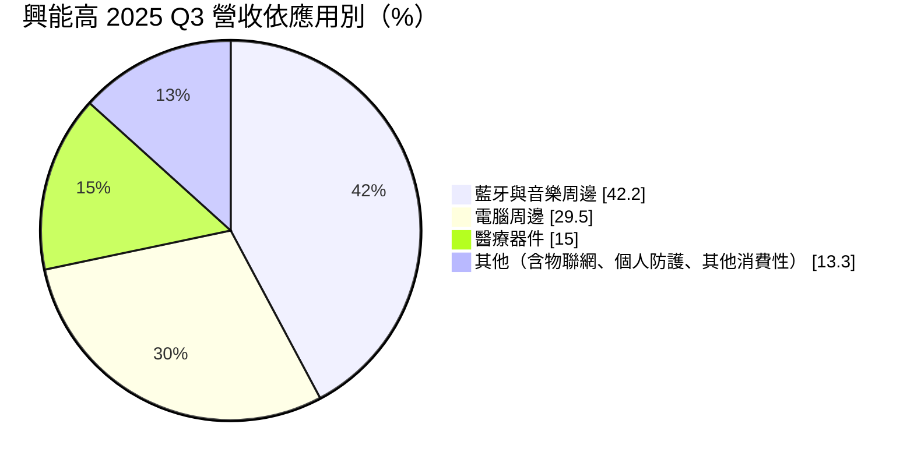
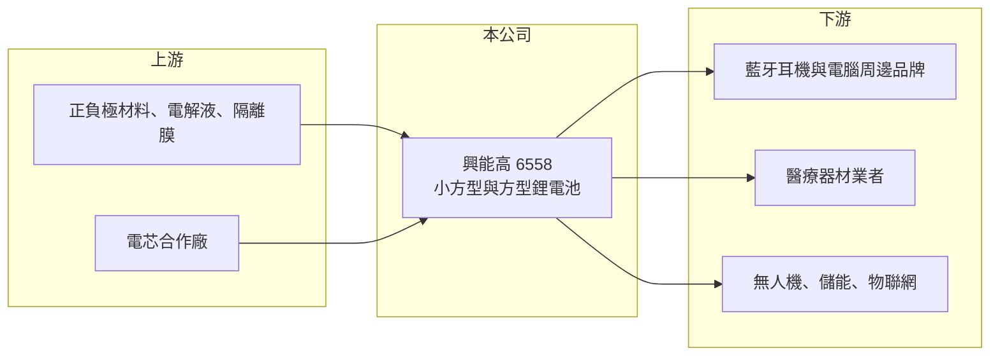

# 6558 興能高

> 上市｜[[產業索引-其他電子業|其他電子業]]｜上市（櫃）日期 2018/12/05

# 第一章：企業模式與商業藍圖

> [!info] 撰寫說明
> 精簡版，由 Claude 依公開資料整理，架構比照 [[2330台積電]]，資料截至 2026-10-07。來源：富果研究興能高 2025 年 12 月法說會筆記、nStock 興能高公司簡介、winvest 營收快訊。#待校對

興能高科技研發、製造與銷售二次[[鋰電池]]，主力是穿戴與周邊產品用的小方型電池，正往醫療與非消費性應用轉型。

- **核心業務：** 生產小方型與中大型方型鋰電池，供應藍牙耳機、電腦周邊、醫療器材與物聯網裝置。
- **營收結構：** 2025 年第三季消費性產品占 75.9%（藍牙與音樂周邊 42.2%、電腦周邊 29.5%），非消費性占 24.1%，其中醫療器件 15.0%。
- **營運據點：** 以台灣為主，2018 年 12 月上市；規劃在東南亞與台灣建立電池組裝產線，預計 2026 年上線。
- **長期方向：** 2025 至 2026 年大幅增加資本支出與研發，鎖定[[無人機]]、[[儲能]]與[[半固態電池]]等非消費性市場。

# 第二章：護城河深度與競爭優勢

興能高的利基在小尺寸客製電池，但規模小、議價力有限。

- **競爭優勢：** 專注小方型電池，能配合穿戴與醫療客戶的客製尺寸；醫療客戶包括美國胰島素注射器與助聽器業者，認證門檻較高。
- **主要對手：** 電池模組廠 [[6121新普]]、[[3211順達]]、[[3323加百裕]]，以及中國的小型電池廠。
- **觀察重點：** 無人機與儲能等非消費性產品能否放量，以及東南亞產線何時開始貢獻。

# 第三章：財務體質與盈利規模

資料日期：2026-10-07，以下數字是撰寫當時的快照；最新月營收、毛利率、累計 EPS 由自動排程寫在本筆記的屬性欄位（月營收、毛利率、累計EPS 等）。#待校對

興能高營收回升，但毛利率偏低，仍在虧損。

- **營收規模：** 2025 年前三季營收 8.28 億元、年減 5.1%；2026 年 8 月營收 1.18 億元、年增 35.96%。
- **獲利：** 2025 年前三季[[毛利率]] 20.4%、稅後淨損 4,155 萬元；2026 年上半年 EPS -0.76 元，毛利率降至 9.84%，營業利益率 -14.19%。
- **財務特色：** 過去五年平均現金股利僅 0.06 元，轉型期研發與資本支出增加，短期獲利承壓。

# 第四章：總體風險與地緣政治

興能高的風險在消費性需求與轉型期的成本壓力。

- **產業週期：** 營收七成以上來自消費性電子，耳機與電腦周邊需求波動直接影響出貨。
- **營運風險：** 2026 年上半年毛利率大幅下滑，新產品與新產線若良率不佳，虧損可能延續。
- **其他風險：** 鋰等原料價格波動、中國電池廠低價競爭，以及電池安全與運輸法規。

# 專有名詞解析

## 應用

- **[[無人機]]**：不需駕駛員搭乘、以遙控或自主飛行的飛行器，用於空拍、巡檢、物流與國防。

## 金融

- **[[毛利率]]**：毛利除以營收，反映產品售價扣除直接成本後的獲利空間。

## 產業

- **[[鋰電池]]**：以鋰離子在正負極間移動來充放電的電池，廣泛用於手機、穿戴裝置與電動車。
- **[[半固態電池]]**：以凝膠或部分固態電解質取代液態電解質的鋰電池，安全性與能量密度較高。
- **[[儲能]]**：把電力儲存起來在需要時釋放的系統，常搭配再生能源或用於備援電力。

# 核心供應鏈

- 上游：正負極材料、電解液與隔離膜供應商，並尋求台灣或亞洲電芯廠合作
- 下游／客戶：藍牙與電腦周邊品牌、美國胰島素注射器與助聽器業者
- 同業：[[6121新普]]、[[3211順達]]、[[3323加百裕]]

## 最新新聞
<!-- news:start -->
<!-- news:end -->

## 相關連結
- [公開資訊觀測站](https://mopsov.twse.com.tw/mops/web/t05st03?step=1&firstin=1&co_id=6558)
- [Goodinfo](https://goodinfo.tw/tw/StockDetail.asp?STOCK_ID=6558)
- [Yahoo 股市](https://tw.stock.yahoo.com/quote/6558)
- [鉅亨網新聞](https://www.cnyes.com/twstock/6558/news)
