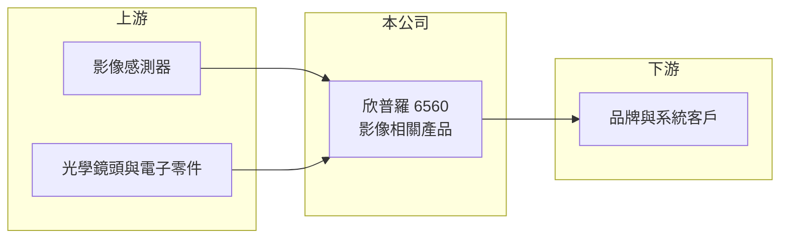

# 6560 欣普羅

> 上櫃｜[[產業索引-光電業|光電業]]｜上市（櫃）日期 2017/01/24

# 第一章：企業模式與商業藍圖

> [!info] 撰寫說明
> 精簡版，由 Claude 依公開資料整理，架構比照 [[2330台積電]]，資料截至 2026-10-07。來源：Poorstock 欣普羅基本資料、winvest 營收快訊。公開資料有限。#待校對

欣普羅是新北市新莊的小型影像產品公司，營收規模小且波動大。

- **核心業務：** 主要從事各類影像相關產品的設計、生產與銷售；具體產品線本次未查到明細，推估涵蓋相機模組或影像擷取裝置。
- **營收結構：** 本次未查到產品別營收比重。
- **營運據點：** 公司位於新北市新莊區。
- **長期方向：** 2026 年營收較 2025 年低基期明顯回升，4 月營收年增 95.97%，成長來源本次未查到說明。

# 第二章：護城河深度與競爭優勢

欣普羅規模小，公開資料不足以判斷護城河，以下多為定性描述。

- **競爭優勢：** 影像產品需要光學、電子與軟體整合能力，小型廠商多以客製與利基市場為主（推估）。
- **主要對手：** 本次未查到公司自述的對手；影像模組同業可參考 [[6668中揚光]] 等光學廠（推估）。
- **觀察重點：** 營收能否維持在每月千萬元以上，以及獲利是否穩定。

# 第三章：財務體質與盈利規模

資料日期：2026-10-07，以下數字是撰寫當時的快照；最新月營收、毛利率、累計 EPS 由自動排程寫在本筆記的屬性欄位（月營收、毛利率、累計EPS 等）。#待校對

欣普羅 2026 年由虧轉盈，但營收基數小。

- **營收規模：** 2026 年 4 月營收 2,656.2 萬元、5 月 1,551.1 萬元、6 月 1,555.7 萬元、7 月 1,550.4 萬元；8 月營收約 1,110 萬元，較 2025 年 8 月的約 198 萬元大幅成長。
- **獲利：** 2026 年第一季與第二季 EPS 皆為 0.37 元；2025 年第三季 EPS -0.88 元。
- **財務特色：** 營收月變化大，單一訂單即可影響當季損益，獲利穩定度有待觀察。

# 第四章：總體風險與地緣政治

欣普羅的風險在於規模小、營收波動大與資訊有限。

- **產業週期：** 影像產品需求隨消費電子與工業應用景氣波動，具[[長鞭效應]]。
- **營運風險：** 營收規模小，客戶與產品可能高度集中（推估），單一客戶訂單變化影響很大。
- **其他風險：** [[影像感測器]]等關鍵零件的供應與價格，以及匯率變動。

# 專有名詞解析

## 應用

- **[[影像感測器]]**：把光線轉成電子訊號的晶片，是相機與影像模組的核心零件。

## 金融

- **[[長鞭效應]]**：終端需求的小幅變動沿供應鏈往上游傳遞時被逐級放大，造成上游庫存與訂單劇烈波動。

## 產業

- **[[光學鏡頭]]**：由多片鏡片組成、把影像聚焦到感測器上的元件。

# 核心供應鏈

- 上游：影像感測器、[[光學鏡頭]]與電子零件供應商（推估）
- 下游／客戶：影像產品品牌與系統客戶（推估）
- 同業：本次未查到，待補

## 最新新聞
<!-- news:start（自動產生，請勿手動編輯此範圍） -->
- 2026-10-05 📰 媒體 19:50｜營收速報 - 欣普羅(6560)9月營收2,310萬元年增率高達122.43％｜[鉅亨網](https://news.cnyes.com/news/id/6621991)

完整紀錄：[[6560欣普羅 新聞]]
<!-- news:end -->

## 相關連結
- [公開資訊觀測站](https://mopsov.twse.com.tw/mops/web/t05st03?step=1&firstin=1&co_id=6560)
- [Goodinfo](https://goodinfo.tw/tw/StockDetail.asp?STOCK_ID=6560)
- [Yahoo 股市](https://tw.stock.yahoo.com/quote/6560)
- [鉅亨網新聞](https://www.cnyes.com/twstock/6560/news)
