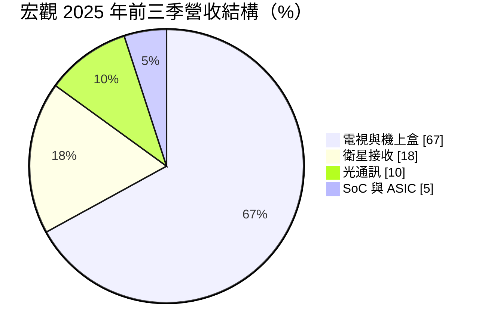
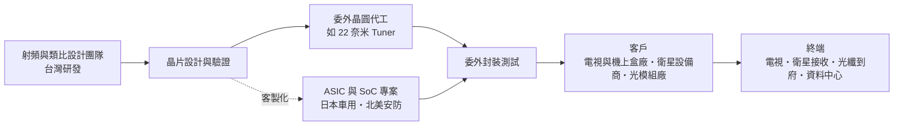
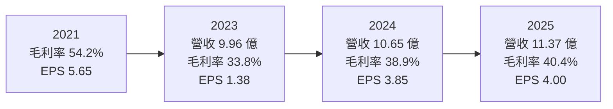
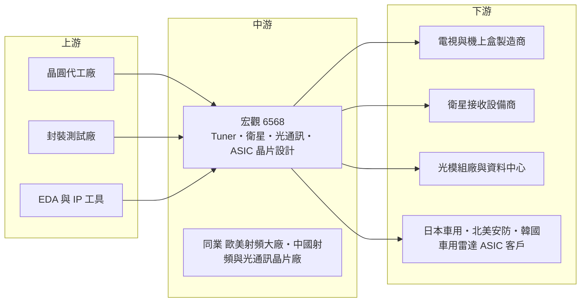

# 6568 宏觀

> 上櫃｜[[產業索引-半導體業|半導體業]]｜上市（櫃）日期 2016/12/28

# 第一章：企業模式與商業藍圖

> [!info] 撰寫說明
> 本文由 Claude 依公開資料整理，架構比照 [[2330台積電]] 的四章研究，資料截至 2026-10-08。財務數字來源：MoneyDJ（富邦證券版）年度財務比率表、HiStock 每月營收頁、Goodinfo 股利政策頁、富果研究 2025/12/18 法說會備忘錄、Yahoo 股市公司基本資料；產業描述為整理性內容，尚未逐條比對原始文件。#待校對

在評估單一個股的長期投資價值時，首要步驟是拆解企業的底層獲利邏輯。本章針對宏觀微電子（股票代號：6568，以下簡稱宏觀）的商業模式進行定性分析，說明這家以電視調諧器起家的[[射頻]]晶片設計公司，如何在成熟市場中維持地位，並試圖轉型為高速訊號傳輸解決方案供應商。

## 一、核心定位：射頻接收晶片的利基型 IC 設計公司

宏觀成立於 2006 年，2016 年底上櫃，是一家 [[Fabless]] 型態的射頻（RF）積體電路設計公司，自己不擁有晶圓廠，專注於晶片設計並委外製造。公司的起家產品是電視與機上盒使用的 [[Silicon Tuner]]，也就是負責從天線或有線電視訊號中「選台」的接收晶片。依公司 2025 年 12 月法說會說法，宏觀的 Tuner 全球市占率超過 35%，排名全球第二。

射頻晶片的設計難度在於類比電路。數位晶片可以靠製程微縮提高效能，但射頻電路需要處理微弱的無線訊號、抑制雜訊與干擾，大量依賴工程師的經驗與長期累積的設計資料。這種「經驗型」技術讓宏觀在全球 Tuner 市場能與歐美大廠並列，但也讓公司的規模受限於特定利基市場。以 2025 年營收約 11.4 億元計算，宏觀屬於小型但具全球市占的 IC 設計公司。

宏觀管理層自我定位的方向，是從「單純的接收端晶片供應商」轉型為「高速訊號傳輸解決方案提供者」，並刻意選擇產品生命週期長的利基市場，而不是追逐競爭最激烈的熱門應用。這個定位決定了公司的成長速度不會太快，但產品一旦被採用，往往能持續出貨多年。

## 二、終端應用／產品板塊：電視為本，光通訊與 ASIC 為新動能

* **電視與機上盒（67%）：** 以 Silicon Tuner 為主，是公司現金流的主要來源。依法說會，主要競爭對手之一的 M 公司（公司未具名）在 2025 年 10 月退出 Tuner 市場，宏觀有機會承接部分份額。不過管理層也坦言 Tuner 是「存量市場」，未來營收大致持平。
* **衛星接收（18%）：** 主要產品為衛星碟型天線上的 [[LNB]] 射頻晶片與 [[Multi-switch]]。值得注意的是，[[低軌衛星]]目前對宏觀沒有營收貢獻，因為主要業者採封閉規格，不開放第三方晶片商。
* **光通訊（10%）：** 包括電信端的 10G [[XGS-PON]] 光纖到府晶片，以及資料中心的 25G 與 100G 多模光通訊晶片。比重已從前一年同期的 6% 提升。管理層刻意避開 800G、1.6T 等 AI 高階市場，專攻歐美對手較不重視的中階規格。
* **SoC 與 [[ASIC]]（5%）：** 為客戶客製化的晶片，包括日本車用電視晶片、北美安防晶片與韓國車用雷達相關晶片。這類案子開發期長，但量產後生命週期也長。

此外，公司已打入中國大型 [[IoT]] 方案商的供應鏈，並開發 USB 4.0 與 HDMI 2.2 使用的主動式光纜（[[AOC]]）晶片，依法說會說法預計 2027 年才會有明顯營收。

## 三、資本轉化邏輯（營運模式）：輕資產設計公司

宏觀屬於典型的輕資產 IC 設計模式：主要投入是研發人力與光罩費用，生產則交給晶圓代工與封測廠。這種模式的優點是不需要大量資本支出，毛利率可以維持在三至五成；缺點是營收規模取決於產品是否被客戶採用，研發費用卻是固定支出。

從財務比率看，宏觀在 2018 至 2021 年毛利率介於 45% 至 54%，營業利益率超過 16%；2022 年後毛利率降到 34% 至 40%，營業利益率在 2023 年一度只剩 1.94%。這反映出兩件事：一是電視市場成熟、價格競爭加劇；二是公司在光通訊、ASIC 等新產品上投入研發，費用先發生、營收後到。

另一個特點是長期的現金部位。依法說會，2025 年第三季底現金及金融資產約 8.63 億元，占股東權益比重高。這讓公司能在景氣低迷時維持研發，但也稀釋了帳面上的資本報酬率。

## 四、企業長期藍圖：從接收端走向高速傳輸

宏觀管理層在 2025 年底提出的 2026 年成長排序為：光通訊第一、ASIC 第二、IoT 第三、Tuner 持平。這個排序本身就是公司的長期藍圖。

* **光通訊：** 已進入中國主要資料中心供應鏈，並逐步取代歐美競爭對手的產品。中階速率光通訊晶片的技術門檻在於高速類比電路，正好是射頻設計團隊的延伸能力。
* **巴西 [[TV 3.0]]：** 公司配合巴西新一代數位電視規格進行展示，採 22 奈米製程的新 Tuner。管理層預期 2026 年先以機上盒為主，電視機導入要到 2027 年後。新規格若在大型市場普及，Tuner 這個存量市場可能出現一波替換需求。
* **車用與安防 ASIC：** 日本車用電視晶片已量產，北美安防晶片 2025 年第四季開始貢獻。管理層指出日本射頻人才短缺，宏觀的射頻加 SoC 整合能力因此受到日本客戶重視。

整體來看，宏觀的長期挑戰是：Tuner 市占已經很高、市場不再成長，新事業必須接棒。新事業的共同特色是「高速類比」，這與公司二十年累積的射頻能力一脈相承，是相對合理的延伸。

# 第二章：護城河深度與競爭優勢

在長期價值投資中，「護城河」指企業抵禦競爭、維持超額利潤的保護機制。本章分析宏觀的競爭優勢來源、全球主要對手，以及這些優勢在成熟市場與新市場中分別能守住多少。

## 一、護城河的核心組成要素

宏觀的護城河屬於「窄護城河」，主要由以下三個要素組成：

* **1. 射頻類比設計的經驗累積：** 射頻電路無法單靠 EDA 工具自動完成，需要工程師針對雜訊、線性度、干擾反覆調校。宏觀二十年累積的 Tuner 設計經驗，是新進者難以短期複製的能力，也是公司能在全球市場拿下約三成五市占的根本原因。
* **2. 長生命週期市場的客戶黏著度：** 電視、機上盒、衛星接收與車用電視的產品週期長，客戶一旦在某平台採用宏觀的晶片，通常會沿用多年，不會為了些微價差頻繁更換。這帶來穩定的出貨基礎。
* **3. 市場退出者留下的空間：** 依法說會，主要競爭對手 M 公司於 2025 年 10 月退出 Tuner 市場。在一個不再成長的市場中，大廠選擇退出、留下少數專業廠商，反而讓存活者的地位更穩固。這是「最後存活者」型的優勢。

## 二、全球主要競爭對手格局

| 對手類型 | 定位 | 對宏觀的威脅 |
|---|---|---|
| 歐美射頻大廠（含 2025 年退出的 M 公司） | 過去 Tuner 市場的主要對手 | 已有大廠退出，威脅下降，但仍有其他國際廠商 |
| 電視 SoC 主晶片廠 | 把 Tuner 整合進電視主晶片 | 整合方案可能取代獨立 Tuner，是長期最大威脅 |
| 中國大陸射頻與光通訊晶片廠 | 本土化政策支持 | 在中國電視與資料中心市場以價格競爭 |
| 歐美光通訊晶片廠 | 中階速率光通訊晶片 | 宏觀正在中國資料中心市場替換其產品，屬雙向競爭 |

註：法說會未具名其他競爭者，表中對手類型為依產業結構整理（推估）。

## 三、優勢轉化：守得住／守不住／觀察重點

* **守得住：** 獨立 Tuner 在電視、機上盒與衛星接收的存量市場。依法說會說法，巴西 TV 3.0 等新規格推出時，主晶片廠跟進速度慢，反而為獨立 Tuner 創造空間。只要新規格持續出現，宏觀就能保有一定的換機需求。
* **守不住：** 低軌衛星接收市場目前因主要業者採封閉規格，第三方晶片商無法進入；如果未來衛星電視被低軌衛星寬頻取代，傳統 LNB 需求可能逐步下降。另外，電視主晶片整合 Tuner 是長期趨勢，獨立 Tuner 的總市場可能緩慢縮小。
* **觀察重點：** 第一是光通訊營收比重能否從一成提升到兩成以上；第二是 ASIC 專案能否從日本與北美延伸到更多客戶；第三是毛利率能否回到 2021 年以前 45% 以上的水準，這代表新產品是否真的具備定價能力。

# 第三章：財務體質與盈利規模

資料日期：2026-10-08。數字取自 MoneyDJ 年度財務比率表、HiStock 每月營收累計、Goodinfo 股利政策頁，表格是撰寫當時的快照；最新月營收、毛利率、累計 EPS 由自動排程寫在本筆記的屬性欄位（月營收、毛利率、累計EPS 等）。#待校對

財務報表是檢驗護城河是否真實存在的最終標準。本章用多年度的三率、ROE、股利與資本報酬，檢視宏觀從 Tuner 高峰期走向轉型期的獲利品質。

## 一、獲利能力的基石：三率

| 年度 | 營收（新台幣） | [[毛利率]] | [[營業利益率]] | EPS（元） | [[ROE]] |
|---|---|---|---|---|---|
| 2021 | 未查得 | 54.22% | 16.44% | 5.65 | 11.39% |
| 2022 | 13.03 億 | 40.44% | 10.50% | 4.05 | 8.16% |
| 2023 | 9.96 億 | 33.78% | 1.94% | 1.38 | 2.89% |
| 2024 | 10.65 億 | 38.87% | 9.47% | 3.85 | 8.16% |
| 2025 | 11.37 億 | 40.43% | 13.68% | 4.00 | 8.10% |

註：2021 年以前的營收金額，因股本曾有變動，無法以每股營業額可靠推算，故寫未查得。2018 與 2019 年 EPS 皆為 8.85 元、ROE 分別為 17.73% 與 16.30%，是公司獲利高峰期。

* **[[毛利率]]：** 2021 年的 54% 是電視需求與晶片缺貨時期的高點，2023 年降到 34% 是庫存調整的谷底，2024 至 2025 年逐步回升到約 40%。這個軌跡顯示公司仍有一定定價能力，但已不容易回到過去的水準。
* **[[營業利益率]]：** 2023 年營業利益率只剩 1.94%，原因是營收下滑但研發費用維持。這是 IC 設計公司的典型特性：研發人力屬固定成本，營收一旦縮減，獲利就會被放大壓縮。2025 年回到 13.68%，代表營收規模恢復後[[營運槓桿]]重新發揮作用。
* **業外因素：** 依法說會，2025 年前三季營業淨利 1.05 億元年增 17%，但稅後淨利 0.72 億元年減 24%，主因是新台幣升值造成的匯損。宏觀以美元計價銷售、又持有大量外幣資產，匯率會讓淨利與本業出現明顯落差。

## 二、[[ROE]]：資本效率

宏觀 2018 與 2019 年的 ROE 在 16% 至 18%，2021 至 2025 年則介於 2.89% 至 11.39%。以 2021 至 2025 年計算，近 5 年平均 ROE 約 7.7%（推算：11.39、8.16、2.89、8.16、8.10 的簡單平均）。ROE 下降有兩個原因：一是獲利能力從高峰回落；二是公司保留大量現金，每股淨值長期維持在 46 至 56 元，股東權益的分母偏大。

營收方面，以可查得的 2022 至 2025 年計算，年複合成長率約 -4.4%（推算：13.03 億到 11.37 億，3 年）；若以 2023 年谷底為起點，2023 至 2025 年年複合成長率約 6.8%（推算）。

## 三、資本支出與自由現金流

* **資本支出：** 宏觀屬輕資產 IC 設計公司，主要支出為研發人力與光罩，本次未查得逐年資本支出金額，但依營運模式判斷占營收比重低（推估）。
* **營業現金流：** MoneyDJ 的每股現金流量在 2018 至 2025 年皆為正值（14.65、11.84、7.10、2.93、7.28、0.01、4.32、9.56 元），2023 年接近零反映當年獲利谷底與營運資金變動。依法說會，存貨由 2024 年底的 3.89 億元降至 2025 年第三季的 2.55 億元，庫存調整已有成效。
* **現金股利：** Goodinfo 資料顯示，股利所屬年度 2019 至 2025 年現金股利依序約為 6.0、5.06、5.02、4.02、1.82、2.04、2.0 元。2024 與 2025 年配息約占 EPS 的五成，低於早年水準，代表公司在轉型期選擇保留較多現金。股利穩定度中等：從未停發，但金額隨獲利大幅波動。

## 四、[[ROIC]] 與 [[WACC]]：價值創造利差

**ROIC 推算：** 宏觀負債比率長期在 12% 至 21%，且以應付款等營業負債為主，本次未查得有息負債，因此以股東權益作為投入資本的近似值。2025 年營業利益約 1.56 億元（11.37 億 × 13.68%），以 20% 稅率計算稅後約 1.24 億元；股東權益約 15.5 億元（每股淨值 50.18 元 × 股本約 3.08 億元換算的 3,080 萬股），ROIC 推算約 8%。若扣除約 8.63 億元的現金及金融資產（2025 年第三季底），實際營運使用的資本約 6.8 億元，營運資本報酬率推算約 18%。

**WACC 推算：** 採 CAPM，台灣 10 年期公債殖利率取 1.75%，市場風險溢酬 6%，β 取 IC 設計中小型股常見值約 1.1（未查得來源數字），股東權益成本約 1.75% + 1.1 × 6% = 8.35%。由於幾乎沒有有息負債，WACC 約等於股東權益成本，推算約 8.3%。

**結論：** 以帳面 ROIC 約 8% 對比 WACC 約 8.3%，宏觀 2025 年大致處於「剛好賺回資金成本」的位置；但若以扣除現金後的營運資本計算，本業報酬率約 18%，明顯高於 WACC。這代表宏觀的本業仍具價值創造能力，帳面 ROE 偏低主要是保留大量現金的結果。長期而言，若光通訊與 ASIC 能把營業利益率推回 15% 以上，或公司提高現金運用效率，ROIC 與 WACC 的利差就會擴大。

# 第四章：總體風險與地緣政治

任何企業都無法脫離宏觀環境獨立存在。本章分析宏觀長期必須面對的地緣政治、產業週期、營運與技術風險。

## 一、地緣政治

宏觀的光通訊業務已打入中國資料中心供應鏈，IoT 也切入中國方案商，代表中國市場在新事業中占有重要地位。在中美科技管制持續升溫的環境下，這有兩面影響：一方面，中國客戶傾向以非美系供應商替代歐美晶片，台灣廠商有機會受惠；另一方面，若管制範圍擴大到中階光通訊或射頻晶片，或中國本土晶片廠成熟後轉向優先採用國產，宏觀的中國業務可能受到壓縮。此外，北美安防與日本車用 ASIC 則提供分散風險的客戶基礎。

## 二、產業週期與市場結構

電視與機上盒是成熟市場，全球出貨量長期持平，需求主要來自換機與新規格。這個市場的週期特性是：整機廠庫存調整時，上游 Tuner 晶片的訂單會先大幅下滑，2023 年營收與獲利的低谷就是例子。光通訊則受電信商與資料中心資本支出影響，波動方向不一定與電視同步，有助於分散景氣循環，但比重仍小。

## 三、營運環境的隱性風險

* **匯率：** 銷售以美元計價、持有大量外幣資產，新台幣升值會同時壓縮營收與產生匯損。2025 年前三季淨利年減 24% 主要來自匯損，說明這是影響實質獲利的重要變數。
* **研發投入與回收時間：** AOC 晶片預計 2027 年才有明顯營收，巴西 TV 3.0 電視端導入也要等到 2027 年後。新產品從投入到回收需要兩至三年，期間研發費用會壓抑獲利。
* **客戶集中與專案風險：** ASIC 業務依賴少數客戶專案，專案延期或客戶策略改變，都會直接影響營收。
* **人才：** 射頻與高速類比工程師在全球都屬稀缺人才，人才流失會直接削弱護城河。

## 四、科技或法規演進

長期最需要關注的是兩個技術趨勢。第一是整合：電視主晶片若普遍內建 Tuner，獨立 Tuner 的市場會逐步萎縮。第二是傳輸方式的轉移：串流影音與低軌衛星寬頻普及後，傳統廣播電視與衛星電視接收的重要性可能下降，而低軌衛星目前又採封閉規格。宏觀把資源轉向光通訊與高速傳輸，正是為了對沖這兩個趨勢；新規格（如巴西 TV 3.0、HDMI 2.2）則是法規與標準面可能帶來的新機會。

# 專有名詞解析

## 半導體

- **[[Silicon Tuner]]**：矽調諧器，負責從電視或有線電視訊號中挑出特定頻道的射頻接收晶片，取代過去體積較大的金屬罐調諧器。
- **[[ASIC]]**：特定應用積體電路，為單一客戶或特定用途客製化設計的晶片，開發期長但量產後生命週期長。
- **[[Fabless]]**：無晶圓廠的 IC 設計公司，只負責設計與銷售，製造委由晶圓代工廠與封測廠。
- **[[射頻]]**：指無線通訊所用的高頻電磁訊號，射頻晶片負責收發與處理這些訊號，設計高度依賴類比電路經驗。

## 應用

- **[[LNB]]**：低雜訊降頻器，裝在衛星碟型天線上，把衛星傳來的高頻微弱訊號放大並轉成較低頻率，再送進接收機。
- **[[Multi-switch]]**：多路切換器，讓多台衛星接收機共用同一組天線訊號，常見於公寓大樓的衛星電視系統。
- **[[XGS-PON]]**：10G 對稱被動式光纖網路，是電信商提供光纖到府服務的新一代規格，上下行速率皆可達 10Gbps。
- **[[AOC]]**：主動式光纜，在線材兩端內建光電轉換晶片，以光纖傳輸高速訊號，可比銅線傳得更遠、更細。
- **[[TV 3.0]]**：巴西新一代數位電視廣播規格，結合廣播與網路傳輸，推出時需要新的接收端晶片。
- **[[低軌衛星]]**：在距地面約數百至兩千公里軌道運行的衛星群，可提供低延遲寬頻網路，代表業者如 Starlink。
- **[[IoT]]**：物聯網，讓各種裝置連上網路互相傳遞資料的應用架構。

## 金融

- **[[營運槓桿]]**：固定成本占比高的企業，營收小幅變動會造成獲利大幅變動的現象。

# 核心供應鏈

## 1. 上游：製造與設計工具
- 晶圓代工與封測：公司未揭露合作廠商名稱；新一代巴西 TV 3.0 Tuner 採 22 奈米製程（依 2025 年法說會）。
- EDA 工具：[[SNPS新思科技]]、[[CDNS益華電腦]]（業界常用，未查得公司實際採用情形）

## 2. 中游：宏觀本身與同業
- 宏觀：Silicon Tuner、LNB 與 Multi-switch、XGS-PON 與資料中心光通訊晶片、客製化 ASIC
- 同業：歐美射頻與光通訊晶片大廠、中國大陸本土晶片廠（公司未具名）

## 3. 下游：主要客戶群
- 電視與機上盒：全球電視品牌與機上盒製造商（未具名）
- 衛星接收：衛星接收設備商（未具名）
- 光通訊：中國資料中心供應鏈與電信設備商（未具名）
- ASIC：日本車用電視客戶、北美安防客戶、韓國車用雷達客戶（依法說會描述）
- IoT：中國大型 IoT 方案商（公司稱 T 公司）

## 最新新聞
<!-- news:start -->
<!-- news:end -->

## 相關連結
- [公開資訊觀測站](https://mopsov.twse.com.tw/mops/web/t05st03?step=1&firstin=1&co_id=6568)
- [Goodinfo](https://goodinfo.tw/tw/StockDetail.asp?STOCK_ID=6568)
- [Yahoo 股市](https://tw.stock.yahoo.com/quote/6568)
- [鉅亨網新聞](https://www.cnyes.com/twstock/6568/news)
