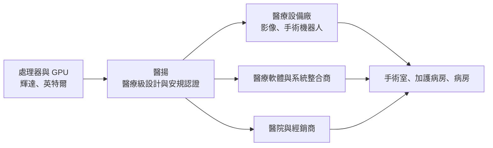
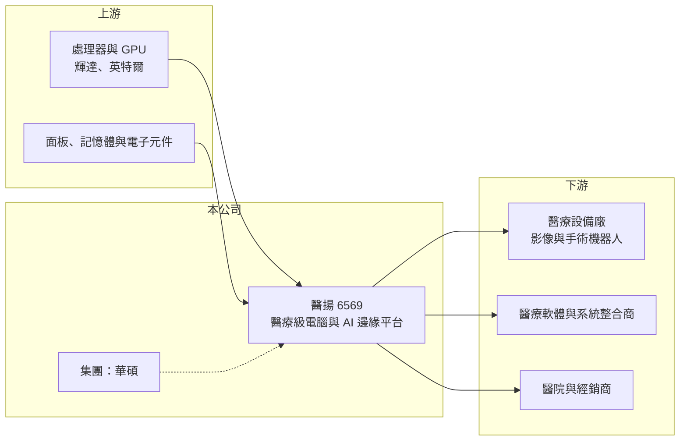

# 6569 醫揚

> 上櫃｜[[產業索引-生技醫療業|生技醫療業]]｜上市（櫃）日期 2016/12/21

# 第一章：企業模式與商業藍圖

> [!info] 撰寫說明
> 本文由 Claude 依公開資料整理，架構比照 [[2330台積電]] 的四章研究，資料截至 2026-10-08。財務數字來源：Goodinfo 年度經營績效頁（含 2026 年公告標題）、櫃買中心開放資料（基本資料、2026 年第二季資產負債與綜合損益、本益比殖利率）、優分析 2025 年 RSNA 展會報導、ETtoday 與鉅亨網報導標題。公開資料有限：產品別與地區別營收比重未查得；標示「憑記憶」的產品線描述尚未比對原始文件。#待校對

在評估單一個股的長期投資價值時，首要步驟是拆解企業的底層獲利邏輯。本章針對醫揚科技（股票代號：6569，以下簡稱醫揚）的商業模式進行定性分析，說明這家華碩集團旗下的醫療電腦公司，如何從醫療平板與推車電腦，走向 AI 手術與醫療影像的邊緣運算平台。

## 一、核心定位：醫療級電腦的專業供應商

醫揚成立於 2010 年，2016 年 12 月上櫃，董事長為莊永順、總經理為莊富鈞，2026 年現金增資後實收資本額約 4.28 億元。醫揚是 [[2357華碩]] 集團旗下的醫療電腦公司，媒體常以「華碩醫療小金雞」稱之。

醫揚的產品是[[醫療級電腦]]：外觀類似一般電腦或平板，但必須通過醫療電氣安規、抗菌外殼、無風扇散熱與長期供貨等要求，才能放在病房、手術室與加護病房使用。產品線包括醫療平板電腦、醫療顯示器、行動護理推車電腦（憑記憶，待校對），以及近年發展的 AI 手術工作站與醫療級[[邊緣運算]]平台。

## 二、事業板塊：從醫院資訊化走向 AI 醫療

* **醫院資訊化設備：** 護理站、病房與行動護理推車使用的醫療電腦與平板，需求來自醫院電子病歷與智慧病房建置，屬於穩定的更新需求（推估）。
* **AI 醫療邊緣平台：** 依 2025 年北美放射學會（RSNA）展會報導，醫揚展出搭載 [[NVDA輝達]] 最新 GPU 架構的醫療級邊緣平台，用於高階影像處理與 AI 病灶辨識，並採用 [[INTC英特爾]] 運算架構；產品也鎖定 AI 手術機器人的運算平台需求。公司以散熱專利與醫療安規設計，讓設備能在手術室與加護病房運作，定位為軟體開發商的「AI Ready 標準化載體」。
* **營收結構：** 本次未查得產品別與地區別營收比重，因此不放圓餅圖。

## 三、資本轉化邏輯：以硬體平台承接醫療軟體與 AI

* **平台化的價值：** 醫療 AI 軟體公司通常不想自己設計符合醫療安規的硬體，醫揚提供已認證的運算平台，讓軟體公司與設備商可以直接整合，縮短產品上市時間。
* **集團資源：** 背靠華碩集團的採購、製造與供應鏈管理能力，有助於取得關鍵零組件與控制成本（推估）。

## 四、企業長期藍圖

依 2025 年法人報導，醫揚採「美國秀技術、台灣秀應用」的雙軌策略，希望卡位成為 AI 醫療的硬體供應商，目標市場涵蓋高階放射影像、臨床即時 AI 運算、智慧醫院（智慧病房、遠距醫療、手術輔助）與手術機器人。2026 年 8 月公司完成現金增資，為新產品與市場擴張準備資金。醫療 AI 從研究走向臨床的過程中，對醫療級運算硬體的需求可望長期成長，但也吸引更多工業電腦廠投入。

# 第二章：護城河深度與競爭優勢

本章分析醫揚的競爭優勢，說明醫療級電腦市場的進入門檻，以及它在 AI 醫療浪潮中面對的對手。

## 一、護城河的核心組成要素

* **醫療安規認證：** 醫療電腦必須通過醫用電氣安全與電磁相容等認證，客戶導入後還要經過自家設備的整合驗證，轉換成本高，一旦被設計進醫療設備，通常會長期供貨。
* **散熱與機構設計：** 手術室與加護病房要求低噪音、無風扇與易清潔，高效能 GPU 的散熱是技術難點，醫揚以散熱專利建立差異化。
* **與晶片大廠的合作：** 與輝達、英特爾的技術合作，讓醫揚能率先取得最新運算架構，對 AI 醫療客戶具吸引力。

## 二、主要競爭對手格局

| 對手 | 定位 | 與醫揚的比較 |
|---|---|---|
| [[2395研華]] | 工業電腦龍頭，設有醫療事業 | 規模與通路遠大於醫揚，產品線完整 |
| [[6414樺漢]]、[[8050廣積]] | 工業電腦與嵌入式平台 | 部分產品切入醫療應用 |
| [[3022威強電]]、[[6166凌華]] | 工業電腦與邊緣 AI 平台 | 邊緣 AI 平台可延伸到醫療應用（推估） |
| 歐美醫療電腦品牌 | 醫療推車與醫療顯示器 | 在歐美醫院通路具品牌優勢 |

## 三、優勢轉化：守得住、守不住與觀察重點

* **守得住：** 已被設計進醫療設備的長期供貨關係，以及醫療安規認證帶來的轉換成本。
* **守不住：** 一般醫療平板與推車電腦的價格。這類產品規格相對標準化，工業電腦同業都能提供，價格競爭明顯，2024 至 2025 年營業利益率下滑即反映這點。
* **觀察重點：** AI 邊緣平台的出貨占比、與醫療設備大廠的設計案數量，以及毛利率能否回到 35% 以上。

# 第三章：財務體質與盈利規模

資料日期：2026-10-08。數字取自 Goodinfo 年度經營績效頁與櫃買中心開放資料，表格是撰寫當時的快照；最新月營收、毛利率、累計 EPS 由自動排程寫在本筆記的屬性欄位（月營收、毛利率、累計EPS 等）。#待校對

財務報表是檢驗護城河是否真實存在的最終標準。本章用七年的三率、ROE 與資本報酬，檢視醫揚的獲利能力與穩定度。

## 一、獲利能力的基石：三率

| 年度 | 營收（新台幣） | [[毛利率]] | [[營業利益率]] | EPS（元） | [[ROE]] |
|---|---|---|---|---|---|
| 2019 | 14.8 億 | 36.6% | 16.0% | 10.88 | 24.2% |
| 2020 | 13.5 億 | 34.4% | 11.9% | 6.07 | 15.9% |
| 2021 | 12.0 億 | 30.3% | 6.20% | 4.22 | 12.1% |
| 2022 | 16.0 億 | 29.5% | 9.09% | 6.24 | 16.7% |
| 2023 | 14.9 億 | 37.3% | 14.6% | 7.65 | 17.5% |
| 2024 | 12.4 億 | 36.8% | 7.15% | 4.69 | 11.7% |
| 2025 | 13.1 億 | 33.0% | 3.98% | 2.88 | 7.15% |
| 2026 上半年 | 8.07 億 | 32.3% | 5.80% | 2.64 | 未查得 |

* **[[毛利率]]：** 長期在 29% 至 37% 之間，屬於硬體設備公司的合理水準。2023 年達 37.3% 後逐步回落，反映產品組合與價格競爭的變化。
* **[[營業利益率]]：** 波動較大，從 2019 年的 16% 降到 2025 年的 4%。營收持平但營業費用增加（研發與海外推廣），壓縮本業獲利。
* **業外收益：** 2026 年上半年營業利益約 0.46 億元，業外收益卻有約 0.70 億元，稅前淨利約 1.16 億元，業外占比過半，評估本業時應以營業利益為準。
* **營收趨勢：** 2019 至 2025 年營收年複合成長約 -2.0%（推算），長期大致持平；2026 年上半年營收 8.07 億元，已超過 2025 年全年的六成，1 至 8 月累計年增約 14%（櫃買中心資料）。

## 二、[[ROE]]：資本效率

2021 至 2025 年平均 ROE 約 13.0%（推算），但 2025 年降到 7.2%。2026 年第二季底總負債約 8.14 億元、權益約 15.5 億元，負債比約 34%，非流動負債約 2.02 億元。每股淨值 39.70 元，股價淨值比約 2.31 倍、本益比約 19.5 倍（櫃買中心資料）。

## 三、股利與自由現金流

最近一期現金股利每股 3.0 元，殖利率約 3.3%（櫃買中心資料），高於 2025 年 EPS 2.88 元，代表部分股利來自累積盈餘。電腦組裝屬輕資產製造，自由現金流長期為正（推估，具體金額未查得）。

## 四、[[ROIC]] 與 [[WACC]]：價值創造利差

**ROIC 推算：** 2025 年營收 13.1 億元、營業利益率 3.98%，營業利益約 0.52 億元，扣除 20% 稅率後約 0.42 億元。2026 年第二季底權益約 15.5 億元，有息負債以非流動負債約 2.02 億元推估，投入資本約 17.5 億元，ROIC 約 2.4%（推算）。若以 2021 至 2023 年較正常的營業利益率 6% 至 15% 計算，ROIC 約在 3% 至 10% 之間（推算）。

**WACC 推算：** 台灣 10 年期公債殖利率取 1.75%、市場風險溢酬 6%、β 取工業電腦與醫材類股常見值 1.0（未查得公司實際 β），股東權益成本約 7.75%。負債成本假設 2.5%、稅後約 2.0%；權益約占 88%、負債約占 12%，WACC 約 7.1%（推算）。

**結論：** 2025 年 ROIC 約 2.4%，低於約 7% 的資金成本，本業暫時沒有創造經濟價值；過去獲利較好的年份 ROIC 則與 WACC 相當或略高。醫揚要重新創造價值，關鍵在於 AI 醫療平台能否帶來較高毛利的營收，讓營業利益率回到 10% 以上。

# 第四章：總體風險與地緣政治

任何企業都無法脫離宏觀環境獨立存在。本章分析醫揚長期必須面對的市場、供應鏈與法規風險。

## 一、地緣政治與國際市場

* **美國市場依賴：** 公司以美國為技術展示與市場拓展的重心，美國關稅政策與醫療機構預算，會直接影響訂單（推估）。
* **供應鏈：** 處理器、GPU 與面板等關鍵零組件仰賴國際大廠，地緣政治或出口管制可能影響取得與成本。

## 二、產業週期與市場結構

* **醫院資本支出週期：** 醫院的資訊化設備採購受預算週期影響，政府醫療支出縮減或醫院經營壓力增加時，採購會延後。
* **工業電腦同業競爭：** AI 邊緣運算吸引眾多工業電腦廠投入醫療市場，產品差異化不易維持。

## 三、營運環境的隱性風險

* **零組件成本：** 記憶體與 GPU 價格波動會影響毛利率，硬體公司難以即時轉嫁。
* **醫療法規：** 醫療電氣安規與資安規範（如醫療設備網路安全要求）持續更新，增加認證成本。
* **匯率：** 外銷比重高，新台幣升值會壓縮毛利與業外匯兌收益。

## 四、科技演進風險

醫療 AI 的價值越來越多集中在軟體與演算法，硬體平台若無法與軟體深度整合，可能淪為標準化商品。醫揚需要持續與晶片大廠和醫療軟體商維持合作，才能保有平台地位。

# 專有名詞解析

## 應用

- **[[醫療級電腦]]**：符合醫用電氣安規、抗菌與無風扇設計的電腦，可在病房、手術室與加護病房長期使用。
- **[[邊緣運算]]**：在資料產生的現場附近進行運算，而非全部傳回雲端，可降低延遲並保護醫療資料隱私。

## 金融

- **[[毛利率]]**：營業毛利占營收的比例，反映產品定價能力與生產成本控制。
- **[[營業利益率]]**：扣除營業費用後的營業利益占營收的比例，衡量本業整體獲利能力。
- **[[ROE]]**：股東權益報酬率，稅後淨利除以股東權益，衡量公司運用股東資金的效率。
- **[[ROIC]]**：投入資本報酬率，稅後營業利益除以股東權益與有息負債的合計，衡量本業對所有資金提供者的報酬。
- **[[WACC]]**：加權平均資金成本，依股東權益與負債的比重加權計算的資金成本，ROIC 高於它才代表創造價值。

# 核心供應鏈

## 1. 上游
- 處理器與 GPU：[[NVDA輝達]]、[[INTC英特爾]]
- 面板、記憶體與電子元件供應商（名稱未查得）

## 2. 本公司與集團
- 醫揚科技：醫療平板、醫療電腦、AI 手術工作站、醫療級邊緣平台
- 集團：[[2357華碩]]

## 3. 下游／客戶
- 醫療影像與手術機器人設備廠、醫療 AI 軟體商、醫院與經銷商（客戶名稱未公開）

## 4. 同業
- 工業電腦與邊緣 AI：[[2395研華]]、[[6414樺漢]]、[[8050廣積]]、[[3022威強電]]、[[6166凌華]]

## 最新新聞
<!-- news:start -->
<!-- news:end -->

## 相關連結
- [公開資訊觀測站](https://mopsov.twse.com.tw/mops/web/t05st03?step=1&firstin=1&co_id=6569)
- [Goodinfo](https://goodinfo.tw/tw/StockDetail.asp?STOCK_ID=6569)
- [Yahoo 股市](https://tw.stock.yahoo.com/quote/6569)
- [鉅亨網新聞](https://www.cnyes.com/twstock/6569/news)
