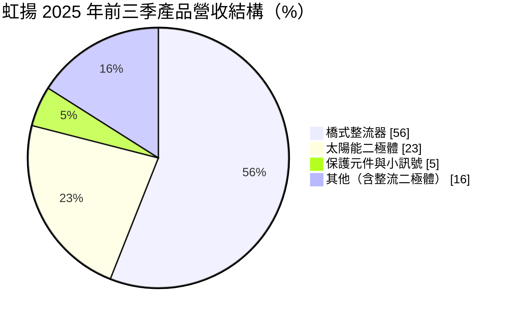
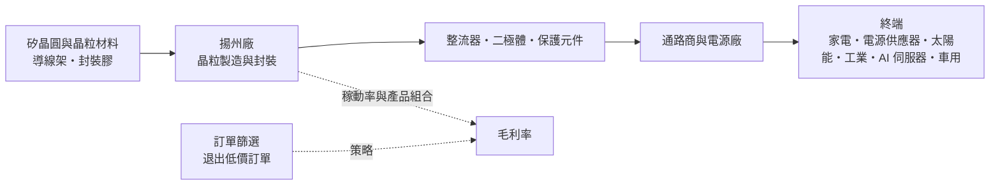
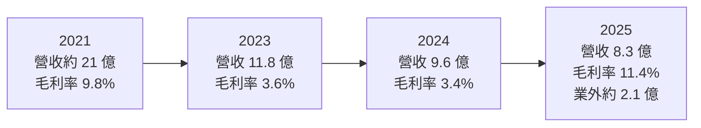
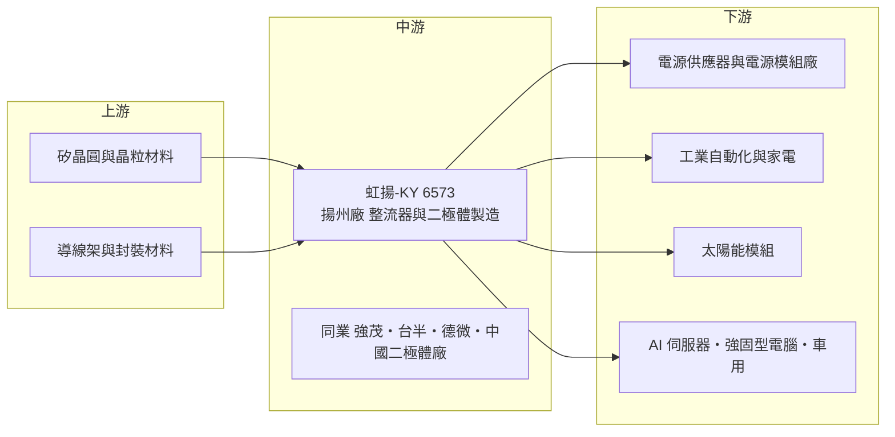

# 6573 虹揚-KY

> 上市｜[[產業索引-半導體業|半導體業]]｜上市（櫃）日期 2017/09/26

# 第一章：企業模式與商業藍圖

> [!info] 撰寫說明
> 本文由 Claude 依公開資料整理，架構比照 [[2330台積電]] 的四章研究，資料截至 2026-10-08。財務數字來源：MoneyDJ（富邦證券版）年度財務比率表、HiStock 每月營收頁、富果研究 2025/11/27 與 2026/05/28 法說會備忘錄、自由時報 2025/06/23 報導、nStock 公司簡介；產業描述為整理性內容，尚未逐條比對原始文件。#待校對

在評估單一個股的長期投資價值時，首要步驟是拆解企業的底層獲利邏輯。本章針對虹揚-KY（股票代號：6573，以下簡稱虹揚）的商業模式進行定性分析，說明這家以中國揚州為生產基地的二極體製造商，為何長期處於本業虧損，以及公司如何透過「重質不重量」的策略嘗試轉型。

## 一、核心定位：以橋式整流器為主的分離式元件廠

虹揚是一家半導體[[分離式元件]]製造商，產品包括各類整流器、[[二極體]]與保護元件。公司於 2009 年在英屬開曼群島設立控股公司，主要營運子公司為中國的揚州虹揚，2017 年 9 月以 [[KY股]] 形式在台灣證券交易所上市。2025 年 10 月，揚州虹揚以現金收購同一集團下的揚州虹宇電子科技 100% 股權，屬於共同控制下的組織重整。

分離式元件和 IC 不同：IC 是把數百萬顆電晶體整合在一顆晶片上，分離式元件則是一顆晶片只做一件事，例如讓電流單向通過（整流）、吸收突波（保護）或開關電流。這類產品單價低、標準化程度高，主要比的是成本、品質穩定度與交期。虹揚與 [[2481強茂]]、[[5425台半]] 等台灣同業屬於同一類型的元件廠，但規模較小，2025 年營收約 8.33 億元。

虹揚與一般 IC 設計公司最大的不同在於它擁有自己的生產線，從晶粒到封裝都在自家工廠完成，屬於整合元件製造（[[IDM]]）型態的小型廠商。擁有工廠能掌握品質與交期，但也意味著必須承擔固定成本，在需求不足時毛利率會被大幅壓縮。

## 二、終端應用／產品板塊：橋式整流器占過半

* **[[橋式整流器]]：** 公司最大產品線，用於把交流電轉為直流電，幾乎所有需要插電的電子設備電源都會用到。比重從 2023 年約 42% 提升到 2025 年前三季的 56%，是公司刻意提高的高毛利產品。
* **太陽能二極體：** 用於太陽能板接線盒中的旁路二極體，避免部分遮蔭時整片模組失效。這塊業務隨太陽能市場起伏，且中國同業價格競爭激烈，公司已逐步收斂。
* **保護元件與小訊號元件：** 包括 [[ESD]] 靜電保護與 [[TVS]] 突波保護元件。依 2025 年報導，ESD 已打入台系 AI 伺服器、電競板卡與強固型電腦，是公司希望擴大的新領域。

依 2026 年 5 月法說會資料，應用端以 5C 電子約 29% 最高，綠能、電源模組、工業自動化各約 15% 至 16%，AI 伺服器約 6%、車用約 4%。地區上中國仍占約 70.5%，台灣 11.3%、越南 7.6%、印度 3.2%。

## 三、資本轉化邏輯（營運模式）：自有工廠的成本型製造

虹揚的獲利模式屬於成本型製造：以自有工廠大量生產標準化元件，靠規模與良率壓低單位成本。問題在於，分離式元件市場中國同業眾多、產能充足，報價長期承壓。2022 至 2024 年虹揚毛利率只有 1.88% 至 3.63%，接近零毛利，代表售價只勉強覆蓋生產成本，研發與管理費用全數轉為虧損。

面對這種情況，管理層在 2025 年採取「訂單篩選」策略：限制低毛利或負毛利訂單出貨，退出中國低階家電市場，寧可犧牲營收換取毛利率。結果 2025 年營收年減 13.4%，但毛利率從 2024 年的約 3% 回升到約 11%。這個取捨說明了小型元件廠的核心困境：規模不夠大時，追求量反而會擴大虧損。

## 四、企業長期藍圖：高功率、保護元件與第三代半導體

虹揚在 2025 至 2026 年的法說會中提出的長期方向包括：

* **產品升級：** 橋式整流器增加 [[蕭特基二極體]]橋與快速恢復橋；保護元件發展小型貼片 ESD、高瓦數 TVS，以及用於 HDMI、USB 3.1 等高速介面的保護元件；[[CSP]] 封裝產品已出貨並切入 DDR5 相關應用。
* **[[SiC]] 藍圖：** 依 2026 年 5 月法說會，規劃 2026 年推出碳化矽蕭特基二極體、2027 年推出 1200V 碳化矽蕭特基二極體、2028 年推出 650V 與 1200V 碳化矽 MOSFET。
* **替代料商機：** 2025 年安世半導體（Nexperia）事件後，歐洲、韓國、印度客戶開始向虹揚詢價 ESD 與小訊號元件。公司估計替代料認證需要 6 至 18 個月。
* **市場分散：** 鞏固大中華區，同時拓展台灣、韓國、東南亞與印度市場，並以 AI 伺服器與車用電子為成長目標。

這些方向合理，但都屬於起步階段。AI 伺服器與車用合計約一成營收，碳化矽量產還需要數年。虹揚的長期藍圖能否實現，取決於公司能否在本業持續虧損的情況下，撐過新產品的驗證期。

# 第二章：護城河深度與競爭優勢

在長期價值投資中，「護城河」指企業抵禦競爭、維持超額利潤的保護機制。本章分析虹揚的競爭條件、主要對手，以及公司能在哪些市場建立差異化。

## 一、護城河的核心組成要素

坦白說，虹揚目前的護城河很淺，長年本業虧損就是最直接的證據。以下三點是公司嘗試建立的差異化來源：

* **1. 橋式整流器的產品專注：** 橋式整流器占營收過半，公司在這個細分品項上累積了較完整的規格與客戶基礎。專注單一品項能提高良率與議價能力，是小廠在大市場中生存的常見策略。
* **2. 非中國品牌客戶的可靠替代供應商：** 虹揚是台灣上市公司，對歐洲、韓國、印度客戶而言，具有財務透明度與供應穩定的形象。2025 年安世事件後的詢價潮，就是這種「可信任替代來源」價值的展現。
* **3. 工業與電源客戶的認證：** 工業與電源應用超過一半營收，是主要利潤來源。這類客戶在導入元件時需要驗證，一旦通過不會輕易更換，提供一定的訂單穩定性。

## 二、全球主要競爭對手格局

| 對手 | 定位 | 對虹揚的威脅 |
|---|---|---|
| [[2481強茂]] | 台灣二極體與 MOSFET 大廠，產品線廣 | 規模與產品線完整度遠高於虹揚 |
| [[5425台半]] | 台灣分離式元件大廠，車用與工業比重高 | 在車用與工業市場直接競爭 |
| [[3675德微]] | 台灣保護元件與二極體廠 | 在 ESD、TVS 保護元件市場重疊 |
| 中國大陸二極體廠 | 政策支持、產能充足 | 以低價搶占家電與太陽能市場，是毛利率長期低迷的主因 |
| Vishay、Diodes、安世半導體等國際大廠 | 全球車用與工業元件龍頭 | 握有品牌與認證優勢；安世事件則帶來替代機會 |

註：表中對手為依產業結構整理，法說會未具名競爭對手（推估）。

## 三、優勢轉化：守得住／守不住／觀察重點

* **守得住：** 工業與電源用的橋式整流器，以及需要可靠替代來源的國際客戶。這類訂單看重品質穩定與供應安全，價格敏感度較低。
* **守不住：** 中國家電與太陽能市場的標準品。中國同業產能充足、報價極低，虹揚已主動退出部分市場，這部分營收未來可能持續萎縮。
* **觀察重點：** 第一是毛利率能否站穩 10% 以上並繼續提升，這是本業轉虧為盈的前提；第二是安世事件的替代料訂單能否在 2026 至 2027 年轉為長期合約；第三是碳化矽產品是否如期推出並取得客戶驗證。

# 第三章：財務體質與盈利規模

資料日期：2026-10-08。數字取自 MoneyDJ 年度財務比率表、HiStock 每月營收累計、富果研究法說會備忘錄，表格是撰寫當時的快照；最新月營收、毛利率、累計 EPS 由自動排程寫在本筆記的屬性欄位（月營收、毛利率、累計EPS 等）。#待校對

財務報表是檢驗護城河是否真實存在的最終標準。本章用多年度的三率、ROE 與資本報酬，檢視虹揚在分離式元件價格競爭下的獲利品質。

## 一、獲利能力的基石：三率

| 年度 | 營收（新台幣） | [[毛利率]] | [[營業利益率]] | EPS（元） | [[ROE]] |
|---|---|---|---|---|---|
| 2021 | 約 20.97 億（推算） | 9.75% | -5.52% | -1.93 | -14.34% |
| 2022 | 12.20 億 | 1.88% | -17.56% | -2.59 | -22.25% |
| 2023 | 11.77 億 | 3.63% | -17.25% | -2.91 | -28.96% |
| 2024 | 9.62 億 | 3.35% | -18.55% | -1.94 | -9.07% |
| 2025 | 8.33 億 | 11.36% | -12.20% | 1.23 | 11.67% |

註：2022 至 2025 年營收取自 HiStock 年度累計；2021 年為 MoneyDJ 依每人營收與員工數推算，僅供參考。2019 與 2020 年 EPS 分別為 -1.57 與 -2.54 元，2018 年為 0.55 元。

* **[[毛利率]]：** 2022 至 2024 年毛利率不到 4%，是分離式元件標準品價格戰的結果。2025 年回升到約 11%，主要來自訂單篩選與產品組合調整，而不是市場報價全面改善。
* **[[營業利益率]]：** 至少從 2019 年起本業連年虧損。2025 年營業虧損收斂到約 1.01 億元，營業費用年減 6.6% 至約 1.96 億元，但仍不足以讓本業轉正。
* **2025 年 EPS 為正的原因：** 2025 年稅後淨利約 0.99 億元、EPS 1.23 元，主要來自約 2.11 億元的業外收入，其中包括第三季認列的老廠拆遷補助款約 2.48 億元。這是一次性收益，不能視為本業轉機。2026 年第一季 EPS 為 -0.40 元，再次說明本業仍在虧損。

## 二、[[ROE]]：資本效率

以 2021 至 2025 年計算，近 5 年平均 ROE 約 -12.6%（推算：-14.34、-22.25、-28.96、-9.07、11.67 的簡單平均）。連年虧損使每股淨值從 2018 年的 21.63 元一路下降到 2025 年的 7.71 元，每股淨值在 7 年間縮水超過六成。這是投資人評估虹揚時最需要正視的事實：長期而言，公司一直在消耗股東資本。

營收方面，2021 年約 20.97 億元到 2025 年 8.33 億元，年複合成長率約 -20.6%（推算）。其中一部分是公司主動退出低價訂單，另一部分則是中國市場需求疲弱與價格競爭。

## 三、資本支出與自由現金流

* **資本支出與現金流：** 本次未查得逐年資本支出與自由現金流數字。以本業連年虧損、淨值持續下降判斷，公司長期自由現金流偏弱（推估）。
* **財務結構：** 依富果整理，2025 年第三季總資產 16.48 億元、總負債 9.16 億元、權益 7.32 億元，負債比率由 63% 降到 55%，流動比率由 0.88 升到 1.16。老廠拆遷補助款改善了財務結構，但負債比仍偏高。
* **股利：** 2025 年度現金股利為 0 元。在本業虧損期間，保留現金與降低負債是合理的優先順序。

## 四、[[ROIC]] 與 [[WACC]]：價值創造利差

**ROIC 推算：** 虹揚本業連年營業虧損，ROIC 為負值。以 2025 年為例，營業虧損約 1.01 億元，投入資本以權益 7.32 億元加上有息負債估算（有息負債未查得；若以總負債 9.16 億元中約一半為借款推估，約 4.6 億元），投入資本約 11.9 億元，ROIC 推算約 -8.5%（虧損不計稅盾）。2022 至 2024 年營業利益率在 -17% 至 -19% 之間，ROIC 推算更低，約在 -10% 至 -15%。

**WACC 推算：** 採 CAPM，台灣 10 年期公債殖利率取 1.75%，市場風險溢酬 6%，β 取分離式元件中小型股常見值約 1.1（未查得來源數字），股東權益成本約 8.35%。負債成本假設 3%，稅後約 2.4%；以權益與有息負債約 6 比 4 估算資本結構（推估），WACC 約 0.6 × 8.35% + 0.4 × 2.4% ≈ 6%（推算）。

**結論：** 虹揚的 ROIC 長期為負，遠低於約 6% 的資金成本，代表公司過去多年並未創造經濟價值。2025 年的獲利來自一次性業外收入，不改變這個結論。投資人若要評估虹揚，重點不在帳面 EPS，而在毛利率能否持續提升到足以讓營業利益轉正，這是 ROIC 由負轉正的必要條件。

# 第四章：總體風險與地緣政治

任何企業都無法脫離宏觀環境獨立存在。本章分析虹揚長期必須面對的地緣政治、產業週期、營運與技術風險。

## 一、地緣政治

虹揚的生產基地在中國揚州，營收約七成來自中國，屬於高度暴露在兩岸與中美關係下的企業。美國對中國製電子產品加徵關稅，會降低客戶在中國採購的意願；依 2025 年報導，已有客戶到越南設廠以規避關稅。另一方面，2025 年安世半導體事件也顯示，地緣政治同樣可能為非中國籍品牌的供應商帶來替代機會。KY 股的結構還有額外的治理風險：營運主體在海外，投資人取得資訊與監督經營層的難度較高。

## 二、產業週期與市場結構

分離式元件是典型的景氣循環產品，下游涵蓋家電、電源、太陽能、工業與車用，任何一個市場的庫存調整都會傳導到元件廠。管理層表示庫存去化已在 2025 年上半年結束，但 2026 年第一季營收仍年減，顯示終端回補力道疲弱。市場結構方面，中國大陸元件廠產能持續擴充，標準品報價長期承壓，這是虹揚毛利率低迷的結構性原因，而非短期現象。

## 三、營運環境的隱性風險

* **規模劣勢：** 年營收不到 10 億元，固定成本攤提能力有限。營收再下滑，毛利率改善的成果可能被抵銷。
* **一次性收益依賴：** 2025 年獲利完全來自業外收入，類似的收益不會每年出現。
* **財務槓桿：** 負債比率雖已降到約 55%，仍高於多數台灣元件同業，若再遇景氣低迷，資金壓力可能重新浮現。
* **匯率：** 以人民幣生產、以美元與人民幣銷售，匯率波動會影響成本與報價。

## 四、科技或法規演進

功率元件的長期技術趨勢是往高壓、高效率與第三代半導體移動，AI 伺服器、電動車與儲能都需要更高效率的電源元件。虹揚的碳化矽藍圖是正確方向，但碳化矽需要不同的材料、設備與製程經驗，國際大廠與中國同業都已大舉投入。以虹揚目前的規模與財務條件，能否在 2027 至 2028 年如期推出具競爭力的碳化矽 MOSFET，是長期最大的不確定性。

# 專有名詞解析

## 半導體

- **[[分離式元件]]**：一顆晶片只執行單一功能的半導體元件，例如二極體、電晶體、MOSFET，與高度整合的 IC 相對。
- **[[二極體]]**：只讓電流單向通過的半導體元件，用於整流、保護與訊號處理，是最基本的分離式元件。
- **[[橋式整流器]]**：把四顆二極體組成橋狀電路封裝在一起，把交流電轉為直流電，是電源供應器的基本零件。
- **[[蕭特基二極體]]**：以金屬與半導體接面製成的二極體，導通壓降低、切換速度快，適合高效率電源。
- **[[ESD]]**：靜電放電保護元件，在電路遭受靜電衝擊時把電流導走，避免晶片損壞，常用於 USB、HDMI 等介面。
- **[[TVS]]**：暫態電壓抑制器，用來吸收雷擊或電源突波產生的瞬間高壓，保護後端電路。
- **[[SiC]]**：碳化矽，一種第三代半導體材料，耐高壓、耐高溫、切換損耗低，用於電動車、充電樁與資料中心電源。
- **[[CSP]]**：晶片尺寸封裝，封裝後的尺寸幾乎與晶片本身相同，適合手機、記憶體模組等空間受限的應用。
- **[[IDM]]**：整合元件製造商，自己設計、製造並銷售晶片的公司型態。

## 金融

- **[[KY股]]**：在台灣掛牌、但註冊地在開曼群島等境外地區的公司股票，營運主體多在中國或東南亞。
- **[[業外收益]]**：非本業營運產生的收入，例如處分資產、補助款、匯兌利益，通常不具持續性。

## 產業

- **[[替代料]]**：原供應商無法供貨或客戶想分散風險時，改用其他廠商的同規格元件，需重新驗證。

# 核心供應鏈

## 1. 上游：材料
- 矽晶圓、晶粒材料、導線架與封裝膠等，具體供應商未查得。

## 2. 中游：虹揚本身與同業
- 營運主體：揚州虹揚（2025 年 10 月收購同集團揚州虹宇）
- 台灣同業：[[2481強茂]]、[[5425台半]]、[[3675德微]]
- 國際同業：Vishay、Diodes、安世半導體；以及中國大陸二極體廠

## 3. 下游：電源與工業客戶
- 電源供應器、電源模組與工業自動化客戶（未具名）
- 新加坡高價家電品牌（依 2025 年報導，未具名）

## 4. 下游：新興應用
- 台系 AI 伺服器、電競板卡、強固型電腦客戶（依 2025 年報導，未具名）
- 車用：韓國車廠與台灣中南部車用零件廠試樣中（依 2025 年法說會）

## 最新新聞
<!-- news:start -->
<!-- news:end -->

## 相關連結
- [公開資訊觀測站](https://mopsov.twse.com.tw/mops/web/t05st03?step=1&firstin=1&co_id=6573)
- [Goodinfo](https://goodinfo.tw/tw/StockDetail.asp?STOCK_ID=6573)
- [Yahoo 股市](https://tw.stock.yahoo.com/quote/6573)
- [鉅亨網新聞](https://www.cnyes.com/twstock/6573/news)
