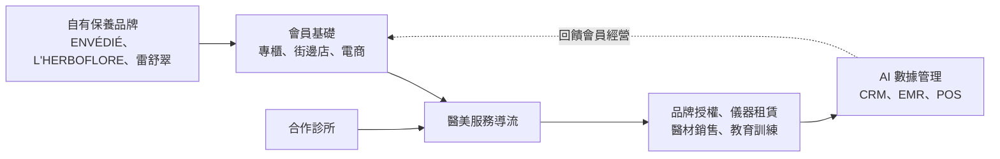
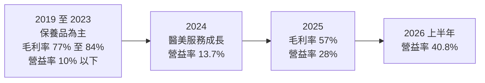
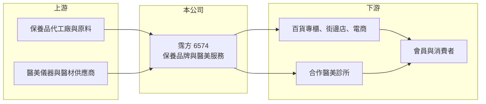

# 6574 霈方

> 上櫃｜[[產業索引-生技醫療業|生技醫療業]]｜上市（櫃）日期 2017/09/04

# 第一章：企業模式與商業藍圖

> [!info] 撰寫說明
> 本文由 Claude 依公開資料整理，架構比照 [[2330台積電]] 的四章研究，資料截至 2026-10-08。財務數字來源：Goodinfo 年度經營績效頁（含 2026 年公告標題）、富果研究 2025 年 12 月 11 日法說會整理、櫃買中心開放資料（基本資料、2026 年第二季資產負債與綜合損益、本益比殖利率）。公開資料有限：產品別與醫美服務的營收比重未查得。#待校對

在評估單一個股的長期投資價值時，首要步驟是拆解企業的底層獲利邏輯。本章針對霈方國際（股票代號：6574，以下簡稱霈方）的商業模式進行定性分析，說明這家從百貨專櫃保養品起家的公司，如何轉型為「保養品＋醫學美容服務」的雙引擎，以及這次轉型為什麼讓毛利率下降、獲利卻創新高。

## 一、核心定位：自有保養品牌與醫美服務的整合者

霈方成立於 2002 年，2017 年 9 月上櫃，董事長兼總經理為呂慶盛，實收資本額約 2.2 億元。公司從美容保養品的品牌專櫃起家，經營多個[[自有品牌]]：ENVÉDIÉ（2002 年）、L'HERBOFLORE（2012 年）、雷舒翠（2013 年），以及 2017 年成立的 Real Breese SPA 中心，銷售通路涵蓋電商、百貨專櫃與街邊店。

2022 年起，霈方開始布局[[醫學美容]]服務，目前提供合作診所品牌授權、醫美儀器租賃、醫材銷售、教育訓練與 AI 數據管理等服務，療程涵蓋微整、美容、體雕與健康管理，並整合 CRM、電子病歷（EMR）、POS 與 ERP 系統。公司的長期目標是打造「一站式健康與美麗生態圈」。

## 二、事業板塊：保養品是基礎，醫美服務是成長動能

* **美容保養事業：** 擁有龐大的會員基礎，是穩定的營收來源。保養品品牌的毛利率高，過去霈方的毛利率長期在 74% 至 84%。
* **醫學美容服務事業：** 2022 年起布局，是主要成長動能。依富果整理的法說資料，2023 年前三季醫美服務營收年增 278.3%。醫美服務的毛利率低於保養品，但營業費用率也較低，因此能提高整體營業利益率。
* **營收結構：** 本次未查得兩大事業的營收比重，因此不放圓餅圖。

## 三、資本轉化邏輯：會員基礎延伸到醫美服務

* **雙引擎互補：** 保養品的會員基礎可以導流到醫美療程，醫美療程後的修護保養又能帶回保養品銷售，兩者形成循環。公司以「保養事業支撐醫美服務成長」描述這個策略。
* **輕資產的醫美模式：** 霈方不是自己開設大量診所，而是以品牌授權、儀器租賃與系統服務和合作診所分潤，資本投入較少（依法說說明的服務內容推估）。

## 四、企業長期藍圖

霈方的長期方向是把醫學美容、預防醫學、健康體態管理與 AI 數據中心整合成一個生態圈。台灣醫美市場隨著療程普及與消費者接受度提高而成長，若霈方能以系統與品牌授權擴大合作診所數量，就能在不大幅增加資本的情況下放大營收。

# 第二章：護城河深度與競爭優勢

本章分析霈方的競爭優勢，說明它在保養品與醫美服務兩個市場的位置，以及轉型後的護城河是否更穩固。

## 一、護城河的核心組成要素

* **品牌與會員基礎：** 經營二十多年的自有品牌與會員，是新進品牌難以短期複製的資產。會員資料也是醫美服務導流的基礎。
* **整合式服務：** 同時提供保養品、醫美儀器、醫材與管理系統，對合作診所而言是一站式解決方案，診所導入後更換供應商的成本較高。
* **數據管理能力：** 整合 CRM、EMR、POS、ERP 的系統，讓霈方能掌握會員消費與療程紀錄，有利精準行銷與回購。

## 二、主要競爭對手格局

| 對手 | 定位 | 與霈方的比較 |
|---|---|---|
| 國際保養品牌 | 百貨專櫃與電商 | 品牌知名度與行銷預算遠大於霈方 |
| [[6523達爾膚]] | 醫美保養品 | 以專業通路與外銷為主，霈方以台灣自有通路為主 |
| [[4137麗豐-KY]]、[[6666羅麗芬-KY]] | 專業美容保養 | 以美容院通路為主 |
| [[1786科妍]] | 醫美注射填充劑 | 醫美產業的醫材供應商 |
| 連鎖醫美診所集團 | 醫美療程服務 | 直接經營診所，與霈方的合作診所競爭客源 |

## 三、優勢轉化：守得住、守不住與觀察重點

* **守得住：** 2025 年營業利益率提升到 28.3%，2026 年上半年更達 40.8%，顯示醫美服務的商業模式在財報上已經跑出成果。
* **守不住：** 保養品本業的營收規模。2019 年營收 10.6 億元，之後降到 6 億元上下，傳統專櫃通路的流量下滑是長期趨勢。
* **觀察重點：** 合作診所數量與醫美服務營收占比、2026 年上半年的高利潤率能否延續，以及業外收益（如處分有價證券）對 EPS 的貢獻程度。

# 第三章：財務體質與盈利規模

資料日期：2026-10-08。數字取自 Goodinfo 年度經營績效頁、富果研究法說會整理與櫃買中心開放資料，表格是撰寫當時的快照；最新月營收、毛利率、累計 EPS 由自動排程寫在本筆記的屬性欄位（月營收、毛利率、累計EPS 等）。#待校對

財務報表是檢驗護城河是否真實存在的最終標準。本章用七年的三率、ROE 與資本報酬，檢視霈方轉型前後的獲利結構變化。

## 一、獲利能力的基石：三率

| 年度 | 營收（新台幣） | [[毛利率]] | [[營業利益率]] | EPS（元） | [[ROE]] |
|---|---|---|---|---|---|
| 2019 | 10.6 億 | 83.7% | 10.3% | 4.04 | 14.2% |
| 2020 | 8.50 億 | 79.4% | 7.07% | 1.91 | 6.64% |
| 2021 | 6.48 億 | 76.6% | -0.71% | 0.63 | 2.12% |
| 2022 | 6.81 億 | 77.2% | 7.47% | 3.09 | 10.7% |
| 2023 | 6.20 億 | 77.3% | 8.96% | 2.12 | 7.30% |
| 2024 | 5.84 億 | 74.0% | 13.7% | 4.10 | 13.8% |
| 2025 | 6.22 億 | 57.1% | 28.3% | 6.82 | 19.2% |
| 2026 上半年 | 4.15 億 | 55.5% | 40.8% | 9.07 | 未查得 |

* **[[毛利率]] 下降、[[營業利益率]] 上升：** 這是商業模式轉變的典型訊號。保養品專櫃的毛利率高，但百貨抽成、櫃位人員與行銷費用也高，營業利益率長期只有個位數；醫美服務的毛利率較低，但費用結構精簡，因此營業利益率大幅提升。
* **營收趨勢：** 2019 至 2025 年營收年複合成長約 -8.5%（推算），主要是保養品本業縮小；2026 年 1 至 8 月累計營收年增約 40%（櫃買中心資料），醫美服務帶動營收重回成長。
* **業外收益：** 2026 年上半年業外收益約 0.67 億元，占稅前淨利約 28%。2026 年 9 月公司公告最近一年累積處分有價證券達公告標準，部分 EPS 來自投資收益，評估本業時應以營業利益為準。

## 二、[[ROE]]：資本效率

2021 至 2025 年平均 ROE 約 10.6%（推算），並呈現上升趨勢，2025 年達 19.2%。2026 年第二季底總負債約 2.84 億元、權益約 10.7 億元，負債比約 21%，財務結構保守。每股淨值 48.55 元，股價淨值比約 2.46 倍、本益比約 9.0 倍（櫃買中心資料）。

## 三、股利與自由現金流

最近一期現金股利每股 3.0 元，殖利率約 2.5%（櫃買中心資料），以 2025 年 EPS 6.82 元計算，配息率約 44%（推算），比過去保守，可能保留資金支應醫美業務擴張。2026 年公司也修訂員工認股權憑證辦法，以股權激勵留住人才。

## 四、[[ROIC]] 與 [[WACC]]：價值創造利差

**來源數字：** 富果整理的法說資料（2023 年資料）列出霈方 ROIC 約 10.67%、WACC 約 5.48%。

**2025 年 ROIC 推算：** 2025 年營收 6.22 億元、營業利益率 28.3%，營業利益約 1.76 億元，扣除 20% 稅率後約 1.41 億元。2026 年第二季底權益約 10.7 億元，有息負債以非流動負債約 0.91 億元推估，投入資本約 11.6 億元，ROIC 約 12.2%（推算）。

**WACC 推算：** 台灣 10 年期公債殖利率取 1.75%、市場風險溢酬 6%、β 取消費服務股常見值 0.9（未查得公司實際 β），股東權益成本約 7.15%。負債成本假設 2.5%、稅後約 2.0%；權益約占 92%、負債約占 8%，WACC 約 6.7%（推算），與富果引用的 5.48% 同一量級。

**結論：** ROIC 約 12%，高於約 5.5% 至 6.7% 的資金成本，利差約 5 至 7 個百分點，而且 2024 年以後明顯擴大，代表醫美轉型確實提高了資本效率。

# 第四章：總體風險與地緣政治

任何企業都無法脫離宏觀環境獨立存在。本章分析霈方長期必須面對的市場、法規與營運風險。

## 一、產業週期與市場結構

* **消費景氣：** 保養品與醫美療程都屬於可選消費，景氣轉弱時支出容易縮減。
* **醫美市場競爭：** 台灣醫美診所數量多、價格競爭激烈，合作診所的經營狀況會直接影響霈方的服務收入。
* **專櫃通路式微：** 百貨專櫃的客流量長期下滑，保養品本業需要轉向電商與自有通路。

## 二、法規風險

* **醫療法規：** 醫美療程屬於醫療行為，須由醫師執行，廣告與收費受醫療法規範。主管機關若加強醫美管理（例如廣告、療程定價或儀器使用規定），會影響合作診所的經營模式。
* **醫材與化妝品法規：** 醫美儀器與醫材須取得許可，化妝品的成分與功效宣稱也有規範，法規趨嚴會提高成本。

## 三、營運環境的隱性風險

* **業外收益波動：** 2026 年獲利有相當比例來自業外與投資處分，這類收益不穩定，可能造成未來 EPS 波動。
* **個資與醫療資料安全：** 整合 CRM 與電子病歷系統，涉及大量會員與病歷資料，一旦發生資安事件，品牌與法律責任風險都很高。
* **人才依賴：** 醫美服務仰賴醫師、護理與美容專業人員，人才流動會影響服務品質與合作關係。

# 專有名詞解析

## 金融

- **[[毛利率]]**：營業毛利占營收的比例，反映產品定價能力與生產成本控制。
- **[[營業利益率]]**：扣除營業費用後的營業利益占營收的比例，衡量本業整體獲利能力。
- **[[ROE]]**：股東權益報酬率，稅後淨利除以股東權益，衡量公司運用股東資金的效率。
- **[[ROIC]]**：投入資本報酬率，稅後營業利益除以股東權益與有息負債的合計，衡量本業對所有資金提供者的報酬。
- **[[WACC]]**：加權平均資金成本，依股東權益與負債的比重加權計算的資金成本，ROIC 高於它才代表創造價值。

## 產業

- **[[自有品牌]]**：由公司自行經營、以自己的商標銷售的品牌，相對於替他人代工，可保留較高的品牌溢價。
- **[[醫學美容]]**：以醫療技術改善外觀的服務，包括注射、雷射、體雕等療程，須由醫師執行。

# 核心供應鏈

## 1. 上游
- 保養品原料與代工、包材供應商（名稱未查得）
- 醫美儀器與醫材供應商（名稱未查得）

## 2. 本公司
- 霈方國際：ENVÉDIÉ、L'HERBOFLORE、雷舒翠、Real Breese SPA，醫美診所品牌授權與系統服務

## 3. 下游／客戶
- 百貨專櫃、街邊店、電商通路的會員
- 合作醫美診所

## 4. 同業
- 保養與醫美：[[6523達爾膚]]、[[4137麗豐-KY]]、[[6666羅麗芬-KY]]、[[1786科妍]]

## 最新新聞
<!-- news:start -->
<!-- news:end -->

## 相關連結
- [公開資訊觀測站](https://mopsov.twse.com.tw/mops/web/t05st03?step=1&firstin=1&co_id=6574)
- [Goodinfo](https://goodinfo.tw/tw/StockDetail.asp?STOCK_ID=6574)
- [Yahoo 股市](https://tw.stock.yahoo.com/quote/6574)
- [鉅亨網新聞](https://www.cnyes.com/twstock/6574/news)
