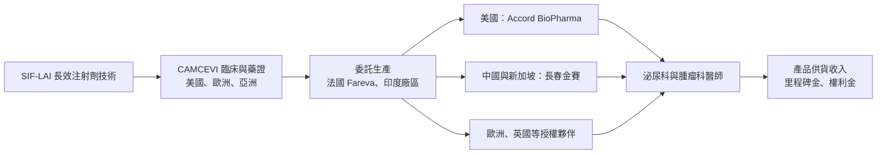
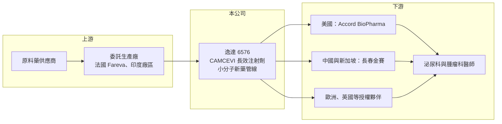

# 6576 逸達

> 上櫃｜[[產業索引-生技醫療業|生技醫療業]]｜上市（櫃）日期 2018/06/29

# 第一章：企業模式與商業藍圖

> [!info] 撰寫說明
> 本文由 Claude 依公開資料整理，架構比照 [[2330台積電]] 的四章研究，資料截至 2026-10-08。財務數字來源：Goodinfo 年度經營績效頁（含 2026 年公告標題）、優分析 2025 年 CAMCEVI 三個月劑型核准報導、櫃買中心開放資料（基本資料、2026 年第二季資產負債與綜合損益、本益比殖利率）。標示「憑記憶」的六個月劑型核准年份與歐洲授權夥伴尚未比對原始文件。#待校對

在評估單一個股的長期投資價值時，首要步驟是拆解企業的底層獲利邏輯。本章針對逸達生物科技（股票代號：6576，以下簡稱逸達）的商業模式進行定性分析，說明這家跨足台美的新藥公司，如何以長效注射劑技術開發前列腺癌藥物 CAMCEVI，並透過全球授權夥伴把產品推向市場。

## 一、核心定位：長效注射劑平台與創新小分子新藥

逸達成立於 2013 年，2018 年 6 月上櫃，董事長兼總經理為簡銘達，實收資本額約 15.8 億元。公司主攻兩大領域：一是以獨家的[[長效注射劑]]技術（SIF-LAI）開發針劑，二是針對罕見與嚴重疾病研發創新小分子新藥。

逸達的代表產品是 CAMCEVI（leuprolide），用於治療晚期前列腺癌的荷爾蒙療法。這類藥物的作用是抑制睪固酮分泌，讓依賴男性荷爾蒙生長的前列腺癌細胞受到控制。CAMCEVI 的特色是以預先調配好的長效注射劑型，減少醫護人員現場調配的步驟，並延長給藥間隔。

## 二、事業板塊：CAMCEVI 的劑型與區域布局

* **六個月劑型（42 毫克）：** 已在美國、歐洲及亞洲多國獲准上市（美國核准年份憑記憶約 2021 年，待校對），是目前穩定的銷售來源。2026 年 7 月，授權夥伴長春金賽藥業向新加坡提交的 CAMCEVI 42 毫克藥證申請獲准上市。
* **三個月劑型（21 毫克）：** 2025 年 8 月 26 日獲美國 [[FDA]] 核准，逸達因此認列約 1.3 億元[[里程碑金]]。美國由 Intas 旗下 Accord BioPharma 負責推廣與配送，並已啟動 J-Code（美國醫療給付代碼）申請，預計 2026 年下半年進入主流給付通路。2026 年 8 月 CAMCEVI 21 毫克獲英國上市許可，同月逸達向台灣食藥署遞交查驗登記申請。
* **新適應症與管線：** 六個月劑型正拓展至中樞性性早熟與乳癌適應症；小分子管線包括 MMP-12 抑制劑與 ALDH2 活化劑系列，針對氣喘、慢性阻塞性肺病、免疫纖維化與罕見遺傳疾病。
* **營收結構：** 本次未查得產品銷售、權利金與里程碑金的營收比重，因此不放圓餅圖。

## 三、資本轉化邏輯：授權夥伴銷售、逸達收取供貨與里程碑收入

* **授權模式：** 逸達採[[新藥授權]]模式，不自建全球業務團隊，而是在各區域找授權夥伴負責推廣，自己專注研發、法規與供應鏈管理。好處是費用較低、可同時進入多個市場；代價是只能分享部分銷售利潤。
* **委外生產：** 法國代工廠 Fareva 持續升級以符合新版 GMP，印度廠區已獲歐盟認證納入全球供應鏈，多點生產可降低單一工廠停產風險。

## 四、企業長期藍圖

逸達的長期方向是讓 CAMCEVI 在六個月與三個月兩種劑型、多個國家同時放量，並把長效注射劑平台延伸到性早熟、乳癌等新適應症，同時推進小分子新藥管線。前列腺癌荷爾蒙療法是成熟且龐大的市場，長效劑型可以減少回診次數，對病患與醫療體系都有價值，這是 CAMCEVI 能分到市場的主要理由。

# 第二章：護城河深度與競爭優勢

本章分析逸達的競爭優勢，說明 CAMCEVI 在前列腺癌荷爾蒙療法市場面對的對手，以及授權模式下的護城河。

## 一、護城河的核心組成要素

* **劑型技術與專利：** 預先調配的長效注射劑型需要特殊的配方與製程技術，相關專利構成差異化基礎。
* **多國藥證：** 美國、歐洲、英國、新加坡等多國藥證，是進入各國市場的必要門檻，競爭者需要同樣的時間與臨床投入才能取得。三期臨床共收錄 144 位患者，主要療效達標率 97.9%。
* **授權夥伴的通路：** Accord BioPharma 與長春金賽等夥伴在當地有成熟的業務團隊，讓逸達不用自建通路就能觸及醫師。

## 二、全球主要競爭對手格局

| 對手 | 產品 | 與 CAMCEVI 的比較 |
|---|---|---|
| AbbVie（Lupron Depot） | leuprolide 長效注射劑 | 市場領導品牌，醫師使用習慣深 |
| Tolmar（Eligard） | leuprolide 長效注射劑 | 同為長效劑型，市占穩固 |
| Ipsen、Ferring 等 | 其他 GnRH 類藥物 | 不同分子但同一治療類別 |
| 口服 GnRH 拮抗劑（如 relugolix） | 口服藥 | 改變給藥方式，對注射劑形成替代壓力 |
| 台灣新藥公司 | [[4147中裕]]、[[6446藥華藥]] | 同為台灣取得美國藥證的新藥公司，適應症不同 |

## 三、優勢轉化：守得住、守不住與觀察重點

* **守得住：** 已取得的多國藥證與授權網絡，以及三個月與六個月劑型並行的產品組合。
* **守不住：** 定價。前列腺癌荷爾蒙療法已有多個成熟產品，CAMCEVI 作為後進者，需要靠價格或便利性爭取處方，利潤空間有限。
* **觀察重點：** 三個月劑型取得 J-Code 後的美國銷售成長、歐洲與亞洲新市場的上市進度，以及性早熟等新適應症的臨床結果。

# 第三章：財務體質與盈利規模

資料日期：2026-10-08。數字取自 Goodinfo 年度經營績效頁與櫃買中心開放資料，表格是撰寫當時的快照；最新月營收、毛利率、累計 EPS 由自動排程寫在本筆記的屬性欄位（月營收、毛利率、累計EPS 等）。#待校對

財務報表是檢驗護城河是否真實存在的最終標準。對剛進入商業化的新藥公司而言，重點在於產品營收能否逐年放大、虧損何時收斂，以及一次性收入的比重。

## 一、多年度表格

| 年度 | 營收（新台幣） | [[毛利率]] | [[營業利益率]] | EPS（元） | [[ROE]] |
|---|---|---|---|---|---|
| 2019 | 0.75 億 | 77.1% | -625% | -5.08 | -69.9% |
| 2020 | 2.30 億 | 75.3% | -210% | -5.04 | -37.5% |
| 2021 | 2.26 億 | 77.5% | -238% | -4.85 | -36.2% |
| 2022 | 3.02 億 | 91.5% | -156% | -4.00 | -42.4% |
| 2023 | 1.95 億 | 58.4% | -517% | -8.14 | -96.2% |
| 2024 | 4.19 億 | 57.3% | -258% | -7.87 | -76.0% |
| 2025 | 4.31 億 | 68.2% | -200% | -5.70 | -69.9% |
| 2026 上半年 | 2.62 億 | 68.3% | -92.3% | 1.80 | 未查得 |

* **營收：** 2020 至 2025 年營收從 2.30 億元成長到 4.31 億元，年複合成長約 13%（推算），但每年包含里程碑金等一次性收入，波動明顯，例如 2025 年三個月劑型核准認列約 1.3 億元里程碑金。
* **毛利率：** 長期在 57% 至 92%，里程碑金幾乎沒有成本，入帳年度毛利率會偏高。
* **2026 年上半年轉盈：** 營業損失約 2.42 億元，但業外收益約 5.62 億元，稅後淨利約 2.83 億元、EPS 1.80 元。這筆業外收益的性質未查得（待校對），屬於一次性項目的可能性高，不能視為本業轉盈。

## 二、[[ROE]]、資本結構與研發強度

2021 至 2025 年平均 ROE 約 -64%（推算）。2026 年第二季底總資產約 18.6 億元，總負債約 5.86 億元（非流動負債約 4.57 億元），權益約 12.7 億元，負債比約 32%；保留盈餘累積虧損約 64 億元，公司長年靠募資支應研發。營業費用約 4.21 億元（2026 年上半年），研發費用占多數（推估），以營收計算的研發與營業費用率約 160%。股價淨值比約 9.7 倍（櫃買中心資料），市場評價主要反映對 CAMCEVI 放量與新管線的期待。

## 三、[[ROIC]] 與 [[WACC]]：價值創造利差

**ROIC 推算：** 2025 年營收 4.31 億元、營業利益率 -200%，營業損失約 8.62 億元，虧損無所得稅抵減。2026 年第二季底權益約 12.7 億元，有息負債以非流動負債約 4.57 億元推估，投入資本約 17.3 億元，ROIC 約 -50%（推算）。

**WACC 推算：** 台灣 10 年期公債殖利率取 1.75%、市場風險溢酬 6%、β 取新藥研發股常見值 1.2（未查得公司實際 β），股東權益成本約 8.95%。負債成本假設 2.5%、稅後約 2.0%；權益約占 74%、負債約占 26%，WACC 約 7.2%（推算）。

**結論：** ROIC 約 -50%，遠低於資金成本，逸達仍在大量消耗資本。不過與純研發公司不同，逸達已有上市產品，2026 年上半年營業虧損約 2.42 億元，單純乘以二也明顯低於 2025 年全年的約 8.62 億元（推算），若三個月劑型順利取得給付並放量，虧損可望逐步收斂，這是 ROIC 改善的關鍵。

# 第四章：總體風險與地緣政治

任何企業都無法脫離宏觀環境獨立存在。本章分析逸達長期必須面對的市場、授權、法規與營運風險。

## 一、地緣政治與國際市場

* **授權夥伴依賴：** 美國銷售仰賴 Accord BioPharma，中國與新加坡仰賴長春金賽，夥伴的策略與推廣力度直接決定逸達的營收。
* **中國市場政策：** 中國藥品集中採購與醫保談判可能壓低售價，影響授權收入。
* **供應鏈：** 生產依賴法國與印度的代工廠，國際物流、關稅或代工廠查核問題都可能影響供貨。

## 二、產業與市場結構風險

* **成熟市場的後進者：** 前列腺癌荷爾蒙療法已有多個品牌，CAMCEVI 須面對既有產品的價格與醫師習慣競爭。
* **口服藥替代：** 口服 GnRH 拮抗劑的出現，可能讓部分病患改用口服療法，壓縮注射劑市場。

## 三、營運與財務風險

* **一次性收入波動：** 營收與獲利高度受里程碑金與業外項目影響，不易預測。
* **資訊安全：** 2026 年 8 月公司公告資訊系統遭受駭客網路攻擊，顯示營運系統的資安風險。
* **新管線臨床風險：** MMP-12 抑制劑、ALDH2 活化劑等小分子新藥仍在臨床階段，失敗率高。
* **持續募資：** 累積虧損逾 60 億元，若產品放量不如預期，仍可能需要增資。

# 專有名詞解析

## 應用

- **[[FDA]]**：美國食品藥物管理局，負責藥品與醫療器材的上市審查，是全球最具指標性的主管機關。

## 金融

- **[[毛利率]]**：營業毛利占營收的比例，反映產品定價能力與生產成本控制。
- **[[營業利益率]]**：扣除營業費用後的營業利益占營收的比例，衡量本業整體獲利能力。
- **[[ROE]]**：股東權益報酬率，稅後淨利除以股東權益，衡量公司運用股東資金的效率。
- **[[ROIC]]**：投入資本報酬率，稅後營業利益除以股東權益與有息負債的合計，衡量本業對所有資金提供者的報酬。
- **[[WACC]]**：加權平均資金成本，依股東權益與負債的比重加權計算的資金成本，ROIC 高於它才代表創造價值。

## 產業

- **[[長效注射劑]]**：讓藥物在體內緩慢釋放的注射劑型，一次注射可維持數週到數月，減少病患回診與給藥次數。
- **[[里程碑金]]**：授權合約中，當藥物達成臨床進展、取得藥證或銷售目標等特定里程碑時，被授權方支付的款項。
- **[[新藥授權]]**：新藥公司把特定區域或適應症的開發與銷售權授權給其他藥廠，以換取簽約金、里程碑金與權利金。

# 核心供應鏈

## 1. 上游
- 原料藥供應商（名稱未查得）
- 委託生產：法國 Fareva、印度廠區

## 2. 本公司
- 逸達生物科技：CAMCEVI 六個月與三個月劑型、MMP-12 抑制劑、ALDH2 活化劑

## 3. 下游／授權夥伴
- 美國：Intas 旗下 Accord BioPharma
- 中國與新加坡：長春金賽藥業
- 歐洲與英國：授權夥伴（名稱憑記憶為 Accord 集團，待校對）

## 4. 同業
- 國際前列腺癌荷爾蒙療法：AbbVie（Lupron Depot）、Tolmar（Eligard）
- 台灣新藥公司：[[4147中裕]]、[[6446藥華藥]]、[[6535順藥]]

## 最新新聞
<!-- news:start -->
<!-- news:end -->

## 相關連結
- [公開資訊觀測站](https://mopsov.twse.com.tw/mops/web/t05st03?step=1&firstin=1&co_id=6576)
- [Goodinfo](https://goodinfo.tw/tw/StockDetail.asp?STOCK_ID=6576)
- [Yahoo 股市](https://tw.stock.yahoo.com/quote/6576)
- [鉅亨網新聞](https://www.cnyes.com/twstock/6576/news)
