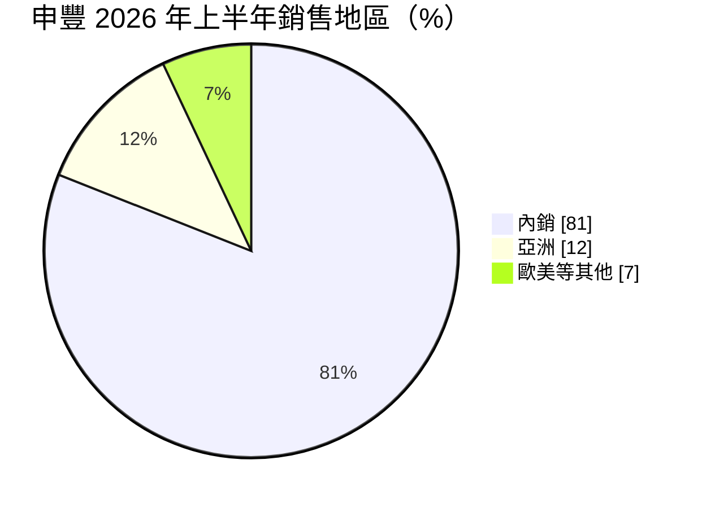
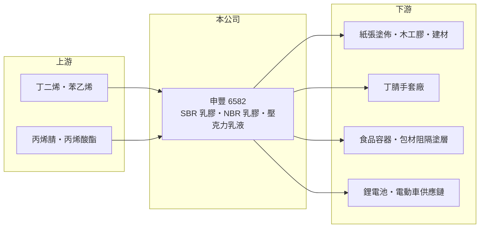

# 6582 申豐

> 上市｜[[產業索引-橡膠工業|橡膠工業]]｜上市（櫃）日期 2017/06/14

# 第一章：企業模式與商業藍圖

> [!info] 撰寫說明
> 精簡版，由 Claude 依公開資料整理，架構比照 [[2330台積電]] 的四章研究，資料截至 2026-10-08。來源：證交所開放資料（基本資料、2026 年上半年資產負債與損益、股利、本益比）、Goodinfo 年度經營績效、富果研究 2026 年 9 月法說會整理。#待校對

申豐特用應材（股票代號：6582，以下簡稱申豐）成立於 1979 年、2017 年上市，屬永豐餘投控集團，專門以[[乳化聚合]]技術生產水性乳膠與乳液。2020 至 2021 年疫情期間，它的 NBR 乳膠因[[丁腈手套]]需求暴增而創下驚人獲利，之後隨手套產業產能過剩，營收與獲利雙雙大幅萎縮，目前正在轉型。

- **核心業務：** 三大產品線：SBR 乳膠用於紙張塗佈、木工膠、建材與鋰電池；[[NBR]] 乳膠主要用於醫療與檢驗用丁腈手套；壓克力（丙烯酸）乳液用於[[阻隔塗層]]與食品容器。目前的轉型重點是依客戶需求開發的客製化產品，例如水性阻隔塗層、無甲醛木工膠、可回收食器阻隔膠與機能性布料用化學品。
- **營收結構：** 產品別比重未揭露。依 2026 年 9 月法說會，2026 年上半年內銷約 81%、亞洲（中國、泰國、馬來西亞、日本）約 12%、歐美約 7%。

- **營運據點：** 年產能約 10 萬噸，產能利用率偏低，本業尚未達損益兩平（工廠地點未查得）。正尋求與日本當地夥伴合作，解決偏遠工業區的陸運成本，以擴大東北亞出貨。
- **長期方向：** 公司定位為「水性乳化聚合解決方案供應商」，以綠色材料與降低環境衝擊為開發核心，切入黏著劑、紡織添加劑、綠色建材與全回收食器。已通過一家國際電動車品牌的認證並打入供應鏈，壓克力系產品也打入大型企業供應鏈。短期目標是達成產銷平衡，再逐步創造獲利。

# 第二章：護城河深度與競爭優勢

申豐的護城河目前很淺，疫情時期的優勢已隨手套產業過剩而消失，新護城河仍在建立中。

- **競爭優勢：** 第一是四十多年的乳化聚合技術累積，能依客戶需求調整配方，適合客製化與小批量的特用市場。第二是極為穩健的財務，負債極低、手上有大量疫情期間累積的資金，有足夠的時間轉型。第三是集團背景，永豐餘在紙業與包材的經驗，與申豐的紙張塗佈、阻隔塗層產品有協同效果（推估）。
- **主要對手：** NBR 乳膠有 [[2108南帝]]、韓國錦湖石化、Synthomer 與中國新產能；SBR 乳膠與壓克力乳液則有陶氏、巴斯夫等國際化學大廠及中國廠商。
- **守得住與守不住：** 守得住的是內銷客戶與需要客製配方的利基應用；守不住的是 NBR 乳膠的價格與量，疫情後手套廠大幅減產，申豐 2025 年[[毛利率]]降到 -5.5%。
- **觀察重點：** 水性阻隔塗層等綠色材料的放量速度、電動車供應鏈訂單能否擴大，以及產能利用率能否提高到損益兩平以上。

# 第三章：財務體質與盈利規模

資料日期：2026-10-08，表格是撰寫當時的快照；最新月營收、毛利率、累計 EPS 由自動排程寫在本筆記的屬性欄位（月營收、毛利率、累計EPS 等）。#待校對

申豐的財報是疫情紅利最極端的案例之一：2021 年 EPS 32.74 元，四年後轉為虧損。

| 年度 | 營收（新台幣） | [[毛利率]] | [[營業利益率]] | EPS（元） | [[ROE]] |
|---|---|---|---|---|---|
| 2021 | 81.6 億 | 60.3% | 53.5% | 32.74 | 57.0% |
| 2022 | 17.0 億 | 25.2% | 11.7% | 1.65 | 2.63% |
| 2023 | 8.94 億 | 2.39% | -24.2% | -1.02 | -1.83% |
| 2024 | 17.1 億 | 8.72% | -3.78% | 0.99 | 1.75% |
| 2025 | 8.21 億 | -5.50% | -23.9% | -0.41 | -0.69% |

- **營收規模：** 2020 至 2025 年營收年複合成長率約 -31%（推算）。疫情前 2016 至 2019 年營收約 30 至 37 億元、毛利率 22% 至 32%、ROE 12% 至 26%，現在的營收規模只剩疫情前的四分之一左右。2026 年上半年營收 2.61 億元、毛利率 2.2%、EPS -0.01 元。
- **獲利：** 目前的獲利主要來自業外的固定收益產品配息等，2026 年上半年營業損失 0.53 億元、業外收益 0.46 億元，兩者幾乎抵銷。2021 至 2025 年平均 ROE 約 11.8%（推算），但全部來自 2021 年。
- **財務特色：** 2026 年上半年總資產約 71.9 億元、股東權益約 68.6 億元、總負債僅 3.3 億元，每股淨值 64.65 元，股價淨值比約 0.49 倍（證交所資料），資產以現金與金融資產為主。2025 年度未配發股利；Goodinfo 統計的長期一般平均現金股利約 4.24 元，主要由疫情年度拉高。

**[[ROIC]] 與 [[WACC]]：** 以 2025 年計，營業損失約 1.96 億元（8.21 億 × -23.9%），虧損不計稅。股東權益約 68.6 億元，幾乎沒有有息負債，投入資本約 68.6 億元，ROIC 約 -2.9%（推算）；若扣除大量現金與金融資產只算營運資產，ROIC 的負值會更大。WACC 以 CAPM 推估：無風險利率 1.75%、市場風險溢酬 6%、β 取化工同業常見值 0.8，股東權益成本約 6.6%，幾乎全為權益融資，WACC 約 6.6%（推算）。2021 年 ROIC 遠高於 WACC，2023 年以後則持續低於資金成本；申豐目前是「資產多、本業虧」的狀態，長期價值取決於轉型能否讓本業重新賺錢，或資金能否有更有效率的運用。

# 第四章：總體風險與地緣政治

申豐的風險集中在本業規模過小與轉型的不確定性。

- **產業週期：** NBR 乳膠受手套產業的擴產與庫存循環主導，疫情後的過剩產能可能需要多年才能消化。SBR 乳膠與壓克力乳液則跟著紙業、建材與包材景氣。
- **營運風險：** 產能利用率偏低，固定成本難以攤提，本業連年虧損；新產品多在認證或小量出貨階段，放量時程不確定。內銷比重高達八成，國內紙業與建材需求轉弱時影響大。
- **其他風險：** 原料丁二烯、苯乙烯、丙烯酸酯的價格隨油價波動；日本市場的物流成本與匯率影響外銷獲利。另一方面，各國對一次性塑膠與含氟塗層的管制，是水性阻隔塗層的長期機會。

# 專有名詞解析

## 應用

- **[[丁腈手套]]**：以 NBR 乳膠製成的拋棄式手套，不含天然乳膠過敏原，廣泛用於醫療、食品與工業。
- **[[阻隔塗層]]**：塗在紙或包材表面、阻擋水、油與氧氣的塗層，水性配方可讓紙容器更容易回收。

## 金融

- **[[ROIC]]**：投入資本報酬率，稅後營業利益除以股東權益加有息負債，衡量本業運用資本的效率。
- **[[WACC]]**：加權平均資金成本，股東與債權人要求報酬的加權平均，ROIC 高於它才代表創造價值。

## 產業

- **[[乳化聚合]]**：把單體分散在水中聚合成微小顆粒的製程，產品為水性乳膠或乳液，揮發性有機物較少。
- **[[NBR]]**：丁腈橡膠（丁二烯與丙烯腈共聚物），耐油性佳，乳膠型態主要用於製作丁腈手套。

# 核心供應鏈

- 上游：丁二烯、苯乙烯、丙烯腈與丙烯酸酯等石化原料，國內來源包括 [[6505台塑化]]、[[1301台塑]]（產業參考，實際供應比例未查得）。
- 下游／客戶：紙業與包材廠，例如集團內的 [[1907永豐餘]]（產業參考）；手套廠；建材與電動車供應鏈客戶（具名客戶未查得）。
- 同業：[[2108南帝]]、錦湖石化、Synthomer、陶氏、巴斯夫。

## 最新新聞
<!-- news:start -->
<!-- news:end -->

## 相關連結
- [公開資訊觀測站](https://mopsov.twse.com.tw/mops/web/t05st03?step=1&firstin=1&co_id=6582)
- [Goodinfo](https://goodinfo.tw/tw/StockDetail.asp?STOCK_ID=6582)
- [Yahoo 股市](https://tw.stock.yahoo.com/quote/6582)
- [鉅亨網新聞](https://www.cnyes.com/twstock/6582/news)
