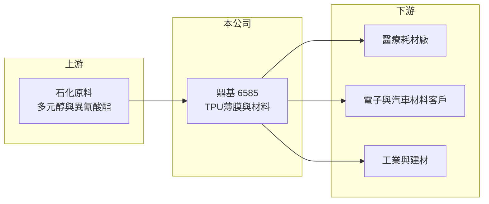

# 6585 鼎基

> 上市｜[[產業索引-其他業|其他業]]｜上市（櫃）日期 2022/05/20

# 第一章：企業模式與商業藍圖

> [!info] 撰寫說明
> 精簡版，由 Claude 依公開資料整理，架構比照 [[2330台積電]]，資料截至 2026-10-07。來源：nstock.tw 鼎基公司概況、優分析 2026 年第二季財報報導。應用別營收比重與主要客戶本次未查到。#待校對

鼎基是以[[TPU]]（熱可塑性聚氨酯）薄膜為核心的特用材料廠，2022 年 5 月掛牌上市。

- **核心業務：** 鼎基生產高科技聚氨酯材料，主力是 TPU 膜，另有化學原料批發與國際貿易業務。
- **營收結構：** 產品應用涵蓋醫療、電子、汽車、工業與建材；2026 年第二季醫療領域年增近四成、電子領域較去年同期倍增，汽車相對平穩，各應用比重本次未查到。
- **營運據點：** 生產與銷售據點本次未查到，本文不推測。
- **長期方向：** 公司預期下半年醫療出貨延續、第三季汽車拉貨恢復正常，電子與工業應用持續貢獻，往高附加價值的醫療與電子用膜發展。

# 第二章：護城河深度與競爭優勢

鼎基的優勢在於特殊配方 TPU 膜的開發能力與高毛利產品組合。

- **競爭優勢：** 2026 年第二季[[毛利率]]達 39.3%，顯示產品屬於規格導向的特用材料，而非一般大宗塑膠（推估）。
- **主要對手：** 國際 TPU 原料與薄膜廠如 Covestro、Lubrizol，以及台灣的 [[1721三晃]] 等 TPU 相關廠商（推估）。
- **觀察重點：** 醫療與電子應用能否維持高成長、汽車客戶拉貨是否回穩，以及毛利率能否守住近四成水準。

# 第三章：財務體質與盈利規模

資料日期：2026-10-07，以下數字是撰寫當時的快照；最新月營收、毛利率、累計 EPS 由自動排程寫在本筆記的屬性欄位（月營收、毛利率、累計EPS 等）。#待校對

鼎基 2026 年第二季三率同步走升，單季 EPS 創歷史次高。

- **營收規模：** 2025 年全年營收 28.5 億元；2026 年第二季營收 9.3 億元，季增 27.8%、年增 54.5%；上半年營收 16.57 億元，年增 13.8%；7 月營收 2.95 億元，年增 50.26%。
- **獲利：** 2026 年第二季 EPS 2.95 元，毛利率 39.3%、[[營業利益率]] 28.6%、淨利率 22.8%；上半年 EPS 4.81 元，稅後純益 3.47 億元，年增 79.3%。
- **財務特色：** 資本額約 7.21 億元，股本小、獲利彈性大；2025 年 EPS 5.64 元，擬配現金股利 4.5 元，屬於高配息政策。

# 第四章：總體風險與地緣政治

鼎基的風險來自終端需求波動與原料價格。

- **產業週期：** 汽車與電子需求受景氣與客戶庫存調整影響，2025 年同期獲利偏低，顯示單季獲利波動大。
- **營運風險：** 醫療與電子高成長若放緩，高基期將使年增率回落；客戶集中度本次未查到。
- **其他風險：** TPU 原料來自石化產品，油價與原料報價波動會影響成本；外銷比重若高，新台幣匯率也會影響獲利（推估）。

# 專有名詞解析

## 金融

- **[[毛利率]]**：毛利占營收的比例，反映產品定價能力與成本控制。
- **[[營業利益率]]**：營業利益占營收的比例，反映本業扣除費用後的獲利能力。

## 產業

- **[[TPU]]**：熱可塑性聚氨酯，兼具橡膠彈性與塑膠加工性的高分子材料，可做成薄膜、鞋材與醫療耗材。
- **[[TPU薄膜]]**：以TPU製成的薄膜，具耐磨、透氣或防水特性，用於醫療敷料、電子保護膜與汽車漆面保護。

# 核心供應鏈

- 上游：TPU 所需的多元醇、異氰酸酯等石化原料供應商（推估）
- 下游／客戶：醫療、電子、汽車、工業與建材應用客戶，客戶名稱未揭露
- 同業：Covestro、Lubrizol、[[1721三晃]] 等 TPU 材料廠（推估）

## 最新新聞
<!-- news:start -->
<!-- news:end -->

## 相關連結
- [公開資訊觀測站](https://mopsov.twse.com.tw/mops/web/t05st03?step=1&firstin=1&co_id=6585)
- [Goodinfo](https://goodinfo.tw/tw/StockDetail.asp?STOCK_ID=6585)
- [Yahoo 股市](https://tw.stock.yahoo.com/quote/6585)
- [鉅亨網新聞](https://www.cnyes.com/twstock/6585/news)
